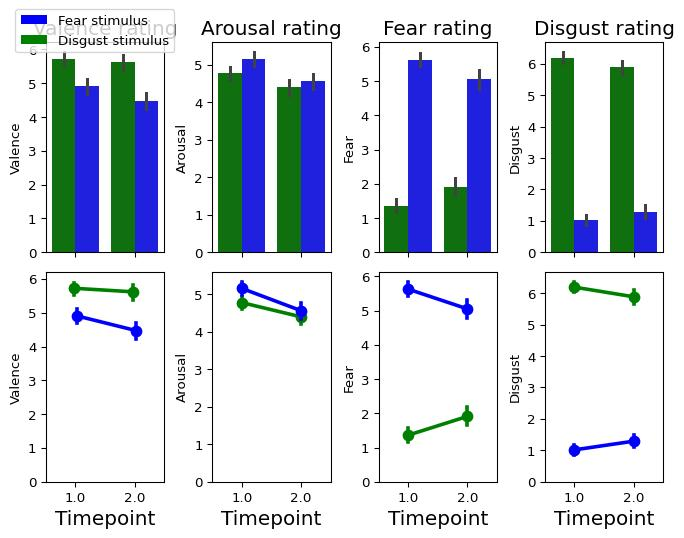
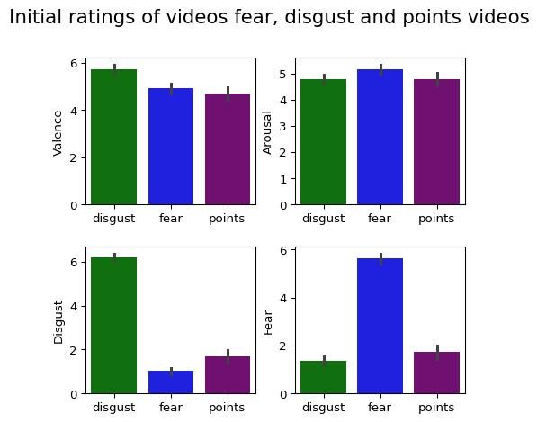

# Video ratings


<p>

This file contains all the analyses for the video ratings task.
</p>

<p>

During this task, participants rated the valence, arousal, fear and
disgust of 10 videos from Cowen and Keltner (2017). This was done
<b>both before and after</b> the reversal learning task.
</p>

<p>

For each participant, the ‘best’ pair of fear and disgust videos (see
paper for equation used to determine the ‘best’ pair) was selected prior
to the reversal learning task. This pair were then used as punishments
in the reversal learning task for the fear and disgust feedback-type
blocks.
</p>

<p>

Analyses here <b>only look at the individually selected video pair</b>
for each participant.
</p>

<br>
<p>

Additionally, after the points block (which doesn’t use the Cowen and
Keltner videos), each participant was asked to rate the valence,
arousal, fear and disgust they felt when they lost points.
</p>

<p>

Analysis of these responses is also detailed here.
</p>

<br>
<p>

This notebook contains
</p>

<p>

- Analysis of ratings of the selected Cowen and Keltner videos to
  identify any differences in valence, arousal and habituation between
  the two stimulus types (models A and B).
- Analysis of ratings of the selected Cowen and Keltner videos to
  validate that fear and disgust was sucessfully induced (models C and
  D)
- Analysis of the points ratings (in comparison to timepoint 1 of the
  selected videos) to assess how the points feedback differed from the
  fear and disgust feedback
- Visualisation of these results

</p>

<br>
<h3>

Step 1: load in packages and data
</h3>

<details class="code-fold">
<summary>Code</summary>

``` python
import numpy as np
import pandas as pd
import matplotlib.pyplot as plt
import seaborn as sns
import scipy.stats as stats
import jsonlines
from functools import reduce
import statistics
import scipy.stats
import seaborn as sns
import math
import os
import json
import ast
import matplotlib.patches as mpatches
import statsmodels.api as sm
import statsmodels.formula.api as smf
from numpy import std, mean, sqrt
import warnings
warnings.simplefilter(action='ignore', category=FutureWarning)

chosen_stim_df = pd.read_csv("U:/Documents/Disgust learning project/github/disgust_reversal_learning-final/csvs/chosen_stim_excluded.csv")
chosen_stim_df.drop('Unnamed: 0', axis="columns", inplace=True)
```

</details>

<h3>

Step 2: create long-form data frame
</h3>

``` python
long_chosen_stim_df=pd.DataFrame()
for i in chosen_stim_df.index:
    row=chosen_stim_df.loc[i]
    #timepoint=['unpleasan']
    timepoint_1=pd.DataFrame({
    'participant_no': [row.participant_no],
    'age': [row.prolific_age],
    'sex': [row. prolific_sex],
    'Vid': [str(row['Vid'])],
    'trial_type': [row.trial_type],
    'Valence': [row.unpleasant_1],
    'Arousal': [row.arousing_1],
    'Fear': [row.frightening_1],
    'Disgust': [row.disgusting_1],
    'Timepoint': 1.0
    })
    timepoint_2=pd.DataFrame({
        'participant_no': [row.participant_no],
        'age': [row.prolific_age],
        'sex': [row. prolific_sex],
        'Vid': [str(row['Vid'])],
        'trial_type': [row.trial_type],
        'Valence': [row.unpleasant_2],
        'Arousal': [row.arousing_2],
        'Fear': [row.frightening_2],
        'Disgust': [row.disgusting_2],
        'Timepoint': 2.0
    })
    long_chosen_stim_df_row=pd.concat([timepoint_1, timepoint_2])
    long_chosen_stim_df=pd.concat([long_chosen_stim_df_row, long_chosen_stim_df])
    long_chosen_stim_df=long_chosen_stim_df[long_chosen_stim_df.trial_type!="points"]
```

<h3>

Step 3: Assess the valence, arousal, disgust and fear ratings of the
fear and disgust videos used in the reversal learning task
</h3>

<p>

Do this using 4 mixed effects models - testing effect of timepoint and
stimulus type on ratings
</p>

<p>

List of models to run:
<p>

- Model A- ’Valence ~ trial_type\*Timepoint’
- Model B- ’Arousal ~ trial_type\*Timepoint’
- Model C- ’Disgust ~ trial_type\*Timepoint’
- Model D- ’Fear ~ trial_type\*Timepoint’

</p>

<br> <br>
<p>

Before running the models, we can visualise this data:
</p>

<details class="code-fold">
<summary>Code</summary>

``` python
fig, axes = plt.subplots(2,4, sharex='col', sharey='col')
#title="Ratings of videos used in reversal learning task"
#plt.suptitle(title, fontsize=30)
#plt.suptitle(title)
fig.tight_layout(pad=0.5)
#fig.set_size_inches(10, 5)

palette = {'fear': 'blue',
            'disgust': 'green'}
#sns.stripplot(data=long_chosen_stim_df, ax=axes[0,0], x='Timepoint', y='Valence', hue='trial_type', dodge=True, palette=palette)
sns.barplot(data=long_chosen_stim_df, ax=axes[0,0], x='Timepoint', y='Valence', hue='trial_type', fill=True, palette=palette, linewidth=1)
axes[0,0].get_legend().set_visible(False)
axes[0,0].set_title("Valence rating", fontsize=15) 

sns.pointplot(data=long_chosen_stim_df, ax=axes[1,0], x='Timepoint', y='Valence', hue='trial_type', dodge=True, palette=palette)
axes[1,0].get_legend().set_visible(False)
axes[1,0].xaxis.get_label().set_fontsize(15)

#sns.stripplot(data=long_chosen_stim_df, ax=axes[0,1], x='Timepoint', y='Arousal', hue='trial_type', dodge=True, palette=palette)
sns.barplot(data=long_chosen_stim_df, ax=axes[0,1], x='Timepoint', y='Arousal', hue='trial_type', fill=True, palette=palette, linewidth=1)
axes[0,1].get_legend().set_visible(False)
axes[0,1].set_title("Arousal rating", fontsize=15) 

sns.pointplot(data=long_chosen_stim_df, ax=axes[1,1], x='Timepoint', y='Arousal', hue='trial_type', dodge=False, palette=palette)
axes[1,1].get_legend().set_visible(False)
axes[1,1].xaxis.get_label().set_fontsize(15)

#sns.stripplot(data=long_chosen_stim_df, ax=axes[0,2], x='Timepoint', y='Fear', hue='trial_type', dodge=True, palette=palette)
sns.barplot(data=long_chosen_stim_df, ax=axes[0,2], x='Timepoint', y='Fear', hue='trial_type', fill=True, palette=palette, linewidth=1)
axes[0,2].get_legend().set_visible(False)
axes[0,2].set_title("Fear rating", fontsize=15) 

sns.pointplot(data=long_chosen_stim_df, ax=axes[1,2], x='Timepoint', y='Fear', hue='trial_type', dodge=False, palette=palette)
axes[1,2].get_legend().set_visible(False)
axes[1,2].xaxis.get_label().set_fontsize(15)

#sns.stripplot(data=long_chosen_stim_df, ax=axes[0,3], x='Timepoint', y='Disgust', hue='trial_type', dodge=True, palette=palette)
sns.barplot(data=long_chosen_stim_df, ax=axes[0,3], x='Timepoint', y='Disgust', hue='trial_type', fill=True, palette=palette, linewidth=1)
axes[0,3].get_legend().set_visible(False)
axes[0,3].set_title("Disgust rating", fontsize=15) 

sns.pointplot(data=long_chosen_stim_df, ax=axes[1,3], x='Timepoint', y='Disgust', hue='trial_type', dodge=False, palette=palette)
axes[1,3].get_legend().set_visible(False)
axes[1,3].xaxis.get_label().set_fontsize(15)

plt.figlegend(loc='center left', bbox_to_anchor=(0,1),  handles=[mpatches.Patch(facecolor='blue'), mpatches.Patch(facecolor='green')], labels=['Fear stimulus', 'Disgust stimulus'])
#handles=[mpatches.Patch(facecolor='blue'), mpatches.Patch(facecolor='green')], labels=['Fear stimulus', 'Disgust stimulus'], prop={'size':15})
plt.show()
```

</details>



<br> <br>
<p>

<b>MODEL A: VALENCE ~ TRIAL_TYPE\*TIMEPOINT</b>
</p>

<p>

In this case, the basic model with a by-participant random slope, but no
random intercepts or additional covariates produced the best fit
(indexed by BIC scores).
</p>

<p>

- This model found an effect of trial-type: disgust videos had a more
  negative valence than fear (this was <b>counter to prediction</b>)
- It also revealed a trial-type\*timepoint interaction: valence ratings
  for disgust didn’t change as much over time relative to fear (i.e.,
  disgust is resistant to habituation).

</p>

``` python
data=long_chosen_stim_df.reset_index()
data.replace(['disgust', 'fear'], [1.0,2.0], inplace=True)
formula = 'Valence ~ trial_type*Timepoint'

model=smf.mixedlm(formula, data, groups=data['participant_no'], missing='drop', re_formula='~trial_type')
results=model.fit(reml=False)
print(results.summary())
```

                  Mixed Linear Model Regression Results
    =================================================================
    Model:               MixedLM    Dependent Variable:    Valence   
    No. Observations:    1360       Method:                ML        
    No. Groups:          340        Scale:                 1.8645    
    Min. group size:     4          Log-Likelihood:        -2696.3107
    Max. group size:     4          Converged:             Yes       
    Mean group size:     4.0                                         
    -----------------------------------------------------------------
                           Coef.  Std.Err.   z    P>|z| [0.025 0.975]
    -----------------------------------------------------------------
    Intercept               6.318    0.381 16.590 0.000  5.571  7.064
    trial_type             -0.488    0.240 -2.033 0.042 -0.959 -0.018
    Timepoint               0.224    0.234  0.955 0.340 -0.235  0.683
    trial_type:Timepoint   -0.329    0.148 -2.224 0.026 -0.620 -0.039
    Group Var               2.692    0.506                           
    Group x trial_type Cov -0.975    0.279                           
    trial_type Var          0.959    0.194                           
    =================================================================

<br>
<p>

<b>MODEL B: AROUSAL ~ TRIAL_TYPE\*TIMEPOINT</b>
</p>

<p>

In this case, the basic model with no by-participant random slope, no
random intercepts and no additional covariates produced the best fit
(indexed by BIC scores).
</p>

<p>

- This model found an effect of trial-type: fear videos had were more
  arousing than disgust (this was <b>counter to prediction</b>)
- There was no trial-type\*timepoint interaction (no difference in
  habituation in the arousal measure)

</p>

``` python
formula = 'Arousal ~ trial_type*Timepoint'

model=smf.mixedlm(formula, data, groups=data['participant_no'], missing='drop')
results=model.fit(reml=False)
print(results.summary())
```

                 Mixed Linear Model Regression Results
    ===============================================================
    Model:               MixedLM   Dependent Variable:   Arousal   
    No. Observations:    1360      Method:               ML        
    No. Groups:          340       Scale:                1.5506    
    Min. group size:     4         Log-Likelihood:       -2504.1712
    Max. group size:     4         Converged:            Yes       
    Mean group size:     4.0                                       
    ---------------------------------------------------------------
                         Coef.  Std.Err.   z    P>|z| [0.025 0.975]
    ---------------------------------------------------------------
    Intercept             4.568    0.344 13.260 0.000  3.892  5.243
    trial_type            0.594    0.214  2.782 0.005  0.176  1.013
    Timepoint            -0.165    0.214 -0.771 0.441 -0.583  0.254
    trial_type:Timepoint -0.215    0.135 -1.590 0.112 -0.479  0.050
    Group Var             1.580    0.140                           
    ===============================================================

<br>
<p>

<b>MODEL C: DISGUST ~ TRIAL_TYPE\*TIMEPOINT</b>
</p>

<p>

In this case, the model with a by-participant random slope, but no
random intercepts and no additional covariates produced the best fit
(indexed by BIC scores).
</p>

<p>

- This model found an effect of trial-type: disgust videos had were more
  disgusting than fear (this was <b>as predicted</b>)
- There was an effect of timepoint (all stimuli got less disgusting over
  time)
- There was a trial-type\*timepoint interaction (the disgust ratings for
  fear and disgust videos changed differentially over time)

</p>

``` python
formula = 'Disgust ~ trial_type*Timepoint'

model=smf.mixedlm(formula, data, groups=data['participant_no'], missing='drop', re_formula='~trial_type')
results=model.fit(reml=False)
print(results.summary())
```

                  Mixed Linear Model Regression Results
    ==================================================================
    Model:                MixedLM    Dependent Variable:    Disgust   
    No. Observations:     1360       Method:                ML        
    No. Groups:           340        Scale:                 1.3046    
    Min. group size:      4          Log-Likelihood:        -2554.2318
    Max. group size:      4          Converged:             Yes       
    Mean group size:      4.0                                         
    ------------------------------------------------------------------
                           Coef.  Std.Err.    z    P>|z| [0.025 0.975]
    ------------------------------------------------------------------
    Intercept              12.262    0.343  35.743 0.000 11.589 12.934
    trial_type             -5.762    0.214 -26.953 0.000 -6.181 -5.343
    Timepoint              -0.888    0.196  -4.535 0.000 -1.272 -0.504
    trial_type:Timepoint    0.582    0.124   4.701 0.000  0.340  0.825
    Group Var               7.398    0.877                            
    Group x trial_type Cov -3.932    0.498                            
    trial_type Var          2.492    0.312                            
    ==================================================================

<br>
<p>

<b>MODEL D: FEAR ~ TRIAL_TYPE\*TIMEPOINT</b>
</p>

<p>

In this case, the model with a by-participant random slope, but no
random intercepts and no additional covariates produced the best fit
(indexed by BIC scores).
</p>

<p>

- This model found an effect of trial-type: disgust videos had were more
  disgusting than fear (this was <b>as predicted</b>)
- There was an effect of timepoint (all stimuli got less disgusting over
  time)
- There was a trial-type\*timepoint interaction (the disgust ratings for
  fear and disgust videos changed differentially over time)

</p>

``` python
formula = 'Fear ~ trial_type*Timepoint'

model=smf.mixedlm(formula, data, groups=data['participant_no'], missing='drop', re_formula='~trial_type')
results=model.fit(reml=False)
print(results.summary())
```

                  Mixed Linear Model Regression Results
    ==================================================================
    Model:                MixedLM    Dependent Variable:    Fear      
    No. Observations:     1360       Method:                ML        
    No. Groups:           340        Scale:                 1.4539    
    Min. group size:      4          Log-Likelihood:        -2719.9407
    Max. group size:      4          Converged:             Yes       
    Mean group size:      4.0                                         
    ------------------------------------------------------------------
                           Coef.  Std.Err.    z    P>|z| [0.025 0.975]
    ------------------------------------------------------------------
    Intercept              -4.576    0.366 -12.511 0.000 -5.293 -3.860
    trial_type              5.391    0.228  23.613 0.000  4.944  5.839
    Timepoint               1.671    0.207   8.079 0.000  1.265  2.076
    trial_type:Timepoint   -1.124    0.131  -8.591 0.000 -1.380 -0.867
    Group Var               9.150    0.996                            
    Group x trial_type Cov -4.671    0.557                            
    trial_type Var          3.185    0.361                            
    ==================================================================

<h3>

Step 4: check how points-based feedback differed from disgust and
fear-based feedback
</h3>

<p>

Doing this using 4 mixed effects models - testing the effect of stimulus
type on ratings
</p>

<p>

List of models to run:
<p>

- Model A- ‘Valence ~ trial_type’
- Model B- ‘Arousal ~ trial_type’
- Model C- ‘Disgust ~ trial_type’
- Model D- ‘Fear ~ trial_type’

</p>

<p>

NB there is only timepoint 1 of fear and disgust ratings are included in
this model (as points rating only has one timepoint).
</p>

<br> <br>
<p>

Before running the models, we can visualise this data:
</p>

<details class="code-fold">
<summary>Code</summary>

``` python
data=chosen_stim_df[['participant_no', 'trial_type', 'unpleasant_1', 'arousing_1', 'disgusting_1', 'frightening_1']].sort_values('trial_type')
fig, axes = plt.subplots(2,2)
title="Initial ratings of videos fear, disgust and points videos"
plt.suptitle(title, fontsize=16)
fig.tight_layout(pad=1.5)
fig.set_size_inches(5, 5)

order=['fear', 'disgust', 'points']
palette = {'fear': 'blue',
            'disgust': 'green',
            'points': 'purple'}
sns.barplot(data=data, ax=axes[0,0],   x='trial_type', hue='trial_type', y='unpleasant_1', palette=palette, legend=False, fill=True, linewidth=1, hue_order=order)
#sns.stripplot(data=data, ax=axes[0,0],  x='trial_type', hue='trial_type', y='unpleasant_1', palette=palette, legend=False, dodge=False, hue_order=order)
axes[0,0].set_xlabel('')
axes[0,0].set_ylabel('Valence')

sns.barplot(data=data, ax=axes[0,1], x='trial_type', hue='trial_type', y='arousing_1', palette=palette, legend=False, fill=True, linewidth=1, hue_order=order)
#sns.stripplot(data=data, ax=axes[0,1], x='trial_type', hue='trial_type', y='arousing_1', palette=palette, legend=False, dodge=False, hue_order=order)
axes[0,1].set_xlabel('')
axes[0,1].set_ylabel('Arousal')

sns.barplot(data=data, ax=axes[1,0], x='trial_type', hue='trial_type', y='disgusting_1', palette=palette, legend=False, fill=True, linewidth=1, hue_order=order)
#sns.stripplot(data=data, ax=axes[1,0], x='trial_type', hue='trial_type', y='disgusting_1', palette=palette, legend=False, dodge=False, hue_order=order)
axes[1,0].set_xlabel('')
axes[1,0].set_ylabel('Disgust')

sns.barplot(data=data, ax=axes[1,1], x='trial_type',  hue='trial_type', y='frightening_1', palette=palette, legend=False, fill=True, linewidth=1, hue_order=order)
#sns.stripplot(data=data, ax=axes[1,1], x='trial_type',  hue='trial_type',  y='frightening_1', palette=palette, legend=False, dodge=False, hue_order=order)
axes[1,1].set_xlabel('')
axes[1,1].set_ylabel('Fear')
plt.show()
```

</details>



<br> <br>
<p>

<b>MODEL E: VALENCE ~ TRIAL_TYPE</b>
</p>

<p>

In this case, the basic model with no by-participant random slope, no
random intercepts but with sex added as a covariate produced the best
fit (indexed by BIC scores).
</p>

- This model found an effect of trial-type: disgust videos had a more
  negative valence than points (<b>as predicted</b>)
- But there was <b>no predicted difference</b> in valence between points
  and fear
- There was also a significant negative effect of age
  <p>

  </p>

``` python
data=chosen_stim_df[['participant_no', 'trial_type', 'unpleasant_1', 'arousing_1', 'disgusting_1', 'frightening_1', 'Vid', 'prolific_age', 'prolific_sex']]
data=data.replace(['points'], ['apoints']) ##makes comparison condition points

formula = 'unpleasant_1~trial_type+prolific_sex'

model=smf.mixedlm(formula, data, groups=data['participant_no'], missing='drop')
results=model.fit(reml=False)
print(results.summary())
```

                 Mixed Linear Model Regression Results
    ================================================================
    Model:              MixedLM   Dependent Variable:   unpleasant_1
    No. Observations:   938       Method:               ML          
    No. Groups:         340       Scale:                2.4872      
    Min. group size:    2         Log-Likelihood:       -1898.9695  
    Max. group size:    3         Converged:            Yes         
    Mean group size:    2.8                                         
    ----------------------------------------------------------------
                          Coef.  Std.Err.   z    P>|z| [0.025 0.975]
    ----------------------------------------------------------------
    Intercept              4.907    0.139 35.312 0.000  4.634  5.179
    trial_type[T.disgust]  1.025    0.132  7.742 0.000  0.765  1.284
    trial_type[T.fear]     0.207    0.132  1.565 0.118 -0.052  0.467
    prolific_sex[T.Male]  -0.434    0.157 -2.768 0.006 -0.741 -0.127
    Group Var              1.169    0.127                           
    ================================================================

<p>

The effects remain when the sex covariate is removed
</p>

``` python
formula = 'unpleasant_1~trial_type'

model=smf.mixedlm(formula, data, groups=data['participant_no'], missing='drop')
results=model.fit(reml=False)
print(results.summary())
```

                 Mixed Linear Model Regression Results
    ===============================================================
    Model:               MixedLM  Dependent Variable:  unpleasant_1
    No. Observations:    938      Method:              ML          
    No. Groups:          340      Scale:               2.4893      
    Min. group size:     2        Log-Likelihood:      -1902.7641  
    Max. group size:     3        Converged:           Yes         
    Mean group size:     2.8                                       
    ---------------------------------------------------------------
                          Coef. Std.Err.   z    P>|z| [0.025 0.975]
    ---------------------------------------------------------------
    Intercept             4.699    0.117 40.012 0.000  4.469  4.929
    trial_type[T.disgust] 1.025    0.132  7.736 0.000  0.765  1.284
    trial_type[T.fear]    0.207    0.132  1.563 0.118 -0.053  0.467
    Group Var             1.212    0.130                           
    ===============================================================

<br> <br>
<p>

<b>MODEL F: AROUSAL ~ TRIAL_TYPE</b>
</p>

<p>

In this case, the basic model with no by-participant random slope, no
random intercepts and no additional covariates produced the best fit
(indexed by BIC scores).
</p>

<p>

- This model found an effect of trial-type: fear videos were more
  arousing than points (<b>as predicted</b>)
- But there was <b>no predicted difference</b> in arousal between points
  and disgust

</p>

``` python
formula = 'arousing_1~trial_type'

model=smf.mixedlm(formula, data, groups=data['participant_no'], missing='drop')
results=model.fit(reml=False)
print(results.summary())
```

                 Mixed Linear Model Regression Results
    ================================================================
    Model:                MixedLM   Dependent Variable:   arousing_1
    No. Observations:     938       Method:               ML        
    No. Groups:           340       Scale:                1.8470    
    Min. group size:      2         Log-Likelihood:       -1780.8311
    Max. group size:      3         Converged:            Yes       
    Mean group size:      2.8                                       
    ----------------------------------------------------------------
                          Coef.  Std.Err.   z    P>|z| [0.025 0.975]
    ----------------------------------------------------------------
    Intercept              4.835    0.104 46.511 0.000  4.631  5.039
    trial_type[T.disgust] -0.053    0.114 -0.460 0.645 -0.277  0.171
    trial_type[T.fear]     0.327    0.114  2.858 0.004  0.103  0.551
    Group Var              1.077    0.125                           
    ================================================================

<p>

<b>MODEL G: DISGUST ~ TRIAL_TYPE</b>
</p>

<p>

In this case, the basic model with no by-participant random slope, no
random intercepts and age as a covariate produced the best fit (indexed
by BIC scores).
</p>

<p>

- This model found an effect of trial-type: disgust videos were more
  disgusting than losing points (<b>as predicted</b>)
- Fear videos, perhaps surprisingly, were significantly <b>less</b>
  disgusting than losing points
- There was also a significant negative effect of age

</p>

``` python
formula = 'disgusting_1~trial_type+prolific_age'

model=smf.mixedlm(formula, data, groups=data['participant_no'], missing='drop')
results=model.fit(reml=False)
print(results.summary())
```

                 Mixed Linear Model Regression Results
    ================================================================
    Model:              MixedLM   Dependent Variable:   disgusting_1
    No. Observations:   938       Method:               ML          
    No. Groups:         340       Scale:                2.4082      
    Min. group size:    2         Log-Likelihood:       -1836.8158  
    Max. group size:    3         Converged:            Yes         
    Mean group size:    2.8                                         
    ----------------------------------------------------------------
                          Coef.  Std.Err.   z    P>|z| [0.025 0.975]
    ----------------------------------------------------------------
    Intercept              2.235    0.230  9.697 0.000  1.783  2.686
    trial_type[T.disgust]  4.494    0.130 34.644 0.000  4.240  4.748
    trial_type[T.fear]    -0.685    0.130 -5.284 0.000 -0.940 -0.431
    prolific_age          -0.012    0.004 -2.679 0.007 -0.021 -0.003
    Group Var              0.645    0.092                           
    ================================================================

<p>

The effects are unchanged when the age covariate is removed
</p>

``` python
formula = 'disgusting_1~trial_type'

model=smf.mixedlm(formula, data, groups=data['participant_no'], missing='drop')
results=model.fit(reml=False)
print(results.summary())
```

                 Mixed Linear Model Regression Results
    ================================================================
    Model:              MixedLM   Dependent Variable:   disgusting_1
    No. Observations:   938       Method:               ML          
    No. Groups:         340       Scale:                2.4094      
    Min. group size:    2         Log-Likelihood:       -1840.3681  
    Max. group size:    3         Converged:            Yes         
    Mean group size:    2.8                                         
    ----------------------------------------------------------------
                          Coef.  Std.Err.   z    P>|z| [0.025 0.975]
    ----------------------------------------------------------------
    Intercept              1.689    0.108 15.597 0.000  1.477  1.902
    trial_type[T.disgust]  4.505    0.130 34.722 0.000  4.250  4.759
    trial_type[T.fear]    -0.675    0.130 -5.200 0.000 -0.929 -0.420
    Group Var              0.675    0.094                           
    ================================================================

<p>

<b>MODEL H: FEAR ~ TRIAL_TYPE</b>
</p>

<p>

In this case, the basic model with no by-participant random slope, no
random intercepts and age as a covariate produced the best fit (indexed
by BIC scores).
</p>

<p>

- This model found an effect of trial-type: fear videos were more
  frightening than losing points (<b>as predicted</b>)
- Disgust videos, perhaps surprisingly (but mirroring results from model
  H), were significantly <b>less</b> frightening than losing points
- There was also a significant negative effect of age

</p>

``` python
formula = 'frightening_1~trial_type+prolific_age'

model=smf.mixedlm(formula, data, groups=data['participant_no'], missing='drop')
results=model.fit(reml=False)
print(results.summary())
```

                 Mixed Linear Model Regression Results
    ================================================================
    Model:               MixedLM  Dependent Variable:  frightening_1
    No. Observations:    938      Method:              ML           
    No. Groups:          340      Scale:               2.6363       
    Min. group size:     2        Log-Likelihood:      -1920.2160   
    Max. group size:     3        Converged:           Yes          
    Mean group size:     2.8                                        
    ----------------------------------------------------------------
                          Coef.  Std.Err.   z    P>|z| [0.025 0.975]
    ----------------------------------------------------------------
    Intercept              2.656    0.268  9.916 0.000  2.131  3.181
    trial_type[T.disgust] -0.398    0.136 -2.923 0.003 -0.665 -0.131
    trial_type[T.fear]     3.869    0.136 28.398 0.000  3.602  4.136
    prolific_age          -0.020    0.005 -3.800 0.000 -0.030 -0.010
    Group Var              1.162    0.125                           
    ================================================================

<p>

The effects are unchanged when the age covariate is removed
</p>

``` python
formula = 'frightening_1~trial_type'

model=smf.mixedlm(formula, data, groups=data['participant_no'], missing='drop')
results=model.fit(reml=False)
print(results.summary())
```

                 Mixed Linear Model Regression Results
    ================================================================
    Model:               MixedLM  Dependent Variable:  frightening_1
    No. Observations:    938      Method:              ML           
    No. Groups:          340      Scale:               2.6332       
    Min. group size:     2        Log-Likelihood:      -1927.2695   
    Max. group size:     3        Converged:           Yes          
    Mean group size:     2.8                                        
    ----------------------------------------------------------------
                          Coef.  Std.Err.   z    P>|z| [0.025 0.975]
    ----------------------------------------------------------------
    Intercept              1.745    0.120 14.490 0.000  1.509  1.982
    trial_type[T.disgust] -0.384    0.136 -2.817 0.005 -0.651 -0.117
    trial_type[T.fear]     3.884    0.136 28.513 0.000  3.617  4.151
    Group Var              1.258    0.131                           
    ================================================================

<h3>

Conclusions
</h3>

<p>

Results from these models tells us:
</p>

<p>

- The stimulus selection procedure was unable to produce perfectly
  matched fear and disgust videos (with disgust videos being marginally
  more negatively valenced and fear videos being more arousing).
- There was a difference in habituation between fear and disgust (fear
  habituated less than disgust), which is in-line with previous
  literature.
- Fear and disgust videos reliably induced the emotions of fear and
  disgust (with fear videos producing much higher fear ratings and vice
  versa).
- The ‘loss’ feedback type (from the points conditions) was more similar
  to the emotional learning conditions than expected. It did not differ
  from fear in terms of valence and did not differ from disgust in terms
  of arousal.
- The ‘loss’ feedback type was, however, very different to the emotional
  conditions in terms of fear and disgust ratings.

</p>
