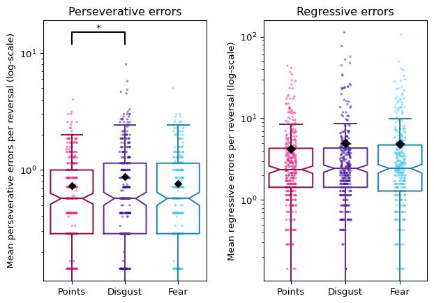
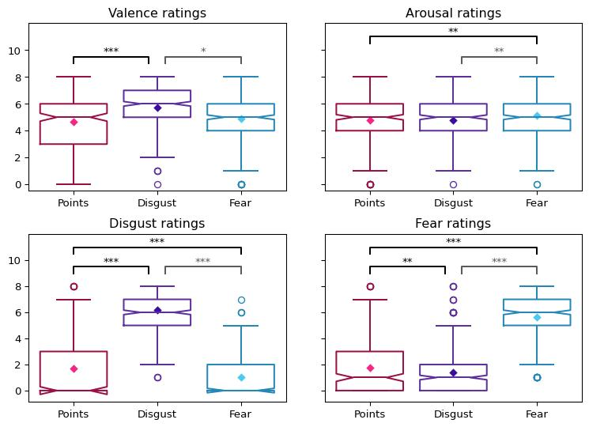
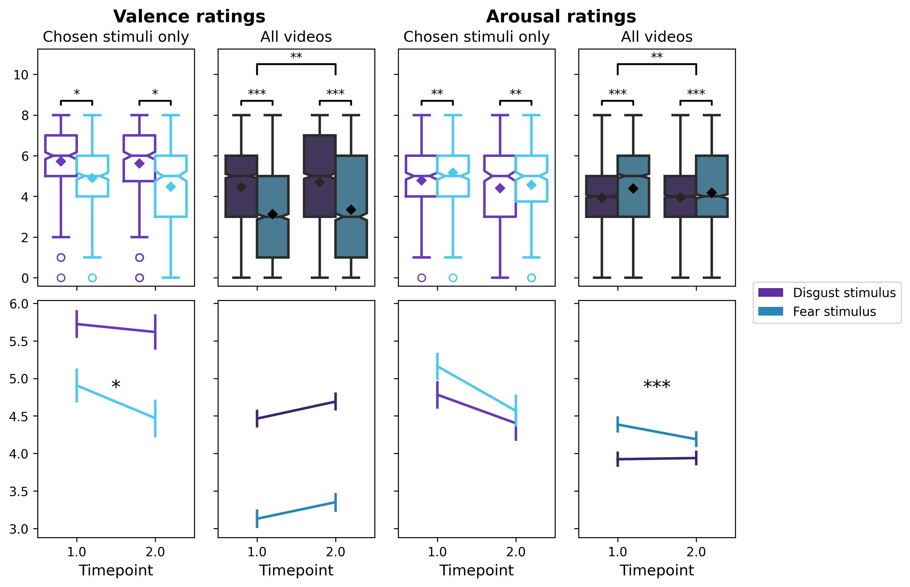
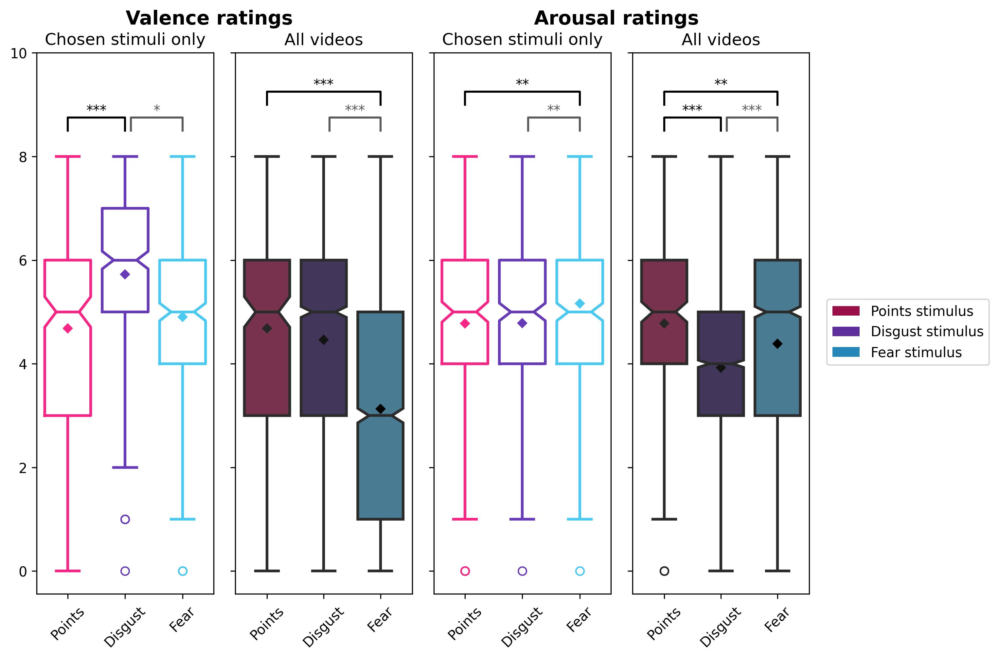
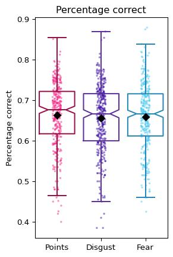
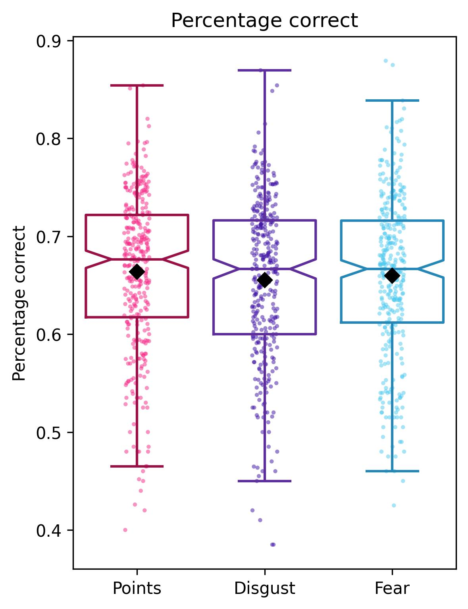
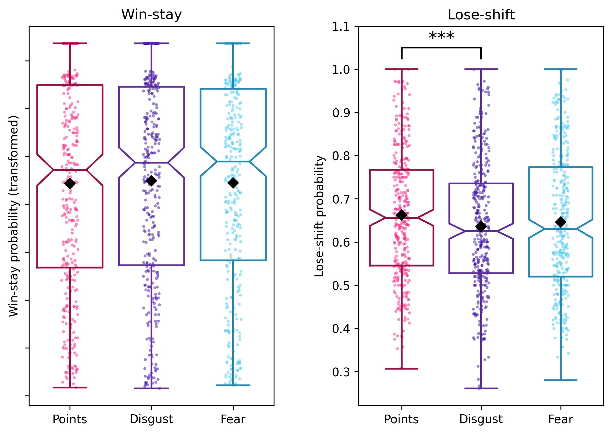
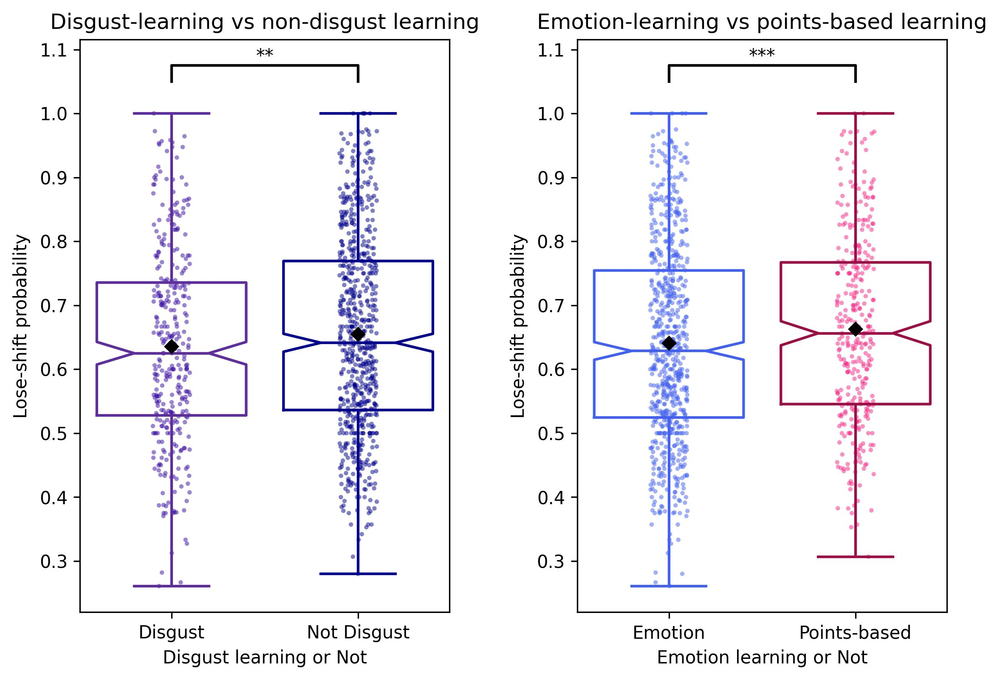
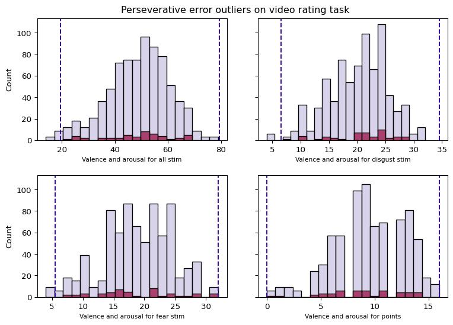

# Data visualisations


<p>

This file contains the code for the graphs included in the paper (and
supplement)
</p>

<h3>

1.  Checking sample demographics
    </h3>

<p>

During data collection, exclusions (due to failed attention checks) were
made on a rolling basis in order to best match the final sample with the
target demographics (in terms of age, sex and psychiatric diagnosis).
</p>

<p>

We ran a series of checks to ensure that this was adequately done
</p>

<details class="code-fold">
<summary>Code</summary>

``` python
##check demographic numbers for included participants
age_categories=[]
for participant in set(task_summary.participant_no):
    sub_df=task_summary[task_summary.participant_no==participant]
    age=sub_df.self_report_age.iloc[0]
    if 18<=age<=24:
        age_cat='18-24'
    elif 25<=age<=34:
        age_cat='25-34'
    elif 35<=age<=44:
        age_cat='35-44'
    elif 45<=age<=54:
        age_cat='45-54'
    elif age>=55:
        age_cat='55+'
    else:
        age_cat='error'
    age_categories.append({
        'participant_no': participant,
        'age_category': age_cat
    })
category_demographics=excluded_demographics.merge(pd.DataFrame(age_categories), on='participant_no', how='left')

##add target numbers
rep_sample_df=category_demographics.groupby(['age_category', 'prolific_sex', 'cleaned_diagnosis']).size().reset_index(name='count')
for i in range(20):
    old_row=rep_sample_df.iloc[i]
    if old_row.age_category=='18-24' and old_row.prolific_sex =='Female' and old_row.cleaned_diagnosis == 'Yes':
        dem_cat='18-24 female with a psychiatric diagnosis'
        target=4
        target_percentage=0.013
    if old_row.age_category=='18-24' and old_row.prolific_sex =='Female' and old_row.cleaned_diagnosis == 'No':
        dem_cat='18-24 female without a psychiatric diagnosis'
        target=15
        target_percentage=0.046
    if old_row.age_category=='18-24' and old_row.prolific_sex =='Male' and old_row.cleaned_diagnosis == 'Yes':
        dem_cat='18-24 male with a psychiatric diagnosis'
        target=3
        target_percentage=0.008
    if old_row.age_category=='18-24' and old_row.prolific_sex =='Male' and old_row.cleaned_diagnosis == 'No':
        dem_cat='18-24 male without a psychiatric diagnosis'
        target=17
        target_percentage=0.052
    if old_row.age_category=='25-34' and old_row.prolific_sex =='Female' and old_row.cleaned_diagnosis == 'Yes':
        dem_cat='25-34 female with a psychiatric diagnosis'
        target=10
        target_percentage=0.03
    if old_row.age_category=='25-34' and old_row.prolific_sex =='Female' and old_row.cleaned_diagnosis == 'No':
            dem_cat='25-34 female without a psychiatric diagnosis'
            target=18
            target_percentage=0.056
    if old_row.age_category=='25-34' and old_row.prolific_sex =='Male' and old_row.cleaned_diagnosis == 'Yes':
            dem_cat='25-34 male with a psychiatric diagnosis'
            target=5
            target_percentage=0.016
    if old_row.age_category=='25-34' and old_row.prolific_sex =='Male' and old_row.cleaned_diagnosis == 'No':
            dem_cat='25-34 male without a psychiatric diagnosis'
            target=23
            target_percentage=0.07
    if old_row.age_category=='35-44' and old_row.prolific_sex =='Female' and old_row.cleaned_diagnosis == 'Yes':
        dem_cat='35-44 female with a psychiatric diagnosis'
        target=11
        target_percentage=0.033
    if old_row.age_category=='35-44' and old_row.prolific_sex =='Female' and old_row.cleaned_diagnosis == 'No':
            dem_cat='35-44 female without a psychiatric diagnosis'
            target=18
            target_percentage=0.057
    if old_row.age_category=='35-44' and old_row.prolific_sex =='Male' and old_row.cleaned_diagnosis == 'Yes':
            dem_cat='25-44 male with a psychiatric diagnosis'
            target=6
            target_percentage=0.02
    if old_row.age_category=='35-44' and old_row.prolific_sex =='Male' and old_row.cleaned_diagnosis == 'No':
            dem_cat='25-44 male without a psychiatric diagnosis'
            target=22
            target_percentage=0.068
    if old_row.age_category=='45-54' and old_row.prolific_sex =='Female' and old_row.cleaned_diagnosis == 'Yes':
        dem_cat='45-54 female with a psychiatric diagnosis'
        target=10
        target_percentage=0.032
    if old_row.age_category=='45-54' and old_row.prolific_sex =='Female' and old_row.cleaned_diagnosis == 'No':
            dem_cat='45-54 female without a psychiatric diagnosis'
            target=18
            target_percentage=0.056
    if old_row.age_category=='45-54' and old_row.prolific_sex =='Male' and old_row.cleaned_diagnosis == 'Yes':
            dem_cat='45-54 male with a psychiatric diagnosis'
            target=6
            target_percentage=0.02
    if old_row.age_category=='45-54' and old_row.prolific_sex =='Male' and old_row.cleaned_diagnosis == 'No':
            dem_cat='45-54 male without a psychiatric diagnosis'
            target=22
            target_percentage=0.067
    if old_row.age_category=='55+' and old_row.prolific_sex =='Female' and old_row.cleaned_diagnosis == 'Yes':
        dem_cat='55+ female with a psychiatric diagnosis'
        target=25
        target_percentage=0.078
    if old_row.age_category=='55+' and old_row.prolific_sex =='Female' and old_row.cleaned_diagnosis == 'No':
            dem_cat='55+ female without a psychiatric diagnosis'
            target=37
            target_percentage=0.113
    if old_row.age_category=='55+' and old_row.prolific_sex =='Male' and old_row.cleaned_diagnosis == 'Yes':
            dem_cat='55+ male with a psychiatric diagnosis'
            target=13
            target_percentage=0.041
    if old_row.age_category=='55+' and old_row.prolific_sex =='Male' and old_row.cleaned_diagnosis == 'No':
            dem_cat='55+ male without a psychiatric diagnosis'
            target=40
            target_percentage=0.124
    
    rep_sample_df.loc[i,'target']=target
    rep_sample_df.loc[i,'target_percentage']=target_percentage*100
    rep_sample_df.loc[i, 'dem_cat']=dem_cat
rep_sample_df['abs_difference']=rep_sample_df['target']- rep_sample_df['count']
rep_sample_df['actual_percentage']=(rep_sample_df['count']/340)*100
rep_sample_df['percentage_difference']=rep_sample_df['target_percentage']-rep_sample_df['actual_percentage']

##plot hypothesised results
fig, axes = plt.subplots(1,1, sharey=False)
sns.barplot(data=rep_sample_df, x='percentage_difference', y='dem_cat', palette='husl', ax=axes)
plt.xlim(-10, 10)
plt.xlabel('Difference between target percentage in each category and actual percentage')
plt.xticks([-10, -7.5, -5, -2.5, 0, 2.5, 5, 7.5, 10], ['-10%', '-7.5%', '-5%', '-2.5%', '0%', '2.5%', '5%', '7.5%', '10%'])
plt.ylabel('Demographic category')
plt.title('Comparison between final sample and target representative sample', weight='bold')

plt.savefig('figures/checking_exclusions_demographics.jpeg', dpi=300, bbox_inches='tight')
```

</details>



<h3>

2.  Video ratings task plots
    </h3>

<br>
<p>

Firstly, compare fear and disgust videos across both timepoints
</p>

<details class="code-fold">
<summary>Code</summary>

``` python
fig, axes = plt.subplots(2,4, sharex='col', sharey='row')
fig.tight_layout(pad=0)
fig.set_size_inches(8.3, 5.8)

order=['disgust', 'fear']
dark_palette = {'disgust': "#5E2E9D" ,
                'fear': "#2487B8"}
palette = { 'disgust': "#3A0CA3",
            'fear': "#4CC9F0"}
            
trial_type_annot, timepoint_annot, interaction_annot = FD_pVal_annot('Valence')

sns.boxplot(data=long_chosen_stim_df, ax=axes[0,0], x='Timepoint', y='Valence', hue='trial_type', hue_order=order, fill=False, palette=dark_palette, notch=True, linewidth=2)
sns.pointplot(data=long_chosen_stim_df, ax=axes[0,0], x='Timepoint', y='Valence', hue='trial_type', hue_order=order, palette=palette, marker='D', markersize=4, dodge=0.4, linestyle='none', ci=None, zorder=3)
axes[0,0].set_ylim(top=11.25)
axes[0,0].set_yticks(range(0, 11, 2)) 
axes[0,0].set_yticklabels(range(0, 11,2)) 
axes[0,0].set_title("Valence rating", fontsize=12) 
axes[0,0].set_ylabel('')

if trial_type_annot != 'NonSig': 
    x1, x2 = -0.2, 0.2  
    y, h, col = long_chosen_stim_df["Valence"].max() +0.5, 0.2, 'black'  
    axes[0,0].plot([x1, x1, x2, x2], [y, y+h, y+h, y], lw=1.5, c=col)  
    axes[0,0].text((x1+x2)*.5, y+h, trial_type_annot, ha='center', va='bottom', color=col) 
    x1, x2 = 0.8, 1.2  
    y, h, col = long_chosen_stim_df["Valence"].max() +0.5, 0.2, 'black'  
    axes[0,0].plot([x1, x1, x2, x2], [y, y+h, y+h, y], lw=1.5, c=col)  
    axes[0,0].text((x1+x2)*.5, y+h, trial_type_annot, ha='center', va='bottom', color=col)
if timepoint_annot != 'NonSig': 
    x1, x2 = 0, 1  
    y, h, col = long_chosen_stim_df["Valence"].max() +2, 0.5, 'black'  
    axes[0,0].plot([x1, x1, x2, x2], [y, y+h, y+h, y], lw=1.5, c=col)  
    axes[0,0].text((x1+x2)*.5, y+h, timepoint_annot, ha='center', va='bottom', color=col) 

sns.pointplot(data=long_chosen_stim_df, ax=axes[1,0], x='Timepoint', y='Valence', hue='trial_type', palette=palette, scale=0.75, marker='')
axes[1,0].xaxis.get_label().set_fontsize(12)
axes[1,0].yaxis.label.set_visible(False)
if interaction_annot != 'NonSig': 
    x= 0.5
    y= 4.75
    axes[1,0].text(x, y, interaction_annot, ha='center', va='bottom', color='black', fontsize=15)


###AROUSAL
trial_type_annot, timepoint_annot, interaction_annot = FD_pVal_annot('Arousal')

sns.boxplot(data=long_chosen_stim_df, ax=axes[0,1], x='Timepoint', y='Arousal', hue='trial_type', hue_order=order, fill=False, palette=dark_palette, notch=True, linewidth=2)
sns.pointplot(data=long_chosen_stim_df, ax=axes[0,1], x='Timepoint', y='Arousal', hue='trial_type', hue_order=order, palette=palette, marker='D', markersize=4, dodge=0.4, linestyle='none', ci=None, zorder=3)
axes[0,1].set_title("Arousal rating", fontsize=12) 
if trial_type_annot != 'NonSig': 
    x1, x2 = -0.2, 0.2  
    y, h, col = long_chosen_stim_df["Valence"].max() +0.5, 0.2, 'black'  
    axes[0,1].plot([x1, x1, x2, x2], [y, y+h, y+h, y], lw=1.5, c=col)  
    axes[0,1].text((x1+x2)*.5, y+h, trial_type_annot, ha='center', va='bottom', color=col) 
    x1, x2 = 0.8, 1.2  
    y, h, col = long_chosen_stim_df["Valence"].max() +0.5, 0.2, 'black'  
    axes[0,1].plot([x1, x1, x2, x2], [y, y+h, y+h, y], lw=1.5, c=col)  
    axes[0,1].text((x1+x2)*.5, y+h, trial_type_annot, ha='center', va='bottom', color=col)
if timepoint_annot != 'NonSig': 
    x1, x2 = 0, 1  
    y, h, col = long_chosen_stim_df["Valence"].max() +2, 0.5, 'black'  
    axes[0,1].plot([x1, x1, x2, x2], [y, y+h, y+h, y], lw=1.5, c=col)  
    axes[0,1].text((x1+x2)*.5, y+h, timepoint_annot, ha='center', va='bottom', color=col) 


sns.pointplot(data=long_chosen_stim_df, ax=axes[1,1], x='Timepoint',y='Arousal', hue='trial_type', palette=palette, marker='', scale=0.75)
axes[1,1].xaxis.get_label().set_fontsize(12)
sns.pointplot(data=long_chosen_stim_df, ax=axes[1,0], x='Timepoint', y='Valence', hue='trial_type', palette=palette, scale=0.75, marker='')
axes[1,1].xaxis.get_label().set_fontsize(12)
axes[1,1].set_ylabel('')
if interaction_annot != 'NonSig': 
    x= 0.5
    y= 4.75
    axes[1,1].text(x, y, interaction_annot, ha='center', va='bottom', color='black', fontsize=15)

trial_type_annot, timepoint_annot, interaction_annot = FD_pVal_annot('Fear')
sns.boxplot(data=long_chosen_stim_df, ax=axes[0,2], x='Timepoint', y='Fear', hue='trial_type', hue_order=order, fill=False, palette=dark_palette, notch=True, linewidth=2)
sns.pointplot(data=long_chosen_stim_df, ax=axes[0,2], x='Timepoint', y='Fear', hue='trial_type', hue_order=order, palette=palette, marker='D', markersize=5, dodge=0.4, linestyle='none', ci=None, zorder=3)
axes[0,2].set_title("Fear ratings", fontsize=12) 
axes[0,2].set_ylabel('')

if trial_type_annot != 'NonSig': 
    x1, x2 = -0.2, 0.2  
    y, h, col = long_chosen_stim_df["Fear"].max() +0.5, 0.2, 'black'  
    axes[0,2].plot([x1, x1, x2, x2], [y, y+h, y+h, y], lw=1.5, c=col)  
    axes[0,2].text((x1+x2)*.5, y+h, trial_type_annot, ha='center', va='bottom', color=col) 
    x1, x2 = 0.8, 1.2  
    y, h, col = long_chosen_stim_df["Fear"].max() +0.5, 0.2, 'black'  
    axes[0,2].plot([x1, x1, x2, x2], [y, y+h, y+h, y], lw=1.5, c=col)  
    axes[0,2].text((x1+x2)*.5, y+h, trial_type_annot, ha='center', va='bottom', color=col)
if timepoint_annot != 'NonSig': 
    x1, x2 = 0, 1  
    y, h, col = long_chosen_stim_df["Fear"].max() +2, 0.5, 'black'  
    axes[0,2].plot([x1, x1, x2, x2], [y, y+h, y+h, y], lw=1.5, c=col)  
    axes[0,2].text((x1+x2)*.5, y+h, timepoint_annot, ha='center', va='bottom', color=col) 


sns.pointplot(data=long_chosen_stim_df, ax=axes[1,2], x='Timepoint', y='Fear', hue='trial_type', scale=0.75, palette=palette, markersize=5, marker='')
axes[1,2].xaxis.get_label().set_fontsize(12)
axes[1,2].set_ylabel('')
if interaction_annot != 'NonSig': 
    x= 0.5
    y= 3.5
    axes[1,2].text(x, y, interaction_annot, ha='center', va='bottom', color='black', fontsize=15)

###DISGUST
trial_type_annot, timepoint_annot, interaction_annot = FD_pVal_annot('Disgust')

sns.boxplot(data=long_chosen_stim_df, ax=axes[0,3], x='Timepoint', y='Disgust', hue='trial_type', hue_order=order, fill=False, palette=dark_palette, notch=True, linewidth=2)
sns.pointplot(data=long_chosen_stim_df, ax=axes[0,3], x='Timepoint', y='Disgust', hue='trial_type', hue_order=order, palette=palette, marker='D', markersize=5, dodge=0.4, linestyle='none', ci=None)
axes[0,3].set_title("Disgust ratings", fontsize=12) 
if trial_type_annot != 'NonSig': 
    x1, x2 = -0.2, 0.2  
    y, h, col = long_chosen_stim_df["Disgust"].max() +0.5, 0.2, 'black'  
    axes[0,3].plot([x1, x1, x2, x2], [y, y+h, y+h, y], lw=1.5, c=col)  
    axes[0,3].text((x1+x2)*.5, y+h, trial_type_annot, ha='center', va='bottom', color=col) 
    x1, x2 = 0.8, 1.2  
    y, h, col = long_chosen_stim_df["Disgust"].max() +0.5, 0.2, 'black'  
    axes[0,3].plot([x1, x1, x2, x2], [y, y+h, y+h, y], lw=1.5, c=col)  
    axes[0,3].text((x1+x2)*.5, y+h, trial_type_annot, ha='center', va='bottom', color=col)
if timepoint_annot != 'NonSig': 
    x1, x2 = 0, 1  
    y, h, col = long_chosen_stim_df["Disgust"].max() +2, 0.5, 'black'  
    axes[0,3].plot([x1, x1, x2, x2], [y, y+h, y+h, y], lw=1.5, c=col)  
    axes[0,3].text((x1+x2)*.5, y+h, timepoint_annot, ha='center', va='bottom', color=col) 


sns.pointplot(data=long_chosen_stim_df, ax=axes[1,3], x='Timepoint', y='Disgust', hue='trial_type', scale=0.75, palette=palette, marker='')
axes[1,3].xaxis.get_label().set_fontsize(12)
if interaction_annot != 'NonSig': 
    x= 0.5
    y= 3.5
    axes[1,3].text(x, y, interaction_annot, ha='center', va='bottom', color='black', fontsize=15)


for ax in axes.flatten():
    ax.get_legend().set_visible(False)
plt.figlegend(loc='center left', bbox_to_anchor=(1,0.5),  handles=[mpatches.Patch(facecolor="#5E2E9D"), mpatches.Patch(facecolor="#2487B8")], labels=['Disgust stimulus', 'Fear stimulus'], prop={'size':10})
#plt.savefig('figures/VidRating_FearDisgust.jpeg', dpi=300, bbox_inches='tight')
```

</details>



<p>

Next, compare fear and disgust ratings (at T1) to points ratings (only
taken once)
</p>

<details class="code-fold">
<summary>Code</summary>

``` python
data=chosen_stim_df[['participant_no', 'trial_type', 'unpleasant_1', 'arousing_1', 'disgusting_1', 'frightening_1']].sort_values('trial_type')
fig, axes = plt.subplots(1,4, sharey='row')
title="Initial ratings of videos fear, disgust and points videos"
#plt.suptitle(title, fontsize=16)
fig.tight_layout(pad=1)
fig.set_size_inches(8.3, 5.8)

order=['points', 'disgust', 'fear']
palette = ["#F72585", "#3A0CA3", "#4CC9F0"]
dark_palette = ["#9B0F47", "#5E2E9D", "#2487B8"]

sns.boxplot(data=data, ax=axes[0],   x='trial_type', hue='trial_type', y='unpleasant_1', legend=False, fill=False, order=order, palette=dark_palette, hue_order=order, notch=True)
sns.pointplot(data=data, ax=axes[0],   x='trial_type', hue='trial_type', y='unpleasant_1', legend=False, order=order, palette=palette, hue_order=order, errorbar=None, marker='D', markersize=3.5)

fear_annot, disgust_annot=points_pVal_annot('Valence')
if fear_annot != 'NonSig':
    x1, x2 = 0, 2  
    y, h, col = 9, 0.25, 'black'  
    axes[0].plot([x1, x1, x2, x2], [y, y+h, y+h, y], lw=1.5, c=col)  
    axes[0].text((x1+x2)*.5, y+h, fear_annot, ha='center', va='bottom', color=col)  
if disgust_annot != 'NonSig':
    x1, x2 = 0, 0.9  
    y, h, col = 8.5, 0.25, 'black'  
    axes[0].plot([x1, x1, x2, x2], [y, y+h, y+h, y], lw=1.5, c=col)  
    axes[0].text((x1+x2)*.5, y+h, disgust_annot, ha='center', va='bottom', color=col) 

axes[0].set_xlabel('')
axes[0].set_ylabel('')
axes[0].set_title('Valence ratings', fontsize=12)
axes[0].set_xticklabels(['Points', 'Disgust', 'Fear'], rotation=45)
axes[0].set_ylim(top=10)
axes[0].set_yticks(range(0, 11,2)) 
axes[0].set_yticklabels(range(0, 11,2))

##AROUSAL
sns.boxplot(data=data, ax=axes[1], x='trial_type', hue='trial_type', y='arousing_1', palette=dark_palette, legend=False, fill=False, order=order, hue_order=order, notch=True)
sns.pointplot(data=data, ax=axes[1], x='trial_type', hue='trial_type', y='arousing_1', palette=palette, legend=False, order=order, hue_order=order, errorbar=None, marker='D', markersize=3.5)
fear_annot, disgust_annot=points_pVal_annot('Arousal')
if fear_annot != 'NonSig':
    x1, x2 = 0, 2  
    y, h, col = 9.2, 0.25, 'black'  
    axes[1].plot([x1, x1, x2, x2], [y, y+h, y+h, y], lw=1.5, c=col)  
    axes[1].text((x1+x2)*.5, y+h, fear_annot, ha='center', va='bottom', color=col)  
if disgust_annot != 'NonSig':
    x1, x2 = 0, 1  
    y, h, col = 8.5, 0.25, 'black'  
    axes[1].plot([x1, x1, x2, x2], [y, y+h, y+h, y], lw=1.5, c=col)  
    axes[1].text((x1+x2)*.5, y+h, disgust_annot, ha='center', va='bottom', color=col) 

axes[1].set_xlabel('')
axes[1].set_ylabel('')
axes[1].set_title('Arousal ratings', fontsize=12)
axes[1].set_xticklabels(['Points', 'Disgust', 'Fear'], rotation=45)


##DISGUST
sns.boxplot(data=data, ax=axes[2], x='trial_type', hue='trial_type', y='disgusting_1', palette=dark_palette, legend=False, fill=False, order=order, hue_order=order, notch=True)
sns.pointplot(data=data, ax=axes[2], x='trial_type', hue='trial_type', y='disgusting_1', palette=palette, legend=False, order=order, hue_order=order, errorbar=None, marker='D', markersize=3.5)

fear_annot, disgust_annot=points_pVal_annot('Disgust')
if fear_annot != 'NonSig':
    x1, x2 = 0, 2  
    y, h, col = 9.2, 0.25, 'black'  
    axes[2].plot([x1, x1, x2, x2], [y, y+h, y+h, y], lw=1.5, c=col)  
    axes[2].text((x1+x2)*.5, y+h, fear_annot, ha='center', va='bottom', color=col)  
if disgust_annot != 'NonSig':
    x1, x2 = 0, 0.9  
    y, h, col = 8.5, 0.25, 'black'  
    axes[2].plot([x1, x1, x2, x2], [y, y+h, y+h, y], lw=1.5, c=col)  
    axes[2].text((x1+x2)*.5, y+h, disgust_annot, ha='center', va='bottom', color=col) 

axes[2].set_xlabel('')
axes[2].set_ylabel('')
axes[2].set_title('Disgust ratings', fontsize=12)
axes[2].set_xticklabels(['Points', 'Disgust', 'Fear'], rotation=45)
axes[2].set_ylim(top=10)
axes[2].set_yticks(range(0, 11,2)) 
axes[2].set_yticklabels(range(0, 11,2))


##FEAR
sns.boxplot(data=data, ax=axes[3], x='trial_type',  hue='trial_type', y='frightening_1', palette=dark_palette, legend=False, fill=False, order=order, hue_order=order, notch=True)
sns.pointplot(data=data, ax=axes[3], x='trial_type', hue='trial_type', y='frightening_1', palette=palette, legend=False, order=order, hue_order=order, errorbar=None, marker='D', markersize=3.5)

fear_annot, disgust_annot=points_pVal_annot('Fear')
if fear_annot != 'NonSig':
    x1, x2 = 0, 2  
    y, h, col = 9.2, 0.25, 'black'  
    axes[3].plot([x1, x1, x2, x2], [y, y+h, y+h, y], lw=1.5, c=col)  
    axes[3].text((x1+x2)*.5, y+h, fear_annot, ha='center', va='bottom', color=col)  
if disgust_annot != 'NonSig':
    x1, x2 = 0, 0.9  
    y, h, col = 8.5, 0.25, 'black'  
    axes[3].plot([x1, x1, x2, x2], [y, y+h, y+h, y], lw=1.5, c=col)  
    axes[3].text((x1+x2)*.5, y+h, disgust_annot, ha='center', va='bottom', color=col) 
axes[3].set_xticklabels(['Points', 'Disgust', 'Fear'], rotation=45)
axes[3].set_xlabel('')
axes[3].set_ylabel('')
axes[3].set_title('Fear ratings', fontsize=12)

##add that fear and disgust were different by all metrics (shown by models A-D)
x1, x2 = 1.1, 2  
y, h, col = 8.5, 0.25, '#5A5A5A'  

valence_annot, timepoint_annot, interaction_annot = FD_pVal_annot('Valence')
arousal_annot, timepoint_annot, interaction_annot = FD_pVal_annot('Arousal')
fear_annot, timepoint_annot, interaction_annot = FD_pVal_annot('Fear')
disgust_annot, timepoint_annot, interaction_annot = FD_pVal_annot('Disgust')

axes[0].text((x1+x2)*.5, y+h, valence_annot, ha='center', va='bottom', color=col)
axes[0].plot([x1, x1, x2, x2], [y, y+h, y+h, y], lw=1.5, c=col) 
axes[1].text((x1+x2)*.5, y+h, arousal_annot, ha='center', va='bottom', color=col)
axes[1].plot([x1, x1, x2, x2], [y, y+h, y+h, y], lw=1.5, c=col) 
axes[2].text((x1+x2)*.5, y+h, fear_annot, ha='center', va='bottom', color=col)
axes[2].plot([x1, x1, x2, x2], [y, y+h, y+h, y], lw=1.5, c=col) 
axes[3].text((x1+x2)*.5, y+h, disgust_annot, ha='center', va='bottom', color=col)
axes[3].plot([x1, x1, x2, x2], [y, y+h, y+h, y], lw=1.5, c=col) 

plt.figlegend(loc='center left', bbox_to_anchor=(1,0.5),  handles=[mpatches.Patch(facecolor="#9B0F47"), mpatches.Patch(facecolor="#5E2E9D"), mpatches.Patch(facecolor="#2487B8")], labels=['Points stimulus', 'Disgust stimulus', 'Fear stimulus'], prop={'size':10})
#plt.savefig('figures/VidRating_Points.jpeg', dpi=300, bbox_inches='tight')
```

</details>



<p>

The plots above show just the ratings for the ‘chosen stimuli’ (those
used in the reversal learning task). We can see how this differs to when
you look across all emotional videos (5 fear videos and 5 disgust
videos)
</p>

<details class="code-fold">
<summary>Code</summary>

``` python
##create long video rating data-frame to allow this
long_vid_ratings=pd.DataFrame()
for i in vid_ratings_df.index:
    row=vid_ratings_df.loc[i]
    timepoint_1=pd.DataFrame({
    'participant_no': [row.participant_no],
    #'age': [row.prolific_age],
    #'sex': [row. prolific_sex],
    'Vid': [str(row['Vid'])],
    'trial_type': [row.trial_type],
    'Valence': [row.unpleasant_1],
    'Arousal': [row.arousing_1],
    'Fear': [row.frightening_1],
    'Disgust': [row.disgusting_1],
    'Timepoint': 1.0
    })
    timepoint_2=pd.DataFrame({
        'participant_no': [row.participant_no],
        #'age': [row.prolific_age],
        #'sex': [row. prolific_sex],
        'Vid': [str(row['Vid'])],
        'trial_type': [row.trial_type],
        'Valence': [row.unpleasant_2],
        'Arousal': [row.arousing_2],
        'Fear': [row.frightening_2],
        'Disgust': [row.disgusting_2],
        'Timepoint': 2.0
    })
    long_vid_ratings_row=pd.concat([timepoint_1, timepoint_2])
    long_vid_ratings=pd.concat([long_vid_ratings_row, long_vid_ratings])
    long_vid_ratings=long_vid_ratings[long_vid_ratings.trial_type!="points"]

fig, axes = plt.subplots(2,4, sharex='col', sharey='row')
fig.tight_layout(pad=0)
fig.set_size_inches(8.3, 5.8)

order=['disgust', 'fear']
dark_palette = {'disgust': "#3e236e" ,
                'fear': "#2487B8"}
palette = { 'disgust': "#673ab7",
            'fear': "#4CC9F0"}


###VALENCE
fig.text(0.25, 1.05, 'Valence ratings', va='center', ha='center', fontsize=14, weight='bold')         

sns.boxplot(data=long_chosen_stim_df, ax=axes[0,0], x='Timepoint', y='Valence', hue='trial_type', hue_order=order, fill=False, palette=palette, notch=True, linewidth=2)
sns.pointplot(data=long_chosen_stim_df, ax=axes[0,0], x='Timepoint', y='Valence', hue='trial_type', hue_order=order, palette=palette, marker='D', markersize=4, dodge=0.4, linestyle='none', ci=None, zorder=3)
axes[0,0].set_ylim(top=11.25)
axes[0,0].set_yticks(range(0, 11, 2)) 
axes[0,0].set_yticklabels(range(0, 11,2)) 
axes[0,0].set_title("Chosen stimuli only", fontsize=12) 
axes[0,0].set_ylabel('')

trial_type_annot, timepoint_annot, interaction_annot = FD_pVal_annot('Valence')
if trial_type_annot != 'NonSig': 
    x1, x2 = -0.2, 0.2  
    y, h, col = long_chosen_stim_df["Valence"].max() +0.5, 0.2, 'black'  
    axes[0,0].plot([x1, x1, x2, x2], [y, y+h, y+h, y], lw=1.5, c=col)  
    axes[0,0].text((x1+x2)*.5, y+h, trial_type_annot, ha='center', va='bottom', color=col) 
    x1, x2 = 0.8, 1.2  
    y, h, col = long_chosen_stim_df["Valence"].max() +0.5, 0.2, 'black'  
    axes[0,0].plot([x1, x1, x2, x2], [y, y+h, y+h, y], lw=1.5, c=col)  
    axes[0,0].text((x1+x2)*.5, y+h, trial_type_annot, ha='center', va='bottom', color=col)
if timepoint_annot != 'NonSig': 
    x1, x2 = 0, 1  
    y, h, col = long_chosen_stim_df["Valence"].max() +2, 0.5, 'black'  
    axes[0,0].plot([x1, x1, x2, x2], [y, y+h, y+h, y], lw=1.5, c=col)  
    axes[0,0].text((x1+x2)*.5, y+h, timepoint_annot, ha='center', va='bottom', color=col) 

sns.pointplot(data=long_chosen_stim_df, ax=axes[1,0], x='Timepoint', y='Valence', hue='trial_type', palette=palette, scale=0.75, marker='')
axes[1,0].xaxis.get_label().set_fontsize(12)
axes[1,0].set_ylabel('')
if interaction_annot != 'NonSig': 
    x= 0.5
    y= 4.75
    axes[1,0].text(x, y, interaction_annot, ha='center', va='bottom', color='black', fontsize=15)

#full dataset
sns.boxplot(data=long_vid_ratings, ax=axes[0,1], x='Timepoint', y='Valence', hue='trial_type', hue_order=order, fill=True, saturation=0.5, palette=dark_palette, notch=True, linewidth=2)
sns.pointplot(data=long_vid_ratings, ax=axes[0,1], x='Timepoint', y='Valence', hue='trial_type', hue_order=order, color='black', marker='D', markersize=4, dodge=0.4, linestyle='none', ci=None, zorder=3)
axes[0,1].set_ylim(top=11.25)
axes[0,1].set_yticks(range(0, 11, 2)) 
axes[0,1].set_yticklabels(range(0, 11,2)) 
axes[0,1].set_title("All videos", fontsize=12) 
axes[0,1].set_ylabel('')

trial_type_annot, timepoint_annot, interaction_annot = expl_FD_pVal_annot('Valence')
if trial_type_annot != 'NonSig': 
    x1, x2 = -0.2, 0.2  
    y, h, col = long_vid_ratings["Valence"].max() +0.5, 0.2, 'black'  
    axes[0,1].plot([x1, x1, x2, x2], [y, y+h, y+h, y], lw=1.5, c=col)  
    axes[0,1].text((x1+x2)*.5, y+h, trial_type_annot, ha='center', va='bottom', color=col) 
    x1, x2 = 0.8, 1.2  
    y, h, col = long_vid_ratings["Valence"].max() +0.5, 0.2, 'black'  
    axes[0,1].plot([x1, x1, x2, x2], [y, y+h, y+h, y], lw=1.5, c=col)  
    axes[0,1].text((x1+x2)*.5, y+h, trial_type_annot, ha='center', va='bottom', color=col)
if timepoint_annot != 'NonSig': 
    x1, x2 = 0, 1  
    y, h, col = long_vid_ratings["Valence"].max() +2, 0.5, 'black'  
    axes[0,1].plot([x1, x1, x2, x2], [y, y+h, y+h, y], lw=1.5, c=col)  
    axes[0,1].text((x1+x2)*.5, y+h, timepoint_annot, ha='center', va='bottom', color=col) 

sns.pointplot(data=long_vid_ratings, ax=axes[1,1], x='Timepoint', y='Valence', hue='trial_type', palette=dark_palette, scale=0.75, marker='')
axes[1,1].xaxis.get_label().set_fontsize(12)
axes[1,1].set_ylabel('')
if interaction_annot != 'NonSig': 
    x= 0.5
    y= 4.75
    axes[1,1].text(x, y, interaction_annot, ha='center', va='bottom', color='black', fontsize=15)


###AROUSAL
fig.text(0.75, 1.05, 'Arousal ratings', va='center', ha='center', fontsize=14, weight='bold')         

sns.boxplot(data=long_chosen_stim_df, ax=axes[0,2], x='Timepoint', y='Arousal', hue='trial_type', hue_order=order, fill=False, palette=palette, notch=True, linewidth=2)
sns.pointplot(data=long_chosen_stim_df, ax=axes[0,2], x='Timepoint', y='Arousal', hue='trial_type', hue_order=order, palette=palette, marker='D', markersize=4, dodge=0.4, linestyle='none', ci=None, zorder=3)
axes[0,2].set_ylim(top=11.25)
axes[0,2].set_yticks(range(0, 11, 2)) 
axes[0,2].set_yticklabels(range(0, 11,2)) 
axes[0,2].set_title("Chosen stimuli only", fontsize=12) 
axes[0,2].set_ylabel('')

trial_type_annot, timepoint_annot, interaction_annot = FD_pVal_annot('Arousal')
if trial_type_annot != 'NonSig': 
    x1, x2 = -0.2, 0.2  
    y, h, col = long_chosen_stim_df["Arousal"].max() +0.5, 0.2, 'black'  
    axes[0,2].plot([x1, x1, x2, x2], [y, y+h, y+h, y], lw=1.5, c=col)  
    axes[0,2].text((x1+x2)*.5, y+h, trial_type_annot, ha='center', va='bottom', color=col) 
    x1, x2 = 0.8, 1.2  
    y, h, col = long_chosen_stim_df["Arousal"].max() +0.5, 0.2, 'black'  
    axes[0,2].plot([x1, x1, x2, x2], [y, y+h, y+h, y], lw=1.5, c=col)  
    axes[0,2].text((x1+x2)*.5, y+h, trial_type_annot, ha='center', va='bottom', color=col)
if timepoint_annot != 'NonSig': 
    x1, x2 = 0, 1  
    y, h, col = long_chosen_stim_df["Arousal"].max() +2, 0.5, 'black'  
    axes[0,2].plot([x1, x1, x2, x2], [y, y+h, y+h, y], lw=1.5, c=col)  
    axes[0,2].text((x1+x2)*.5, y+h, timepoint_annot, ha='center', va='bottom', color=col) 

sns.pointplot(data=long_chosen_stim_df, ax=axes[1,2], x='Timepoint', y='Arousal', hue='trial_type', palette=palette, scale=0.75, marker='')
axes[1,2].xaxis.get_label().set_fontsize(12)
axes[1,2].set_ylabel('')
if interaction_annot != 'NonSig': 
    x= 0.5
    y= 4.75
    axes[1,2].text(x, y, interaction_annot, ha='center', va='bottom', color='black', fontsize=15)

sns.boxplot(data=long_vid_ratings, ax=axes[0,3], x='Timepoint', y='Arousal', hue='trial_type', hue_order=order, fill=True, saturation=0.5, palette=dark_palette, notch=True, linewidth=2)
sns.pointplot(data=long_vid_ratings, ax=axes[0,3], x='Timepoint', y='Arousal', hue='trial_type', hue_order=order, color='black', marker='D', markersize=4, dodge=0.4, linestyle='none', ci=None, zorder=3)
axes[0,3].set_ylim(top=11.25)
axes[0,3].set_yticks(range(0, 11, 2)) 
axes[0,3].set_yticklabels(range(0, 11,2)) 
axes[0,3].set_title("All videos", fontsize=12) 
axes[0,3].set_ylabel('')

trial_type_annot, timepoint_annot, interaction_annot = expl_FD_pVal_annot('Arousal')
if trial_type_annot != 'NonSig': 
    x1, x2 = -0.2, 0.2  
    y, h, col = long_vid_ratings["Arousal"].max() +0.5, 0.2, 'black'  
    axes[0,3].plot([x1, x1, x2, x2], [y, y+h, y+h, y], lw=1.5, c=col)  
    axes[0,3].text((x1+x2)*.5, y+h, trial_type_annot, ha='center', va='bottom', color=col) 
    x1, x2 = 0.8, 1.2  
    y, h, col = long_vid_ratings["Arousal"].max() +0.5, 0.2, 'black'  
    axes[0,3].plot([x1, x1, x2, x2], [y, y+h, y+h, y], lw=1.5, c=col)  
    axes[0,3].text((x1+x2)*.5, y+h, trial_type_annot, ha='center', va='bottom', color=col)
if timepoint_annot != 'NonSig': 
    x1, x2 = 0, 1  
    y, h, col = long_vid_ratings["Arousal"].max() +2, 0.5, 'black'  
    axes[0,3].plot([x1, x1, x2, x2], [y, y+h, y+h, y], lw=1.5, c=col)  
    axes[0,3].text((x1+x2)*.5, y+h, timepoint_annot, ha='center', va='bottom', color=col) 

sns.pointplot(data=long_vid_ratings, ax=axes[1,3], x='Timepoint', y='Arousal', hue='trial_type', palette=dark_palette, scale=0.75, marker='')
axes[1,3].xaxis.get_label().set_fontsize(12)
axes[1,3].set_ylabel('')
if interaction_annot != 'NonSig': 
    x= 0.5
    y= 4.75
    axes[1,3].text(x, y, interaction_annot, ha='center', va='bottom', color='black', fontsize=15)

for ax in axes.flatten():
    ax.get_legend().set_visible(False)
plt.figlegend(loc='center left', bbox_to_anchor=(1,0.5),  handles=[mpatches.Patch(facecolor="#5E2E9D"), mpatches.Patch(facecolor="#2487B8")], labels=['Disgust stimulus', 'Fear stimulus'], prop={'size':10})
#plt.savefig('figures/Exploratory_VidRating_FearDisgust.jpeg', dpi=300, bbox_inches='tight')
```

</details>


<br>
<p>

And in comparison to points ratings
</p>

<details class="code-fold">
<summary>Code</summary>

``` python
data=chosen_stim_df[['participant_no', 'trial_type', 'unpleasant_1', 'arousing_1', 'disgusting_1', 'frightening_1']].sort_values('trial_type')
fig, axes = plt.subplots(1,4, sharey=True)
title="Initial ratings of videos fear, disgust and points videos"
#plt.suptitle(title, fontsize=16)
fig.set_size_inches(8.3, 5.8)
fig.tight_layout(pad=0)

order=['points', 'disgust', 'fear']
palette = ["#F72585", "#673ab7", "#4CC9F0"]
dark_palette = ["#9B0F47", "#3e236e", "#2487B8"]

##VALENCE
fig.text(0.25, 1.05, 'Valence ratings', va='center', ha='center', fontsize=14, weight='bold')
sns.boxplot(data=data, ax=axes[0],   x='trial_type', hue='trial_type', y='unpleasant_1', legend=False, fill=False, linewidth=2, order=order, palette=palette, hue_order=order, notch=True)
sns.pointplot(data=data, ax=axes[0],   x='trial_type', hue='trial_type', y='unpleasant_1', legend=False, order=order, palette=palette, hue_order=order, errorbar=None, marker='D', markersize=3.5)

fear_annot, disgust_annot=points_pVal_annot('Valence')
if fear_annot != 'NonSig':
    x1, x2 = 0, 2  
    y, h, col = 9, 0.25, 'black'  
    axes[0].plot([x1, x1, x2, x2], [y, y+h, y+h, y], lw=1.5, c=col)  
    axes[0].text((x1+x2)*.5, y+h, fear_annot, ha='center', va='bottom', color=col)  
if disgust_annot != 'NonSig':
    x1, x2 = 0, 1  
    y, h, col = 8.5, 0.25, 'black'  
    axes[0].plot([x1, x1, x2, x2], [y, y+h, y+h, y], lw=1.5, c=col)  
    axes[0].text((x1+x2)*.5, y+h, disgust_annot, ha='center', va='bottom', color=col) 

#add fear vs disgust contrast
x1, x2 = 1.1, 2  
y, h, col = 8.5, 0.25, '#5A5A5A'  
FD_valence_annot, timepoint_annot, interaction_annot = FD_pVal_annot('Valence')
axes[0].text((x1+x2)*.5, y+h, FD_valence_annot, ha='center', va='bottom', color=col)
axes[0].plot([x1, x1, x2, x2], [y, y+h, y+h, y], lw=1.5, c=col) 

axes[0].set_xlabel('')
axes[0].set_ylabel('')
axes[0].set_title('Chosen stimuli only', fontsize=12)
axes[0].set_xticklabels(['Points', 'Disgust', 'Fear'], rotation=45)
axes[0].set_ylim(top=10)
axes[0].set_yticks(range(0, 11,2)) 
axes[0].set_yticklabels(range(0, 11,2))

T1_and_points=pd.concat([vid_ratings_df,chosen_stim_df[chosen_stim_df.trial_type=='points']]).reset_index()
T1_and_points=T1_and_points[['participant_no', 'trial_type', 'unpleasant_1', 'arousing_1', 'disgusting_1', 'frightening_1', 'Vid']].sort_values('trial_type')
box=sns.boxplot(x=T1_and_points['trial_type'], y=T1_and_points['unpleasant_1'], notch=True, linewidth=2, fill=True, order=order, saturation=0.5, palette=dark_palette, ax=axes[1])
sns.pointplot(data=T1_and_points, ax=axes[1],   x='trial_type', hue='trial_type', y='unpleasant_1', legend=False, order=order, color='black', hue_order=order, errorbar=None, marker='D', markersize=3.5)

fear_annot, disgust_annot=expl_points_pVal_annot('Valence')
if fear_annot != 'NonSig':
    x1, x2 = 0, 2
    y, h, col = 9, 0.25, 'black'  
    axes[1].plot([x1, x1, x2, x2], [y, y+h, y+h, y], lw=1.5, c=col)  
    axes[1].text((x1+x2)*.5, y+h, fear_annot, ha='center', va='bottom', color=col)  
if disgust_annot != 'NonSig':
    x1, x2 = 0, 1
    y, h, col = 8.5, 0.25, 'black'  
    axes[1].plot([x1, x1, x2, x2], [y, y+h, y+h, y], lw=1.5, c=col)  
    axes[1].text((x1+x2)*.5, y+h, disgust_annot, ha='center', va='bottom', color=col) 

#add fear vs disgust contrast
x1, x2 = 1.1, 2  
y, h, col = 8.5, 0.25, '#5A5A5A'  
FD_valence_annot, timepoint_annot, interaction_annot = expl_FD_pVal_annot('Valence')
axes[1].text((x1+x2)*.5, y+h, FD_valence_annot, ha='center', va='bottom', color=col)
axes[1].plot([x1, x1, x2, x2], [y, y+h, y+h, y], lw=1.5, c=col) 

axes[1].set_xlabel('')
axes[1].set_ylabel('')
axes[1].set_title('All videos', fontsize=12)
axes[1].set_xticklabels(['Points', 'Disgust', 'Fear'], rotation=45)
axes[1].set_ylim(top=10)
axes[1].set_yticks(range(0, 11,2)) 
axes[1].set_yticklabels(range(0, 11,2))
axes[1].margins(x=0.15)


##Arousal
fig.text(0.75, 1.05, 'Arousal ratings', va='center', ha='center', fontsize=14, weight='bold')

sns.boxplot(data=data, ax=axes[2],   x='trial_type', hue='trial_type', y='arousing_1', legend=False, fill=False, linewidth=2, order=order, palette=palette, hue_order=order, notch=True)
sns.pointplot(data=data, ax=axes[2],   x='trial_type', hue='trial_type', y='arousing_1', legend=False, order=order, palette=palette, hue_order=order, errorbar=None, marker='D', markersize=3.5)

fear_annot, disgust_annot=points_pVal_annot('Arousal')
if fear_annot != 'NonSig':
    x1, x2 = 0, 2  
    y, h, col = 9, 0.25, 'black'  
    axes[2].plot([x1, x1, x2, x2], [y, y+h, y+h, y], lw=1.5, c=col)  
    axes[2].text((x1+x2)*.5, y+h, fear_annot, ha='center', va='bottom', color=col)  
if disgust_annot != 'NonSig':
    x1, x2 = 0, 1  
    y, h, col = 8.5, 0.25, 'black'  
    axes[2].plot([x1, x1, x2, x2], [y, y+h, y+h, y], lw=1.5, c=col)  
    axes[2].text((x1+x2)*.5, y+h, disgust_annot, ha='center', va='bottom', color=col) 

#add fear vs disgust contrast
x1, x2 = 1.1, 2  
y, h, col = 8.5, 0.25, '#5A5A5A'  
FD_arousal_annot, timepoint_annot, interaction_annot = FD_pVal_annot('Arousal')
axes[2].text((x1+x2)*.5, y+h, FD_arousal_annot, ha='center', va='bottom', color=col)
axes[2].plot([x1, x1, x2, x2], [y, y+h, y+h, y], lw=1.5, c=col) 

axes[2].set_xlabel('')
axes[2].set_ylabel('')
axes[2].set_title('Chosen stimuli only', fontsize=12)
axes[2].set_xticklabels(['Points', 'Disgust', 'Fear'], rotation=45)
axes[2].set_ylim(top=10)
axes[2].set_yticks(range(0, 11,2)) 
axes[2].set_yticklabels(range(0, 11,2))

T1_and_points=pd.concat([vid_ratings_df,chosen_stim_df[chosen_stim_df.trial_type=='points']]).reset_index()
T1_and_points=T1_and_points[['participant_no', 'trial_type', 'unpleasant_1', 'arousing_1', 'disgusting_1', 'frightening_1', 'Vid']].sort_values('trial_type')
sns.boxplot(x=T1_and_points['trial_type'], y=T1_and_points['arousing_1'], notch=True, linewidth=2, fill=True, order=order, saturation=0.5, palette=dark_palette, ax=axes[3])
sns.pointplot(data=T1_and_points, ax=axes[3],   x='trial_type', hue='trial_type', y='arousing_1', legend=False, order=order, color='black', hue_order=order, errorbar=None, marker='D', markersize=3.5)

fear_annot, disgust_annot=expl_points_pVal_annot('Arousal')
if fear_annot != 'NonSig':
    x1, x2 = 0, 2
    y, h, col = 9, 0.25, 'black'  
    axes[3].plot([x1, x1, x2, x2], [y, y+h, y+h, y], lw=1.5, c=col)  
    axes[3].text((x1+x2)*.5, y+h, fear_annot, ha='center', va='bottom', color=col)  
if disgust_annot != 'NonSig':
    x1, x2 = 0, 1
    y, h, col = 8.5, 0.25, 'black'  
    axes[3].plot([x1, x1, x2, x2], [y, y+h, y+h, y], lw=1.5, c=col)  
    axes[3].text((x1+x2)*.5, y+h, disgust_annot, ha='center', va='bottom', color=col) 

#add fear vs disgust contrast
x1, x2 = 1.1, 2  
y, h, col = 8.5, 0.25, '#5A5A5A'  
FD_Arousal_annot, timepoint_annot, interaction_annot = expl_FD_pVal_annot('Arousal')
axes[3].text((x1+x2)*.5, y+h, FD_Arousal_annot, ha='center', va='bottom', color=col)
axes[3].plot([x1, x1, x2, x2], [y, y+h, y+h, y], lw=1.5, c=col) 

axes[3].set_xlabel('')
axes[3].set_ylabel('')
axes[3].set_title('All videos', fontsize=12)
axes[3].set_xticklabels(['Points', 'Disgust', 'Fear'], rotation=45)
axes[3].set_ylim(top=10)
axes[3].set_yticks(range(0, 11,2)) 
axes[3].set_yticklabels(range(0, 11,2))
axes[3].margins(x=0.15)

plt.figlegend(loc='center left', bbox_to_anchor=(1,0.5),  handles=[mpatches.Patch(facecolor="#9B0F47"), mpatches.Patch(facecolor="#5E2E9D"), mpatches.Patch(facecolor="#2487B8")], labels=['Points stimulus', 'Disgust stimulus', 'Fear stimulus'], prop={'size':10})
#plt.savefig('figures/Exploratory_VidRating_Points.jpeg', dpi=300, bbox_inches='tight')
```

</details>



<h3>

3.  Reversal learning task
    </h3>

    <p>

    Firstly, we can use data from a randomly selected participant to
    show performance on the task
    </p>

<details class="code-fold">
<summary>Code</summary>

``` python
complete_task=pd.read_csv(r"U:\Documents\Disgust learning project\github\disgust_reversal_learning-final\csvs\complete_task_excluded.csv")
sub_df=complete_task[complete_task.participant_no==56]
block_df=sub_df[sub_df.block_no==0].reset_index()
plt.plot(block_df.correct_stim, color="#4CC9F0")
plt.plot(block_df.stim_selected, 'o', color="#3A0CA3", markersize=3.5)
plt.xlabel('Trial number')
plt.yticks([0,1], ['Fractal A', 'Fractal B'])
#plt.savefig('figures/ReversalLearning_individual_plot.jpeg', dpi=300, bbox_inches='tight')
```

</details>

    ([<matplotlib.axis.YTick at 0x1ca42f515b0>,
      <matplotlib.axis.YTick at 0x1ca42c8dbb0>],
     [Text(0, 0, 'Fractal A'), Text(0, 1, 'Fractal B')])



<b>Now, we can make hypothesis testing plots</b>
<p>

<b>Firstly, we plot models 1 and 2 (regressive and perseverative
errors)</b>
</p>

<details class="code-fold">
<summary>Code</summary>

``` python
fig, axes = plt.subplots(1,2, sharey=False)
fig.tight_layout(pad=3)
fig.set_size_inches(8.3, 5.8)

##plot hypothesised results
palette = ["#F72585", "#3A0CA3", "#4CC9F0"]
dark_palette = ["#9B0F47", "#5E2E9D", "#2487B8"]

sns.stripplot(data=task_summary, x="block_type", y="mean_perseverative_er", ax=axes[0], palette=palette, alpha=.5, jitter=True, marker='.', order=['Points', 'Disgust', 'Fear'], zorder=1)
sns.boxplot(data=task_summary, x="block_type", y="mean_perseverative_er",  ax=axes[0], palette=dark_palette, fill=False, showfliers=False, notch=True, order=['Points', 'Disgust', 'Fear'], zorder=2)
sns.pointplot(data=task_summary, x="block_type", y="mean_perseverative_er",  ax=axes[0], marker="D", color='black', errorbar=None, linestyle='none', markersize=4, order=['Points', 'Disgust', 'Fear'], zorder=3)

fear_annot, points_annot = pVal_annot('persEr')
if fear_annot != 'NonSig':
    x1, x2 = 1, 2  
    y, h, col = task_summary["mean_perseverative_er"].max() + 15, 10, 'black'  
    axes[0].plot([x1, x1, x2, x2], [y, y+h, y+h, y], lw=1.5, c=col)  
    axes[0].text((x1+x2)*.5, y+h, fear_annot, ha='center', va='bottom', color=col)  
if points_annot != 'NonSig':
    x1, x2 = 0, 1  
    y, h, col = task_summary["mean_perseverative_er"].max() + 1.5, 1.5, 'black'  
    axes[0].plot([x1, x1, x2, x2], [y, y+h, y+h, y], lw=1.5, c=col)  
    axes[0].text((x1+x2)*.5, y+h, points_annot, ha='center', va='bottom', color=col, fontsize=15) 

axes[0].set_xlabel("")
axes[0].set_ylabel("Mean perseverative errors per reversal (log-scale)") 
axes[0].set_title("Perseverative errors")
axes[0].set_yscale('log')
axes[0].set_ylim(top=y+h+3.5)

##REGRESSIVE ERRORS
sns.stripplot(data=task_summary, x="block_type", y="mean_regressive_er", ax=axes[1], palette=palette, alpha=.5, jitter=True, marker='.', order=['Points', 'Disgust', 'Fear'], zorder=1)
sns.boxplot(data=task_summary, x="block_type", y="mean_regressive_er",  ax=axes[1], palette=dark_palette, fill=False, showfliers=False, notch=True, order=['Points', 'Disgust', 'Fear'], zorder=2)
sns.pointplot(data=task_summary, x="block_type", y="mean_regressive_er",  ax=axes[1], marker="D", color='black', errorbar=None, linestyle='none', markersize=5, order=['Points', 'Disgust', 'Fear'], zorder=3)
axes[1].set_xlabel("")
axes[1].set_xticklabels(axes[1].get_xticklabels(), rotation=0)
axes[1].set_ylabel("Mean regressive errors per reversal (log-scale)") 
axes[1].set_title("Regressive errors")
axes[1].set_yscale('log')

fear_annot, points_annot = pVal_annot('regEr')
if fear_annot != 'NonSig':
    x1, x2 = 1, 2  
    y, h, col = task_summary["mean_regressive_er"].max() + 0.5, 0.2, 'black'  
    axes[1].plot([x1, x1, x2, x2], [y, y+h, y+h, y], lw=1.5, c=col)  
    axes[1].text((x1+x2)*.5, y+h, fear_annot, ha='center', va='bottom', color=col)  
if points_annot != 'NonSig':
    x1, x2 = 0, 1  
    y, h, col = task_summary["mean_regressive_er"].max() + 0.075, 0.05, 'black'  
    axes[1].plot([x1, x1, x2, x2], [y, y+h, y+h, y], lw=1.5, c=col)  
    axes[1].text((x1+x2)*.5, y+h, points_annot, ha='center', va='bottom', color=col) 
#plt.savefig('figures/ReversaLearning_PerseverativeRegressive.jpeg', dpi=300, bbox_inches='tight')
```

</details>



<p>

<b>Next, create the same plot for win-stay/lose-shift analyses</b>
</p>

<details class="code-fold">
<summary>Code</summary>

``` python
fig, axes = plt.subplots(1,2, sharey=False)
fig.tight_layout(pad=3)
fig.set_size_inches(8.3, 5.8)

##plot hypothesised results
palette = ["#F72585", "#3A0CA3", "#4CC9F0"]
dark_palette = ["#9B0F47", "#5E2E9D", "#2487B8"]

#tests were run on transformed variable - so will plot the transformed variable
pt=PowerTransformer(method='yeo-johnson', standardize=False)
skl_yeojohnson=pt.fit(pd.DataFrame(task_summary.win_stay))
skl_yeojohnson=pt.transform(pd.DataFrame(task_summary.win_stay))
task_summary['win_stay_transformed'] = pt.transform(pd.DataFrame(task_summary.win_stay))

sns.stripplot(data=task_summary, x="block_type", y="win_stay_transformed", ax=axes[0], palette=palette, alpha=.5, jitter=True, marker='.', order=['Points', 'Disgust', 'Fear'], zorder=1)
sns.boxplot(data=task_summary, x="block_type", y="win_stay_transformed",  ax=axes[0], palette=dark_palette, fill=False, showfliers=False, notch=True, order=['Points', 'Disgust', 'Fear'], zorder=2)
sns.pointplot(data=task_summary, x="block_type", y="win_stay_transformed",  ax=axes[0], marker="D", color='black', errorbar=None, linestyle='none', markersize=5, order=['Points', 'Disgust', 'Fear'], zorder=3)

fear_annot, points_annot = pVal_annot('winStay')
if fear_annot != 'NonSig':
    x1, x2 = 1, 2  
    y, h, col = task_summary["win_stay_transformed"].max() + 0.2, 0.1, 'black'  
    axes[0].plot([x1, x1, x2, x2], [y, y+h, y+h, y], lw=1.5, c=col)  
    axes[0].text((x1+x2)*.5, y+h, fear_annot, ha='center', va='bottom', color=col)  
if points_annot != 'NonSig':
    x1, x2 = 0, 1  
    y, h, col = task_summary["win_stay_transformed"].max() + 0.5, 0.025, 'black'  
    axes[0].plot([x1, x1, x2, x2], [y, y+h, y+h, y], lw=1.5, c=col)  
    axes[0].text((x1+x2)*.5, y+h, points_annot, ha='center', va='bottom', color=col) 

axes[0].set_xlabel("")
axes[0].set_ylabel("Win-stay probability (transformed)") 
axes[0].set_title("Win-stay")
axes[0].tick_params(labelleft=False)

sns.stripplot(data=task_summary, x="block_type", y="lose_shift", ax=axes[1], palette=palette, alpha=.5, jitter=True, marker='.', order=['Points', 'Disgust', 'Fear'], zorder=1)
sns.boxplot(data=task_summary, x="block_type", y="lose_shift",  ax=axes[1], palette=dark_palette, fill=False, showfliers=False, notch=True, order=['Points', 'Disgust', 'Fear'], zorder=2)
sns.pointplot(data=task_summary, x="block_type", y="lose_shift",  ax=axes[1], marker="D", color='black', errorbar=None, linestyle='none', markersize=5, order=['Points', 'Disgust', 'Fear'], zorder=3)
axes[1].set_xlabel("")
axes[1].set_xticklabels(axes[1].get_xticklabels(), rotation=0)
axes[1].set_ylabel("Lose-shift probability", labelpad=5) 
axes[1].set_title("Lose-shift")


fear_annot, points_annot = pVal_annot('loseShift')
if fear_annot != 'NonSig':
    x1, x2 = 1, 2  
    y, h, col = task_summary["lose_shift"].max() + 0.2, 0.05, 'black'  
    axes[1].plot([x1, x1, x2, x2], [y, y+h, y+h, y], lw=1.5, c=col)  
    axes[1].text((x1+x2)*.5, y+h, fear_annot, ha='center', va='bottom', color=col)  
if points_annot != 'NonSig':
    x1, x2 = 0, 1  
    y, h, col = task_summary["lose_shift"].max() + 0.025, 0.025, 'black'  
    axes[1].plot([x1, x1, x2, x2], [y, y+h, y+h, y], lw=1.5, c=col)  
    axes[1].text((x1+x2)*.5, y+h, points_annot, ha='center', va='bottom', color=col, fontsize=15) 
axes[1].set_ylim(top=y+h+0.05)
#plt.savefig('figures/ReversaLearning_winStayLoseShift.jpeg', dpi=300, bbox_inches='tight')
```

</details>



<p>

We also tested whether the effects of feedback-type in perseverative
error and lose-shift analyses are better explained by a difference
between disgust and other types or learning or a more general difference
between emotional (fear/disgust) and non-emotional learning
</p>

<p>

For perseverative errors:
</p>

<details class="code-fold">
<summary>Code</summary>

``` python
task_summary.loc[task_summary['block_type']=='Disgust', 'disgustOrNot']='Disgust'
task_summary.loc[task_summary['block_type']!='Disgust', 'disgustOrNot']='Not'
task_summary.loc[task_summary['block_type']=='Points', 'emotionOrNot']='Not'
task_summary.loc[task_summary['block_type']!='Points', 'emotionOrNot']='Emotion'

emotionDisgust_pvals=pd.read_csv("disgustEmotion_regEr_pvalsForPlotting.csv")
disgustOrNot_pval=float(emotionDisgust_pvals[emotionDisgust_pvals.model=='disgustOrNot'].pvals)
if disgustOrNot_pval < 0.001:
    disgustOrNot_annot='***'
elif disgustOrNot_pval <0.01:
    disgustOrNot_annot='**'
elif disgustOrNot_pval <0.05:
    disgustOrNot_annot='*'
else:
    disgustOrNot_annot='NonSig'

emotionOrNot_pval=float(emotionDisgust_pvals[emotionDisgust_pvals.model=='emotionOrNot'].pvals)
if emotionOrNot_pval < 0.001:
    emotionOrNot_annot='***'
elif emotionOrNot_pval <0.01:
    emotionOrNott_annot='**'
elif emotionOrNot_pval <0.05:
    emotionOrNot_annot='*'
else:
    emotionOrNot_annot='NonSig'
        

fig, axes = plt.subplots(1,2, sharey=False)
fig.tight_layout(pad=3)
fig.set_size_inches(8.3, 5.8)
disgust_not_palette=["#5E2E9D", "#00008B"]
emotion_not_palette=["#4361EE", "#9B0F47"]

disgust_not_light=["#3A0CA3", "#00008B"]
emotion_not_light=["#4361EE", "#F72585"]

sns.stripplot(data=task_summary, x="disgustOrNot", y="mean_perseverative_er", ax=axes[0], palette=disgust_not_light, alpha=.5, jitter=True, marker='.', zorder=1)
sns.boxplot(data=task_summary, x="disgustOrNot", y="mean_perseverative_er", ax=axes[0], palette=disgust_not_palette, fill=False, showfliers=False, notch=True, zorder=2)
sns.pointplot(data=task_summary, x="disgustOrNot", y="mean_perseverative_er", ax=axes[0], marker="D", color='black', errorbar=None, linestyle='none', markersize=4, zorder=3)
axes[0].set_xlabel("Disgust learning or Not")
axes[0].set_xticklabels(['Disgust', 'Not Disgust'])
axes[0].set_ylabel("Perseverative errors per reversal (log-scale)", labelpad=5) 
axes[0].set_title("Disgust-learning vs non-disgust learning", fontsize=12)
axes[0].set_yscale('log')

sns.stripplot(data=task_summary, x="emotionOrNot", y="mean_perseverative_er", ax=axes[1], palette=emotion_not_light, alpha=.5, jitter=True, marker='.', zorder=1)
sns.boxplot(data=task_summary, x="emotionOrNot", y="mean_perseverative_er", ax=axes[1],palette=emotion_not_palette, fill=False, showfliers=False, notch=True, zorder=2)
sns.pointplot(data=task_summary, x="emotionOrNot", y="mean_perseverative_er", ax=axes[1],marker="D", color='black', errorbar=None, linestyle='none', markersize=4, zorder=3)
axes[1].set_xlabel("Emotion learning or Not")
axes[1].set_xticklabels(['Emotion', 'Points-based'])
axes[1].set_ylabel("Perseverative errors per reversal (log-scale)", labelpad=5) 
axes[1].set_title("Emotion-learning vs points-based learning", fontsize=12)
axes[1].set_yscale('log')

if disgustOrNot_annot != 'NonSig':
    x1, x2 = 0, 1  
    y, h, col = task_summary["mean_perseverative_er"].max() +1.5, 1.5, 'black'  
    axes[0].plot([x1, x1, x2, x2], [y, y+h, y+h, y], lw=1.5, c=col)  
    axes[0].text((x1+x2)*.5, y+h, disgustOrNot_annot, ha='center', va='bottom', color=col) 
if emotionOrNot_annot != 'NonSig':
    x1, x2 = 0, 1  
    y, h, col = task_summary["mean_perseverative_er"].max() +1.5, 1.5, 'black'  
    axes[1].plot([x1, x1, x2, x2], [y, y+h, y+h, y], lw=1.5, c=col)  
    axes[1].text((x1+x2)*.5, y+h, emotionOrNot_annot, ha='center', va='bottom', color=col) 
plt.savefig('figures/ReversaLearning_DisgustNotEmotionNot_persEr.jpeg', dpi=300, bbox_inches='tight')
```

</details>


<p>

For lose-shift probability:

<details class="code-fold">
<summary>Code</summary>

``` python
emotionDisgust_pvals=pd.read_csv("disgustEmotion_loseShift_pvalsForPlotting.csv")
disgustOrNot_pval=float(emotionDisgust_pvals[emotionDisgust_pvals.model=='disgustOrNot'].pvals)
emotionOrNot_pval=float(emotionDisgust_pvals[emotionDisgust_pvals.model=='emotionOrNot'].pvals)

if disgustOrNot_pval < 0.001:
    disgustOrNot_annot='***'
elif disgustOrNot_pval <0.01:
    disgustOrNot_annot='**'
elif disgustOrNot_pval <0.05:
    disgustOrNot_annot='*'
else:
    disgustOrNot_annot='NonSig'


if emotionOrNot_pval < 0.001:
    emotionOrNot_annot='***'
elif emotionOrNot_pval <0.01:
    emotionOrNott_annot='**'
elif emotionOrNot_pval <0.05:
    emotionOrNot_annot='*'
else:
    emotionOrNot_annot='NonSig'
        

fig, axes = plt.subplots(1,2, sharey=False)
fig.tight_layout(pad=3)
fig.set_size_inches(8.3, 5.8)

disgust_not_palette=["#5E2E9D", "#00008B"]
emotion_not_palette=["#4361EE", "#9B0F47"]

disgust_not_light=["#3A0CA3", "#00008B"]
emotion_not_light=["#4361EE", "#F72585"]

sns.stripplot(data=task_summary, x="disgustOrNot", y="lose_shift", ax=axes[0], palette=disgust_not_light, alpha=.5, jitter=True, marker='.', zorder=1)
sns.boxplot(data=task_summary, x="disgustOrNot", y="lose_shift", ax=axes[0], palette=disgust_not_palette, fill=False, showfliers=False, notch=True, zorder=2)
sns.pointplot(data=task_summary, x="disgustOrNot", y="lose_shift", ax=axes[0], marker="D", color='black', errorbar=None, linestyle='none', markersize=4, zorder=3)
axes[0].set_xlabel("Disgust learning or Not")
axes[0].set_xticklabels(['Disgust', 'Not Disgust'])
axes[0].set_ylabel("Lose-shift probability", labelpad=5) 
axes[0].set_title("Disgust-learning vs non-disgust learning", fontsize=12)

sns.stripplot(data=task_summary, x="emotionOrNot", y="lose_shift", ax=axes[1], palette=emotion_not_light, alpha=.5, jitter=True, marker='.', zorder=1)
sns.boxplot(data=task_summary, x="emotionOrNot", y="lose_shift", ax=axes[1],palette=emotion_not_palette, fill=False, showfliers=False, notch=True, zorder=2)
sns.pointplot(data=task_summary, x="emotionOrNot", y="lose_shift", ax=axes[1],marker="D", color='black', errorbar=None, linestyle='none', markersize=4, zorder=3)
axes[1].set_xlabel("Emotion learning or Not")
axes[1].set_xticklabels(['Emotion', 'Points-based'])
axes[1].set_ylabel("Lose-shift probability", labelpad=5) 
axes[1].set_title("Emotion-learning vs points-based learning", fontsize=12)

if disgustOrNot_annot != 'NonSig':
    x1, x2 = 0, 1  
    y, h, col = task_summary["lose_shift"].max() +0.05, 0.025, 'black'  
    axes[0].plot([x1, x1, x2, x2], [y, y+h, y+h, y], lw=1.5, c=col)  
    axes[0].text((x1+x2)*.5, y+h, disgustOrNot_annot, ha='center', va='bottom', color=col) 
if emotionOrNot_annot != 'NonSig':
    x1, x2 = 0, 1  
    y, h, col = task_summary["lose_shift"].max() +0.05, 0.025, 'black'  
    axes[1].plot([x1, x1, x2, x2], [y, y+h, y+h, y], lw=1.5, c=col)  
    axes[1].text((x1+x2)*.5, y+h, emotionOrNot_annot, ha='center', va='bottom', color=col) 
plt.savefig('figures/ReversaLearning_DisgustNotEmotionNot_loseShift.jpeg', dpi=300, bbox_inches='tight')
```

</details>



<p>

<b>And finally, an exploratory test effected the effect of block-type on
accuracy(percentage correct)</b>
</p>

<details class="code-fold">
<summary>Code</summary>

``` python
palette = ["#F72585", "#3A0CA3", "#4CC9F0"]
dark_palette = ["#9B0F47", "#5E2E9D", "#2487B8"]

##plot hypothesised results
fig, axes = plt.subplots(1,1, sharey=False)
fig.set_size_inches(4.15/2, 5.8/2)

sns.stripplot(data=task_summary, x="block_type", y="percentage_correct", ax=axes, palette=palette, alpha=.5, jitter=True, marker='.', order=['Points', 'Disgust', 'Fear'], zorder=1)
sns.boxplot(data=task_summary, x="block_type", y="percentage_correct",  ax=axes, palette=dark_palette, fill=False, showfliers=False, notch=True, order=['Points', 'Disgust', 'Fear'], zorder=2)
sns.pointplot(data=task_summary, x="block_type", y="percentage_correct",  ax=axes, marker="D", color='black', errorbar=None, linestyle='none', markersize=5, order=['Points', 'Disgust', 'Fear'], zorder=3)
axes.set_xlabel("")
axes.set_xticklabels(axes.get_xticklabels(), rotation=0)
axes.set_ylabel("Percentage correct") 
axes.set_title("Percentage correct")
#plt.savefig('figures/exploratory_ReversaLearning_PercentageCorrect.jpeg', dpi=300, bbox_inches='tight')
```

</details>

    Text(0.5, 1.0, 'Percentage correct')



<h3>

4.  Examining the nature of outliers in the perseverative error outcome
    </h3>

    <p>

    The perseverative error outcome in the hypothesis testing model
    seemed to be quite dependent on outliers. Therefore, here we assess
    the nature of those outliers:
    <p>

    a- to determine whether they are ‘true’ outliers (i.e., due to
    inattention etc.) resulting in alterations in task performance
    across all metrics
    </p>

    <p>

    b- to determine whether these outliers performed differently on the
    video rating task (e.g., were they more disgusted, leading to their
    altered task performance?)

<p>

Firstly, identify the outliers in the perseverative error outcome
</p>

<details class="code-fold">
<summary>Code</summary>

``` python
colorA="#9B0F47" #dark pink
colorB="#3A0CA3" #darker purple
colorC="#CBC3E3" #light purple


##identify the outliers in the perseverative error outcome
Q1 = task_summary['mean_perseverative_er'].quantile(0.25)
Q3 = task_summary['mean_perseverative_er'].quantile(0.75)
IQR = Q3 - Q1
lower_bound = Q1- 1.5 *  IQR
upper_bound = Q3 + 1.5 *  IQR
if lower_bound < min(task_summary.mean_perseverative_er):
    lower_bound = min(task_summary.mean_perseverative_er)
outliers=task_summary[(task_summary['mean_perseverative_er']<lower_bound) | (task_summary['mean_perseverative_er']>upper_bound )]

bin_width=np.ptp(task_summary.mean_perseverative_er)/35
bins=np.arange(min(task_summary.mean_perseverative_er), max(task_summary.mean_perseverative_er) + bin_width, bin_width)

fig, axes = plt.subplots(1,1)
fig.set_size_inches(8.3, 5.8)
sns.histplot(data=task_summary, bins=bins, x="mean_perseverative_er", color=colorC, ax=axes) 
sns.histplot(data=outliers, bins=bins,
x="mean_perseverative_er", color=colorA, zorder=2, ax=axes) 

axes.axvline(lower_bound, color=colorB, linestyle='dashed', linewidth=1.5, label='Lower Bound')
axes.axvline(upper_bound, color=colorB, linestyle='dashed', linewidth=1.5, label='Upper Bound')
axes.set_xlabel('Mean perseverative errors per reversal')
print("Number of outliers ="+str(len(outliers)))
#plt.savefig('figures/Exploratory_ReversaLearning_PerseverativeOutliers.jpeg', dpi=300, bbox_inches='tight')
```

</details>

    Number of outliers =47


<p>

And then plot where these outliers fall on other key task outcomes
</p>

<details class="code-fold">
<summary>Code</summary>

``` python
fig, axes = plt.subplots(2,2, sharey=True)
fig.tight_layout(pad=1.75)
fig.set_size_inches(8.3, 5.8)
title="Perseverative error outliers on other key task outcomes"
plt.suptitle(title, fontsize=12)
plt.ylim(0,40) 
## this is because there are 37 outliers 
# #and we want to be able to see clearly where they lie in the distribution

#percentage coorrect
Q1 = task_summary['percentage_correct'].quantile(0.25)
Q3 = task_summary['percentage_correct'].quantile(0.75)
IQR = Q3 - Q1
lower_bound = Q1- 1.5 *  IQR
upper_bound = Q3 + 1.5 *  IQR
bin_width=np.ptp(task_summary.percentage_correct)/25
bins=np.arange(min(task_summary.percentage_correct), max(task_summary.percentage_correct) + bin_width, bin_width)
sns.histplot(data=task_summary, x="percentage_correct", color=colorC, bins=bins, ax=axes[0,0]) 
sns.histplot(data=outliers, x="percentage_correct", bins=bins, color=colorA, ax=axes[0,0]) 
axes[0,0].axvline(lower_bound, color=colorB, linestyle='dashed', linewidth=1.5, label='Lower Bound')
axes[0,0].axvline(upper_bound, color=colorB, linestyle='dashed', linewidth=1.5,  label='Upper Bound')
axes[0,0].set_xlabel('Percentage correct')

#regressive error
Q1 = task_summary['mean_regressive_er'].quantile(0.25)
Q3 = task_summary['mean_regressive_er'].quantile(0.75)
IQR = Q3 - Q1
lower_bound = Q1- 1.5 *  IQR
upper_bound = Q3 + 1.5 *  IQR
if lower_bound < min(task_summary.mean_regressive_er):
    lower_bound = min(task_summary.mean_regressive_er)
bin_width=np.ptp(task_summary.mean_regressive_er)/25
bins=np.arange(min(task_summary.mean_regressive_er), max(task_summary.mean_regressive_er) + bin_width, bin_width)
sns.histplot(data=task_summary, x="mean_regressive_er", color=colorC, bins=bins, ax=axes[0,1]) 
sns.histplot(data=outliers, x="mean_regressive_er", bins=bins, color=colorA, ax=axes[0,1]) 
axes[0,1].axvline(lower_bound, color=colorB, linestyle='dashed', linewidth=1.5,  label='Lower Bound')
axes[0,1].axvline(upper_bound, color=colorB, linestyle='dashed', linewidth=1.5,  label='Upper Bound')
axes[0,1].set_xlabel('Regressive errors')

#win-stay
Q1 = task_summary['win_stay'].quantile(0.25)
Q3 = task_summary['win_stay'].quantile(0.75)
IQR = Q3 - Q1
lower_bound = Q1- 1.5 *  IQR
upper_bound = Q3 + 1.5 *  IQR
if upper_bound > max(task_summary.win_stay):
    upper_bound = max(task_summary.win_stay)
bin_width=np.ptp(task_summary.win_stay)/25
bins=np.arange(min(task_summary.win_stay), max(task_summary.win_stay) + bin_width, bin_width)
sns.histplot(data=task_summary, x="win_stay", color=colorC, bins=bins, ax=axes[1,0]) 
sns.histplot(data=outliers, x="win_stay", bins=bins, color=colorA, ax=axes[1,0]) 
axes[1,0].axvline(lower_bound, color=colorB, linestyle='dashed', linewidth=1.5, label='Lower Bound')
axes[1,0].axvline(upper_bound, color=colorB, linestyle='dashed', linewidth=1.5, label='Upper Bound')
axes[1,0].set_xlabel('Win-stay')

#lose-shift
Q1 = task_summary['lose_shift'].quantile(0.25)
Q3 = task_summary['lose_shift'].quantile(0.75)
IQR = Q3 - Q1
lower_bound = Q1- 1.5 *  IQR
upper_bound = Q3 + 1.5 *  IQR
if upper_bound > max(task_summary.lose_shift):
    upper_bound = max(task_summary.lose_shift)
if lower_bound < min(task_summary.lose_shift):
    lower_bound = min(task_summary.lose_shift)
bin_width=np.ptp(task_summary.lose_shift)/25
bins=np.arange(min(task_summary.lose_shift), max(task_summary.lose_shift) + bin_width, bin_width)
sns.histplot(data=task_summary, x="lose_shift", color=colorC, bins=bins, ax=axes[1,1]) 
sns.histplot(data=outliers, x="lose_shift", bins=bins, color=colorA, ax=axes[1,1]) 
axes[1,1].axvline(lower_bound, color=colorB, linestyle='dashed', linewidth=1.5,  label='Lower Bound')
axes[1,1].axvline(upper_bound, color=colorB, linestyle='dashed', linewidth=1.5, label='Upper Bound')
axes[1,1].set_xlabel('Lose-shift')
#plt.savefig('figures/Exploratory_ReversaLearning_PerseverativeOutliers_keyOutcomes.jpeg', dpi=300, bbox_inches='tight')
```

</details>

    Text(0.5, 77.16666666666664, 'Lose-shift')


<p>

And finally, assess whether they appear different on the video rating
task
</p>

<details class="code-fold">
<summary>Code</summary>

``` python
fig, axes = plt.subplots(2,2, sharey=True)
fig.tight_layout(pad=1.75)
fig.set_size_inches(8.3, 5.8)
title="Perseverative error outliers on video rating task"
plt.suptitle(title, fontsize=12)

#all emotions
Q1 = task_summary['all_emotion_score'].quantile(0.25)
Q3 = task_summary['all_emotion_score'].quantile(0.75)
IQR = Q3 - Q1
lower_bound = Q1- 1.5 *  IQR
upper_bound = Q3 + 1.5 *  IQR
bin_width=np.ptp(task_summary.all_emotion_score)/20
bins=np.arange(min(task_summary.all_emotion_score), max(task_summary.all_emotion_score) + bin_width, bin_width)
sns.histplot(data=task_summary, x="all_emotion_score", bins=bins, ax=axes[0,0], color=colorC) 
sns.histplot(data=outliers, x="all_emotion_score", bins=bins, ax=axes[0,0], color=colorA)
axes[0,0].axvline(lower_bound, color=colorB, linestyle='dashed', linewidth=1.5,label='Lower Bound')
axes[0,0].axvline(upper_bound, color=colorB, linestyle='dashed', linewidth=1.5, label='Upper Bound')
axes[0,0].set_xlabel('Valence and arousal for all stim', fontsize=8)
#axes[0,0].set_xlabel('')
#disgust
Q1 = task_summary['disgust_score'].quantile(0.25)
Q3 = task_summary['disgust_score'].quantile(0.75)
IQR = Q3 - Q1
lower_bound = Q1- 1.5 *  IQR
upper_bound = Q3 + 1.5 *  IQR
if lower_bound < min(task_summary.disgust_score):
    lower_bound = min(task_summary.disgust_score)
bin_width=np.ptp(task_summary.disgust_score)/20
bins=np.arange(min(task_summary.disgust_score), max(task_summary.disgust_score) + bin_width, bin_width)
sns.histplot(data=task_summary, x="disgust_score", bins=bins, ax=axes[0,1], color=colorC) 
sns.histplot(data=outliers, x="disgust_score", bins=bins, ax=axes[0,1], color=colorA) 
axes[0,1].axvline(lower_bound, color=colorB, linestyle='dashed', linewidth=1.5, label='Lower Bound')
axes[0,1].axvline(upper_bound, color=colorB, linestyle='dashed', linewidth=1.5, label='Upper Bound')
axes[0,1].set_xlabel('Valence and arousal for disgust stim', fontsize=8)
#axes[0,1].set_xlabel('')

#fear
Q1 = task_summary['fear_score'].quantile(0.25)
Q3 = task_summary['fear_score'].quantile(0.75)
IQR = Q3 - Q1
lower_bound = Q1- 1.5 *  IQR
upper_bound = Q3 + 1.5 *  IQR
if upper_bound > max(task_summary.fear_score):
    upper_bound = max(task_summary.fear_score)
bin_width=np.ptp(task_summary.fear_score)/20
bins=np.arange(min(task_summary.fear_score), max(task_summary.fear_score) + bin_width, bin_width)
sns.histplot(data=task_summary, x="fear_score", bins=bins, ax=axes[1,0], color=colorC) 
sns.histplot(data=outliers, x="fear_score", bins=bins, ax=axes[1,0], color=colorA) 
axes[1,0].axvline(lower_bound, color=colorB, linestyle='dashed', linewidth=1.5, label='Lower Bound')
axes[1,0].axvline(upper_bound, color=colorB, linestyle='dashed', linewidth=1.5, label='Upper Bound')
axes[1,0].set_xlabel('Valence and arousal for fear stim', fontsize=8)
#axes[1,0].set_xlabel('')
#points
Q1 = task_summary['points_score'].quantile(0.25)
Q3 = task_summary['points_score'].quantile(0.75)
IQR = Q3 - Q1
lower_bound = Q1- 1.5 *  IQR
upper_bound = Q3 + 1.5 *  IQR
if upper_bound > max(task_summary.points_score):
    upper_bound = max(task_summary.points_score)
if lower_bound < min(task_summary.points_score):
    lower_bound = min(task_summary.points_score)
bin_width=np.ptp(task_summary.points_score)/20
bins=np.arange(min(task_summary.points_score), max(task_summary.points_score) + bin_width, bin_width)
sns.histplot(data=task_summary, x="points_score", bins=bins, ax=axes[1,1], color=colorC) 
sns.histplot(data=outliers, x="points_score", bins=bins, ax=axes[1,1], color=colorA) 
axes[1,1].axvline(lower_bound, color=colorB, linestyle='dashed', linewidth=1.5, label='Lower Bound')
axes[1,1].axvline(upper_bound, color=colorB, linestyle='dashed', linewidth=1.5,label='Upper Bound')
axes[1,1].set_xlabel('Valence and arousal for points', fontsize=8)
#axes[1,1].set_xlabel('')
#plt.savefig('figures/Exploratory_ReversaLearning_PerseverativeOutliers_vidRatings.jpeg', dpi=300, bbox_inches='tight')
```

</details>

    Text(0.5, 77.16666666666664, 'Valence and arousal for points')


