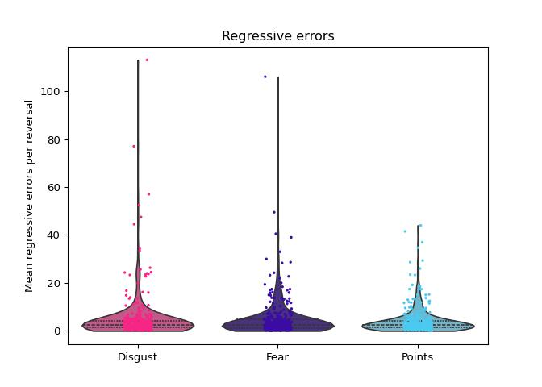

# Model 2: mean regressive errors per reversal ~ feedback type


<p>

This file contains all model-agnostic tests run to test the effect of
feedback type (fear, disgust, points) on regressive errors.
</p>

<br> Includes:
<p>

- initial skew assessment (and resulting skew transformation)
- initial hypothesis testing mixed effects model
- assessment of assumptions of this model (which was violated)
- resulting generalized mixed effects model
- assessing whether adding video-ratings differences (identified in
  video-rating analyses) moderates results
- sensitivity analysis (including generalized mixed effects models)
- final conclusions

</p>

<h3>

Load in packages and data- in r and then in python
</h3>

<details class="code-fold">
<summary>Code</summary>

``` r
library(tidyverse, quietly=TRUE)
library(lme4)
library(emmeans)
library(DHARMa)

task_summary <- read.csv("U:/Documents/Disgust learning project/github/disgust_reversal_learning-final/csvs/dem_vids_task_excluded.csv")
```

</details>

<details class="code-fold">
<summary>Code</summary>

``` python
import numpy as np
import pandas as pd
import matplotlib.pyplot as plt
import seaborn as sns
import scipy.stats as stats
import jsonlines
from functools import reduce
import statistics
import scipy.stats
import seaborn as sns
import math
import os
import json
import ast
import statsmodels.api as sm
import statsmodels.formula.api as smf
import pingouin as pg
import warnings
from scipy.stats import ttest_rel
#from statannotations.Annotator import Annotator
from scipy.stats import skew
from statsmodels.stats.diagnostic import het_white
from sklearn.preprocessing import PowerTransformer
import statannot
from scipy.stats import ttest_ind
import itertools

warnings.simplefilter(action='ignore', category=FutureWarning)
pd.options.mode.copy_on_write = True

task_summary=pd.read_csv("U:/Documents/Disgust learning project/github/disgust_reversal_learning-final/csvs/dem_vids_task_excluded.csv")
```

</details>

<br>
<h3>

<b>Visualise the data</b>
</h3>

<details class="code-fold">
<summary>Code</summary>

``` python
palette = ["#F72585", "#3A0CA3", "#4CC9F0"]

##plot hypothesised results
fig, axes = plt.subplots(1,1, sharey=False)

sns.stripplot(data=task_summary, x="block_type", y="mean_regressive_er", ax=axes, palette=palette, size=5, jitter=True, marker='.')
sns.violinplot(data=task_summary, x="block_type", y="mean_regressive_er", ax=axes,fill=True, inner="quart", palette=palette, saturation=0.5, cut=0)
#axes.set_xlabel("Feedback type")
axes.set_xlabel("")
axes.set_xticklabels(axes.get_xticklabels(), rotation=0)
axes.set_ylabel("Mean regressive errors per reversal") 
axes.set_title("Regressive errors")
```

</details>



<br>

<h3>

Assess and correct for skewness in perservative error outcome
</h3>

<details class="code-fold">
<summary>Code</summary>

``` python
pt=PowerTransformer(method='yeo-johnson', standardize=False)
skl_yeojohnson=pt.fit(pd.DataFrame(task_summary.mean_regressive_er))
skl_yeojohnson=pt.transform(pd.DataFrame(task_summary.mean_regressive_er))
task_summary['regressive_er_transformed'] = pt.transform(pd.DataFrame(task_summary.mean_regressive_er))

fig, axes = plt.subplots(1, 2, sharey=True)
sns.histplot(data=task_summary, x="mean_regressive_er", ax=axes[0]) 
sns.histplot(data=task_summary['regressive_er_transformed'], ax=axes[1])
print('Regressive error skew: '+str(skew(task_summary.mean_regressive_er)))
```

</details>

    Regressive error skew: 6.465682277497517


<h3>

<b>Hypothesis testing</b>
</h3>

In this case, the basic model (no random slopes or random intercepts,
and no covariates) produced the best fit (indexed by BIC scores).
<p>

The model shows <b>no effect of feedback type.</b>
</p>

``` python
data=task_summary.reset_index()
formula = 'regressive_er_transformed ~ block_type'
results=smf.mixedlm(formula, data, groups=data['participant_no'], missing='drop').fit(reml=False)
print(results.summary())
```

                     Mixed Linear Model Regression Results
    =======================================================================
    Model:            MixedLM Dependent Variable: regressive_er_transformed
    No. Observations: 1020    Method:             ML                       
    No. Groups:       340     Scale:              0.0602                   
    Min. group size:  3       Log-Likelihood:     -265.2907                
    Max. group size:  3       Converged:          Yes                      
    Mean group size:  3.0                                                  
    ------------------------------------------------------------------------
                             Coef.   Std.Err.    z     P>|z|  [0.025  0.975]
    ------------------------------------------------------------------------
    Intercept                 0.933     0.019  48.088  0.000   0.895   0.971
    block_type[T.Fear]        0.006     0.019   0.313  0.755  -0.031   0.043
    block_type[T.Points]     -0.001     0.019  -0.050  0.960  -0.038   0.036
    Group Var                 0.068     0.034                               
    =======================================================================

<b>BUT</b> the residuals of this model are significantly non-normal! So
we will need to run a generalized mixed effects model.

``` python
#shapiro-Wilk test of normality of residuals
labels = ["Statistic", "p-value"]
norm_res = stats.shapiro(results.resid)
for key, val in dict(zip(labels, norm_res)).items():
    print(key, val)
```

    Statistic 0.993953373902031
    p-value 0.00038660283099416264

<h4>

Run a generalized mixed effects model (done in R)
</h4>

Model details:
<p>

- Gamma probability distribution and inverse link function
- random intercepts for individually selected feedback videos and
  by-participant random slopes
- no additional covariates

</p>

<p>

This is the specification that produced the best fit (according to BIC)
</p>

<p>

Results from this model show also show <b>no effect of block-type</b> on
regressive error rate.
</p>

``` r
task_summary$pos_regressive_er <- task_summary$mean_regressive_er + 0.01 ##+0.01 as all values must be positive (i.e., can't have 0s)
generalized_model <- suppressMessages(glmer(pos_regressive_er ~ block_type + (block_type|participant_no) + (1|feedback_details), data=task_summary, family=Gamma(link="inverse")))
summary(generalized_model)
```

    Generalized linear mixed model fit by maximum likelihood (Laplace
      Approximation) [glmerMod]
     Family: Gamma  ( inverse )
    Formula: pos_regressive_er ~ block_type + (block_type | participant_no) +  
        (1 | feedback_details)
       Data: task_summary

         AIC      BIC   logLik deviance df.resid 
      4454.8   4509.0  -2216.4   4432.8     1009 

    Scaled residuals: 
        Min      1Q  Median      3Q     Max 
    -1.6695 -0.4836  0.0461  0.3925  1.9061 

    Random effects:
     Groups           Name             Variance  Std.Dev.  Corr       
     participant_no   (Intercept)      3.686e-02 1.920e-01            
                      block_typeFear   2.768e-02 1.664e-01 -0.39      
                      block_typePoints 2.595e-02 1.611e-01 -0.41  0.51
     feedback_details (Intercept)      2.668e-09 5.166e-05            
     Residual                          3.545e-01 5.954e-01            
    Number of obs: 1020, groups:  participant_no, 340; feedback_details, 11

    Fixed effects:
                      Estimate Std. Error t value Pr(>|z|)    
    (Intercept)       0.494004   0.025622  19.280   <2e-16 ***
    block_typeFear   -0.001471   0.028237  -0.052    0.958    
    block_typePoints  0.002548   0.027666   0.092    0.927    
    ---
    Signif. codes:  0 '***' 0.001 '**' 0.01 '*' 0.05 '.' 0.1 ' ' 1

    Correlation of Fixed Effects:
                (Intr) blck_F
    block_typFr -0.508       
    blck_typPnt -0.550  0.497
    optimizer (Nelder_Mead) convergence code: 0 (OK)
    boundary (singular) fit: see help('isSingular')

<br>
<p>

As this hypothesis test found a no difference between fear and disgust
or disgust and points, we will compute a Bayes Factor to test the
strength of the evidence for the null
</p>

<details class="code-fold">
<summary>Code</summary>

``` python
def bayes_factor(df, dependent_var, condition_1_name, condition_2_name):
    df=df[(df.block_type==condition_1_name)| (df.block_type==condition_2_name)][[dependent_var, 'block_type', 'participant_no']]
    df.dropna(inplace=True)
    df=df.pivot(index='participant_no', columns='block_type', values=dependent_var).reset_index()
    ttest=pg.ttest(df[condition_1_name], df[condition_2_name], paired=True)
    bf_null=1/float(ttest.BF10)
    return bf_null
```

</details>

<p>

Firstly for disgust vs fear:
</p>

``` python
print(bayes_factor(task_summary, 'regressive_er_transformed', 'Disgust', 'Fear'))
```

    15.625

<p>

This means that there is <b>strong</b> evidence for the null
</p>

<br>
<p>

Next for disgust vs points:
</p>

``` python
print(bayes_factor(task_summary, 'regressive_er_transformed', 'Disgust', 'Points'))
```

    16.39344262295082

<p>

This means that there is <b>strong</b> evidence for the null
</p>

<br>
<p>

We also look at fear vs points (which is not directly assessed by the
model)
</p>

``` python
print(bayes_factor(task_summary, 'regressive_er_transformed', 'Points', 'Fear'))
```

    15.384615384615383

<p>

This means that there is <b>strong</b> evidence for the null
</p>

<br>
<h3>

Adding video ratings
</h3>

Finally, we will test whether this effect remains after video rating
differences between fear and disgust have been controlled for.
<p>

As before, the mixed effects model violated assumptions, so a
generalized mixed effects model is run.
</p>

<details class="code-fold">
<summary>Code</summary>

``` python
formula = 'regressive_er_transformed ~ block_type + valence_diff + arousal_diff + valence_habdiff'
results=smf.mixedlm(formula, data, groups=data['participant_no'], missing='drop').fit(reml=False)
#shapiro-Wilk test of normality of residuals
labels = ["Statistic", "p-value"]
norm_res = stats.shapiro(results.resid)
#
for key, val in dict(zip(labels, norm_res)).items():
    print(key, val)
```

</details>

    Statistic 0.9939763341744763
    p-value 0.00040001610559894327

<br> Generalized mixed effects model details:
<p>

- Gamma probability distribution and inverse link function
- random intercepts for fractals used as stimuli
- no additional covariates

</p>

<p>

This is the specification that produced the best fit (according to BIC)
</p>

<br>
<p>

Adding video ratings has <b> no effect </b> on the results (i.e., there
remains no effect of block-type on regressive error rate)
</p>

``` r
generalized_model <- glmer(pos_regressive_er ~ block_type + valence_diff + arousal_diff + valence_habdiff + (1|participant_no) + (1|fractals), data=task_summary, family=Gamma(link="inverse"))
summary(generalized_model)
```

    Generalized linear mixed model fit by maximum likelihood (Laplace
      Approximation) [glmerMod]
     Family: Gamma  ( inverse )
    Formula: pos_regressive_er ~ block_type + valence_diff + arousal_diff +  
        valence_habdiff + (1 | participant_no) + (1 | fractals)
       Data: task_summary

         AIC      BIC   logLik deviance df.resid 
      4543.8   4588.2  -2262.9   4525.8     1011 

    Scaled residuals: 
        Min      1Q  Median      3Q     Max 
    -1.5083 -0.6452 -0.1718  0.3982  3.4338 

    Random effects:
     Groups         Name        Variance  Std.Dev.
     participant_no (Intercept) 0.0298333 0.17272 
     fractals       (Intercept) 0.0003704 0.01925 
     Residual                   0.4351638 0.65967 
    Number of obs: 1020, groups:  participant_no, 340; fractals, 28

    Fixed effects:
                       Estimate Std. Error t value Pr(>|z|)    
    (Intercept)       0.4319595  0.0215252  20.068   <2e-16 ***
    block_typeFear   -0.0042333  0.0073595  -0.575    0.565    
    block_typePoints  0.0117315  0.0074434   1.576    0.115    
    valence_diff      0.0012770  0.0094170   0.136    0.892    
    arousal_diff     -0.0048141  0.0125399  -0.384    0.701    
    valence_habdiff   0.0004988  0.0071246   0.070    0.944    
    ---
    Signif. codes:  0 '***' 0.001 '**' 0.01 '*' 0.05 '.' 0.1 ' ' 1

    Correlation of Fixed Effects:
                (Intr) blck_F blck_P vlnc_d arsl_d
    block_typFr -0.190                            
    blck_typPnt -0.161  0.437                     
    valence_dff  0.417  0.002  0.007              
    arousal_dff -0.319  0.013  0.003 -0.179       
    valnc_hbdff -0.255  0.004 -0.002 -0.354  0.132

<br> <br>
<h3>

<b> Sensitivity analysis </b>
</h3>

We also ran the same analyses after outliers had been excluded, to
assess whether outliers are driving this effect.

<p>

Firstly, exclude outliers from the dataframe (outliers are define as
those \>1.5 IQRs above or below the upper or lower quartile)

<details class="code-fold">
<summary>Code</summary>

``` python
#create outliers df --> removing those >1.5 IQRs above or below UQ and LQ
def replace_outliers_with_nan(df, column):
    Q1 = df[column].quantile(0.25)
    Q3 = df[column].quantile(0.75)
    IQR = Q3 - Q1
    lower_bound = Q1- 1.5 *  IQR
    upper_bound = Q3 + 1.5 *  IQR
    df[column]=df[column].apply(lambda x: np.nan if x<lower_bound or x>upper_bound else x)
    return df

key_outcomes=['percentage_correct', 'mean_perseverative_er', 'mean_regressive_er', 'median_till_correct', 'win_stay', 'lose_shift']
for col in key_outcomes:
    task_summary=replace_outliers_with_nan(task_summary, col)
task_summary.to_csv('sensitivity_df.csv')
sensitivity_df=task_summary
```

</details>

<br>
<h3>

Assess and correct for skewness in perservative error outcome (excluding
outliers)
</h3>

<details class="code-fold">
<summary>Code</summary>

``` python
pt=PowerTransformer(method='yeo-johnson', standardize=False)
skl_yeojohnson=pt.fit(pd.DataFrame(sensitivity_df.mean_regressive_er))
skl_yeojohnson=pt.transform(pd.DataFrame(sensitivity_df.mean_regressive_er))
sensitivity_df['regressive_er_transformed'] = pt.transform(pd.DataFrame(sensitivity_df.mean_regressive_er))


fig, axes = plt.subplots(1,2, sharey=True)
sns.histplot(data=sensitivity_df, x="mean_regressive_er", ax=axes[0]) 
sns.histplot(data=sensitivity_df['regressive_er_transformed'], ax=axes[1])
print('regressive error skew: '+str(skew(sensitivity_df.mean_regressive_er.dropna())))
```

</details>

    regressive error skew: 1.1057309176558778


<h3>

<b>Outlier-free hypothesis testing</b>
</h3>

In this case, the basic model (no random slopes or random intercepts)
with no additional covariates produced the best fit (indexed by BIC
scores).
<p>

The model shows no effect of feedback type (as with the original
analysis)
</p>

``` python
data=sensitivity_df.reset_index()
formula = 'regressive_er_transformed ~ block_type'

results=smf.mixedlm(formula, data, groups=data['participant_no'], missing='drop').fit(reml=False)
print(results.summary())
```

                     Mixed Linear Model Regression Results
    =======================================================================
    Model:            MixedLM Dependent Variable: regressive_er_transformed
    No. Observations: 907     Method:             ML                       
    No. Groups:       327     Scale:              0.1368                   
    Min. group size:  1       Log-Likelihood:     -556.8437                
    Max. group size:  3       Converged:          Yes                      
    Mean group size:  2.8                                                  
    ------------------------------------------------------------------------
                             Coef.   Std.Err.    z     P>|z|  [0.025  0.975]
    ------------------------------------------------------------------------
    Intercept                 1.150     0.027  42.163  0.000   1.096   1.203
    block_type[T.Fear]       -0.002     0.030  -0.067  0.946  -0.062   0.057
    block_type[T.Points]     -0.001     0.030  -0.035  0.972  -0.060   0.058
    Group Var                 0.093     0.039                               
    =======================================================================

<p>

And this time, the assumptions are not violated
</p>

``` python
#shapiro-Wilk test of normality of residuals
labels = ["Statistic", "p-value"]
norm_res = stats.shapiro(results.resid)
for key, val in dict(zip(labels, norm_res)).items():
    print(key, val)
```

    Statistic 0.9988694126723006
    p-value 0.8539183639658268

``` python
##homoskedasticity of variance 
#White Lagrange Multiplier Test for Heteroscedasticity
het_white_res = het_white(results.resid, results.model.exog)

labels = ["LM Statistic", "LM-Test p-value", "F-Statistic", "F-Test p-value"]

for key, val in dict(zip(labels, het_white_res)).items():
    print(key, val)
```

    LM Statistic 3.7851740201083066
    LM-Test p-value 0.1506814896455357
    F-Statistic 1.89423225557972
    F-Test p-value 0.1510303973629437

<br>
<p>

As this hypothesis test found a no difference between fear and disgust
or disgust and points, we will compute a Bayes Factor to test the
strength of the evidence for the null
</p>

<p>

Firstly for disgust vs fear:
</p>

``` python
print(bayes_factor(sensitivity_df, 'regressive_er_transformed', 'Disgust', 'Fear'))
```

    15.15151515151515

<p>

This means that there is <b>strong</b> evidence for the null
</p>

<br>
<p>

Next for disgust vs points:
</p>

``` python
print(bayes_factor(sensitivity_df, 'regressive_er_transformed', 'Disgust', 'Points'))
```

    15.15151515151515

<p>

This means that there is <b>strong</b> evidence for the null
</p>

<br>
<p>

We also look at fear vs points (which is not directly assessed by the
model)
</p>

``` python
print(bayes_factor(sensitivity_df, 'regressive_er_transformed', 'Points', 'Fear'))
```

    14.492753623188404

<p>

This means that there is <b>strong</b> evidence for the null
</p>

<br>
<p>

<b>Finally, adding video rating values to this model has no effect: </b>
</p>

(NB model with the digit-span covariate produced the best fit)

``` python
data=sensitivity_df.reset_index()
formula = 'regressive_er_transformed ~ block_type + valence_diff + arousal_diff + valence_habdiff'

results=smf.mixedlm(formula, data, groups=data['participant_no'], missing='drop').fit(reml=False)
print(results.summary())
```

                     Mixed Linear Model Regression Results
    =======================================================================
    Model:            MixedLM Dependent Variable: regressive_er_transformed
    No. Observations: 907     Method:             ML                       
    No. Groups:       327     Scale:              0.1369                   
    Min. group size:  1       Log-Likelihood:     -556.4483                
    Max. group size:  3       Converged:          Yes                      
    Mean group size:  2.8                                                  
    ------------------------------------------------------------------------
                             Coef.   Std.Err.    z     P>|z|  [0.025  0.975]
    ------------------------------------------------------------------------
    Intercept                 1.141     0.031  36.353  0.000   1.079   1.202
    block_type[T.Fear]       -0.002     0.030  -0.078  0.938  -0.062   0.057
    block_type[T.Points]     -0.001     0.030  -0.042  0.967  -0.061   0.058
    valence_diff             -0.002     0.013  -0.153  0.878  -0.028   0.024
    arousal_diff              0.016     0.018   0.874  0.382  -0.020   0.052
    valence_habdiff           0.003     0.011   0.317  0.751  -0.017   0.024
    Group Var                 0.093     0.039                               
    =======================================================================

<p>

Model assumptions are not violated:
</p>

``` python
#shapiro-Wilk test of normality of residuals
labels = ["Statistic", "p-value"]
norm_res = stats.shapiro(results.resid)
for key, val in dict(zip(labels, norm_res)).items():
    print(key, val)
```

    Statistic 0.9988861183674403
    p-value 0.8621665767375177

``` python
##homoskedasticity of variance 
#White Lagrange Multiplier Test for Heteroscedasticity
het_white_res = het_white(results.resid, results.model.exog)

labels = ["LM Statistic", "LM-Test p-value", "F-Statistic", "F-Test p-value"]

for key, val in dict(zip(labels, het_white_res)).items():
    print(key, val)
```

    LM Statistic 13.350445493912835
    LM-Test p-value 0.7124281619582324
    F-Statistic 0.7812343930336153
    F-Test p-value 0.7163175239908735

<h4>

<b>Exploratory analyses</b>
</h4>

<p>

- Points ratings
- error rates

</p>
