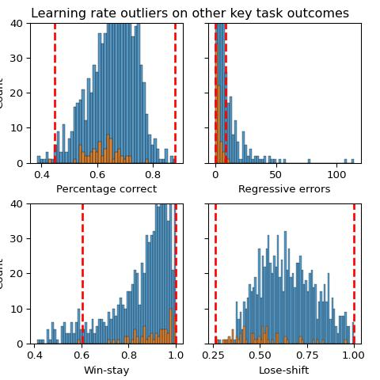
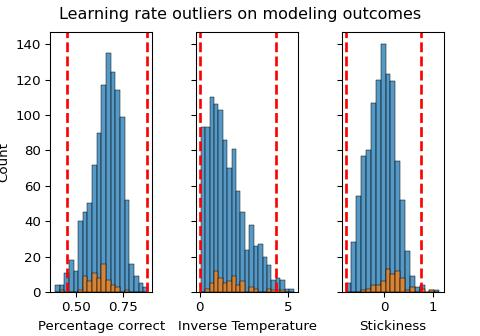

# Computational modeling hypothesis testing (learning rate)


<p>

This file contains hypothesis testing carried out on the winning model
(1lr_stick1_allparamsep) using the <b>learning rate</b> parameter.
<p>

<p>

Learning rate parameters are compared between the three feedback types
using the same mixed effects modeling strategy as was used in the
model-agnostic hypothesis testing analyses (including skew transforms,
assumptions testing, generalized models for failed model assumptions,
video-ratings covariates, sensitivity analyses, bayes factors for null
results, and BIC model comparison as a means of selecting random effects
and covariates).

<h3>

Load in packages and data- in python and then in r
</h3>

<details class="code-fold">
<summary>Code</summary>

``` python
import numpy as np
import pandas as pd
import matplotlib.pyplot as plt
import seaborn as sns
import scipy.stats as stats
import jsonlines
from functools import reduce
import statistics
import scipy.stats
import seaborn as sns
import math
import os
import json
import ast
import statsmodels.api as sm
import statsmodels.formula.api as smf
import pingouin as pg
import warnings
from scipy.stats import ttest_rel
#from statannotations.Annotator import Annotator
from scipy.stats import skew
from statsmodels.stats.diagnostic import het_white
from sklearn.preprocessing import PowerTransformer
import statannot
from scipy.stats import ttest_ind
from scipy.stats import ttest_1samp
import itertools

warnings.simplefilter(action='ignore', category=FutureWarning)
pd.options.mode.copy_on_write = True

filepath="//cbsu/data/Group/Nord/DisgustReversalLearningModeling/finalModelComp/1lr_stick1_blk3_allparamsep_params.csv"
params = pd.read_csv(filepath)
task_summary=pd.read_csv('U:/Documents/Disgust learning project/github/disgust_reversal_learning-final/csvs/dem_vids_task_excluded.csv')
task_summary.sort_values(by=['participant_no', 'block_type'], inplace=True)
params['participant_no']=list(set(task_summary.participant_no))

#convert to long df
long_params=pd.DataFrame()
for subj in set(params['participant_no']):
    subj_params= params[params['participant_no']==subj]
    disgust_row=pd.DataFrame({
        'participant_no': [float(subj_params['participant_no'])],
        'LR':  [float(subj_params['d_alpha'])],
        'invTemp': [float(subj_params['d_beta'])],
        'stickiness': [float(subj_params['d_omega'])],
        'block_type': ['Disgust']
    })
    fear_row=pd.DataFrame({
        'participant_no': [float(subj_params['participant_no'])],
        'LR':  [float(subj_params['f_alpha'])],
        'invTemp': [float(subj_params['f_beta'])],
        'stickiness': [float(subj_params['f_omega'])],
        'block_type': ['Fear']
    })
    points_row=pd.DataFrame({
        'participant_no': [float(subj_params['participant_no'])],
        'LR':  [float(subj_params['p_alpha'])],
        'invTemp': [float(subj_params['p_beta'])],
        'stickiness': [float(subj_params['p_omega'])],
        'block_type': ['Points']
    })
    long_params=pd.concat([long_params, disgust_row, fear_row, points_row])

##combine with task_summary_df
df=pd.merge(task_summary, long_params, on=['participant_no', 'block_type'], how='inner')
df.to_csv("csvs/winningModelOutput.csv")

pvals_file = 'pvals/ModelingPvalsForPlotting.xlsx'
```

</details>

<details class="code-fold">
<summary>Code</summary>

``` r
library(tidyverse, quietly=TRUE)
library(lme4)
library(emmeans)
library(DHARMa)
library('readxl')
library('xlsx')

df <- read.csv("csvs/winningModelOutput.csv")
pvals_file <- 'pvals/ModelingPvalsForPlotting.xlsx'
```

</details>

<h3>

Learning rate
</h3>

<b>Assess and correct for skewness</b>

<details class="code-fold">
<summary>Code</summary>

``` python
pt=PowerTransformer(method='yeo-johnson', standardize=False)
skl_yeojohnson=pt.fit(pd.DataFrame(df.LR))
skl_yeojohnson=pt.transform(pd.DataFrame(df.LR))
df['LR_transformed'] = pt.transform(pd.DataFrame(df.LR))
##because LR is constrained between 1 and 0 divide by max
df['LR_transformed']=df['LR_transformed']/np.max(df['LR_transformed'])

fig, axes = plt.subplots(1,2, sharey=True)
sns.histplot(data=df, x="LR", ax=axes[0]) 
sns.histplot(data=df['LR_transformed'], ax=axes[1])
print('LR skew: '+str(skew(df.LR)))
```

</details>

    LR skew: -2.6143096681123543


<br>

<b>Mixed effects model assumptions violated</b>
<p>

In this case, a basic model (no random slopes or random intercepts) with
an age covariate produced the best fit (as indexed by BIC scores). But
the model assumptions were violated:

<p>

Select the winning mixed effects model:
</p>

<details class="code-fold">
<summary>Code</summary>

``` python
#run basic model 
data=df.reset_index()
formula = 'LR_transformed ~ block_type'
basic_model=smf.mixedlm(formula, data, groups=data['participant_no'], missing='drop').fit(reml=False)

#test which random effects to include
#feedback_randint=smf.mixedlm(formula, data, groups=data['participant_no'], missing='drop', vc_formula={'feedback_details': '0+feedback_details'}).fit(reml=False) 
#fractals_randint=smf.mixedlm(formula, data, groups=data['participant_no'], missing='drop', vc_formula={'fractals': '0+fractals'}).fit(reml=False) 
feedback_fractals_randint=smf.mixedlm(formula, data, groups=data['participant_no'], missing='drop', vc_formula={"feedback_details": "0 + feedback_details", "fractals": "0 + fractals"}).fit(reml=False)

randslope=smf.mixedlm(formula, data, groups=data['participant_no'], missing='drop', re_formula='~block_type').fit(reml=False)
#feedback_randint_randslope=smf.mixedlm(formula, data, groups=data['participant_no'], missing='drop', vc_formula={'feedback_details': '0+feedback_details'}, re_formula='~block_type').fit(reml=False)
#feedback_fractals_randint_randslope=smf.mixedlm(formula, data, groups=data['participant_no'], missing='drop', vc_formula={'feedback_details': '0+feedback_details', "fractals": "0 + fractals"}, re_formula='~block_type').fit(reml=False)


bic=pd.DataFrame({'basic_model': [basic_model.bic], 
                    #'feedback_randint': [feedback_randint.bic], 
                    #'fractals_randint': [fractals_randint.bic],
                    'feedback_fractals_randint': [feedback_fractals_randint.bic], ##added manually
                    'randslope': [randslope.bic],
                    #'feedback_randint_randslope':[feedback_randint_randslope.bic],
                    #'feedback_fractals_randint_randslope': [feedback_fractals_randint_randslope.bic]
                    })
win1=bic.sort_values(by=0, axis=1).columns[0]

#test which covariates to add
##test which covariates to add -- Using the random effects which were best above (basic model in this case)
no_covariate=smf.mixedlm(formula, data, groups=data['participant_no'], missing='drop').fit(reml=False)
sex_covariate=smf.mixedlm(formula+str('+prolific_sex'), data, groups=data['participant_no'], missing='drop').fit(reml=False)
age_covariate=smf.mixedlm(formula+str('+prolific_age'), data, groups=data['participant_no'], missing='drop').fit(reml=False)
digit_span_covariate=smf.mixedlm(formula+str('+digit_span'), data, groups=data['participant_no'], missing='drop').fit(reml=False)
sex_age_covariate=smf.mixedlm(formula+str('+prolific_sex+prolific_age'), data, groups=data['participant_no'], missing='drop').fit(reml=False)
sex_digit_span_covariate=smf.mixedlm(formula+str('+prolific_sex+digit_span'), data, groups=data['participant_no'], missing='drop').fit(reml=False)
digit_span_age_covariate=smf.mixedlm(formula+str('+digit_span+prolific_age'), data, groups=data['participant_no'], missing='drop').fit(reml=False)
sex_age_digit_span_covariate=smf.mixedlm(formula+str('+prolific_sex+prolific_age+digit_span'), data, groups=data['participant_no'], missing='drop').fit(reml=False)

bic=pd.DataFrame({'no_covariate': [no_covariate.bic], 
                    'sex_covariate': [sex_covariate.bic], 
                    'age_covariate': [age_covariate.bic],
                    'digit_span_covariate': [digit_span_covariate.bic],
                    'sex_age_covariate': [sex_age_covariate.bic],
                    'sex_digit_span_covariate': [sex_digit_span_covariate.bic],
                    'digit_span_age_covariate': [digit_span_age_covariate.bic],
                    'sex_age_digit_span_covariate': [sex_age_digit_span_covariate.bic]})
win2=bic.sort_values(by=0, axis=1).columns[0]
print("Winning models: "+ win1 +" "+ win2)
```

</details>

    Winning models: basic_model age_covariate

<p>

Shapiro-Wilk test of normality of residuals
</p>

<details class="code-fold">
<summary>Code</summary>

``` python
#chosen model
results=age_covariate

#shapiro-Wilk test of normality of residuals
labels = ["Statistic", "p-value"]
norm_res = stats.shapiro(results.resid)

for key, val in dict(zip(labels, norm_res)).items():
    print(key, val)
```

</details>

    Statistic 0.9930394830228928
    p-value 0.00010319737564526502

<p>

White Lagrange multiplier Test for Heteroscedasticity
</p>

<details class="code-fold">
<summary>Code</summary>

``` python
#chosen model
##homoskedasticity of variance 
#White Lagrange Multiplier Test for Heteroscedasticity
het_white_res = het_white(results.resid, results.model.exog)

labels = ["LM Statistic", "LM-Test p-value", "F-Statistic", "F-Test p-value"]

for key, val in dict(zip(labels, het_white_res)).items():
    print(key, val)
```

</details>

    LM Statistic 5.805568490741361
    LM-Test p-value 0.4453192787901349
    F-Statistic 0.9664551980710416
    F-Test p-value 0.44670390853327924

<h4>

<b>So instead we run a generalized mixed effects model (done in R)</b>
</h4>

<details class="code-fold">
<summary>Code</summary>

``` r
##LR model
gamma_log <- glmer(LR~ block_type + (1|participant_no), data=df, family=Gamma(link="log"))
gamma_inverse <- glmer(LR~ block_type + (1|participant_no), data=df, family=Gamma(link="inverse"))
#gamma_identity <- glmer(LR~ block_type + (1|participant_no), data=df, family=Gamma(link="identity"))

invgaus_log <- glmer(LR~ block_type + (1|participant_no), data=df, family=inverse.gaussian(link="log"))
invgaus_inverse <- glmer(LR~ block_type + (1|participant_no), data=df, family=inverse.gaussian(link="inverse"))
invgaus_identity <- glmer(LR~ block_type + (1|participant_no), data=df, family=inverse.gaussian(link="identity"))

bic_values <- c(
  BIC(gamma_log),
  BIC(gamma_inverse),
  BIC(invgaus_log),
  BIC(invgaus_inverse),
  BIC(invgaus_identity)
)
model_names <- c("Gamma (log)", "Gamma (inverse)", "Inverse gaussian (log)", "Inverse gaussian (inverse)", "Inverse gaussian (identity)")

bic_df <- data.frame(Model = model_names, BIC = bic_values)
win1 <- bic_df[which.min(bic_df$BIC), ]$Model

basic_model <- glmer(LR~ block_type + (1|participant_no), data=df, family=Gamma(link="log"))

feedback_randint <- glmer(LR~ block_type + (1|participant_no) + (1|feedback_details), data=df, family=Gamma(link="log"))
fractals_randint <- glmer(LR~ block_type + (1|participant_no) + (1|fractals), data=df, family=Gamma(link="log"))
feedback_fractals_randint <- glmer(LR~ block_type + (1|participant_no) + (1|fractals) + (1|feedback_details), data=df, family=Gamma(link="log"))

#randslope <- glmer(LR~ block_type + (block_type|participant_no), data=df, family=Gamma(link="log"))
#feedback_randint_randslope <- glmer(LR~ block_type + (block_type|participant_no) + (1|feedback_details), data=df, family=Gamma(link="log"))
#feedback_fractals_randint_randslope <- glmer(LR~ block_type + (block_type|participant_no) + (1|feedback_details) + (1|fractals), data=df, family=Gamma(link="log"))

bic_values <- c(
  BIC(basic_model),
  BIC(feedback_randint),
  BIC(fractals_randint),
  BIC(feedback_fractals_randint)
  #BIC(feedback_randint_randslope)
)
model_names <- c("basic model", "feedback_randint", "fractals_randint", "feedback_fractals_randint")

bic_df <- data.frame(Model = model_names, BIC = bic_values)
win2 <- bic_df[which.min(bic_df$BIC), ]$Model

no_covariate <- basic_model
sex_covariate <- glmer(LR ~ block_type + (1|participant_no) + prolific_sex, data=df, family=Gamma(link="log"))
bic_values <- c(
  BIC(no_covariate),
  BIC(sex_covariate)
)
model_names <- c("no_covariate", "sex_covariate")
bic_df <- data.frame(Model = model_names, BIC = bic_values)
win3 <- bic_df[which.min(bic_df$BIC), ]$Model

print(paste0("Winning models: ", win1, " ", win2," ",win3))
```

</details>

    [1] "Winning models: Gamma (log) basic model no_covariate"

<p>

Results from this model show <b>no significant effect of block-type</b>:
although the disgust vs points comparison is nearing significance.

``` r
summary(no_covariate)
```

    Generalized linear mixed model fit by maximum likelihood (Laplace
      Approximation) [glmerMod]
     Family: Gamma  ( log )
    Formula: LR ~ block_type + (1 | participant_no)
       Data: df

         AIC      BIC   logLik deviance df.resid 
     -2870.6  -2846.0   1440.3  -2880.6     1015 

    Scaled residuals: 
        Min      1Q  Median      3Q     Max 
    -6.9622 -0.2181  0.2010  0.4903  2.0703 

    Random effects:
     Groups         Name        Variance Std.Dev.
     participant_no (Intercept) 0.001362 0.03691 
     Residual                   0.003533 0.05944 
    Number of obs: 1020, groups:  participant_no, 340

    Fixed effects:
                      Estimate Std. Error t value Pr(>|z|)    
    (Intercept)      -0.103638   0.004622 -22.425   <2e-16 ***
    block_typeFear    0.002240   0.004396   0.510   0.6103    
    block_typePoints  0.008513   0.004395   1.937   0.0528 .  
    ---
    Signif. codes:  0 '***' 0.001 '**' 0.01 '*' 0.05 '.' 0.1 ' ' 1

    Correlation of Fixed Effects:
                (Intr) blck_F
    block_typFr -0.475       
    blck_typPnt -0.476  0.500

<p>

Extract confidence intervals
</p>

``` r
print(confint.merMod(no_covariate, method='Wald'))
```

                             2.5 %      97.5 %
    .sig01                      NA          NA
    .sigma                      NA          NA
    (Intercept)      -0.1126956418 -0.09457938
    block_typeFear   -0.0063751186  0.01085575
    block_typePoints -0.0001017489  0.01712687

<p>

As this hypothesis test found no difference between fear and disgust or
points and disgust, we will compute Bayes Factors to test the strength
of the evidence for the null
</p>

<details class="code-fold">
<summary>Code</summary>

``` python
def bayes_factor(df, dependent_var, condition_1_name, condition_2_name):
    df=df[(df.block_type==condition_1_name)| (df.block_type==condition_2_name)][[dependent_var, 'block_type', 'participant_no']]
    df.dropna(inplace=True)
    df=df.pivot(index='participant_no', columns='block_type', values=dependent_var).reset_index()
    ttest=pg.ttest(df[condition_1_name], df[condition_2_name], paired=True)
    bf_null=1/float(ttest.BF10)
    return ttest, bf_null
```

</details>

<details class="code-fold">
<summary>Code</summary>

``` python
ttest, bf_null = bayes_factor(df, 'LR', 'Disgust', 'Points')

print(f"Disgust vs Points: BF01 = {bf_null}")
```

</details>

    Disgust vs Points: BF01 = 2.320185614849188

<details class="code-fold">
<summary>Code</summary>

``` python
ttest, bf_null = bayes_factor(df, 'LR', 'Disgust', 'Fear')
#print("Disgust vs Fear BF01: " + bf_null)

print(f"Disgust vs Fear: BF01 = {bf_null}")
```

</details>

    Disgust vs Fear: BF01 = 14.285714285714285

<p>

We also look at fear vs points (which is not directly assessed by the
model)
</p>

<details class="code-fold">
<summary>Code</summary>

``` python
ttest, bf_null = bayes_factor(df, 'LR', 'Points', 'Fear')

print(f"Points vs Fear: T = {ttest['T'][0]}, CI95% = {ttest['CI95%'][0]}, p = {ttest['p-val'][0]}")
```

</details>

    Points vs Fear: T = 1.3090073099974557, CI95% = [-0.    0.01], p = 0.19141848984835413

<p>

And because the result is null, also get a Bayes factor:
</p>

<details class="code-fold">
<summary>Code</summary>

``` python
print(f"Points vs Fear: BF01 = {bf_null}")
```

</details>

    Points vs Fear: BF01 = 7.042253521126761

    U:\Documents\envs\disgust_reversal_venv\Lib\site-packages\openpyxl\styles\stylesheet.py:237: UserWarning: Workbook contains no default style, apply openpyxl's default
      warn("Workbook contains no default style, apply openpyxl's default")

<br>
<h3>

<b>Adding video ratings</b>
</h3>

We will next test whether this result remains after video rating
differences between fear and disgust have been controlled for.
<p>

As before, the mixed effects model violated assumptions, so a
generalized mixed effects model must be run.
</p>

<details class="code-fold">
<summary>Code</summary>

``` python
#run basic model 
data=df.reset_index()
formula = 'LR_transformed ~ block_type + valence_diff + arousal_diff + valence_habdiff'
basic_model=smf.mixedlm(formula, data, groups=data['participant_no'], missing='drop').fit(reml=False)

#test which random effects to include
#feedback_randint=smf.mixedlm(formula, data, groups=data['participant_no'], missing='drop', vc_formula={'feedback_details': '0+feedback_details'}).fit(reml=False) 
#fractals_randint=smf.mixedlm(formula, data, groups=data['participant_no'], missing='drop', vc_formula={'fractals': '0+fractals'}).fit(reml=False) 
#feedback_fractals_randint=smf.mixedlm(formula, data, groups=data['participant_no'], missing='drop', vc_formula={"feedback_details": "0 + feedback_details", "fractals": "0 + fractals"}).fit(reml=False)

randslope=smf.mixedlm(formula, data, groups=data['participant_no'], missing='drop', re_formula='~block_type').fit(reml=False)
#feedback_randint_randslope=smf.mixedlm(formula, data, groups=data['participant_no'], missing='drop', vc_formula={'feedback_details': '0+feedback_details'}, re_formula='~block_type').fit(reml=False)
#feedback_fractals_randint_randslope=smf.mixedlm(formula, data, groups=data['participant_no'], missing='drop', vc_formula={'feedback_details': '0+feedback_details', "fractals": "0 + fractals"}, re_formula='~block_type').fit(reml=False)


bic=pd.DataFrame({'basic_model': [basic_model.bic], 
                    #'feedback_randint': [feedback_randint.bic], 
                    #'fractals_randint': [fractals_randint.bic],
                    #'feedback_fractals_randint': [feedback_fractals_randint.bic], ##added manually
                    'randslope': [randslope.bic],
                   # 'feedback_randint_randslope':[feedback_randint_randslope.bic],
                   # 'feedback_fractals_randint_randslope': [feedback_fractals_randint_randslope.bic]
                    })
win1=bic.sort_values(by=0, axis=1).columns[0]

no_covariate=smf.mixedlm(formula, data, groups=data['participant_no'], missing='drop').fit(reml=False)
sex_covariate=smf.mixedlm(formula+str('+prolific_sex'), data, groups=data['participant_no'], missing='drop').fit(reml=False)
age_covariate=smf.mixedlm(formula+str('+prolific_age'), data, groups=data['participant_no'], missing='drop').fit(reml=False)
digit_span_covariate=smf.mixedlm(formula+str('+digit_span'), data, groups=data['participant_no'], missing='drop').fit(reml=False)
sex_age_covariate=smf.mixedlm(formula+str('+prolific_sex+prolific_age'), data, groups=data['participant_no'], missing='drop').fit(reml=False)
sex_digit_span_covariate=smf.mixedlm(formula+str('+prolific_sex+digit_span'), data, groups=data['participant_no'], missing='drop').fit(reml=False)
digit_span_age_covariate=smf.mixedlm(formula+str('+digit_span+prolific_age'), data, groups=data['participant_no'], missing='drop').fit(reml=False)
sex_age_digit_span_covariate=smf.mixedlm(formula+str('+prolific_sex+prolific_age+digit_span'), data, groups=data['participant_no'], missing='drop').fit(reml=False)

bic=pd.DataFrame({'no_covariate': [no_covariate.bic], 
                    'sex_covariate': [sex_covariate.bic], 
                    'age_covariate': [age_covariate.bic],
                    'digit_span_covariate': [digit_span_covariate.bic],
                    'sex_age_covariate': [sex_age_covariate.bic],
                    'sex_digit_span_covariate': [sex_digit_span_covariate.bic],
                    'digit_span_age_covariate': [digit_span_age_covariate.bic],
                    'sex_age_digit_span_covariate': [sex_age_digit_span_covariate.bic]})
win2=bic.sort_values(by=0, axis=1).columns[0]
print("Winning models: "+ win1 +" "+ win2)
```

</details>

    Winning models: basic_model age_covariate

<p>

Shapiro-Wilk test of normality of residuals
</p>

<details class="code-fold">
<summary>Code</summary>

``` python
results=no_covariate
labels = ["Statistic", "p-value"]
norm_res = stats.shapiro(results.resid)

for key, val in dict(zip(labels, norm_res)).items():
    print(key, val)
```

</details>

    Statistic 0.9927651604306115
    p-value 7.03712119298224e-05

<p>

White Lagrange multiplier Test for Heteroscedasticity
</p>

<details class="code-fold">
<summary>Code</summary>

``` python
het_white_res = het_white(results.resid, results.model.exog)

labels = ["LM Statistic", "LM-Test p-value", "F-Statistic", "F-Test p-value"]

for key, val in dict(zip(labels, het_white_res)).items():
    print(key, val)
```

</details>

    LM Statistic 16.969873681565183
    LM-Test p-value 0.4564089991756076
    F-Statistic 0.9972026692956796
    F-Test p-value 0.4587040366937576

<h4>

So we select a generalised mixed effects model
</h4>

Model details:
<p>

- Gamma probability distribution and log link function
- no additional random effects or slopes
- no additional covariates

</p>

<p>

This is the specification that produced the best fit (according to BIC)
</p>

<details class="code-fold">
<summary>Code</summary>

``` r
##LR model
gamma_log <- glmer(LR~ block_type + valence_diff + arousal_diff + valence_habdiff  + (1|participant_no), data=df, family=Gamma(link="log"))
gamma_inverse <- glmer(LR~ block_type + valence_diff + arousal_diff + valence_habdiff  + (1|participant_no), data=df, family=Gamma(link="inverse"))
#gamma_identity <- glmer(LR~ block_type + valence_diff + arousal_diff + valence_habdiff  + (1|participant_no), data=df, family=Gamma(link="identity"))

invgaus_log <- glmer(LR~ block_type + valence_diff + arousal_diff + valence_habdiff  + (1|participant_no), data=df, family=inverse.gaussian(link="log"))
invgaus_inverse <- glmer(LR~ block_type + valence_diff + arousal_diff + valence_habdiff  + (1|participant_no), data=df, family=inverse.gaussian(link="inverse"))
invgaus_identity <- glmer(LR~ block_type + valence_diff + arousal_diff + valence_habdiff  + (1|participant_no), data=df, family=inverse.gaussian(link="identity"))

bic_values <- c(
  BIC(gamma_log),
  BIC(gamma_inverse),
 # BIC(gamma_identity),
  BIC(invgaus_log),
  BIC(invgaus_inverse),
  BIC(invgaus_identity)
)
model_names <- c("Gamma (log)", 
                "Gamma (inverse)", 
               # "Gamma (identity)",
                 "Inverse gaussian (log)", 
                 "Inverse gaussian (inverse)", 
                 "Inverse gaussian (identity)")

bic_df <- data.frame(Model = model_names, BIC = bic_values)
win1 <- bic_df[which.min(bic_df$BIC), ]$Model

basic_model <- glmer(LR~ block_type + valence_diff + arousal_diff + valence_habdiff + (1|participant_no), data=df, family=Gamma(link="log"))

feedback_randint <- glmer(LR~ block_type + valence_diff + arousal_diff + valence_habdiff + (1|participant_no) + (1|feedback_details), data=df, family=Gamma(link="log"))
fractals_randint <- glmer(LR~ block_type + valence_diff + arousal_diff + valence_habdiff + (1|participant_no) + (1|fractals), data=df, family=Gamma(link="log"))
feedback_fractals_randint <- glmer(LR~ block_type + valence_diff + arousal_diff + valence_habdiff + (1|participant_no) + (1|fractals) + (1|feedback_details), data=df, family=Gamma(link="log"))

#randslope <- glmer(LR~ block_type + valence_diff + arousal_diff + valence_habdiff + (block_type + valence_diff + arousal_diff + valence_habdiff|participant_no), data=df, family=Gamma(link="log"))
#feedback_randint_randslope <- glmer(LR~ block_type + valence_diff + arousal_diff + valence_habdiff + (block_type + valence_diff + arousal_diff + valence_habdiff|participant_no) + (1|feedback_details), data=df, family=Gamma(link="log"))
#feedback_fractals_randint_randslope <- glmer(LR~ block_type + valence_diff + arousal_diff + valence_habdiff + (block_type + valence_diff + arousal_diff + valence_habdiff|participant_no) + (1|feedback_details) + (1|fractals), data=df, family=Gamma(link="log"))

bic_values <- c(
  BIC(basic_model),
  BIC(feedback_randint),
  BIC(fractals_randint),
  BIC(feedback_fractals_randint)
  #BIC(randslope),
  #BIC(feedback_randint_randslope)
  #BIC(feedback_fractals_ randint_randslope)
)
model_names <- c("basic model", 
                "feedback_randint", 
                "fractals_randint", 
                "feedback_fractals_randint"
                #"randslope",
                #"feedback_randint_randslope",
                #"feedback_fractals_randint_randslope"
                )

bic_df <- data.frame(Model = model_names, BIC = bic_values)
win2 <- bic_df[which.min(bic_df$BIC), ]$Model

no_covariate <- basic_model
#no other covariate models converged
win3 <- 'no_covariate'

print(paste0("Winning models: ", win1, " ", win2," ",win3))
```

</details>

    [1] "Winning models: Gamma (log) basic model no_covariate"

<p>

This has <b> no effect </b> on the results

``` r
summary(no_covariate)
```

    Generalized linear mixed model fit by maximum likelihood (Laplace
      Approximation) [glmerMod]
     Family: Gamma  ( log )
    Formula: LR ~ block_type + valence_diff + arousal_diff + valence_habdiff +  
        (1 | participant_no)
       Data: df

         AIC      BIC   logLik deviance df.resid 
     -2865.3  -2825.9   1440.6  -2881.3     1012 

    Scaled residuals: 
        Min      1Q  Median      3Q     Max 
    -6.9725 -0.2254  0.1990  0.4897  2.0560 

    Random effects:
     Groups         Name        Variance Std.Dev.
     participant_no (Intercept) 0.001357 0.03683 
     Residual                   0.003531 0.05942 
    Number of obs: 1020, groups:  participant_no, 340

    Fixed effects:
                       Estimate Std. Error t value Pr(>|z|)    
    (Intercept)      -0.1023970  0.0054236 -18.880   <2e-16 ***
    block_typeFear    0.0022328  0.0043957   0.508   0.6115    
    block_typePoints  0.0085096  0.0043951   1.936   0.0528 .  
    valence_diff      0.0017612  0.0024705   0.713   0.4759    
    arousal_diff      0.0009500  0.0033010   0.288   0.7735    
    valence_habdiff  -0.0004695  0.0018807  -0.250   0.8029    
    ---
    Signif. codes:  0 '***' 0.001 '**' 0.01 '*' 0.05 '.' 0.1 ' ' 1

    Correlation of Fixed Effects:
                (Intr) blck_F blck_P vlnc_d arsl_d
    block_typFr -0.407                            
    blck_typPnt -0.406  0.500                     
    valence_dff  0.457 -0.003 -0.001              
    arousal_dff -0.319  0.002  0.002 -0.191       
    valnc_hbdff -0.276  0.001  0.001 -0.347  0.137

<p>

Extract confidence intervals
</p>

``` r
print(confint.merMod(no_covariate, method='Wald'))
```

                             2.5 %       97.5 %
    .sig01                      NA           NA
    .sigma                      NA           NA
    (Intercept)      -0.1130271498 -0.091766872
    block_typeFear   -0.0063825631  0.010848166
    block_typePoints -0.0001046215  0.017123808
    valence_diff     -0.0030809052  0.006603311
    arousal_diff     -0.0055198047  0.007419812
    valence_habdiff  -0.0041555763  0.003216659

<br>
<h3>

<b> Sensitivity analysis </b>
</h3>

We also ran the same analyses after outliers had been excluded, to
assess whether outliers are driving this effect.

<p>

This variable is skewed, so the alternative outlier definition is used -
but we also include the pre-registered definition for completeness:
</p>

<b>Original/pre-registered outlier definition</b>
<p>

Firstly, exclude outliers from the dataframe (outliers are define as
those \>1.5 IQRs above or below the upper or lower quartile)

<details class="code-fold">
<summary>Code</summary>

``` python
def replace_outliers_with_nan(df, column):
    Q1 = df[column].quantile(0.25)
    Q3 = df[column].quantile(0.75)
    IQR = Q3 - Q1
    lower_bound = Q1- 1.5 * IQR
    upper_bound = Q3 + 1.5 * IQR
    df[column]=df[column].apply(lambda x: np.nan if x<lower_bound or x>upper_bound else x)
    return df

key_outcomes=['LR', 'invTemp', 'stickiness']
for col in key_outcomes:
    df=replace_outliers_with_nan(df, col)

df.to_csv("csvs/sensitivity_winningModelOutput.csv")
```

</details>

<p>

In the case of the learning rate outcome, 67 datapoints are excluded
</p>

``` python
print("Number of LR outliers: "+str(len(df[df.LR.isna()])))
```

    Number of LR outliers: 67

<p>

Assess and correct for skewness
</p>

<details class="code-fold">
<summary>Code</summary>

``` python
pt=PowerTransformer(method='yeo-johnson', standardize=False)
skl_yeojohnson=pt.fit(pd.DataFrame(df.LR))
skl_yeojohnson=pt.transform(pd.DataFrame(df.LR))
df['LR_transformed'] = pt.transform(pd.DataFrame(df.LR))

##because LR is constrained between 1 and 0 divide by max
df['LR_transformed']=df['LR_transformed']/np.max(df['LR_transformed'])

fig, axes = plt.subplots(1,2, sharey=True)
sns.histplot(data=df, x="LR", ax=axes[0]) 
sns.histplot(data=df['LR_transformed'], ax=axes[1])
print('LR skew: '+str(skew(df.LR.dropna())))
```

</details>

    LR skew: -0.7965778814323508


<br>

<b>Mixed effects model assumptions violated</b>
<p>

In this case, a model with a random by-participant slope and an age
covariate produced the best fit (as indexed by BIC scores). But the
model assumptions were violated:

<p>

Select the winning mixed effects model:
</p>

<details class="code-fold">
<summary>Code</summary>

``` python
data=df.reset_index()
formula = 'LR_transformed ~ block_type'
basic_model=smf.mixedlm(formula, data, groups=data['participant_no'], missing='drop').fit(reml=False)

#test which random effects to include
#feedback_randint=smf.mixedlm(formula, data, groups=data['participant_no'], missing='drop', vc_formula={'feedback_details': '0+feedback_details'}).fit(reml=False) 
#fractals_randint=smf.mixedlm(formula, data, groups=data['participant_no'], missing='drop', vc_formula={'fractals': '0+fractals'}).fit(reml=False) 
feedback_fractals_randint=smf.mixedlm(formula, data, groups=data['participant_no'], missing='drop', vc_formula={"feedback_details": "0 + feedback_details", "fractals": "0 + fractals"}).fit(reml=False)

randslope=smf.mixedlm(formula, data, groups=data['participant_no'], missing='drop', re_formula='~block_type').fit(reml=False)
#feedback_randint_randslope=smf.mixedlm(formula, data, groups=data['participant_no'], missing='drop', vc_formula={'feedback_details': '0+feedback_details'}, re_formula='~block_type').fit(reml=False)
#feedback_fractals_randint_randslope=smf.mixedlm(formula, data, groups=data['participant_no'], missing='drop', vc_formula={'feedback_details': '0+feedback_details', "fractals": "0 + fractals"}, re_formula='~block_type').fit(reml=False)

bic=pd.DataFrame({#'basic_model': [basic_model.bic], 
                    #'feedback_randint': [feedback_randint.bic], 
                    #'fractals_randint': [fractals_randint.bic],
                    'feedback_fractals_randint': [feedback_fractals_randint.bic], ##added manually
                    'randslope': [randslope.bic],
                    #'feedback_randint_randslope':[feedback_randint_randslope.bic],
                    #'feedback_fractals_randint_randslope': [feedback_fractals_randint_randslope.bic]
                    })
win1=bic.sort_values(by=0, axis=1).columns[0]

no_covariate=smf.mixedlm(formula, data, groups=data['participant_no'], missing='drop', re_formula='~block_type').fit(reml=False)
sex_covariate=smf.mixedlm(formula+str('+prolific_sex'), data, groups=data['participant_no'], missing='drop', re_formula='~block_type').fit(reml=False)
age_covariate=smf.mixedlm(formula+str('+prolific_age'), data, groups=data['participant_no'], missing='drop', re_formula='~block_type').fit(reml=False)
digit_span_covariate=smf.mixedlm(formula+str('+digit_span'), data, groups=data['participant_no'], missing='drop', re_formula='~block_type').fit(reml=False)
sex_age_covariate=smf.mixedlm(formula+str('+prolific_sex+prolific_age'), data, groups=data['participant_no'], missing='drop', re_formula='~block_type').fit(reml=False)
sex_digit_span_covariate=smf.mixedlm(formula+str('+prolific_sex+digit_span'), data, groups=data['participant_no'], missing='drop', re_formula='~block_type').fit(reml=False)
digit_span_age_covariate=smf.mixedlm(formula+str('+digit_span+prolific_age'), data, groups=data['participant_no'], missing='drop', re_formula='~block_type').fit(reml=False)
sex_age_digit_span_covariate=smf.mixedlm(formula+str('+prolific_sex+prolific_age+digit_span'), data, groups=data['participant_no'], missing='drop', re_formula='~block_type').fit(reml=False)

bic=pd.DataFrame({'no_covariate': [no_covariate.bic], 
                    'sex_covariate': [sex_covariate.bic], 
                    'age_covariate': [age_covariate.bic],
                    'digit_span_covariate': [digit_span_covariate.bic],
                    'sex_age_covariate': [sex_age_covariate.bic],
                    'sex_digit_span_covariate': [sex_digit_span_covariate.bic],
                    'digit_span_age_covariate': [digit_span_age_covariate.bic],
                    'sex_age_digit_span_covariate': [sex_age_digit_span_covariate.bic]})
win2=bic.sort_values(by=0, axis=1).columns[0]
print("Winning models: "+ win1 +" "+ win2)
```

</details>

    Winning models: randslope age_covariate

<p>

Shapiro-Wilk test of normality of residuals
</p>

<details class="code-fold">
<summary>Code</summary>

``` python
#chosen model
results=age_covariate

#shapiro-Wilk test of normality of residuals
labels = ["Statistic", "p-value"]
norm_res = stats.shapiro(results.resid)

for key, val in dict(zip(labels, norm_res)).items():
    print(key, val)
```

</details>

    Statistic 0.990137716513506
    p-value 5.190718249329804e-06

<p>

White Lagrange multiplier Test for Heteroscedasticity
</p>

<details class="code-fold">
<summary>Code</summary>

``` python
#chosen model
##homoskedasticity of variance 
#White Lagrange Multiplier Test for Heteroscedasticity
het_white_res = het_white(results.resid, results.model.exog)

labels = ["LM Statistic", "LM-Test p-value", "F-Statistic", "F-Test p-value"]

for key, val in dict(zip(labels, het_white_res)).items():
    print(key, val)
```

</details>

    LM Statistic 9.246513061935557
    LM-Test p-value 0.16018161252305566
    F-Statistic 1.5447539139644435
    F-Test p-value 0.1603721824090706

<h4>

Run a generalized mixed effects model (done in R)
</h4>

Model details:
<p>

- Gamma probability distribution and identity link function
- random effect of fractals
- no additional covariate

</p>

<p>

This is the specification that produced the best fit (according to BIC)
</p>

<details class="code-fold">
<summary>Code</summary>

``` r
df <- read.csv("csvs/sensitivity_winningModelOutput.csv")

##LR model
gamma_log <- glmer(LR~ block_type + (1|participant_no), data=df, family=Gamma(link="log"))
gamma_inverse <- glmer(LR~ block_type + (1|participant_no), data=df, family=Gamma(link="inverse"))
gamma_identity <- glmer(LR~ block_type + (1|participant_no), data=df, family=Gamma(link="identity"))

invgaus_log <- glmer(LR~ block_type + (1|participant_no), data=df, family=inverse.gaussian(link="log"))
invgaus_inverse <- glmer(LR~ block_type + (1|participant_no), data=df, family=inverse.gaussian(link="inverse"))
invgaus_identity <- glmer(LR~ block_type + (1|participant_no), data=df, family=inverse.gaussian(link="identity"))

bic_values <- c(
  BIC(gamma_log),
  BIC(gamma_inverse),
  BIC(gamma_identity),
  BIC(invgaus_log),
  BIC(invgaus_inverse),
  BIC(invgaus_identity)
)
model_names <- c("Gamma (log)", "Gamma (inverse)", "Gamma (identity)", "Inverse gaussian (log)", "Inverse gaussian (inverse)", "Inverse gaussian (identity)")

bic_df <- data.frame(Model = model_names, BIC = bic_values)
win1 <- bic_df[which.min(bic_df$BIC), ]$Model

basic_model <- glmer(LR~ block_type + (1|participant_no), data=df, family=Gamma(link="identity"))

feedback_randint <- glmer(LR~ block_type + (1|participant_no) + (1|feedback_details), data=df, family=Gamma(link="identity"))
fractals_randint <- glmer(LR~ block_type + (1|participant_no) + (1|fractals), data=df, family=Gamma(link="identity"))
feedback_fractals_randint <- glmer(LR~ block_type + (1|participant_no) + (1|fractals) + (1|feedback_details), data=df, family=Gamma(link="identity"))

#randslope <- glmer(LR~ block_type + (block_type|participant_no), data=df, family=Gamma(link="identity"))
#feedback_randint_randslope <- glmer(LR~ block_type + (block_type|participant_no) + (1|feedback_details), data=df, family=Gamma(link="identity"))
#feedback_fractals_randint_randslope <- glmer(LR~ block_type + (block_type|participant_no) + (1|feedback_details) + (1|fractals), data=df, family=Gamma(link="identity"))

bic_values <- c(
  BIC(basic_model),
  BIC(feedback_randint),
  BIC(fractals_randint),
  BIC(feedback_fractals_randint)
)
model_names <- c("basic model", "feedback_randint", "fractals_randint", "feedback_fractals_randint")

bic_df <- data.frame(Model = model_names, BIC = bic_values)
win2 <- bic_df[which.min(bic_df$BIC), ]$Model

#choose covariates
no_covariate <- fractals_randint
sex_covariate <- glmer(LR ~ block_type + (1|participant_no) + (1|fractals) + prolific_sex, data=df, family=Gamma(link="identity"))
#age_covariate <- glmer(LR ~ block_type + (1|participant_no) + (1|fractals) + prolific_age, data=df, family=Gamma(link="identity"))
#digit_span_covariate <- glmer(LR ~ block_type + (1|participant_no) + (1|fractals) + digit_span, data=df, family=Gamma(link="identity"))
#sex_age_covariate <- glmer(LR ~ block_type + (1|participant_no) + (1|fractals) + prolific_sex + prolific_age, data=df, family=Gamma(link="identity"))
#sex_digit_span_covariate <- glmer(LR ~ block_type + (1|participant_no) + (1|fractals) + prolific_sex + digit_span, data=df, family=Gamma(link="identity"))
#digit_span_age_covariate <- glmer(LR ~ block_type + (1|participant_no) + (1|fractals) + prolific_age + digit_span, data=df, family=Gamma(link="identity"))
#sex_digit_span_age_covariate <- glmer(LR ~ block_type + (1|participant_no) + (1|fractals) + prolific_age + prolific_sex + digit_span, data=df, family=Gamma(link="identity"))

bic_values <- c(
  BIC(no_covariate),
  BIC(sex_covariate)
  #BIC(age_covariate),
  #BIC(digit_span_covariate),
  #BIC(sex_digit_span_covariate),
  #BIC(digit_span_age_covariate),
  #BIC(sex_digit_span_age_covariate)
)
model_names <- c("no_covariate", "sex_covariate")

bic_df <- data.frame(Model = model_names, BIC = bic_values)
win3 <- bic_df[which.min(bic_df$BIC), ]$Model

print(paste0("Winning models: ", win1, " ", win2," ",win3))
```

</details>

    [1] "Winning models: Gamma (identity) fractals_randint no_covariate"

<p>

Results of this winning model reveal that, once outliers have been
excluded, there is a significant effect of block-type: both a difference
between fear and disgust, and points and disgust
</p>

``` r
summary(no_covariate)
```

    Generalized linear mixed model fit by maximum likelihood (Laplace
      Approximation) [glmerMod]
     Family: Gamma  ( identity )
    Formula: LR ~ block_type + (1 | participant_no) + (1 | fractals)
       Data: df

         AIC      BIC   logLik deviance df.resid 
     -3948.1  -3919.0   1980.1  -3960.1      947 

    Scaled residuals: 
        Min      1Q  Median      3Q     Max 
    -2.9851 -0.5379  0.1684  0.6611  1.9257 

    Random effects:
     Groups         Name        Variance  Std.Dev.
     participant_no (Intercept) 4.100e-04 0.020247
     fractals       (Intercept) 2.556e-05 0.005056
     Residual                   9.699e-04 0.031144
    Number of obs: 953, groups:  participant_no, 338; fractals, 28

    Fixed effects:
                     Estimate Std. Error t value Pr(>|z|)    
    (Intercept)      0.913544   0.003130 291.849  < 2e-16 ***
    block_typeFear   0.006576   0.002104   3.125  0.00178 ** 
    block_typePoints 0.005104   0.002068   2.468  0.01360 *  
    ---
    Signif. codes:  0 '***' 0.001 '**' 0.01 '*' 0.05 '.' 0.1 ' ' 1

    Correlation of Fixed Effects:
                (Intr) blck_F
    block_typFr -0.327       
    blck_typPnt -0.330  0.495

<p>

Extract confidence intervals
</p>

``` r
print(confint.merMod(no_covariate, method='Wald'))
```

                           2.5 %      97.5 %
    .sig01                    NA          NA
    .sig02                    NA          NA
    .sigma                    NA          NA
    (Intercept)      0.907408473 0.919678617
    block_typeFear   0.002450988 0.010700306
    block_typePoints 0.001050277 0.009157923

<p>

Compute a Bayesian t-test to compare Fear and Points conditions (not
assessed by the original model)
</p>

<details class="code-fold">
<summary>Code</summary>

``` python
ttest, bf_null = bayes_factor(df, 'LR', 'Points', 'Fear')

print(f"Points vs Fear: T = {ttest['T'][0]}, CI95% = {ttest['CI95%'][0]}, p = {ttest['p-val'][0]}")
```

</details>

    Points vs Fear: T = -0.5458273429917914, CI95% = [-0.01  0.  ], p = 0.5855943565442677

<p>

And because the result is null, also get a Bayes factor:
</p>

<details class="code-fold">
<summary>Code</summary>

``` python
print(f"Points vs Fear: BF01 = {bf_null}")
```

</details>

    Points vs Fear: BF01 = 13.333333333333334

    U:\Documents\envs\disgust_reversal_venv\Lib\site-packages\openpyxl\styles\stylesheet.py:237: UserWarning: Workbook contains no default style, apply openpyxl's default
      warn("Workbook contains no default style, apply openpyxl's default")

<h3>

Alternative outlier analysis
</h3>

<p>

Given the discrepancy between the main and sensitivity analyses, we
carried out an investigation into the properties of these ‘outlier’
participants - to help interpret this result (as was done previously
with the perseverative error outcome)
</p>

<details class="code-fold">
<summary>Code</summary>

``` python
#load in all files
filepath="//cbsu/data/Group/Nord/DisgustReversalLearningModeling/finalModelComp/1lr_stick1_blk3_allparamsep_params.csv"
params = pd.read_csv(filepath)

task_summary=pd.read_csv('U:/Documents/Disgust learning project/github/disgust_reversal_learning-final/csvs/dem_vids_task_excluded.csv')
task_summary.sort_values(by=['participant_no', 'block_type'], inplace=True)

chosen_stim_df=pd.read_csv('U:/Documents/Disgust learning project/github/disgust_reversal_learning-final/csvs/chosen_stim_excluded.csv')
vid_ratings_df=pd.read_csv('U:/Documents/Disgust learning project/github/disgust_reversal_learning-final/csvs/ratings_df.csv')

##due to error some don't have points values - so will have to exclude them
participants_to_remove=list(set(chosen_stim_df[chosen_stim_df.unpleasant_1.isna()].participant_no))
chosen_stim_df_short=chosen_stim_df[~chosen_stim_df['participant_no'].isin(participants_to_remove)]
task_summary_short=task_summary[~task_summary['participant_no'].isin(participants_to_remove)]

##add stimulus rating totals for each category to task summary dataframe
stim_ratings_totals=pd.DataFrame()
block_feedback=pd.DataFrame()
for participant_no in set(chosen_stim_df_short.participant_no):
    participant_df=chosen_stim_df_short[chosen_stim_df_short.participant_no==participant_no]
    disgust=participant_df[participant_df.trial_type=="disgust"]
    fear=participant_df[participant_df.trial_type=="fear"]
    points=participant_df[participant_df.trial_type=="points"]
    disgust_score=int(disgust.unpleasant_1)+int(disgust.unpleasant_2)+int(disgust.arousing_1)+int(disgust.arousing_2)
    fear_score=int(fear.unpleasant_1)+int(fear.unpleasant_2)+int(fear.arousing_1)+int(fear.arousing_2)
    points_score=int(points.unpleasant_1)+int(points.arousing_1)
    
    row=pd.DataFrame({
        'participant_no': [participant_no],
        'disgust_score': [disgust_score],
        'fear_score': [fear_score],
        'points_score': [points_score],
        'all_emotion_score': [disgust_score + fear_score + points_score]
    })
    stim_ratings_totals=pd.concat([stim_ratings_totals, row])
task_summary=pd.merge(task_summary, stim_ratings_totals, on='participant_no', how='outer')

params['participant_no']=list(set(task_summary.participant_no))

#convert to long df
long_params=pd.DataFrame()
for subj in set(params['participant_no']):
    subj_params= params[params['participant_no']==subj]
    disgust_row=pd.DataFrame({
        'participant_no': [float(subj_params['participant_no'])],
        'LR':  [float(subj_params['d_alpha'])],
        'invTemp': [float(subj_params['d_beta'])],
        'stickiness': [float(subj_params['d_omega'])],
        'block_type': ['Disgust']
    })
    fear_row=pd.DataFrame({
        'participant_no': [float(subj_params['participant_no'])],
        'LR':  [float(subj_params['f_alpha'])],
        'invTemp': [float(subj_params['f_beta'])],
        'stickiness': [float(subj_params['f_omega'])],
        'block_type': ['Fear']
    })
    points_row=pd.DataFrame({
        'participant_no': [float(subj_params['participant_no'])],
        'LR':  [float(subj_params['p_alpha'])],
        'invTemp': [float(subj_params['p_beta'])],
        'stickiness': [float(subj_params['p_omega'])],
        'block_type': ['Points']
    })
    long_params=pd.concat([long_params, disgust_row, fear_row, points_row])

##combine with task_summary_df
df=pd.merge(task_summary, long_params, on=['participant_no', 'block_type'], how='inner')

##identify the outliers in the LR error outcome
Q1 = df['LR'].quantile(0.25)
Q3 = df['LR'].quantile(0.75)
IQR = Q3 - Q1
lower_bound = Q1- 1.5 *  IQR
upper_bound = 1
if lower_bound < min(df.LR):
    lower_bound = min(df.LR)
outliers=df[(df['LR']<lower_bound) | (df['LR']>upper_bound )]

bin_width=0.015
bins=np.arange(min(df.LR), max(df.LR) + bin_width, bin_width)
sns.histplot(data=df, bins=bins, x="LR") 
sns.histplot(data=outliers, bins=bins,
x="LR") 
plt.axvline(lower_bound, color='red', linestyle='dashed', linewidth=2, label='Lower Bound')
plt.axvline(upper_bound, color='red', linestyle='dashed', linewidth=2, label='Upper Bound')
print("Number of outliers ="+str(len(outliers)))
```

</details>

    Number of outliers =67


<p>

Plot where these outliers lie on other key outcomes
</p>

<details class="code-fold">
<summary>Code</summary>

``` python
#plot where these outliers fall on other key task outcomes
fig, axes = plt.subplots(2,2, sharey=True)
fig.tight_layout(pad=1.75)
fig.set_size_inches(5, 5)
title="Learning rate outliers on other key task outcomes"
plt.suptitle(title, fontsize=12)
plt.ylim(0,40) 
```

</details>

    (0.0, 40.0)

<details class="code-fold">
<summary>Code</summary>

``` python
## this is because there are 37 outliers 
# #and we want to be able to see clearly where they lie in the distribution

#percentage coorrect
Q1 = df['percentage_correct'].quantile(0.25)
Q3 = df['percentage_correct'].quantile(0.75)
IQR = Q3 - Q1
lower_bound = Q1- 1.5 *  IQR
upper_bound = Q3 + 1.5 *  IQR
bin_width=0.01
bins=np.arange(min(df.percentage_correct), max(df.percentage_correct) + bin_width, bin_width)
sns.histplot(data=df, x="percentage_correct", bins=bins, ax=axes[0,0]) 
sns.histplot(data=outliers, x="percentage_correct", bins=bins, ax=axes[0,0]) 
axes[0,0].axvline(lower_bound, color='red', linestyle='dashed', linewidth=2, label='Lower Bound')
axes[0,0].axvline(upper_bound, color='red', linestyle='dashed', linewidth=2, label='Upper Bound')
axes[0,0].set_xlabel('Percentage correct')

#regressive error
Q1 = df['mean_regressive_er'].quantile(0.25)
Q3 = df['mean_regressive_er'].quantile(0.75)
IQR = Q3 - Q1
lower_bound = Q1- 1.5 *  IQR
upper_bound = Q3 + 1.5 *  IQR
if lower_bound < min(df.mean_regressive_er):
    lower_bound = min(df.mean_regressive_er)
bin_width=2
bins=np.arange(min(df.mean_regressive_er), max(df.mean_regressive_er) + bin_width, bin_width)
sns.histplot(data=df, x="mean_regressive_er", bins=bins, ax=axes[0,1]) 
sns.histplot(data=outliers, x="mean_regressive_er", bins=bins, ax=axes[0,1]) 
axes[0,1].axvline(lower_bound, color='red', linestyle='dashed', linewidth=2, label='Lower Bound')
axes[0,1].axvline(upper_bound, color='red', linestyle='dashed', linewidth=2, label='Upper Bound')
axes[0,1].set_xlabel('Regressive errors')

#win-stay
Q1 = df['win_stay'].quantile(0.25)
Q3 = df['win_stay'].quantile(0.75)
IQR = Q3 - Q1
lower_bound = Q1- 1.5 *  IQR
upper_bound = Q3 + 1.5 *  IQR
if upper_bound > max(df.win_stay):
    upper_bound = max(df.win_stay)
bin_width=0.01
bins=np.arange(min(df.win_stay), max(df.win_stay) + bin_width, bin_width)
sns.histplot(data=df, x="win_stay", bins=bins, ax=axes[1,0]) 
sns.histplot(data=outliers, x="win_stay", bins=bins, ax=axes[1,0]) 
axes[1,0].axvline(lower_bound, color='red', linestyle='dashed', linewidth=2, label='Lower Bound')
axes[1,0].axvline(upper_bound, color='red', linestyle='dashed', linewidth=2, label='Upper Bound')
axes[1,0].set_xlabel('Win-stay')

#lose-shift
Q1 = df['lose_shift'].quantile(0.25)
Q3 = df['lose_shift'].quantile(0.75)
IQR = Q3 - Q1
lower_bound = Q1- 1.5 *  IQR
upper_bound = Q3 + 1.5 *  IQR
if upper_bound > max(df.lose_shift):
    upper_bound = max(df.lose_shift)
if lower_bound < min(df.lose_shift):
    lower_bound = min(df.lose_shift)
bin_width=0.01
bins=np.arange(min(df.lose_shift), max(df.lose_shift) + bin_width, bin_width)
sns.histplot(data=df, x="lose_shift", bins=bins, ax=axes[1,1]) 
sns.histplot(data=outliers, x="lose_shift", bins=bins, ax=axes[1,1]) 
axes[1,1].axvline(lower_bound, color='red', linestyle='dashed', linewidth=2, label='Lower Bound')
axes[1,1].axvline(upper_bound, color='red', linestyle='dashed', linewidth=2, label='Upper Bound')
axes[1,1].set_xlabel('Lose-shift')
```

</details>



<p>

On other modeling outcomes:
</p>

<details class="code-fold">
<summary>Code</summary>

``` python
#plot where these outliers fall on other modeling task outcomes
fig, axes = plt.subplots(1,3, sharey=True)
fig.tight_layout(pad=3)
fig.set_size_inches(5, 3.5)
title="Learning rate outliers on modeling outcomes"
plt.suptitle(title, fontsize=12)
#plt.ylim(0,40) 
## this is because there are 37 outliers 
# #and we want to be able to see clearly where they lie in the distribution

#percentage coorrect
Q1 = df['percentage_correct'].quantile(0.25)
Q3 = df['percentage_correct'].quantile(0.75)
IQR = Q3 - Q1
lower_bound = Q1- 1.5 *  IQR
upper_bound = Q3 + 1.5 *  IQR
bin_width=0.025
bins=np.arange(min(df.percentage_correct), max(df.percentage_correct) + bin_width, bin_width)
sns.histplot(data=df, x="percentage_correct", bins=bins, ax=axes[0]) 
sns.histplot(data=outliers, x="percentage_correct", bins=bins, ax=axes[0]) 
axes[0].axvline(lower_bound, color='red', linestyle='dashed', linewidth=2, label='Lower Bound')
axes[0].axvline(upper_bound, color='red', linestyle='dashed', linewidth=2, label='Upper Bound')
axes[0].set_xlabel('Percentage correct')

#inverse temperature
Q1 = df['invTemp'].quantile(0.25)
Q3 = df['invTemp'].quantile(0.75)
IQR = Q3 - Q1
lower_bound = 0
upper_bound = Q3 + 1.5 *  IQR
bin_width=0.25
bins=np.arange(min(df.invTemp), max(df.invTemp) + bin_width, bin_width)
sns.histplot(data=df, x="invTemp", bins=bins, ax=axes[1]) 
sns.histplot(data=outliers, x="invTemp", bins=bins, ax=axes[1]) 
axes[1].axvline(lower_bound, color='red', linestyle='dashed', linewidth=2, label='Lower Bound')
axes[1].axvline(upper_bound, color='red', linestyle='dashed', linewidth=2, label='Upper Bound')
axes[1].set_xlabel('Inverse Temperature')

#stickiness
Q1 = df['stickiness'].quantile(0.25)
Q3 = df['stickiness'].quantile(0.75)
IQR = Q3 - Q1
lower_bound = Q1- 1.5 *  IQR
upper_bound = Q3 + 1.5 *  IQR
if lower_bound < min(df.stickiness):
    lower_bound = min(df.stickiness)
bin_width=0.1
bins=np.arange(min(df.stickiness), max(df.stickiness) + bin_width, bin_width)
sns.histplot(data=df, x="stickiness", bins=bins, ax=axes[2]) 
sns.histplot(data=outliers, x="stickiness", bins=bins, ax=axes[2]) 
axes[2].axvline(lower_bound, color='red', linestyle='dashed', linewidth=2, label='Lower Bound')
axes[2].axvline(upper_bound, color='red', linestyle='dashed', linewidth=2, label='Upper Bound')
axes[2].set_xlabel('Stickiness')
```

</details>



<p>

And on the video ratings scores:
</p>

<details class="code-fold">
<summary>Code</summary>

``` python
fig, axes = plt.subplots(2,2, sharey=False)
fig.tight_layout(pad=3)
fig.set_size_inches(5, 5)
title="LR outliers on video rating task"
plt.suptitle(title, fontsize=12)
#plt.ylim(0,40) 
## this is because there are 37 outliers 
# #and we want to be able to see clearly where they lie in the distribution

#all emotions
Q1 = task_summary['all_emotion_score'].quantile(0.25)
Q3 = task_summary['all_emotion_score'].quantile(0.75)
IQR = Q3 - Q1
lower_bound = Q1- 1.5 *  IQR
upper_bound = Q3 + 1.5 *  IQR
bin_width=1
bins=np.arange(min(task_summary.all_emotion_score), max(task_summary.all_emotion_score) + bin_width, bin_width)
sns.histplot(data=task_summary, x="all_emotion_score", bins=bins, ax=axes[0,0]) 
sns.histplot(data=outliers, x="all_emotion_score", bins=bins, ax=axes[0,0]) 
axes[0,0].axvline(lower_bound, color='red', linestyle='dashed', linewidth=2, label='Lower Bound')
axes[0,0].axvline(upper_bound, color='red', linestyle='dashed', linewidth=2, label='Upper Bound')
axes[0,0].set_title('Valence and arousal for all stim', fontsize=8)
axes[0,0].set_xlabel('')
#disgust
Q1 = task_summary['disgust_score'].quantile(0.25)
Q3 = task_summary['disgust_score'].quantile(0.75)
IQR = Q3 - Q1
lower_bound = Q1- 1.5 *  IQR
upper_bound = Q3 + 1.5 *  IQR
if lower_bound < min(task_summary.disgust_score):
    lower_bound = min(task_summary.disgust_score)
bin_width=1
bins=np.arange(min(task_summary.disgust_score), max(task_summary.disgust_score) + bin_width, bin_width)
sns.histplot(data=task_summary, x="disgust_score", bins=bins, ax=axes[0,1]) 
sns.histplot(data=outliers, x="disgust_score", bins=bins, ax=axes[0,1]) 
axes[0,1].axvline(lower_bound, color='red', linestyle='dashed', linewidth=2, label='Lower Bound')
axes[0,1].axvline(upper_bound, color='red', linestyle='dashed', linewidth=2, label='Upper Bound')
axes[0,1].set_title('Valence and arousal for disgust stim', fontsize=8)
axes[0,1].set_xlabel('')

#fear
Q1 = task_summary['fear_score'].quantile(0.25)
Q3 = task_summary['fear_score'].quantile(0.75)
IQR = Q3 - Q1
lower_bound = Q1- 1.5 *  IQR
upper_bound = Q3 + 1.5 *  IQR
if upper_bound > max(task_summary.fear_score):
    upper_bound = max(task_summary.fear_score)
bin_width=1
bins=np.arange(min(task_summary.fear_score), max(task_summary.fear_score) + bin_width, bin_width)
sns.histplot(data=task_summary, x="fear_score", bins=bins, ax=axes[1,0]) 
sns.histplot(data=outliers, x="fear_score", bins=bins, ax=axes[1,0]) 
axes[1,0].axvline(lower_bound, color='red', linestyle='dashed', linewidth=2, label='Lower Bound')
axes[1,0].axvline(upper_bound, color='red', linestyle='dashed', linewidth=2, label='Upper Bound')
axes[1,0].set_title('Valence and arousal for fear stim', fontsize=8)
axes[1,0].set_xlabel('')
#points
Q1 = task_summary['points_score'].quantile(0.25)
Q3 = task_summary['points_score'].quantile(0.75)
IQR = Q3 - Q1
lower_bound = Q1- 1.5 *  IQR
upper_bound = Q3 + 1.5 *  IQR
if upper_bound > max(task_summary.points_score):
    upper_bound = max(task_summary.points_score)
if lower_bound < min(task_summary.points_score):
    lower_bound = min(task_summary.points_score)
bin_width=1
bins=np.arange(min(task_summary.points_score), max(task_summary.points_score) + bin_width, bin_width)
sns.histplot(data=task_summary, x="points_score", bins=bins, ax=axes[1,1]) 
sns.histplot(data=outliers, x="points_score", bins=bins, ax=axes[1,1]) 
axes[1,1].axvline(lower_bound, color='red', linestyle='dashed', linewidth=2, label='Lower Bound')
axes[1,1].axvline(upper_bound, color='red', linestyle='dashed', linewidth=2, label='Upper Bound')
axes[1,1].set_title('Valence and arousal for points', fontsize=8)
axes[1,1].set_xlabel('')
```

</details>


<p>

And test if there is a different proportion of these people with mental
health diagnoses (relative to the rest of the sample).
</p>

<details class="code-fold">
<summary>Code</summary>

``` python
outliers_dem=outliers[['participant_no', 'cleaned_diagnosis', 'prolific_age', 'prolific_sex']].drop_duplicates()
no_outliers_dem=task_summary[~task_summary['participant_no'].isin(list(outliers_dem.participant_no))][['participant_no', 'cleaned_diagnosis', 'prolific_age', 'prolific_sex']].drop_duplicates()

outliers_MH=outliers_dem['cleaned_diagnosis'].value_counts()['Yes']
outliers_noMH=outliers_dem['cleaned_diagnosis'].value_counts()['No']
no_outliers_MH=no_outliers_dem['cleaned_diagnosis'].value_counts()['Yes']
no_outliers_noMH=no_outliers_dem['cleaned_diagnosis'].value_counts()['No']

observed=np.array([[outliers_MH, outliers_noMH], 
                [no_outliers_MH, no_outliers_noMH]])
chi2, p, dof, expected = stats.chi2_contingency(observed)
print(f"Chi2: {chi2}; p-val: {p}")
```

</details>

    Chi2: 0.0; p-val: 1.0

<br>
<p>

Together, these results suggest that the definition of outliers
specified in the stage-1 registered report is not a good metric (as with
the perseverative error outcome) - likely due to the skewed nature of
the variable. Perhaps a better metric would be excluding blocks where
the accuracy score (percentage correct) is defined as an outlier: as the
histogram shows, there are a minority of the LR ‘outliers’ that fit this
definition.
</p>

<p>

Therefore, we re-run the generalised mixed effects model excluding only
the values that are outliers on the percentage correct outcome (have
unusually low accuracy).
</p>

<br>
<p>

Create a dataframe which excludes accuracy outliers
</p>

``` r
task_summary <- read.csv("csvs/winningModelOutput.csv")
Q1 <- quantile(task_summary$percentage_correct, 0.25)
Q3 <- quantile(task_summary$percentage_correct, 0.75)

IQR_value <- Q3 - Q1  

lower_bound <- Q1 - 1.5 * IQR_value
upper_bound <- Q3 + 1.5 * IQR_value

explore_df <- task_summary[task_summary$percentage_correct >= lower_bound, ]
```

<p>

Select the winning model as before
</p>

<details class="code-fold">
<summary>Code</summary>

``` r
gamma_log <- glmer(LR~ block_type + (1|participant_no), data=explore_df, family=Gamma(link="log"))
gamma_inverse <- glmer(LR~ block_type + (1|participant_no), data=explore_df, family=Gamma(link="inverse"))
#gamma_identity <- glmer(LR~ block_type + (1|participant_no), data=explore_df, family=Gamma(link="identity"))

invgaus_log <- glmer(LR~ block_type + (1|participant_no), data=explore_df, family=inverse.gaussian(link="log"))
invgaus_inverse <- glmer(LR~ block_type + (1|participant_no), data=explore_df, family=inverse.gaussian(link="inverse"))
invgaus_identity <- glmer(LR~ block_type + (1|participant_no), data=explore_df, family=inverse.gaussian(link="identity"))

bic_values <- c(
  BIC(gamma_log),
  BIC(gamma_inverse),
  BIC(invgaus_log),
  BIC(invgaus_inverse),
  BIC(invgaus_identity)
)
model_names <- c("Gamma (log)", "Gamma (inverse)", "Inverse gaussian (log)", "Inverse gaussian (inverse)", "Inverse gaussian (identity)")

bic_df <- data.frame(Model = model_names, BIC = bic_values)
win1 <- bic_df[which.min(bic_df$BIC), ]$Model

basic_model <- glmer(LR~ block_type + (1|participant_no), data=explore_df, family=Gamma(link="log"))

feedback_randint <- glmer(LR~ block_type + (1|participant_no) + (1|feedback_details), data=explore_df, family=Gamma(link="log"))
fractals_randint <- glmer(LR~ block_type + (1|participant_no) + (1|fractals), data=explore_df, family=Gamma(link="log"))
feedback_fractals_randint <- glmer(LR~ block_type + (1|participant_no) + (1|fractals) + (1|feedback_details), data=explore_df, family=Gamma(link="log"))

#randslope <- glmer(LR~ block_type + (block_type|participant_no), data=explore_df, family=Gamma(link="log"))
#feedback_randint_randslope <- glmer(LR~ block_type + (block_type|participant_no) + (1|feedback_details), data=explore_df, family=Gamma(link="log"))
#feedback_fractals_randint_randslope <- glmer(LR~ block_type + (block_type|participant_no) + (1|feedback_details) + (1|fractals), data=explore_df, family=Gamma(link="log"))

bic_values <- c(
  BIC(basic_model),
  BIC(feedback_randint),
  BIC(fractals_randint),
  BIC(feedback_fractals_randint)
)
model_names <- c("basic model", "feedback_randint", "fractals_randint", "feedback_fractals_randint")

bic_df <- data.frame(Model = model_names, BIC = bic_values)
win2 <- bic_df[which.min(bic_df$BIC), ]$Model

#choose covariates
no_covariate <- basic_model
sex_covariate <- glmer(LR ~ block_type + (1|participant_no) + prolific_sex, data=explore_df, family=Gamma(link="log"))
#age_covariate <- glmer(LR ~ block_type + (1|participant_no) + prolific_age, data=explore_df, family=Gamma(link="log"))
#digit_span_covariate <- glmer(LR ~ block_type + (1|participant_no) + digit_span, data=explore_df, family=Gamma(link="log"))
#sex_age_covariate <- glmer(LR ~ block_type + (1|participant_no) + prolific_sex + prolific_age, data=explore_df, family=Gamma(link="log"))
#sex_digit_span_covariate <- glmer(LR ~ block_type + (1|participant_no) + prolific_sex + digit_span, data=explore_df, family=Gamma(link="log"))
#digit_span_age_covariate <- glmer(LR ~ block_type + (1|participant_no) + prolific_age + digit_span, data=explore_df, family=Gamma(link="log"))
#sex_digit_span_age_covariate <- glmer(LR ~ block_type + (1|participant_no) + prolific_age + prolific_sex + digit_span, data=explore_df, family=Gamma(link="log"))

bic_values <- c(
  BIC(no_covariate),
  BIC(sex_covariate)
)
model_names <- c("no_covariate", "sex_covariate")

bic_df <- data.frame(Model = model_names, BIC = bic_values)
win3 <- bic_df[which.min(bic_df$BIC), ]$Model

print(paste0("Winning models: ", win1, " ", win2," ",win3))
```

</details>

    [1] "Winning models: Gamma (log) basic model no_covariate"

<p>

Results from the winning model:
</p>

``` r
summary(no_covariate)
```

    Generalized linear mixed model fit by maximum likelihood (Laplace
      Approximation) [glmerMod]
     Family: Gamma  ( log )
    Formula: LR ~ block_type + (1 | participant_no)
       Data: explore_df

         AIC      BIC   logLik deviance df.resid 
     -2850.7  -2826.1   1430.3  -2860.7     1006 

    Scaled residuals: 
        Min      1Q  Median      3Q     Max 
    -6.9912 -0.2215  0.1982  0.4906  2.0699 

    Random effects:
     Groups         Name        Variance Std.Dev.
     participant_no (Intercept) 0.00134  0.03661 
     Residual                   0.00351  0.05925 
    Number of obs: 1011, groups:  participant_no, 340

    Fixed effects:
                      Estimate Std. Error t value Pr(>|z|)    
    (Intercept)      -0.103388   0.004608 -22.438   <2e-16 ***
    block_typeFear    0.002023   0.004407   0.459   0.6462    
    block_typePoints  0.008987   0.004417   2.035   0.0419 *  
    ---
    Signif. codes:  0 '***' 0.001 '**' 0.01 '*' 0.05 '.' 0.1 ' ' 1

    Correlation of Fixed Effects:
                (Intr) blck_F
    block_typFr -0.481       
    blck_typPnt -0.479  0.501

``` r
print(confint.merMod(no_covariate, method='Wald'))
```

                             2.5 %      97.5 %
    .sig01                      NA          NA
    .sigma                      NA          NA
    (Intercept)      -0.1124186432 -0.09435657
    block_typeFear   -0.0066140788  0.01066022
    block_typePoints  0.0003306866  0.01764373

<p>

Because of the null result between fear and disgust we compute a bayes
factor for the strength of that null:
</p>

<details class="code-fold">
<summary>Code</summary>

``` python
task_summary = pd.read_csv("csvs/winningModelOutput.csv")
Q1 = task_summary['percentage_correct'].quantile(0.25)
Q3 = task_summary['percentage_correct'].quantile(0.75)
IQR = Q3 - Q1
lower_bound = Q1- 1.5 *  IQR
upper_bound = Q3 + 1.5 *  IQR
explore_df = task_summary[task_summary.percentage_correct > lower_bound]

ttest, bf_null = bayes_factor(explore_df, 'LR', 'Disgust', 'Fear')
#print("Disgust vs Fear BF01: " + bf_null)

print(f"Disgust vs Fear: BF01 = {bf_null}")
```

</details>

    Disgust vs Fear: BF01 = 14.285714285714285

<p>

We also look at fear vs points (which is not directly assessed by the
model)
</p>

<details class="code-fold">
<summary>Code</summary>

``` python
ttest, bf_null = bayes_factor(explore_df, 'LR', 'Points', 'Fear')

print(f"Points vs Fear: T = {ttest['T'][0]}, CI95% = {ttest['CI95%'][0]}, p = {ttest['p-val'][0]}")
```

</details>

    Points vs Fear: T = 1.4763257609457563, CI95% = [-0.    0.01], p = 0.14079862102944335

<p>

And because the result is null, also get a Bayes factor:
</p>

<details class="code-fold">
<summary>Code</summary>

``` python
print(f"Points vs Fear: BF01 = {bf_null}")
```

</details>

    Points vs Fear: BF01 = 5.555555555555555

    U:\Documents\envs\disgust_reversal_venv\Lib\site-packages\openpyxl\styles\stylesheet.py:237: UserWarning: Workbook contains no default style, apply openpyxl's default
      warn("Workbook contains no default style, apply openpyxl's default")

<h3>

<b>Exploratory analysis: emotion vs not & disgust vs not </b>
</h3>

<p>

This has revealed a potential difference between disgust and points, but
no difference between disgust and fear or points and fear
</p>

<p>

Therefore, we run the same exploratory analyses as in the perseverative
error and lose-shift outcomes to test whether the results are better
explained by disgust vs not-disgust differences or emotional vs not
emotional differences
</p>

<details class="code-fold">
<summary>Code</summary>

``` r
explore_df <- explore_df %>%
  mutate(
    disgustOrNot = ifelse(block_type == "Disgust", "Disgust", "Not"),
    emotionOrNot = ifelse(block_type == "Points", "Not", "Emotion")
  )
```

</details>

<p>

Run the hypothesis test for ‘disgust or not’ (using the same model
specification as used for the hypothesis testing analysis).
</p>

<p>

In this case, a generalized mixed effects model with:
</p>

<p>

- Gamma probability distribution and log link function
- no additional random effects or slopes
- no additional covariates

</p>

``` r
disgustOrNot <- glmer(LR ~ disgustOrNot + (1|participant_no), data=explore_df, family=Gamma(link="log"))
summary(disgustOrNot)
```

    Generalized linear mixed model fit by maximum likelihood (Laplace
      Approximation) [glmerMod]
     Family: Gamma  ( log )
    Formula: LR ~ disgustOrNot + (1 | participant_no)
       Data: explore_df

         AIC      BIC   logLik deviance df.resid 
     -2850.2  -2830.5   1429.1  -2858.2     1007 

    Scaled residuals: 
        Min      1Q  Median      3Q     Max 
    -6.9866 -0.2265  0.2091  0.5018  2.0057 

    Random effects:
     Groups         Name        Variance Std.Dev.
     participant_no (Intercept) 0.001338 0.03657 
     Residual                   0.003516 0.05930 
    Number of obs: 1011, groups:  participant_no, 340

    Fixed effects:
                     Estimate Std. Error t value Pr(>|z|)    
    (Intercept)     -0.103395   0.004609 -22.434   <2e-16 ***
    disgustOrNotNot  0.005496   0.003828   1.436    0.151    
    ---
    Signif. codes:  0 '***' 0.001 '**' 0.01 '*' 0.05 '.' 0.1 ' ' 1

    Correlation of Fixed Effects:
                (Intr)
    dsgstOrNtNt -0.555

``` r
print(confint.merMod(disgustOrNot, method='Wald'))
```

                           2.5 %      97.5 %
    .sig01                    NA          NA
    .sigma                    NA          NA
    (Intercept)     -0.112427953 -0.09436144
    disgustOrNotNot -0.002007152  0.01299851

<p>

And then again for ‘emotion or ’not’:
<p>

``` r
emotionOrNot <- glmer(LR ~ emotionOrNot + (1|participant_no), data=explore_df, family=Gamma(link="log"))
summary(emotionOrNot)
```

    Generalized linear mixed model fit by maximum likelihood (Laplace
      Approximation) [glmerMod]
     Family: Gamma  ( log )
    Formula: LR ~ emotionOrNot + (1 | participant_no)
       Data: explore_df

         AIC      BIC   logLik deviance df.resid 
     -2852.5  -2832.8   1430.2  -2860.5     1007 

    Scaled residuals: 
        Min      1Q  Median      3Q     Max 
    -7.0011 -0.2246  0.2007  0.4922  2.0865 

    Random effects:
     Groups         Name        Variance Std.Dev.
     participant_no (Intercept) 0.001340 0.03661 
     Residual                   0.003511 0.05926 
    Number of obs: 1011, groups:  participant_no, 340

    Fixed effects:
                     Estimate Std. Error t value Pr(>|z|)    
    (Intercept)     -0.102370   0.004039 -25.347   <2e-16 ***
    emotionOrNotNot  0.007971   0.003822   2.085    0.037 *  
    ---
    Signif. codes:  0 '***' 0.001 '**' 0.01 '*' 0.05 '.' 0.1 ' ' 1

    Correlation of Fixed Effects:
                (Intr)
    emotnOrNtNt -0.314

``` r
print(confint.merMod(emotionOrNot, method='Wald'))
```

                            2.5 %      97.5 %
    .sig01                     NA          NA
    .sigma                     NA          NA
    (Intercept)     -0.1102859936 -0.09445410
    emotionOrNotNot  0.0004794179  0.01546333

<p>

Only the ‘emotion or not’ model finds a significant effect, suggesting
that the difference between points and other types of learning (both
fear and disgust learning) is the key driver of effects
<p>

<p>

BIC values also show that this model is the better fitting model,
further supporting the hypothesis
</p>

``` r
#re-run the basic model for comparison
basic_model <- glmer(LR ~ block_type + (1|participant_no), data=explore_df, family=Gamma(link="log"))
bic_values <- c(
    BIC(basic_model),
    BIC(disgustOrNot),
    BIC(emotionOrNot)
)
model_names <- c("Original model", "Disgust or not", "Emotion or not")
bic_df <- data.frame(Model = model_names, BIC = bic_values)
bic_df <- bic_df[order(bic_df$BIC), ]

print(bic_df)
```

               Model       BIC
    3 Emotion or not -2832.809
    2 Disgust or not -2830.518
    1 Original model -2826.100
