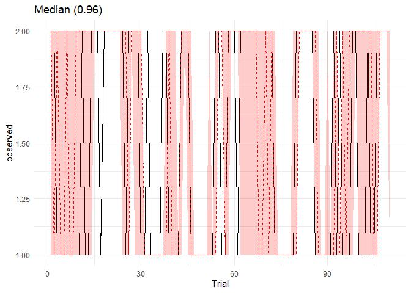

# Computational modeling - model checking


<p>

This file contains all of the computational model validation analyses
completed after the model fitting process (prior to hypothesis testing)
</p>

<p>

Prior to this, data were processed, models were run and model-checks
were extracted using the code within the modelFitting folder
</p>

- data were pre-processed into the correct format for cmdstanr
  (makeStanData.r)
- data were fit to a series of Q-learning models which differed in the
  included parameters (and whether parameters were shared or differed
  across learning types) - submitCluster.sh and runModel.sh/R
- model convergence outputs were extracted (effective sample size, rhat)
  (code in /modelDiagnostics folder - testingrhatneff.ipynb)
- posterior predictive checks and parameter recovery were also carried
  out (code in /modelDiagnostics/ParamRecov and /modelDiagnostics/PPCs)

<p>

This file contains:
</p>

- WAIC model comparison
- model convergence checks
- posterior predictive checks
- parameter recovery

<p>

Load in packages in python and in r
</p>

<details class="code-fold">
<summary>Code</summary>

``` python
import numpy as np
import pandas as pd
import matplotlib.pyplot as plt
import seaborn as sns
import scipy.stats as stats
import jsonlines
from functools import reduce
import statistics
import scipy.stats
import seaborn as sns
import math
import os
import json
import ast
import statsmodels.api as sm
import statsmodels.formula.api as smf
import pingouin as pg
import warnings
from scipy.stats import ttest_rel
#from statannotations.Annotator import Annotator
from scipy.stats import skew
from statsmodels.stats.diagnostic import het_white
from sklearn.preprocessing import PowerTransformer
import statannot
from scipy.stats import ttest_ind
import itertools

warnings.simplefilter(action='ignore', category=FutureWarning)
pd.options.mode.copy_on_write = True
```

</details>

<details class="code-fold">
<summary>Code</summary>

``` r
set.seed(41)
library(dplyr)
library(ggplot2)
library(hBayesDM)
library(pheatmap)
library(truncnorm)
library(rstan)
library(cmdstanr)
library(bayesplot)
library(posterior)
library(loo)
library(rstanarm)
library(magick)
library(cowplot)
```

</details>

<h3>

WAIC model comparison and model convergence checks
</h3>

<p>

Firstly, we must compare q-learning models to a model which assumes
random learning. This shows that q-learning models are a much better fit
to the data
</p>

<details class="code-fold">
<summary>Code</summary>

``` r
folder <- "//cbsu/data/Group/Nord/DisgustReversalLearningModeling/finalModelComp/modelOutputs"
loglik_list <- list()
waic_list <- list()
modelname_list <-list()
for (filename in list.dirs(folder, recursive=FALSE)){
  #print(filename)
  if (grepl("OUTdir", filename)) {
    next   # skip this file
    }
    modelname<-basename(filename)
    #print(modelname)
    loglik <- readRDS(list.files(filename, pattern="^loglik", full.names=TRUE))
    waic <- waic(loglik)
    loglik_list[[modelname]]<- loglik
    waic_list[[modelname]] <- waic
    modelname_list <- append(modelname_list, modelname)
}

df <- data.frame(
  model = names(waic_list),
  waic = c(
    waic_list[[modelname_list[[1]]]]$estimates["waic", "Estimate"],
    waic_list[[modelname_list[[2]]]]$estimates["waic", "Estimate"],
    waic_list[[modelname_list[[3]]]]$estimates["waic", "Estimate"],
    waic_list[[modelname_list[[4]]]]$estimates["waic", "Estimate"],
    waic_list[[modelname_list[[5]]]]$estimates["waic", "Estimate"],
    waic_list[[modelname_list[[6]]]]$estimates["waic", "Estimate"],
    waic_list[[modelname_list[[7]]]]$estimates["waic", "Estimate"],
    waic_list[[modelname_list[[8]]]]$estimates["waic", "Estimate"],
    waic_list[[modelname_list[[9]]]]$estimates["waic", "Estimate"],
    waic_list[[modelname_list[[10]]]]$estimates["waic", "Estimate"],
    waic_list[[modelname_list[[11]]]]$estimates["waic", "Estimate"],
    waic_list[[modelname_list[[12]]]]$estimates["waic", "Estimate"],
    waic_list[[modelname_list[[13]]]]$estimates["waic", "Estimate"],
    waic_list[[modelname_list[[14]]]]$estimates["waic", "Estimate"],
    waic_list[[modelname_list[[15]]]]$estimates["waic", "Estimate"],
    waic_list[[modelname_list[[16]]]]$estimates["waic", "Estimate"],
    waic_list[[modelname_list[[17]]]]$estimates["waic", "Estimate"],
    waic_list[[modelname_list[[18]]]]$estimates["waic", "Estimate"],
    waic_list[[modelname_list[[19]]]]$estimates["waic", "Estimate"],
    waic_list[[modelname_list[[20]]]]$estimates["waic", "Estimate"],
    waic_list[[modelname_list[[21]]]]$estimates["waic", "Estimate"]
    ),
  se = c(
    waic_list[[modelname_list[[1]]]]$estimates["waic", "SE"],
    waic_list[[modelname_list[[2]]]]$estimates["waic", "SE"],
    waic_list[[modelname_list[[3]]]]$estimates["waic", "SE"],
    waic_list[[modelname_list[[4]]]]$estimates["waic", "SE"],
    waic_list[[modelname_list[[5]]]]$estimates["waic", "SE"],
    waic_list[[modelname_list[[6]]]]$estimates["waic", "SE"],
    waic_list[[modelname_list[[7]]]]$estimates["waic", "SE"],
    waic_list[[modelname_list[[8]]]]$estimates["waic", "SE"],
    waic_list[[modelname_list[[9]]]]$estimates["waic", "SE"],
    waic_list[[modelname_list[[10]]]]$estimates["waic", "SE"],
    waic_list[[modelname_list[[11]]]]$estimates["waic", "SE"],
    waic_list[[modelname_list[[12]]]]$estimates["waic", "SE"],
    waic_list[[modelname_list[[13]]]]$estimates["waic", "SE"],
    waic_list[[modelname_list[[14]]]]$estimates["waic", "SE"],
    waic_list[[modelname_list[[15]]]]$estimates["waic", "SE"],
    waic_list[[modelname_list[[16]]]]$estimates["waic", "SE"],
    waic_list[[modelname_list[[17]]]]$estimates["waic", "SE"],
    waic_list[[modelname_list[[18]]]]$estimates["waic", "SE"],
    waic_list[[modelname_list[[19]]]]$estimates["waic", "SE"],
    waic_list[[modelname_list[[20]]]]$estimates["waic", "SE"],
    waic_list[[modelname_list[[21]]]]$estimates["waic", "SE"]
    )
)
df <- df[order(df$waic), ] 
df$model <- factor(df$model, levels = df$model[order(df$waic)])
df <- df[!grepl("hybrid", df$model, ignore.case = TRUE), ]
print(df)
```

</details>

                                model     waic       se
    16    2lr_stick1_blk3_allparamsep 109838.9 3639.941
    6     1lr_stick1_blk3_allparamsep 110113.0 3638.806
    18        2lr_stick1_blk3_emVsNot 110679.9 3660.760
    8         1lr_stick1_blk3_emVsNot 110958.8 3658.060
    17 2lr_stick1_blk3_allparamshared 111141.4 3673.464
    7  1lr_stick1_blk3_allparamshared 111438.2 3668.803
    11    2lr_stick0_blk3_allparamsep 112864.5 3546.958
    1     1lr_stick0_blk3_allparamsep 113142.1 3549.225
    13        2lr_stick0_blk3_emVsNot 113585.9 3574.687
    3         1lr_stick0_blk3_emVsNot 113851.4 3572.948
    12 2lr_stick0_blk3_allparamshared 114083.8 3598.087
    2  1lr_stick0_blk3_allparamshared 114378.1 3595.745
    21                    random_blk3 153385.1 2693.042

<details class="code-fold">
<summary>Code</summary>

``` r
ggplot(df, aes(x = model, y = waic)) +
  geom_point() +
  geom_errorbar(aes(ymin = waic - se, ymax = waic + se), width = 0.2) +
  labs(y = "WAIC", x = "Model") +
  theme_minimal() +
  theme(
    axis.text.x = element_text(angle = 45, hjust = 1, vjust = 1),
    plot.margin = margin(t = 10, r = 10, b = 50, l = 10)
  )
```

</details>


<p>

BUT this also shows that no model is a ‘clear’ winner (lower WAIC by \>
3 SEs)
<p>

However, ‘stickiness’ models consistently produce a better fit
</p>

<details class="code-fold">
<summary>Code</summary>

``` r
theme_set(theme_bw())
df <- df[!grepl("random", df$model, ignore.case = TRUE), ]
ggplot(df, aes(x = model, y = waic, color=model)) +
  geom_point(size =4) +
  geom_errorbar(aes(ymin = waic - se, ymax = waic + se), width = 0.5, size =1) +
  #coord_flip()+
  labs(y = "WAIC", x="") +
  scale_color_manual(values=c("#9B0F47", "#9B0F47", "#9B0F47", "#9B0F47", "#9B0F47", "#9B0F47",
                                "#3A0CA3","#3A0CA3","#3A0CA3","#3A0CA3","#3A0CA3","#3A0CA3")) +
  theme_minimal(base_size=18) +
  theme(
    plot.background = element_rect(fill = "white", color = NA),
    panel.background = element_rect(fill = "white", color = NA),
    axis.text.x = element_text(angle = 45, hjust = 1, vjust = 1),
    legend.position = 'none',
    plot.margin = margin(t = 20, r = 20, b = 30, l = 50))
```

</details>


<p>

And looking within this, the single learning rate models have better
diagnostics (e.g., effective sample size is much higher for the single
learning rate models))
</p>

<details class="code-fold">
<summary>Code</summary>

``` r
#load rhat_neff_df
rhat_neff_df <- read.csv("U:/Documents/Disgust learning project/github/disgust_reversal_learning-final/results/comp_modeling/modelFitting/modelDiagnostics/rhat_neff_df.csv") #created by modelDiagnostics/testingrhatneff.ipynb
rhat_neff_df <- rhat_neff_df[!grepl("stick0", rhat_neff_df$model, ignore.case = TRUE), ]
rhat_neff_df <- rhat_neff_df[order(rhat_neff_df$min_neff, decreasing=TRUE), ] 
print(subset(rhat_neff_df, select = -max_rhat))
```

</details>

                            modelName  min_neff
    9  1lr_stick1_blk3_allparamshared 0.8345388
    3         1lr_stick1_blk3_emVsNot 0.8099417
    8     1lr_stick1_blk3_allparamsep 0.7669077
    5         2lr_stick1_blk3_emVsNot 0.3644348
    7     2lr_stick1_blk3_allparamsep 0.3482681
    12 2lr_stick1_blk3_allparamshared 0.3090907

<p>

Within this, the ‘all parameter separately’ flavour of model is the most
theoretically informative (as it allows us to compare the three
feedback-types) and it has the lowest WAIC value, suggesting that
despite having the most free parameters, it is the most parsimonious.
</p>

<p>

This model also has a maximum r-hat value that suggests good model
convergence (close to 1)
</p>

<details class="code-fold">
<summary>Code</summary>

``` r
#load rhat_neff_df
print(rhat_neff_df[rhat_neff_df$modelName=='1lr_stick1_blk3_allparamsep',])
```

</details>

                        modelName max_rhat  min_neff
    8 1lr_stick1_blk3_allparamsep 1.003552 0.7669077

<br>

<h3>

Posterior predictive checks
</h3>

<p>

To assess how well the ‘predicted’ value of the model aligns with the
actual choice on any given trial, we evaluated whether the actual choice
is within the inter-quartile range of predicted choices across draws.
This is done using the postpred_alltrials output from the PPCs.R script
(/modelDiagnostics/PPCs). This code produces the overall mean % of
trials within the inter-quartile range (across all participants and
trials) and plots a single block for the participant who has the median
score for this percentage.

<details class="code-fold">
<summary>Code</summary>

``` r
postpred_alltrials <- readRDS("modelFitting/modelDiagnostics/PPCs/postpred_alltrials_1lr_stick1_blk3_allparamsep.rds")

out_df<- data.frame()

for(participant_no in 1:340){
    for(block_no in 1:3){
        subj_df = postpred_alltrials[postpred_alltrials$subject==participant_no,]
        block_df = subj_df[subj_df$block==block_no,]

        for(trial_no in block_df$trial){
            trial_df <- block_df[block_df$trial == trial_no, ]
            observed <- trial_df$observed
            pred_median <- trial_df$pred_median
            LQ <- trial_df$pred_lower
            UQ <- trial_df$pred_upper

            if((observed>=LQ) & (observed<=UQ)){
                in_range <- 1
            } else {
                in_range <- 0
            }

            df <- data.frame(
                subject = participant_no,
                block = block_no,
                trial=trial_no,
                observed=observed,
                pred_median=pred_median,
                LQ=LQ,
                UQ=UQ,
                in_range= in_range
            )
            out_df <- rbind(out_df, df)
        }
    }
}

mean(out_df$in_range)
```

</details>

    [1] 0.9576299

<details class="code-fold">
<summary>Code</summary>

``` r
in_range_df <- data.frame()
for(participant_no in 1:340){
    for(block_no in 1:3){
    subj_df = out_df[out_df$subject==participant_no,]
    block_df = subj_df[subj_df$block_no, ]
    in_range_prob = mean(subj_df[subj_df$subject==participant_no,]$in_range)
    df <- data.frame(
        subject = participant_no,
        block=block_no,
        in_range_prob = in_range_prob
    )
    in_range_df <- rbind(in_range_df, df)
}
}
saveRDS(in_range_df, "U:/Documents/Disgust learning project/github/disgust_reversal_learning-final/results/comp_modeling/modelFitting/modelDiagnostics/PPCs/in_range_df.rds")

med<-as.numeric(quantile(in_range_df$in_range_prob, probs=0.5))
q_index <- which.min(abs(in_range_df$in_range_prob - med))
participant_no <- in_range_df[q_index, c('subject')]
block_no <- in_range_df[q_index, c('block')]

subj_df = postpred_alltrials[postpred_alltrials$subject==participant_no,]
block_df = subj_df[subj_df$block==block_no,]
ggplot(block_df, aes(x=trial)) +
  geom_line(aes(y=observed), color="black") +
  geom_line(aes(y=pred_median), color="red", linetype="dashed") +
  geom_ribbon(aes(ymin=pred_lower, ymax=pred_upper), fill="red", alpha=0.2) +
  labs(title=paste0("Median (", round(med,2), ")"),, x="Trial") +
  theme_minimal()
```

</details>



<br>

<h3>

Parameter recovery
</h3>

<p>

Full code for the parameter recovery on the winning model can be found
in the /modelFitting/modelDiagnostics/ParamRecov folder
<p>

<p>

Here, we compare the parameters recovered from the model to the
parameters used to simulate the dataset
</p>

<details class="code-fold">
<summary>Code</summary>

``` r
simul_pars <- readRDS("//cbsu/data/Group/Nord/DisgustReversalLearningModeling/finalModelComp/modelCompAndDiagnostics/ParamRecov/simParams.rds")
model_pars <- readRDS("//cbsu/data/Group/Nord/DisgustReversalLearningModeling/finalModelComp/modelCompAndDiagnostics/ParamRecov/modelOutput/modelPars_1lr_stick1_blk3_allparamsep.rds")

param_recov <- merge(simul_pars, model_pars, by ='subjID')
param_cors = cor(param_recov)
param_cors <- param_cors[-c(1), -c(1)]
param_cors <- param_cors[-c(1,2,3,4,5,6,7,8,9), -c(10,11,12,13,14,15,16,17,18) ]
param_cors <- param_cors[c('p_alpha', 'f_alpha', 'd_alpha', 
                            'p_beta', 'f_beta', 'd_beta',
                            'p_omega', 'f_omega', 'd_omega'),
                             c('pointsLearningRate', 'fearLearningRate', 'disgustLearningRate', 
                                'pointsInverseTemp', 'fearInverseTemp', 'disgustInverseTemp',
                                    'pointsStickiness', 'fearStickiness', 'disgustStickiness')]
pheatmap(param_cors, 
         cluster_rows = FALSE, cluster_cols = FALSE,
         display_numbers = TRUE, number_format = "%.2f", fontsize=16)
```

</details>


<p>

This shows high correspondence between simulated and recovered
parameters (between 0.71 and 0.96)
</p>

<br>
