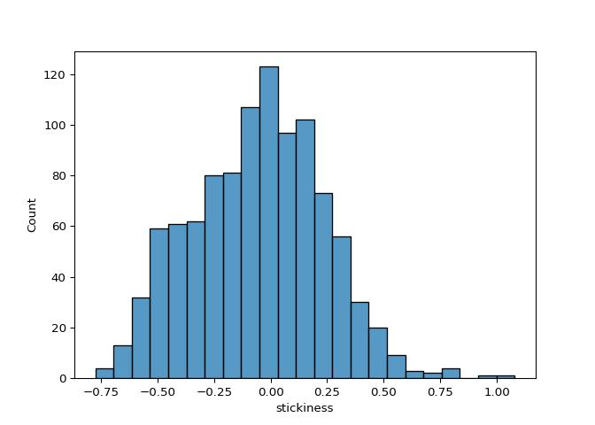

# Computational modeling hypothesis testing (stickiness)


<p>

This file contains hypothesis testing carried out on the winning model
(1LR_stick1_allparamsep) using the <b>stickiness</b> parameter.
<p>

<p>

Stickiness parameters are compared between the three feedback types
using the same mixed effects modeling strategy as was used in the
model-agnostic hypothesis testing analyses (including skew transforms,
assumptions testing, generalized models for failed model assumptions,
video-ratings covariates, sensitivity analyses, bayes factors for null
results, and BIC model comparison as a means of selecting random effects
and covariates).

<br>
<h3>

Load in packages and data- in python and then in r
</h3>

<details class="code-fold">
<summary>Code</summary>

``` python
import numpy as np
import pandas as pd
import matplotlib.pyplot as plt
import seaborn as sns
import scipy.stats as stats
import jsonlines
from functools import reduce
import statistics
import scipy.stats
import seaborn as sns
import math
import os
import json
import ast
import statsmodels.api as sm
import statsmodels.formula.api as smf
import pingouin as pg
import warnings
from scipy.stats import ttest_rel
#from statannotations.Annotator import Annotator
from scipy.stats import skew
from statsmodels.stats.diagnostic import het_white
from sklearn.preprocessing import PowerTransformer
import statannot
from scipy.stats import ttest_ind
from scipy.stats import ttest_1samp
import itertools

warnings.simplefilter(action='ignore', category=FutureWarning)
pd.options.mode.copy_on_write = True

filepath="//cbsu/data/Group/Nord/DisgustReversalLearningModeling/finalModelComp/1LR_stick1_blk3_allparamsep_params.csv"
params = pd.read_csv(filepath)
task_summary=pd.read_csv('U:/Documents/Disgust learning project/github/disgust_reversal_learning-final/csvs/dem_vids_task_excluded.csv')
task_summary.sort_values(by=['participant_no', 'block_type'], inplace=True)
params['participant_no']=list(set(task_summary.participant_no))

#convert to long df
long_params=pd.DataFrame()
for subj in set(params['participant_no']):
    subj_params= params[params['participant_no']==subj]
    disgust_row=pd.DataFrame({
        'participant_no': [float(subj_params['participant_no'])],
        'LR':  [float(subj_params['d_alpha'])],
        'invTemp': [float(subj_params['d_beta'])],
        'stickiness': [float(subj_params['d_omega'])],
        'block_type': ['Disgust']
    })
    fear_row=pd.DataFrame({
        'participant_no': [float(subj_params['participant_no'])],
        'LR':  [float(subj_params['f_alpha'])],
        'invTemp': [float(subj_params['f_beta'])],
        'stickiness': [float(subj_params['f_omega'])],
        'block_type': ['Fear']
    })
    points_row=pd.DataFrame({
        'participant_no': [float(subj_params['participant_no'])],
        'LR':  [float(subj_params['p_alpha'])],
        'invTemp': [float(subj_params['p_beta'])],
        'stickiness': [float(subj_params['p_omega'])],
        'block_type': ['Points']
    })
    long_params=pd.concat([long_params, disgust_row, fear_row, points_row])

##combine with task_summary_df
df=pd.merge(task_summary, long_params, on=['participant_no', 'block_type'], how='inner')
df.to_csv("csvs/winningModelOutput.csv")

pvals_file = 'pvals/ModelingPvalsForPlotting.xlsx'
```

</details>

<details class="code-fold">
<summary>Code</summary>

``` r
library(tidyverse, quietly=TRUE)
library(lme4)
library(emmeans)
library(DHARMa)
library('readxl')
library('xlsx')

df <- read.csv("csvs/winningModelOutput.csv")
pvals_file <- 'pvals/ModelingPvalsForPlotting.xlsx'
```

</details>

<b>Assess for skewness</b>
<p>

There is no skew so a transformation is not required
</p>

<details class="code-fold">
<summary>Code</summary>

``` python
sns.histplot(data=df, x="stickiness") 
print('stickiness skew: '+str(skew(df.stickiness)))
```

</details>

    stickiness skew: 0.0878784169741605



<b>Mixed effects model assumptions violated</b>
<p>

In this case, a basic model (no random slopes or random intercepts) with
no covariates produced the best fit (as indexed by BIC scores). But the
model assumptions were violated:

<p>

Select the winning mixed effects model:
</p>

<details class="code-fold">
<summary>Code</summary>

``` python
data=df.reset_index()
formula = 'stickiness ~ block_type'
basic_model=smf.mixedlm(formula, data, groups=data['participant_no'], missing='drop').fit(reml=False)

#feedback_randint=smf.mixedlm(formula, data, groups=data['participant_no'], missing='drop', vc_formula={'feedback_details': '0+feedback_details'}).fit(reml=False) 
#fractals_randint=smf.mixedlm(formula, data, groups=data['participant_no'], missing='drop', vc_formula={'fractals': '0+fractals'}).fit(reml=False) 
#feedback_fractals_randint=smf.mixedlm(formula, data, groups=data['participant_no'], missing='drop', vc_formula={"feedback_details": "0 + feedback_details", "fractals": "0 + fractals"}).fit(reml=False)

randslope=smf.mixedlm(formula, data, groups=data['participant_no'], missing='drop', re_formula='~block_type').fit(reml=False)
feedback_randint_randslope=smf.mixedlm(formula, data, groups=data['participant_no'], missing='drop', vc_formula={'feedback_details': '0+feedback_details'}, re_formula='~block_type').fit(reml=False)
#feedback_fractals_randint_randslope=smf.mixedlm(formula, data, groups=data['participant_no'], missing='drop', vc_formula={'feedback_details': '0+feedback_details', "fractals": "0 + fractals"}, re_formula='~block_type').fit(reml=False)


bic=pd.DataFrame({'basic_model': [basic_model.bic], 
                    #'feedback_randint': [feedback_randint.bic], 
                    #'fractals_randint': [fractals_randint.bic],
                    #'feedback_fractals_randint': [feedback_fractals_randint.bic], ##added manually
                    'randslope': [randslope.bic],
                    'feedback_randint_randslope':[feedback_randint_randslope.bic],
                    #'feedback_fractals_randint_randslope': [feedback_fractals_randint_randslope.bic]
                    })
win1=bic.sort_values(by=0, axis=1).columns[0]

##test which covariates to add -- Using the random effects which were best above (basic model in this case)
no_covariate=smf.mixedlm(formula, data, groups=data['participant_no'], missing='drop').fit(reml=False)
sex_covariate=smf.mixedlm(formula+str('+prolific_sex'), data, groups=data['participant_no'], missing='drop').fit(reml=False)
age_covariate=smf.mixedlm(formula+str('+prolific_age'), data, groups=data['participant_no'], missing='drop').fit(reml=False)
digit_span_covariate=smf.mixedlm(formula+str('+digit_span'), data, groups=data['participant_no'], missing='drop').fit(reml=False)
sex_age_covariate=smf.mixedlm(formula+str('+prolific_sex+prolific_age'), data, groups=data['participant_no'], missing='drop').fit(reml=False)
sex_digit_span_covariate=smf.mixedlm(formula+str('+prolific_sex+digit_span'), data, groups=data['participant_no'], missing='drop').fit(reml=False)
digit_span_age_covariate=smf.mixedlm(formula+str('+digit_span+prolific_age'), data, groups=data['participant_no'], missing='drop').fit(reml=False)
sex_age_digit_span_covariate=smf.mixedlm(formula+str('+prolific_sex+prolific_age+digit_span'), data, groups=data['participant_no'], missing='drop').fit(reml=False)

bic=pd.DataFrame({'no_covariate': [no_covariate.bic], 
                    'sex_covariate': [sex_covariate.bic], 
                    'age_covariate': [age_covariate.bic],
                    'digit_span_covariate': [digit_span_covariate.bic],
                    'sex_age_covariate': [sex_age_covariate.bic],
                    'sex_digit_span_covariate': [sex_digit_span_covariate.bic],
                    'digit_span_age_covariate': [digit_span_age_covariate.bic],
                    'sex_age_digit_span_covariate': [sex_age_digit_span_covariate.bic]})
win2=bic.sort_values(by=0, axis=1).columns[0]
print("Winning models: "+ win1 +" "+ win2)
```

</details>

    Winning models: basic_model no_covariate

<p>

Shapiro-Wilk test of normality of residuals
</p>

<details class="code-fold">
<summary>Code</summary>

``` python
#chosen model
results=no_covariate

#shapiro-Wilk test of normality of residuals
labels = ["Statistic", "p-value"]
norm_res = stats.shapiro(results.resid)

for key, val in dict(zip(labels, norm_res)).items():
    print(key, val)
```

</details>

    Statistic 0.996719743175173
    p-value 0.03241234713229448

<p>

White Lagrange multiplier Test for Heteroscedasticity
</p>

<details class="code-fold">
<summary>Code</summary>

``` python
#chosen model
##homoskedasticity of variance 
#White Lagrange Multiplier Test for Heteroscedasticity
het_white_res = het_white(results.resid, results.model.exog)

labels = ["LM Statistic", "LM-Test p-value", "F-Statistic", "F-Test p-value"]

for key, val in dict(zip(labels, het_white_res)).items():
    print(key, val)
```

</details>

    LM Statistic 17.450020329488016
    LM-Test p-value 0.00016247114117356502
    F-Statistic 8.850766064012982
    F-Test p-value 0.0001546073707316201

<h4>

<b>So instead we run a generalized mixed effects model (done in R)</b>
</h4>

<details class="code-fold">
<summary>Code</summary>

``` r
#make non-negative
df$stickiness = df$stickiness + 1

gamma_log <- glmer(stickiness~ block_type + (1|participant_no), data=df, family=Gamma(link="log"))
gamma_inverse <- glmer(stickiness~ block_type + (1|participant_no), data=df, family=Gamma(link="inverse"))
gamma_identity <- glmer(stickiness~ block_type + (1|participant_no), data=df, family=Gamma(link="identity"))

invgaus_log <- glmer(stickiness~ block_type + (1|participant_no), data=df, family=inverse.gaussian(link="log"))
invgaus_inverse <- glmer(stickiness~ block_type + (1|participant_no), data=df, family=inverse.gaussian(link="inverse"))
invgaus_identity <- glmer(stickiness~ block_type + (1|participant_no), data=df, family=inverse.gaussian(link="identity"))

bic_values <- c(
  BIC(gamma_log),
  BIC(gamma_inverse),
  BIC(gamma_identity),
  BIC(invgaus_log),
  BIC(invgaus_inverse),
  BIC(invgaus_identity)
)
model_names <- c("Gamma (log)", "Gamma (inverse)", "Gamma (identity)", "Inverse gaussian (log)", "Inverse gaussian (inverse)", "Inverse gaussian (identity)")

bic_df <- data.frame(Model = model_names, BIC = bic_values)
win1 <- bic_df[which.min(bic_df$BIC), ]$Model

#now pick random effect structure
basic_model <- glmer(stickiness~ block_type + (1|participant_no), data=df, family=Gamma(link="identity"))

feedback_randint <- glmer(stickiness~ block_type + (1|participant_no) + (1|feedback_details), data=df, family=Gamma(link="identity"))
fractals_randint <- glmer(stickiness~ block_type + (1|participant_no) + (1|fractals), data=df, family=Gamma(link="identity"))
feedback_fractals_randint <- glmer(stickiness~ block_type + (1|participant_no) + (1|fractals) + (1|feedback_details), data=df, family=Gamma(link="identity"))

randslope <- glmer(stickiness~ block_type + (block_type|participant_no), data=df, family=Gamma(link="identity"))
#feedback_randint_randslope <- glmer(stickiness~ block_type + (block_type|participant_no) + (1|feedback_details), data=df, family=Gamma(link="identity"))
#feedback_fractals_randint_randslope <- glmer(stickiness~ block_type + (block_type|participant_no) + (1|feedback_details) + (1|fractals), data=df, family=Gamma(link="identity"))

bic_values <- c(
  BIC(basic_model),
  BIC(feedback_randint),
  BIC(fractals_randint),
  BIC(feedback_fractals_randint)
  #BIC(randslope)
  #BIC(feedback_randint_randslope)
  #BIC(feedback_fractals_randint_randslope)
)
model_names <- c("basic model", "feedback_randint", "fractals_randint", "feedback_fractals_randint")

bic_df <- data.frame(Model = model_names, BIC = bic_values)

bic_df <- bic_df[order(bic_df$BIC), ]
win2 <- bic_df[which.min(bic_df$BIC), ]$Model

no_covariate <- basic_model
#choose covariates
no_covariate <- basic_model
sex_covariate <- glmer(stickiness ~ block_type + (1|participant_no) + prolific_sex, data=df, family=Gamma(link="identity"))
#age_covariate <- glmer(stickiness ~ block_type + (1|participant_no) + prolific_age, data=df, family=Gamma(link="identity"))
#digit_span_covariate <- glmer(stickiness ~ block_type + (1|participant_no) + digit_span, data=df, family=Gamma(link="identity"))
#sex_age_covariate <- glmer(stickiness ~ block_type + (1|participant_no) + prolific_sex + prolific_age, data=df, family=Gamma(link="identity"))
#sex_digit_span_covariate <- glmer(stickiness ~ block_type + (1|participant_no) + prolific_sex + digit_span, data=df, family=Gamma(link="identity"))
#digit_span_age_covariate <- glmer(stickiness ~ block_type + (1|participant_no) + prolific_age + digit_span, data=df, family=Gamma(link="identity"))
#sex_digit_span_age_covariate <- glmer(stickiness ~ block_type + (1|participant_no) + prolific_age + prolific_sex + digit_span, data=df, family=Gamma(link="identity"))

bic_values <- c(
  BIC(no_covariate),
  BIC(sex_covariate)
)
model_names <- c("no_covariate", "sex_covariate")

bic_df <- data.frame(Model = model_names, BIC = bic_values)
win3 <- bic_df[which.min(bic_df$BIC), ]$Model

print(paste0("Winning models: ", win1, " ", win2," ",win3))
```

</details>

    [1] "Winning models: Gamma (identity) basic model no_covariate"

<p>

Results from this model show a <b>significant effect of block-type</b>
</p>

``` r
summary(no_covariate)
```

    Generalized linear mixed model fit by maximum likelihood (Laplace
      Approximation) [glmerMod]
     Family: Gamma  ( identity )
    Formula: stickiness ~ block_type + (1 | participant_no)
       Data: df

         AIC      BIC   logLik deviance df.resid 
      -202.8   -178.1    106.4   -212.8     1015 

    Scaled residuals: 
         Min       1Q   Median       3Q      Max 
    -2.50811 -0.56538  0.02259  0.54351  2.81088 

    Random effects:
     Groups         Name        Variance Std.Dev.
     participant_no (Intercept) 0.03084  0.1756  
     Residual                   0.05336  0.2310  
    Number of obs: 1020, groups:  participant_no, 340

    Fixed effects:
                     Estimate Std. Error t value Pr(>|z|)    
    (Intercept)       1.02710    0.01927  53.290  < 2e-16 ***
    block_typeFear   -0.06214    0.01387  -4.479 7.51e-06 ***
    block_typePoints -0.09997    0.01344  -7.440 1.01e-13 ***
    ---
    Signif. codes:  0 '***' 0.001 '**' 0.01 '*' 0.05 '.' 0.1 ' ' 1

    Correlation of Fixed Effects:
                (Intr) blck_F
    block_typFr -0.384       
    blck_typPnt -0.388  0.555

<p>

Extract confidence intervals
</p>

``` r
print(confint.merMod(no_covariate, method='Wald'))
```

                           2.5 %      97.5 %
    .sig01                    NA          NA
    .sigma                    NA          NA
    (Intercept)       0.98932816  1.06488094
    block_typeFear   -0.08932837 -0.03494459
    block_typePoints -0.12630878 -0.07363533

<p>

A Bayesian t-test to assess differences between fear and points (as this
is not directly assessed by the model)
</p>

<details class="code-fold">
<summary>Code</summary>

``` python
def bayes_factor(df, dependent_var, condition_1_name, condition_2_name):
    df=df[(df.block_type==condition_1_name)| (df.block_type==condition_2_name)][[dependent_var, 'block_type', 'participant_no']]
    df.dropna(inplace=True)
    df=df.pivot(index='participant_no', columns='block_type', values=dependent_var).reset_index()
    ttest=pg.ttest(df[condition_1_name], df[condition_2_name], paired=True)
    bf_null=1/float(ttest.BF10)
    return ttest, bf_null

ttest, bf_null = bayes_factor(df, 'stickiness', 'Points', 'Fear')

print(f"Points vs Fear: T = {ttest['T'][0]}, CI95% = {ttest['CI95%'][0]}, p = {ttest['p-val'][0]}")
```

</details>

    Points vs Fear: T = -3.1913136823036923, CI95% = [-0.07 -0.02], p = 0.0015487114817951295

    U:\Documents\envs\disgust_reversal_venv\Lib\site-packages\openpyxl\styles\stylesheet.py:237: UserWarning: Workbook contains no default style, apply openpyxl's default
      warn("Workbook contains no default style, apply openpyxl's default")

<br>
<h3>

<b>Adding video ratings</b>
</h3>

We will next test whether this effect remains after video rating
differences between fear and disgust have been controlled for.
<p>

As before, the mixed effects model violated assumptions, so a
generalized mixed effects model must be run.
</p>

<details class="code-fold">
<summary>Code</summary>

``` python
data=df.reset_index()
formula = 'stickiness ~ block_type +valence_diff + arousal_diff + valence_habdiff'
basic_model=smf.mixedlm(formula, data, groups=data['participant_no'], missing='drop').fit(reml=False)

#feedback_randint=smf.mixedlm(formula, data, groups=data['participant_no'], missing='drop', vc_formula={'feedback_details': '0+feedback_details'}).fit(reml=False) 
#fractals_randint=smf.mixedlm(formula, data, groups=data['participant_no'], missing='drop', vc_formula={'fractals': '0+fractals'}).fit(reml=False) 
#feedback_fractals_randint=smf.mixedlm(formula, data, groups=data['participant_no'], missing='drop', vc_formula={"feedback_details": "0 + feedback_details", "fractals": "0 + fractals"}).fit(reml=False)

randslope=smf.mixedlm(formula, data, groups=data['participant_no'], missing='drop', re_formula='~block_type').fit(reml=False)
feedback_randint_randslope=smf.mixedlm(formula, data, groups=data['participant_no'], missing='drop', vc_formula={'feedback_details': '0+feedback_details'}, re_formula='~block_type').fit(reml=False)
#feedback_fractals_randint_randslope=smf.mixedlm(formula, data, groups=data['participant_no'], missing='drop', vc_formula={'feedback_details': '0+feedback_details', "fractals": "0 + fractals"}, re_formula='~block_type').fit(reml=False)


bic=pd.DataFrame({'basic_model': [basic_model.bic], 
                    #'feedback_randint': [feedback_randint.bic], 
                    #'fractals_randint': [fractals_randint.bic],
                    #'feedback_fractals_randint': [feedback_fractals_randint.bic], ##added manually
                    'randslope': [randslope.bic],
                    'feedback_randint_randslope':[feedback_randint_randslope.bic],
                   # 'feedback_fractals_randint_randslope': [feedback_fractals_randint_randslope.bic]
                    })
win1=bic.sort_values(by=0, axis=1).columns[0]

##test which covariates to add -- Using the random effects which were best above (basic model in this case)
no_covariate=smf.mixedlm(formula, data, groups=data['participant_no'], missing='drop').fit(reml=False)
sex_covariate=smf.mixedlm(formula+str('+prolific_sex'), data, groups=data['participant_no'], missing='drop').fit(reml=False)
age_covariate=smf.mixedlm(formula+str('+prolific_age'), data, groups=data['participant_no'], missing='drop').fit(reml=False)
digit_span_covariate=smf.mixedlm(formula+str('+digit_span'), data, groups=data['participant_no'], missing='drop').fit(reml=False)
sex_age_covariate=smf.mixedlm(formula+str('+prolific_sex+prolific_age'), data, groups=data['participant_no'], missing='drop').fit(reml=False)
sex_digit_span_covariate=smf.mixedlm(formula+str('+prolific_sex+digit_span'), data, groups=data['participant_no'], missing='drop').fit(reml=False)
digit_span_age_covariate=smf.mixedlm(formula+str('+digit_span+prolific_age'), data, groups=data['participant_no'], missing='drop').fit(reml=False)
sex_age_digit_span_covariate=smf.mixedlm(formula+str('+prolific_sex+prolific_age+digit_span'), data, groups=data['participant_no'], missing='drop').fit(reml=False)

bic=pd.DataFrame({'no_covariate': [no_covariate.bic], 
                    'sex_covariate': [sex_covariate.bic], 
                    'age_covariate': [age_covariate.bic],
                    'digit_span_covariate': [digit_span_covariate.bic],
                    'sex_age_covariate': [sex_age_covariate.bic],
                    'sex_digit_span_covariate': [sex_digit_span_covariate.bic],
                    'digit_span_age_covariate': [digit_span_age_covariate.bic],
                    'sex_age_digit_span_covariate': [sex_age_digit_span_covariate.bic]})
win2=bic.sort_values(by=0, axis=1).columns[0]
print("Winning models: "+ win1 +" "+ win2)
```

</details>

    Winning models: basic_model no_covariate

<p>

Shapiro-Wilk test of normality of residuals
</p>

<details class="code-fold">
<summary>Code</summary>

``` python
#chosen model
results=no_covariate

#shapiro-Wilk test of normality of residuals
labels = ["Statistic", "p-value"]
norm_res = stats.shapiro(results.resid)

for key, val in dict(zip(labels, norm_res)).items():
    print(key, val)
```

</details>

    Statistic 0.9965944247578783
    p-value 0.02622715577807743

<p>

White Lagrange multiplier Test for Heteroscedasticity
</p>

<details class="code-fold">
<summary>Code</summary>

``` python
#chosen model
##homoskedasticity of variance 
#White Lagrange Multiplier Test for Heteroscedasticity
het_white_res = het_white(results.resid, results.model.exog)

labels = ["LM Statistic", "LM-Test p-value", "F-Statistic", "F-Test p-value"]

for key, val in dict(zip(labels, het_white_res)).items():
    print(key, val)
```

</details>

    LM Statistic 34.222114544845915
    LM-Test p-value 0.007858739676715342
    F-Statistic 2.0461928821350215
    F-Test p-value 0.007341325341116323

<p>

Model selection for the generalized mixed effects model
</p>

<details class="code-fold">
<summary>Code</summary>

``` r
gamma_log <- glmer(stickiness~ block_type + valence_diff + arousal_diff + valence_habdiff  + (1|participant_no), data=df, family=Gamma(link="log"))
gamma_inverse <- glmer(stickiness~ block_type + valence_diff + arousal_diff + valence_habdiff  + (1|participant_no), data=df, family=Gamma(link="inverse"))
gamma_identity <- glmer(stickiness~ block_type + valence_diff + arousal_diff + valence_habdiff  + (1|participant_no), data=df, family=Gamma(link="identity"))

invgaus_log <- glmer(stickiness~ block_type + valence_diff + arousal_diff + valence_habdiff  + (1|participant_no), data=df, family=inverse.gaussian(link="log"))
invgaus_inverse <- glmer(stickiness~ block_type + valence_diff + arousal_diff + valence_habdiff  + (1|participant_no), data=df, family=inverse.gaussian(link="inverse"))
invgaus_identity <- glmer(stickiness~ block_type + valence_diff + arousal_diff + valence_habdiff  + (1|participant_no), data=df, family=inverse.gaussian(link="identity"))

bic_values <- c(
  BIC(gamma_log),
  BIC(gamma_inverse),
  BIC(gamma_identity),
  BIC(invgaus_log),
  BIC(invgaus_inverse),
  BIC(invgaus_identity)
)
model_names <- c("Gamma (log)", 
                "Gamma (inverse)", 
                "Gamma (identity)",
                 "Inverse gaussian (log)", 
                 "Inverse gaussian (inverse)", 
                 "Inverse gaussian (identity)")

bic_df <- data.frame(Model = model_names, BIC = bic_values)
win1 <- bic_df[which.min(bic_df$BIC), ]$Model

basic_model <- glmer(stickiness~ block_type + valence_diff + arousal_diff + valence_habdiff + (1|participant_no), data=df, family=Gamma(link="identity"))

feedback_randint <- glmer(stickiness~ block_type + valence_diff + arousal_diff + valence_habdiff + (1|participant_no) + (1|feedback_details), data=df, family=Gamma(link="identity"))
fractals_randint <- glmer(stickiness~ block_type + valence_diff + arousal_diff + valence_habdiff + (1|participant_no) + (1|fractals), data=df, family=Gamma(link="identity"))
#feedback_fractals_randint <- glmer(stickiness~ block_type + valence_diff + arousal_diff + valence_habdiff + (1|participant_no) + (1|fractals) + (1|feedback_details), data=df, family=Gamma(link="identity"))

#randslope <- glmer(stickiness~ block_type + valence_diff + arousal_diff + valence_habdiff + (block_type + valence_diff + arousal_diff + valence_habdiff|participant_no), data=df, family=Gamma(link="identity"))
#feedback_randint_randslope <- glmer(stickiness~ block_type + valence_diff + arousal_diff + valence_habdiff + (block_type + valence_diff + arousal_diff + valence_habdiff|participant_no) + (1|feedback_details), data=df, family=Gamma(link="identity"))
#feedback_fractals_randint_randslope <- glmer(stickiness~ block_type + valence_diff + arousal_diff + valence_habdiff + (block_type + valence_diff + arousal_diff + valence_habdiff|participant_no) + (1|feedback_details) + (1|fractals), data=df, family=Gamma(link="identity"))

bic_values <- c(
  BIC(basic_model),
  BIC(feedback_randint),
  BIC(fractals_randint)
  #BIC(feedback_fractals_randint)
  #BIC(randslope),
  #BIC(feedback_randint_randslope)
  #BIC(feedback_fractals_ randint_randslope)
)
model_names <- c("basic model", 
                "feedback_randint",
                "fractals_randint"
              #  "feedback_fractals_randint"
                #"randslope",
                #"feedback_randint_randslope",
                #"feedback_fractals_randint_randslope"
                )

bic_df <- data.frame(Model = model_names, BIC = bic_values)

bic_df <- bic_df[order(bic_df$BIC), ]
win2 <- bic_df[which.min(bic_df$BIC), ]$Model

no_covariate <- basic_model
win3 <- 'no_covariate'

print(paste0("Winning models: ", win1, " ", win2," ",win3))
```

</details>

    [1] "Winning models: Gamma (identity) basic model no_covariate"

<p>

Adding video ratings has <b> no effect </b> on the results

``` r
summary(no_covariate)
```

    Generalized linear mixed model fit by maximum likelihood (Laplace
      Approximation) [glmerMod]
     Family: Gamma  ( identity )
    Formula: 
    stickiness ~ block_type + valence_diff + arousal_diff + valence_habdiff +  
        (1 | participant_no)
       Data: df

         AIC      BIC   logLik deviance df.resid 
      -197.6   -158.2    106.8   -213.6     1012 

    Scaled residuals: 
         Min       1Q   Median       3Q      Max 
    -2.51035 -0.56911  0.02087  0.54497  2.81479 

    Random effects:
     Groups         Name        Variance Std.Dev.
     participant_no (Intercept) 0.03068  0.1752  
     Residual                   0.05329  0.2309  
    Number of obs: 1020, groups:  participant_no, 340

    Fixed effects:
                      Estimate Std. Error t value Pr(>|z|)    
    (Intercept)       1.016966   0.022839  44.528  < 2e-16 ***
    block_typeFear   -0.062181   0.013874  -4.482 7.40e-06 ***
    block_typePoints -0.099903   0.013439  -7.434 1.05e-13 ***
    valence_diff     -0.009099   0.010454  -0.870    0.384    
    arousal_diff      0.002593   0.014156   0.183    0.855    
    valence_habdiff   0.004326   0.008011   0.540    0.589    
    ---
    Signif. codes:  0 '***' 0.001 '**' 0.01 '*' 0.05 '.' 0.1 ' ' 1

    Correlation of Fixed Effects:
                (Intr) blck_F blck_P vlnc_d arsl_d
    block_typFr -0.323                            
    blck_typPnt -0.330  0.555                     
    valence_dff  0.470  0.003 -0.006              
    arousal_dff -0.327  0.002 -0.003 -0.191       
    valnc_hbdff -0.275 -0.001  0.004 -0.333  0.133

<p>

Extract confidence intervals
</p>

``` r
print(confint.merMod(no_covariate, method='Wald'))
```

                           2.5 %      97.5 %
    .sig01                    NA          NA
    .sigma                    NA          NA
    (Intercept)       0.97220185  1.06172920
    block_typeFear   -0.08937379 -0.03498801
    block_typePoints -0.12624189 -0.07356360
    valence_diff     -0.02958842  0.01139048
    arousal_diff     -0.02515295  0.03033885
    valence_habdiff  -0.01137519  0.02002740

<br>
<h3>

<b> Sensitivity analysis </b>
</h3>

We also ran the same analyses after outliers had been excluded, to
assess whether outliers are driving this effect.

<p>

Firstly, exclude outliers from the dataframe (outliers are defined as
those \>1.5 IQRs above or below the upper or lower quartile)

<details class="code-fold">
<summary>Code</summary>

``` python
def replace_outliers_with_nan(df, column):
    Q1 = df[column].quantile(0.25)
    Q3 = df[column].quantile(0.75)
    IQR = Q3 - Q1
    lower_bound = Q1- 1.5 * IQR
    upper_bound = Q3 + 1.5 * IQR
    df[column]=df[column].apply(lambda x: np.nan if x<lower_bound or x>upper_bound else x)
    return df

key_outcomes=['LR', 'invTemp', 'stickiness']
for col in key_outcomes:
    df=replace_outliers_with_nan(df, col)

df.to_csv("csvs/sensitivity_winningModelOutput.csv")
```

</details>

<p>

In the case of the stickiness outcome, 6 datapoints are excluded
</p>

``` python
print("Number of stickiness outliers: "+str(len(df[df.stickiness.isna()])))
```

    Number of stickiness outliers: 6

<p>

Assess for skewness (there is none)
</p>

<details class="code-fold">
<summary>Code</summary>

``` python
sns.histplot(data=df, x="stickiness") 
print('stickiness skew: '+str(skew(df.stickiness.dropna())))
```

</details>

    stickiness skew: -0.058315437281584226


<br>

<b>Mixed effects model assumptions violated</b>
<p>

In this case, a model with a random by-participant slope and no
covariate produced the best fit (as indexed by BIC scores). But the
model assumptions were violated:

<p>

Select the winning mixed effects model:
</p>

<details class="code-fold">
<summary>Code</summary>

``` python
data=df.reset_index()
formula = 'stickiness ~ block_type'
basic_model=smf.mixedlm(formula, data, groups=data['participant_no'], missing='drop').fit(reml=False)

#test which random effects to include
#feedback_randint=smf.mixedlm(formula, data, groups=data['participant_no'], missing='drop', vc_formula={'feedback_details': '0+feedback_details'}).fit(reml=False) 
#fractals_randint=smf.mixedlm(formula, data, groups=data['participant_no'], missing='drop', vc_formula={'fractals': '0+fractals'}).fit(reml=False) 
#feedback_fractals_randint=smf.mixedlm(formula, data, groups=data['participant_no'], missing='drop', vc_formula={"feedback_details": "0 + feedback_details", "fractals": "0 + fractals"}).fit(reml=False)

randslope=smf.mixedlm(formula, data, groups=data['participant_no'], missing='drop', re_formula='~block_type').fit(reml=False)
feedback_randint_randslope=smf.mixedlm(formula, data, groups=data['participant_no'], missing='drop', vc_formula={'feedback_details': '0+feedback_details'}, re_formula='~block_type').fit(reml=False)
#feedback_fractals_randint_randslope=smf.mixedlm(formula, data, groups=data['participant_no'], missing='drop', vc_formula={'feedback_details': '0+feedback_details', "fractals": "0 + fractals"}, re_formula='~block_type').fit(reml=False)


bic=pd.DataFrame({'basic_model': [basic_model.bic], 
                    #'feedback_randint': [feedback_randint.bic], 
                    #'fractals_randint': [fractals_randint.bic],
                    #'feedback_fractals_randint': [feedback_fractals_randint.bic], ##added manually
                    'randslope': [randslope.bic],
                    'feedback_randint_randslope':[feedback_randint_randslope.bic],
                    #'feedback_fractals_randint_randslope': [feedback_fractals_randint_randslope.bic]
                    })
win1=bic.sort_values(by=0, axis=1).columns[0]

##test which covariates to add -- Using the random effects which were best above (basic model in this case)
no_covariate=smf.mixedlm(formula, data, groups=data['participant_no'], missing='drop').fit(reml=False)
sex_covariate=smf.mixedlm(formula+str('+prolific_sex'), data, groups=data['participant_no'], missing='drop').fit(reml=False)
age_covariate=smf.mixedlm(formula+str('+prolific_age'), data, groups=data['participant_no'], missing='drop').fit(reml=False)
digit_span_covariate=smf.mixedlm(formula+str('+digit_span'), data, groups=data['participant_no'], missing='drop').fit(reml=False)
sex_age_covariate=smf.mixedlm(formula+str('+prolific_sex+prolific_age'), data, groups=data['participant_no'], missing='drop').fit(reml=False)
sex_digit_span_covariate=smf.mixedlm(formula+str('+prolific_sex+digit_span'), data, groups=data['participant_no'], missing='drop').fit(reml=False)
digit_span_age_covariate=smf.mixedlm(formula+str('+digit_span+prolific_age'), data, groups=data['participant_no'], missing='drop').fit(reml=False)
sex_age_digit_span_covariate=smf.mixedlm(formula+str('+prolific_sex+prolific_age+digit_span'), data, groups=data['participant_no'], missing='drop').fit(reml=False)

bic=pd.DataFrame({'no_covariate': [no_covariate.bic], 
                    'sex_covariate': [sex_covariate.bic], 
                    'age_covariate': [age_covariate.bic],
                    'digit_span_covariate': [digit_span_covariate.bic],
                    'sex_age_covariate': [sex_age_covariate.bic],
                    'sex_digit_span_covariate': [sex_digit_span_covariate.bic],
                    'digit_span_age_covariate': [digit_span_age_covariate.bic],
                    'sex_age_digit_span_covariate': [sex_age_digit_span_covariate.bic]})
win2=bic.sort_values(by=0, axis=1).columns[0]
print("Winning models: "+ win1 +" "+ win2)
```

</details>

    Winning models: basic_model no_covariate

<p>

Shapiro-Wilk test of normality of residuals
</p>

<details class="code-fold">
<summary>Code</summary>

``` python
#chosen model
results=no_covariate

#shapiro-Wilk test of normality of residuals
labels = ["Statistic", "p-value"]
norm_res = stats.shapiro(results.resid)

for key, val in dict(zip(labels, norm_res)).items():
    print(key, val)
```

</details>

    Statistic 0.9981524473223216
    p-value 0.34079759735050486

<p>

White Lagrange multiplier Test for Heteroscedasticity
</p>

<details class="code-fold">
<summary>Code</summary>

``` python
#chosen model
##homoskedasticity of variance 
#White Lagrange Multiplier Test for Heteroscedasticity
het_white_res = het_white(results.resid, results.model.exog)

labels = ["LM Statistic", "LM-Test p-value", "F-Statistic", "F-Test p-value"]

for key, val in dict(zip(labels, het_white_res)).items():
    print(key, val)
```

</details>

    LM Statistic 15.62601038924151
    LM-Test p-value 0.0004044407963918066
    F-Statistic 7.911812941802677
    F-Test p-value 0.0003895431996975439

<h4>

Run a generalized mixed effects model (done in R)
</h4>

Model details:
<p>

- Gamma probability distribution and identity link function
- no additional random effects
- no additional covariate

</p>

<p>

This is the specification that produced the best fit (according to BIC)
</p>

<details class="code-fold">
<summary>Code</summary>

``` r
df <- read.csv("csvs/sensitivity_winningModelOutput.csv")

#make non-negative
df$stickiness = df$stickiness + 1

gamma_log <- glmer(stickiness~ block_type + (1|participant_no), data=df, family=Gamma(link="log"))
gamma_inverse <- glmer(stickiness~ block_type + (1|participant_no), data=df, family=Gamma(link="inverse"))
gamma_identity <- glmer(stickiness~ block_type + (1|participant_no), data=df, family=Gamma(link="identity"))

invgaus_log <- glmer(stickiness~ block_type + (1|participant_no), data=df, family=inverse.gaussian(link="log"))
invgaus_inverse <- glmer(stickiness~ block_type + (1|participant_no), data=df, family=inverse.gaussian(link="inverse"))
invgaus_identity <- glmer(stickiness~ block_type + (1|participant_no), data=df, family=inverse.gaussian(link="identity"))

bic_values <- c(
  BIC(gamma_log),
  BIC(gamma_inverse),
  BIC(gamma_identity),
  BIC(invgaus_log),
  BIC(invgaus_inverse),
  BIC(invgaus_identity)
)
model_names <- c("Gamma (log)", "Gamma (inverse)", "Gamma (identity)", "Inverse gaussian (log)", "Inverse gaussian (inverse)", "Inverse gaussian (identity)")

bic_df <- data.frame(Model = model_names, BIC = bic_values)
win1 <- bic_df[which.min(bic_df$BIC), ]$Model

#now pick random effect structure
basic_model <- glmer(stickiness~ block_type + (1|participant_no), data=df, family=Gamma(link="identity"))

feedback_randint <- glmer(stickiness~ block_type + (1|participant_no) + (1|feedback_details), data=df, family=Gamma(link="identity"))
fractals_randint <- glmer(stickiness~ block_type + (1|participant_no) + (1|fractals), data=df, family=Gamma(link="identity"))
feedback_fractals_randint <- glmer(stickiness~ block_type + (1|participant_no) + (1|fractals) + (1|feedback_details), data=df, family=Gamma(link="identity"))

#randslope <- glmer(stickiness~ block_type + (block_type|participant_no), data=df, family=Gamma(link="identity"))
#feedback_randint_randslope <- glmer(stickiness~ block_type + (block_type|participant_no) + (1|feedback_details), data=df, family=Gamma(link="identity"))
#feedback_fractals_randint_randslope <- glmer(stickiness~ block_type + (block_type|participant_no) + (1|feedback_details) + (1|fractals), data=df, family=Gamma(link="identity"))

bic_values <- c(
  BIC(basic_model),
  BIC(feedback_randint),
  BIC(fractals_randint),
  BIC(feedback_fractals_randint)
  #BIC(randslope)
  #BIC(feedback_randint_randslope)
  #BIC(feedback_fractals_randint_randslope)
)
model_names <- c("basic model", "feedback_randint", "fractals_randint", "feedback_fractals_randint")

bic_df <- data.frame(Model = model_names, BIC = bic_values)
win2 <- bic_df[which.min(bic_df$BIC), ]$Model

no_covariate <- basic_model
sex_covariate <- glmer(stickiness ~ block_type + (1|participant_no) + prolific_sex, data=df, family=Gamma(link="identity"))
#age_covariate <- glmer(stickiness ~ block_type + (1|participant_no) + prolific_age, data=df, family=Gamma(link="identity"))
#digit_span_covariate <- glmer(stickiness ~ block_type + (1|participant_no) + digit_span, data=df, family=Gamma(link="identity"))
#sex_age_covariate <- glmer(stickiness ~ block_type + (1|participant_no) + prolific_sex + prolific_age, data=df, family=Gamma(link="identity"))
sex_digit_span_covariate <- glmer(stickiness ~ block_type + (1|participant_no) + prolific_sex + digit_span, data=df, family=Gamma(link="identity"))
#digit_span_age_covariate <- glmer(stickiness ~ block_type + (1|participant_no) + prolific_age + digit_span, data=df, family=Gamma(link="identity"))
#sex_digit_span_age_covariate <- glmer(stickiness ~ block_type + (1|participant_no) + prolific_age + prolific_sex + digit_span, data=df, family=Gamma(link="identity"))

bic_values <- c(
  BIC(no_covariate),
  BIC(sex_covariate),
  BIC(sex_digit_span_covariate)
)
model_names <- c("no_covariate", "sex_covariate", "sex_digit_span_covariate")

bic_df <- data.frame(Model = model_names, BIC = bic_values)
win3 <- bic_df[which.min(bic_df$BIC), ]$Model

print(paste0("Winning models: ", win1, " ", win2," ",win3))
```

</details>

    [1] "Winning models: Gamma (identity) basic model no_covariate"

<p>

Results show an effect of feedback-type (fear vs disgust; disgust vs
points)
</p>

``` r
summary(no_covariate)
```

    Generalized linear mixed model fit by maximum likelihood (Laplace
      Approximation) [glmerMod]
     Family: Gamma  ( identity )
    Formula: stickiness ~ block_type + (1 | participant_no)
       Data: df

         AIC      BIC   logLik deviance df.resid 
      -225.7   -201.1    117.9   -235.7     1009 

    Scaled residuals: 
         Min       1Q   Median       3Q      Max 
    -2.52635 -0.57017  0.02772  0.55517  2.84357 

    Random effects:
     Groups         Name        Variance Std.Dev.
     participant_no (Intercept) 0.02966  0.1722  
     Residual                   0.05235  0.2288  
    Number of obs: 1014, groups:  participant_no, 340

    Fixed effects:
                     Estimate Std. Error t value Pr(>|z|)    
    (Intercept)       1.02126    0.01900  53.748  < 2e-16 ***
    block_typeFear   -0.05993    0.01379  -4.346 1.39e-05 ***
    block_typePoints -0.09740    0.01337  -7.286 3.20e-13 ***
    ---
    Signif. codes:  0 '***' 0.001 '**' 0.01 '*' 0.05 '.' 0.1 ' ' 1

    Correlation of Fixed Effects:
                (Intr) blck_F
    block_typFr -0.389       
    blck_typPnt -0.393  0.555

<p>

Extract confidence intervals
</p>

``` r
print(confint.merMod(no_covariate, method='Wald'))
```

                           2.5 %      97.5 %
    .sig01                    NA          NA
    .sigma                    NA          NA
    (Intercept)       0.98401401  1.05849613
    block_typeFear   -0.08695213 -0.03290118
    block_typePoints -0.12360735 -0.07120075

<p>

Compute a Bayesian t-test to compare Fear and Points conditions (not
assessed by the original model)
</p>

<details class="code-fold">
<summary>Code</summary>

``` python
ttest, bf_null = bayes_factor(df, 'stickiness', 'Points', 'Fear')

print(f"Points vs Fear: T = {ttest['T'][0]}, CI95% = {ttest['CI95%'][0]}, p = {ttest['p-val'][0]}")
```

</details>

    Points vs Fear: T = -3.2254260084913264, CI95% = [-0.07 -0.02], p = 0.0013810934437469943
