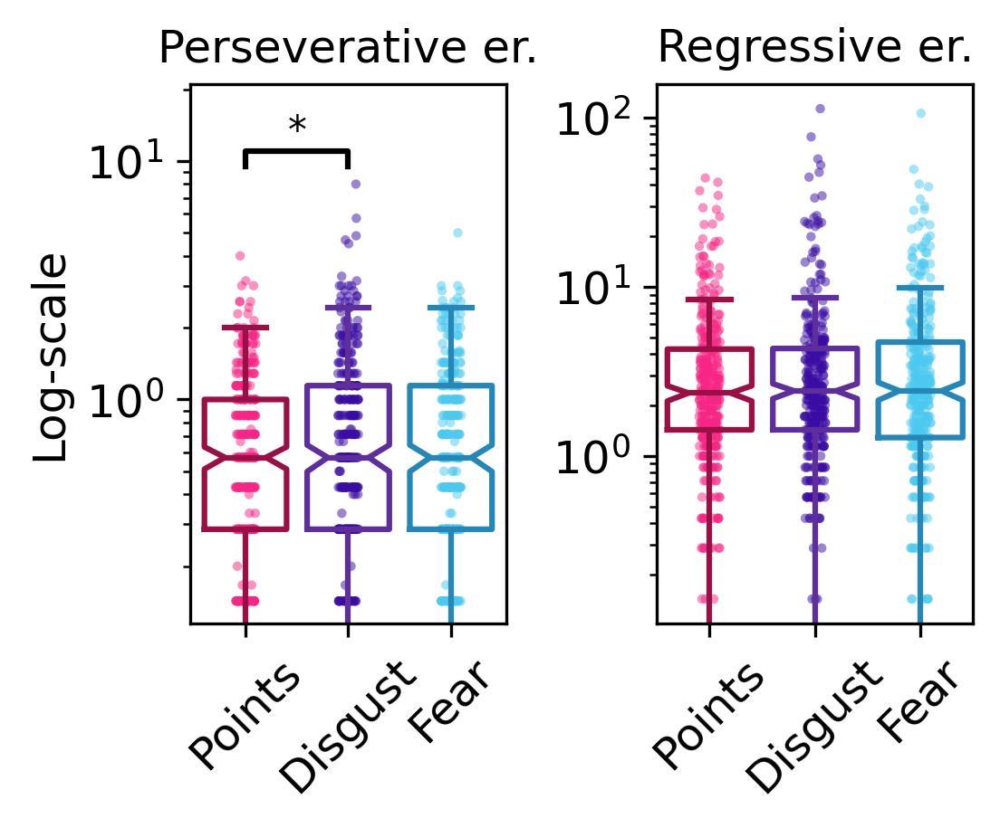
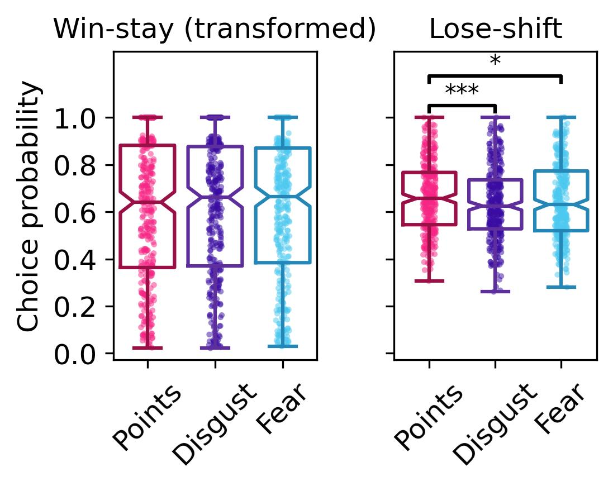
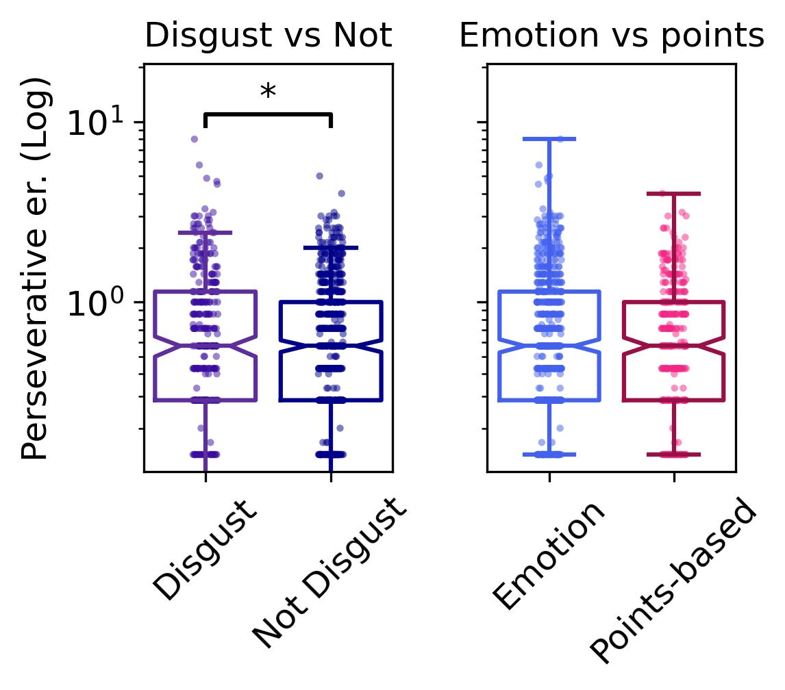
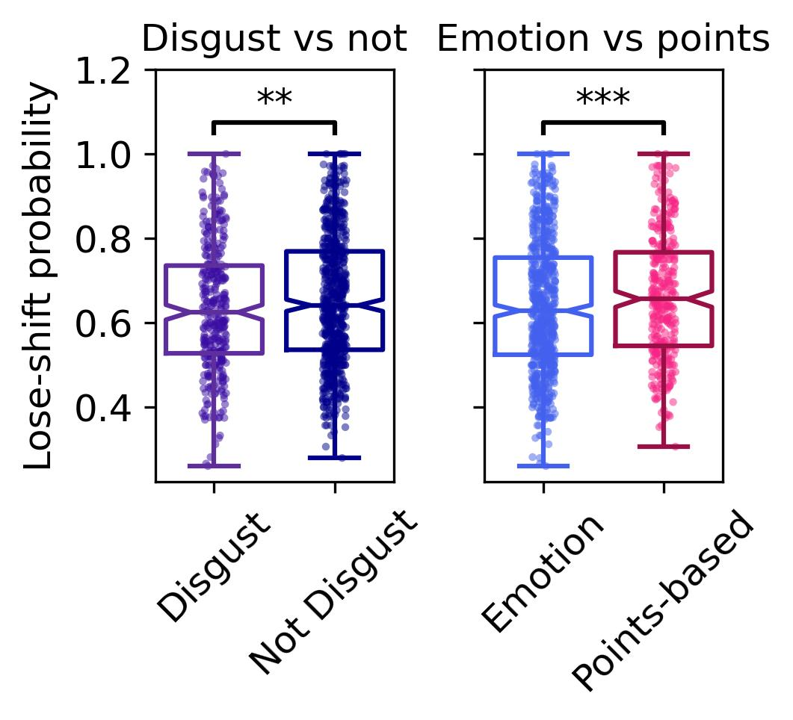

# Data visualisations


<p>

This file contains the code for the graphs included in the paper (and
supplement)
</p>

<p>

Firstly, we can use data from a randomly selected participant to show
performance on the task
</p>

<details class="code-fold">
<summary>Code</summary>

``` python
complete_task=pd.read_csv(r"U:\Documents\Disgust learning project\github\disgust_reversal_learning-final\csvs\complete_task_excluded.csv")
sub_df=complete_task[complete_task.participant_no==56]
block_df=sub_df[sub_df.block_no==0].reset_index()

plt.figure(figsize=(4, 3)) 
plt.rcParams['font.size'] = 12
plt.plot(block_df.correct_stim, color="#4CC9F0")
plt.plot(block_df.stim_selected, 'o', color="#3A0CA3", markersize=3.5)
plt.xlabel('Trial number')
plt.yticks([0,1], ['Fractal A', 'Fractal B'])
plt.savefig('ReversalLearning_individual_plot.jpeg', dpi=300, bbox_inches='tight')
```

</details>



<b>Now, we can make hypothesis testing plots</b>
<p>

<b>Firstly, we plot models 1 and 2 (regressive and perseverative
errors)</b>
</p>

<details class="code-fold">
<summary>Code</summary>

``` python
fig, axes = plt.subplots(1,2, sharey=False)
fig.tight_layout(pad=3)
#fig.set_size_inches(8.3, 5.8)
fig.set_size_inches(3.7, 2.7)
plt.rcParams['font.size'] = 12  

##plot hypothesised results
palette = ["#F72585", "#3A0CA3", "#4CC9F0"]
dark_palette = ["#9B0F47", "#5E2E9D", "#2487B8"]

sns.stripplot(data=task_summary, x="block_type", y="mean_perseverative_er", ax=axes[0], palette=palette, alpha=.5, jitter=True, marker='.', order=['Points', 'Disgust', 'Fear'], zorder=1)
sns.boxplot(data=task_summary, x="block_type", y="mean_perseverative_er",  ax=axes[0], palette=dark_palette, fill=False, showfliers=False, notch=True, order=['Points', 'Disgust', 'Fear'], zorder=2)
#sns.pointplot(data=task_summary, x="block_type", y="mean_perseverative_er",  ax=axes[0], marker="D", color='black', errorbar=None, linestyle='none', markersize=4, order=['Points', 'Disgust', 'Fear'], zorder=3)

fear_annot, points_annot, pointsFear_annot = pVal_annot('persEr')
if fear_annot != 'NonSig':
    x1, x2 = 1, 2  
    y, h, col = task_summary["mean_perseverative_er"].max() + 15, 5, 'black'  
    axes[0].plot([x1, x1, x2, x2], [y, y+h, y+h, y], lw=1.5, c=col)  
    axes[0].text((x1+x2)*.5, y+h, fear_annot, ha='center', va='bottom', color=col)  
if points_annot != 'NonSig':
    x1, x2 = 0, 1  
    y, h, col = task_summary["mean_perseverative_er"].max() + 1.5, 1.5, 'black'  
    axes[0].plot([x1, x1, x2, x2], [y, y+h, y+h, y], lw=1.5, c=col)  
    axes[0].text((x1+x2)*.5, y+h, points_annot, ha='center', va='bottom', color=col, fontsize=10) 
if pointsFear_annot != 'NonSig':
    x1, x2 = 0, 2  
    y, h, col = df["LR"].max() + 1.5, 1.5, 'black'  
    axes[0].plot([x1, x1, x2, x2], [y, y+h, y+h, y], lw=1.5, c=col)  
    axes[0].text((x1+x2)*.5, y+h, pointsFear_annot, ha='center', va='bottom', color=col, fontsize=15) 

axes[0].set_xlabel("")
#axes[0].set_ylabel("Mean perseverative errors per reversal (log-scale)") 
axes[0].set_ylabel("Log-scale") 
axes[0].set_xticklabels(axes[0].get_xticklabels(), rotation=45)
axes[0].set_title("Perseverative er.", fontsize=12)
axes[0].set_yscale('log')
axes[0].set_ylim(top=y+h+10)

##REGRESSIVE ERRORS
sns.stripplot(data=task_summary, x="block_type", y="mean_regressive_er", ax=axes[1], palette=palette, alpha=.5, jitter=True, marker='.', order=['Points', 'Disgust', 'Fear'], zorder=1)
sns.boxplot(data=task_summary, x="block_type", y="mean_regressive_er",  ax=axes[1], palette=dark_palette, fill=False, showfliers=False, notch=True, order=['Points', 'Disgust', 'Fear'], zorder=2)
#sns.pointplot(data=task_summary, x="block_type", y="mean_regressive_er",  ax=axes[1], marker="D", color='black', errorbar=None, linestyle='none', markersize=5, order=['Points', 'Disgust', 'Fear'], zorder=3)
axes[1].set_xlabel("")
axes[1].set_xticklabels(axes[1].get_xticklabels(), rotation=45)
#axes[1].set_ylabel("Mean regressive errors per reversal (log-scale)") 
axes[1].set_ylabel("") 
axes[1].set_title("Regressive er.", fontsize=12)
axes[1].set_yscale('log')

fear_annot, points_annot, pointsFear_annot = pVal_annot('regEr')
if fear_annot != 'NonSig':
    x1, x2 = 1, 2  
    y, h, col = task_summary["mean_regressive_er"].max() + 0.5, 0.2, 'black'  
    axes[1].plot([x1, x1, x2, x2], [y, y+h, y+h, y], lw=1.5, c=col)  
    axes[1].text((x1+x2)*.5, y+h, fear_annot, ha='center', va='bottom', color=col)  
if points_annot != 'NonSig':
    x1, x2 = 0, 1  
    y, h, col = task_summary["mean_regressive_er"].max() + 0.075, 0.05, 'black'  
    axes[1].plot([x1, x1, x2, x2], [y, y+h, y+h, y], lw=1.5, c=col)  
    axes[1].text((x1+x2)*.5, y+h, points_annot, ha='center', va='bottom', color=col) 
if pointsFear_annot != 'NonSig':
    x1, x2 = 0, 2  
    y, h, col = df["LR"].max() + 1.5, 1.5, 'black'  
    axes[1].plot([x1, x1, x2, x2], [y, y+h, y+h, y], lw=1.5, c=col)  
    axes[1].text((x1+x2)*.5, y+h, pointsFear_annot, ha='center', va='bottom', color=col, fontsize=10) 
plt.savefig('ReversaLearning_PerseverativeRegressive.jpeg', dpi=300, bbox_inches='tight')
```

</details>


<p>

<b>Next, create the same plot for win-stay/lose-shift analyses</b>
</p>

<details class="code-fold">
<summary>Code</summary>

``` python
fig, axes = plt.subplots(1,2, sharey=True)
fig.tight_layout(pad=3)
#fig.set_size_inches(8.3, 5.8)
fig.set_size_inches(3.7, 2.5)
plt.rcParams['font.size'] = 12

##plot hypothesised results
palette = ["#F72585", "#3A0CA3", "#4CC9F0"]
dark_palette = ["#9B0F47", "#5E2E9D", "#2487B8"]

#tests were run on transformed variable - so will plot the transformed variable
pt=PowerTransformer(method='yeo-johnson', standardize=False)
skl_yeojohnson=pt.fit(pd.DataFrame(task_summary.win_stay))
skl_yeojohnson=pt.transform(pd.DataFrame(task_summary.win_stay))
task_summary['win_stay_transformed'] = pt.transform(pd.DataFrame(task_summary.win_stay))
task_summary['win_stay_transformed']=task_summary['win_stay_transformed']/np.max(task_summary['win_stay_transformed'])

sns.stripplot(data=task_summary, x="block_type", y="win_stay_transformed", ax=axes[0], palette=palette, alpha=.5, jitter=True, marker='.', order=['Points', 'Disgust', 'Fear'], zorder=1)
sns.boxplot(data=task_summary, x="block_type", y="win_stay_transformed",  ax=axes[0], palette=dark_palette, fill=False, showfliers=False, notch=True, order=['Points', 'Disgust', 'Fear'], zorder=2)
#sns.pointplot(data=task_summary, x="block_type", y="win_stay_transformed",  ax=axes[0], marker="D", color='black', errorbar=None, linestyle='none', markersize=5, order=['Points', 'Disgust', 'Fear'], zorder=3)

fear_annot, points_annot, pointsFear_annot = pVal_annot('winStay')
if fear_annot != 'NonSig':
    x1, x2 = 1, 2  
    y, h, col = task_summary["win_stay_transformed"].max() + 0.2, 0.1, 'black'  
    axes[0].plot([x1, x1, x2, x2], [y, y+h, y+h, y], lw=1.5, c=col)  
    axes[0].text((x1+x2)*.5, y+h, fear_annot, ha='center', va='bottom', color=col)  
if points_annot != 'NonSig':
    x1, x2 = 0, 1  
    y, h, col = task_summary["win_stay_transformed"].max() + 0.5, 0.025, 'black'  
    axes[0].plot([x1, x1, x2, x2], [y, y+h, y+h, y], lw=1.5, c=col)  
    axes[0].text((x1+x2)*.5, y+h, points_annot, ha='center', va='bottom', color=col) 
if pointsFear_annot != 'NonSig':
    x1, x2 = 0, 2  
    y, h, col = task_summary["win_stay_transformed"].max() + 1.5, 1.5, 'black'  
    axes[0].plot([x1, x1, x2, x2], [y, y+h, y+h, y], lw=1.5, c=col)  
    axes[0].text((x1+x2)*.5, y+h, pointsFear_annot, ha='center', va='bottom', color=col, fontsize=10) 

axes[0].set_xlabel("")
axes[0].set_ylabel("") 
axes[0].set_ylabel("Choice probability") 
axes[0].set_xticklabels(axes[0].get_xticklabels(), rotation=45, fontsize=12)
axes[0].set_yticks([0, 0.2, 0.4, 0.6, 0.8, 1])
axes[0].set_title("Win-stay (transformed)", fontsize=12)
axes[0].set_ylim(top=1.28)

sns.stripplot(data=task_summary, x="block_type", y="lose_shift", ax=axes[1], palette=palette, alpha=.5, jitter=True, marker='.', order=['Points', 'Disgust', 'Fear'], zorder=1)
sns.boxplot(data=task_summary, x="block_type", y="lose_shift",  ax=axes[1], palette=dark_palette, fill=False, showfliers=False, notch=True, order=['Points', 'Disgust', 'Fear'], zorder=2)
#sns.pointplot(data=task_summary, x="block_type", y="lose_shift",  ax=axes[1], marker="D", color='black', errorbar=None, linestyle='none', markersize=5, order=['Points', 'Disgust', 'Fear'], zorder=3)
axes[1].set_xlabel("")
axes[1].set_xticklabels(axes[1].get_xticklabels(), rotation=45)
axes[1].set_ylabel("") 
axes[1].set_title("Lose-shift", fontsize=12)


fear_annot, points_annot, pointsFear_annot = pVal_annot('loseShift')
if fear_annot != 'NonSig':
    x1, x2 = 1, 2  
    y, h, col = task_summary["lose_shift"].max() + 0.2, 0.05, 'black'  
    axes[1].plot([x1, x1, x2, x2], [y, y+h, y+h, y], lw=1.5, c=col)  
    axes[1].text((x1+x2)*.5, y+h, fear_annot, ha='center', va='bottom', color=col)  
if points_annot != 'NonSig':
    x1, x2 = 0, 1  
    y, h, col = task_summary["lose_shift"].max() + 0.025, 0.025, 'black'  
    axes[1].plot([x1, x1, x2, x2], [y, y+h, y+h, y], lw=1.5, c=col)  
    axes[1].text((x1+x2)*.5, y+h, points_annot, ha='center', va='bottom', color=col, fontsize=10) 
if pointsFear_annot != 'NonSig':
    x1, x2 = 0, 2  
    y, h, col = task_summary["lose_shift"].max() + 0.15, 0.025, 'black'  
    axes[1].plot([x1, x1, x2, x2], [y, y+h, y+h, y], lw=1.5, c=col)  
    axes[1].text((x1+x2)*.5, y+h, pointsFear_annot, ha='center', va='bottom', color=col, fontsize=10) 

#axes[1].set_ylim(top=y+h+0.05)
plt.savefig('ReversaLearning_winStayLoseShift.jpeg', dpi=300, bbox_inches='tight')
```

</details>



<p>

We also tested whether the effects of feedback-type in perseverative
error and lose-shift analyses are better explained by a difference
between disgust and other types or learning or a more general difference
between emotional (fear/disgust) and non-emotional learning
</p>

<p>

For perseverative errors:
</p>

<details class="code-fold">
<summary>Code</summary>

``` python
task_summary.loc[task_summary['block_type']=='Disgust', 'disgustOrNot']='Disgust'
task_summary.loc[task_summary['block_type']!='Disgust', 'disgustOrNot']='Not'
task_summary.loc[task_summary['block_type']=='Points', 'emotionOrNot']='Not'
task_summary.loc[task_summary['block_type']!='Points', 'emotionOrNot']='Emotion'

emotionDisgust_pvals=pd.read_csv("../pvals/disgustEmotion_regEr_pvalsForPlotting.csv")
disgustOrNot_pval=float(emotionDisgust_pvals[emotionDisgust_pvals.model=='disgustOrNot'].pvals)
if disgustOrNot_pval < 0.001:
    disgustOrNot_annot='***'
elif disgustOrNot_pval <0.01:
    disgustOrNot_annot='**'
elif disgustOrNot_pval <0.05:
    disgustOrNot_annot='*'
else:
    disgustOrNot_annot='NonSig'

emotionOrNot_pval=float(emotionDisgust_pvals[emotionDisgust_pvals.model=='emotionOrNot'].pvals)
if emotionOrNot_pval < 0.001:
    emotionOrNot_annot='***'
elif emotionOrNot_pval <0.01:
    emotionOrNot_annot='**'
elif emotionOrNot_pval <0.05:
    emotionOrNot_annot='*'
else:
    emotionOrNot_annot='NonSig'
        

fig, axes = plt.subplots(1,2, sharey=True)
fig.tight_layout(pad=3)
#fig.set_size_inches(8.3, 5.8)
fig.set_size_inches(3.7, 2.7)
plt.rcParams['font.size'] = 12   # <-- make everything smaller

disgust_not_palette=["#5E2E9D", "#00008B"]
emotion_not_palette=["#4361EE", "#9B0F47"]

disgust_not_light=["#3A0CA3", "#00008B"]
emotion_not_light=["#4361EE", "#F72585"]

sns.stripplot(data=task_summary, x="disgustOrNot", y="mean_perseverative_er", ax=axes[0], palette=disgust_not_light, alpha=.5, jitter=True, marker='.', zorder=1)
sns.boxplot(data=task_summary, x="disgustOrNot", y="mean_perseverative_er", ax=axes[0], palette=disgust_not_palette, fill=False, showfliers=False, notch=True, zorder=2)
#sns.pointplot(data=task_summary, x="disgustOrNot", y="mean_perseverative_er", ax=axes[0], marker="D", color='black', errorbar=None, linestyle='none', markersize=4, zorder=3)
axes[0].set_xlabel("")
axes[0].set_xticklabels(['Disgust', 'Not Disgust'], rotation=45)
axes[0].set_ylabel("Perseverative er. (Log)") 
axes[0].set_title("Disgust vs Not", fontsize=12)
axes[0].set_yscale('log')

sns.stripplot(data=task_summary, x="emotionOrNot", y="mean_perseverative_er", ax=axes[1], palette=emotion_not_light, alpha=.5, jitter=True, marker='.', zorder=1)
sns.boxplot(data=task_summary, x="emotionOrNot", y="mean_perseverative_er", ax=axes[1],palette=emotion_not_palette, fill=False, showfliers=False, notch=True, zorder=2)
#sns.pointplot(data=task_summary, x="emotionOrNot", y="mean_perseverative_er", ax=axes[1], marker="D", color='black', errorbar=None, linestyle='none', markersize=4, zorder=3)


if disgustOrNot_annot != 'NonSig':
    x1, x2 = 0, 1  
    y, h, col = task_summary["mean_perseverative_er"].max() +1.5, 1.5, 'black'  
    axes[0].plot([x1, x1, x2, x2], [y, y+h, y+h, y], lw=1.5, c=col)  
    axes[0].text((x1+x2)*.5, y+h, disgustOrNot_annot, ha='center', va='bottom', color=col) 
if emotionOrNot_annot != 'NonSig':
    x1, x2 = 0, 1  
    y, h, col = task_summary["mean_perseverative_er"].max() +1.5, 1.5, 'black'  
    axes[1].plot([x1, x1, x2, x2], [y, y+h, y+h, y], lw=1.5, c=col)  
    axes[1].text((x1+x2)*.5, y+h, emotionOrNot_annot, ha='center', va='bottom', color=col) 

axes[1].set_xlabel("")
axes[1].set_xticklabels(['Emotion', 'Points-based'], rotation=45)
axes[1].set_ylabel("") 
axes[1].set_title("Emotion vs points", fontsize=12)
axes[1].set_yscale('log')
axes[0].set_ylim(top=y+h+10)
plt.savefig('ReversaLearning_DisgustNotEmotionNot_persEr.jpeg', dpi=300, bbox_inches='tight')
```

</details>



<p>

For lose-shift probability:

<details class="code-fold">
<summary>Code</summary>

``` python
emotionDisgust_pvals=pd.read_csv("../pvals/disgustEmotion_loseShift_pvalsForPlotting.csv")
disgustOrNot_pval=float(emotionDisgust_pvals[emotionDisgust_pvals.model=='disgustOrNot'].pvals)
emotionOrNot_pval=float(emotionDisgust_pvals[emotionDisgust_pvals.model=='emotionOrNot'].pvals)

if disgustOrNot_pval < 0.001:
    disgustOrNot_annot='***'
elif disgustOrNot_pval <0.01:
    disgustOrNot_annot='**'
elif disgustOrNot_pval <0.05:
    disgustOrNot_annot='*'
else:
    disgustOrNot_annot='NonSig'


if emotionOrNot_pval < 0.001:
    emotionOrNot_annot='***'
elif emotionOrNot_pval <0.01:
    emotionOrNot_annot='**'
elif emotionOrNot_pval <0.05:
    emotionOrNot_annot='*'
else:
    emotionOrNot_annot='NonSig'
        

fig, axes = plt.subplots(1,2, sharey=True)
fig.tight_layout(pad=3)
#fig.set_size_inches(8.3, 5.8)
fig.set_size_inches(3.25, 2.5)
plt.rcParams['font.size'] = 12   

disgust_not_palette=["#5E2E9D", "#00008B"]
emotion_not_palette=["#4361EE", "#9B0F47"]

disgust_not_light=["#3A0CA3", "#00008B"]
emotion_not_light=["#4361EE", "#F72585"]

sns.stripplot(data=task_summary, x="disgustOrNot", y="lose_shift", ax=axes[0], palette=disgust_not_light, alpha=.5, jitter=True, marker='.', zorder=1)
sns.boxplot(data=task_summary, x="disgustOrNot", y="lose_shift", ax=axes[0], palette=disgust_not_palette, fill=False, showfliers=False, notch=True, zorder=2)
#sns.pointplot(data=task_summary, x="disgustOrNot", y="lose_shift", ax=axes[0], marker="D", color='black', errorbar=None, linestyle='none', markersize=4, zorder=3)
axes[0].set_xlabel("")
axes[0].set_xticklabels(['Disgust', 'Not Disgust'], rotation=45)
axes[0].set_ylabel("Lose-shift probability", labelpad=5) 
axes[0].set_title("Disgust vs not", fontsize=12)
axes[0].set_ylim(top=1.2)

sns.stripplot(data=task_summary, x="emotionOrNot", y="lose_shift", ax=axes[1], palette=emotion_not_light, alpha=.5, jitter=True, marker='.', zorder=1)
sns.boxplot(data=task_summary, x="emotionOrNot", y="lose_shift", ax=axes[1],palette=emotion_not_palette, fill=False, showfliers=False, notch=True, zorder=2)
#sns.pointplot(data=task_summary, x="emotionOrNot", y="lose_shift", ax=axes[1],marker="D", color='black', errorbar=None, linestyle='none', markersize=4, zorder=3)
axes[1].set_xlabel("")
axes[1].set_xticklabels(['Emotion', 'Points-based'], rotation=45)
axes[1].set_ylabel("") 
axes[1].set_title("Emotion vs points", fontsize=12)

if disgustOrNot_annot != 'NonSig':
    x1, x2 = 0, 1  
    y, h, col = task_summary["lose_shift"].max() +0.05, 0.025, 'black'  
    axes[0].plot([x1, x1, x2, x2], [y, y+h, y+h, y], lw=1.5, c=col)  
    axes[0].text((x1+x2)*.5, y+h, disgustOrNot_annot, ha='center', va='bottom', color=col) 
if emotionOrNot_annot != 'NonSig':
    x1, x2 = 0, 1  
    y, h, col = task_summary["lose_shift"].max() +0.05, 0.025, 'black'  
    axes[1].plot([x1, x1, x2, x2], [y, y+h, y+h, y], lw=1.5, c=col)  
    axes[1].text((x1+x2)*.5, y+h, emotionOrNot_annot, ha='center', va='bottom', color=col) 
plt.savefig('ReversaLearning_DisgustNotEmotionNot_loseShift.jpeg', dpi=300, bbox_inches='tight')
```

</details>



<h3>

4.  Examining the nature of outliers in the perseverative error outcome
    </h3>

    <p>

    The perseverative error outcome in the hypothesis testing model
    seemed to be quite dependent on outliers. Therefore, here we assess
    the nature of those outliers:
    <p>

    a- to determine whether they are ‘true’ outliers (i.e., due to
    inattention etc.) resulting in alterations in task performance
    across all metrics
    </p>

    <p>

    b- to determine whether these outliers performed differently on the
    video rating task (e.g., were they more disgusted, leading to their
    altered task performance?)

<details class="code-fold">
<summary>Code</summary>

``` python
fig, axes = plt.subplots(2,1, sharex=False, gridspec_kw={'height_ratios': [1.5, 1]})
fig.tight_layout(pad=1)
#fig.set_size_inches(8.3, 5.8)
fig.set_size_inches(3.7, 3.25)
plt.rcParams['font.size'] = 12   

colorA="#9B0F47" #dark pink
colorB="#3A0CA3" #darker purple
colorC="#CBC3E3" #light purple


##identify the outliers in the perseverative error outcome
Q1 = task_summary['mean_perseverative_er'].quantile(0.25)
Q3 = task_summary['mean_perseverative_er'].quantile(0.75)
IQR = Q3 - Q1
lower_bound = Q1- 1.5 *  IQR
upper_bound = Q3 + 1.5 *  IQR
if lower_bound < min(task_summary.mean_perseverative_er):
    lower_bound = min(task_summary.mean_perseverative_er)
outliers=task_summary[(task_summary['mean_perseverative_er']<lower_bound) | (task_summary['mean_perseverative_er']>upper_bound )]

bin_width=np.ptp(task_summary.mean_perseverative_er)/35
bins=np.arange(min(task_summary.mean_perseverative_er), max(task_summary.mean_perseverative_er) + bin_width, bin_width)

sns.histplot(data=task_summary, bins=bins, x="mean_perseverative_er", color=colorC, ax=axes[0]) 
sns.histplot(data=outliers, bins=bins,
x="mean_perseverative_er", color=colorA, zorder=2, ax=axes[0]) 

axes[0].axvline(lower_bound, color=colorB, linestyle='dashed', linewidth=1.5, label='Lower Bound')
axes[0].axvline(upper_bound, color=colorB, linestyle='dashed', linewidth=1.5, label='Upper Bound')
axes[0].set_xlabel('Mean perseverative errors per reversal')
print("Number of outliers ="+str(len(outliers)))

axes[0].set_xlabel('')
axes[0].set_ylabel('')
axes[0].set_title('Perseverative er.', fontsize=12)
axes[0].tick_params(axis='x', which='both', bottom=False, top=False, labelbottom=False)
axes[0].set_yticks([])
#axes[0].set_ylim(top=100)

#percentage coorrect
Q1 = task_summary['percentage_correct'].quantile(0.25)
Q3 = task_summary['percentage_correct'].quantile(0.75)
IQR = Q3 - Q1
lower_bound = Q1- 1.5 *  IQR
upper_bound = Q3 + 1.5 *  IQR
bin_width=np.ptp(task_summary.percentage_correct)/25
bins=np.arange(min(task_summary.percentage_correct), max(task_summary.percentage_correct) + bin_width, bin_width)
sns.histplot(data=task_summary, x="percentage_correct", color=colorC, bins=bins, ax=axes[1]) 
sns.histplot(data=outliers, x="percentage_correct", bins=bins, color=colorA, ax=axes[1]) 
axes[1].axvline(lower_bound, color=colorB, linestyle='dashed', linewidth=1.5, label='Lower Bound')
axes[1].axvline(upper_bound, color=colorB, linestyle='dashed', linewidth=1.5,  label='Upper Bound')
axes[1].set_xlabel('')
axes[1].set_ylabel('')
axes[1].set_title('Percentage correct', fontsize=12)
axes[1].set_ylim(top=50)
axes[1].tick_params(axis='x', which='both', bottom=False, top=False, labelbottom=False)
axes[1].set_yticks([])

plt.savefig('Exploratory_ReversaLearning_PerseverativeOutliers.jpeg', dpi=300, bbox_inches='tight')
```

</details>

    Number of outliers =37


