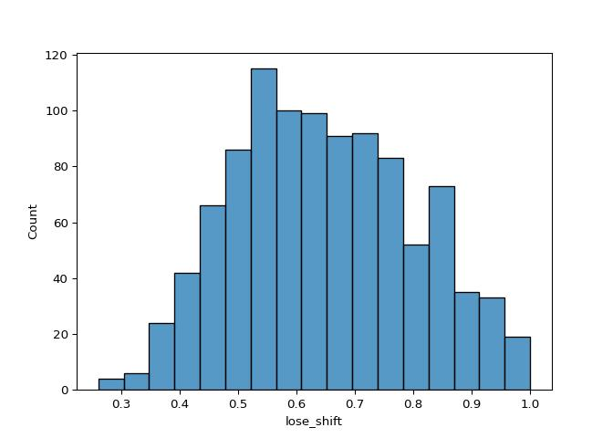

# Model 4: lose shift probability ~ feedback type


<p>

This file contains all model-agnostic tests run to test the effect of
feedback type (fear, disgust, points) on lose-shift probability.
</p>

<br> Includes:
<p>

- initial skew assessment
- initial hypothesis testing mixed effects model
- assessment of assumptions of this model
- assessing whether adding video-ratings differences (identified in
  video-rating analyses) moderates results
- sensitivity analysis
- final conclusions

</p>

<h3>

Load in packages and data- in python and in r
</h3>

<details class="code-fold">
<summary>Code</summary>

``` python
import numpy as np
import pandas as pd
import matplotlib.pyplot as plt
import seaborn as sns
import scipy.stats as stats
import jsonlines
from functools import reduce
import statistics
import scipy.stats
import seaborn as sns
import math
import os
import json
import ast
import statsmodels.api as sm
import statsmodels.formula.api as smf
import pingouin as pg
import warnings
from scipy.stats import ttest_rel
#from statannotations.Annotator import Annotator
from scipy.stats import skew
from statsmodels.stats.diagnostic import het_white
from sklearn.preprocessing import PowerTransformer
import statannot
from scipy.stats import ttest_ind
import itertools

warnings.simplefilter(action='ignore', category=FutureWarning)
pd.options.mode.copy_on_write = True

task_summary=pd.read_csv("U:/Documents/Disgust learning project/github/disgust_reversal_learning-final/csvs/dem_vids_task_excluded.csv")

pvals_file = 'pvals/pvalsForPlotting.xlsx'
```

</details>

<details class="code-fold">
<summary>Code</summary>

``` r
library(tidyverse, quietly=TRUE)
library(lme4)
library(emmeans)
library(DHARMa)

task_summary <- read.csv("U:/Documents/Disgust learning project/github/disgust_reversal_learning-final/csvs/dem_vids_task_excluded.csv")

pvals_file = 'pvals/pvalsForPlotting.xlsx'
```

</details>

<br>
<h3>

The lose-shift variable is not skewed
</h3>

<p>

So no skewness transformation is required.
</p>

<details class="code-fold">
<summary>Code</summary>

``` python
sns.histplot(data=task_summary, x="lose_shift") 
print('lose-shift  skew: '+str(skew(task_summary.lose_shift, nan_policy='omit')))
```

</details>

    lose-shift  skew: 0.16189569452640257



<h3>

<b>Hypothesis testing</b>
</h3>

<p>

In this case, the basic model (no random slopes or random intercepts)
with an age covariate produced the best fit (indexed by BIC scores).

<details class="code-fold">
<summary>Code</summary>

``` python
data=task_summary
formula = 'lose_shift ~ block_type'
basic_model=smf.mixedlm(formula, data, groups=data['participant_no'], missing='drop').fit(reml=False)

#test which random effects to include
#feedback_randint=smf.mixedlm(formula, data, groups=data['participant_no'], missing='drop', vc_formula={'feedback_details': '0+feedback_details'}).fit(reml=False)
#fractals_randint=smf.mixedlm(formula, data, groups=data['participant_no'], missing='drop', vc_formula={'fractals': '0+fractals'}).fit(reml=False)
#feedback_fractals_randint=smf.mixedlm(formula, data, groups=data['participant_no'], missing='drop', vc_formula={"feedback_details": "0 + feedback_details", "fractals": "0 + fractals"}).fit(reml=False)
        #had to comment out because it does not converge and errors out

#randslope=smf.mixedlm(formula, data, groups=data['participant_no'], missing='drop', re_formula='~block_type').fit(reml=False)
#feedback_randint_randslope=smf.mixedlm(formula, data, groups=data['participant_no'], missing='drop', vc_formula={'feedback_details': '0+feedback_details'}, re_formula='~block_type').fit(reml=False)
#feedback_fractals_randint_randslope=smf.mixedlm(formula, data, groups=data['participant_no'], missing='drop', vc_formula={'feedback_details': '0+feedback_details', "fractals": "0 + fractals"}, re_formula='~block_type').fit(reml=False)


bic=pd.DataFrame({'basic_model': [basic_model.bic], 
                  #  'feedback_randint': ['CONVERGENCE WARNING'], 
                  #  'fractals_randint': ['CONVERGENCE WARNING'],
                  #  'feedback_fractals_randint': ['CONVERGENCE WARNING'], 
                  #  'randslope': ['CONVERGENCE WARNING'],
                  #  'feedback_randint_randslope':['CONVERGENCE WARNING'],
                   # 'feedback_fractals_randint_randslope': ['NOT CONVERGED']
                    })
win1=bic.sort_values(by=0, axis=1).columns[0]

##test which covariates to add -- Using the random effects which were best above (basic model in this case)
no_covariate=smf.mixedlm(formula, data, groups=data['participant_no'], missing='drop').fit(reml=False)
sex_covariate=smf.mixedlm(formula+str('+prolific_sex'), data, groups=data['participant_no'], missing='drop').fit(reml=False)
age_covariate=smf.mixedlm(formula+str('+prolific_age'), data, groups=data['participant_no'], missing='drop').fit(reml=False)
digit_span_covariate=smf.mixedlm(formula+str('+digit_span'), data, groups=data['participant_no'], missing='drop').fit(reml=False)
sex_age_covariate=smf.mixedlm(formula+str('+prolific_sex+prolific_age'), data, groups=data['participant_no'], missing='drop').fit(reml=False)
sex_digit_span_covariate=smf.mixedlm(formula+str('+prolific_sex+digit_span'), data, groups=data['participant_no'], missing='drop').fit(reml=False)
digit_span_age_covariate=smf.mixedlm(formula+str('+digit_span+prolific_age'), data, groups=data['participant_no'], missing='drop').fit(reml=False)
sex_age_digit_span_covariate=smf.mixedlm(formula+str('+prolific_sex+prolific_age+digit_span'), data, groups=data['participant_no'], missing='drop').fit(reml=False)

bic=pd.DataFrame({'no_covariate': [no_covariate.bic], 
                    'sex_covariate': [sex_covariate.bic], 
                    'age_covariate': [age_covariate.bic],
                    'digit_span_covariate': [digit_span_covariate.bic],
                    'sex_age_covariate': [sex_age_covariate.bic],
                    'sex_digit_span_covariate': [sex_digit_span_covariate.bic],
                    'digit_span_age_covariate': [digit_span_age_covariate.bic],
                    'sex_age_digit_span_covariate': [sex_age_digit_span_covariate.bic]})
win2=bic.sort_values(by=0, axis=1).columns[0]
print("Winning models: "+ win1 +" "+ win2)
```

</details>

    Winning models: basic_model age_covariate

<p>

Shapiro-Wilk test of normality of residuals
</p>

<details class="code-fold">
<summary>Code</summary>

``` python
#chosen model
results=age_covariate

#shapiro-Wilk test of normality of residuals
labels = ["Statistic", "p-value"]
norm_res = stats.shapiro(results.resid)

for key, val in dict(zip(labels, norm_res)).items():
    print(key, val)
```

</details>

    Statistic 0.9982479633219511
    p-value 0.3850884723504157

<details class="code-fold">
<summary>Code</summary>

``` python
    ##if test is significant then the assumption is violated
        #is significant here
```

</details>

<p>

White Lagrange multiplier Test for Heteroscedasticity
</p>

<details class="code-fold">
<summary>Code</summary>

``` python
#chosen model
##homoskedasticity of variance 
#White Lagrange Multiplier Test for Heteroscedasticity
het_white_res = het_white(results.resid, results.model.exog)

labels = ["LM Statistic", "LM-Test p-value", "F-Statistic", "F-Test p-value"]

for key, val in dict(zip(labels, het_white_res)).items():
    print(key, val)
```

</details>

    LM Statistic 7.570756342605051
    LM-Test p-value 0.2712665370232391
    F-Statistic 1.2625040586135379
    F-Test p-value 0.27200186565647244

<details class="code-fold">
<summary>Code</summary>

``` python
    ##again, only violated if you get a significant p value
```

</details>

<p>

This model showed a <b>significant effect of feedback-type on lose-shift
probability</b>
</p>

<p>

Specifically, the points block had a significantly higher lose-shift
probability than the disgust-block.
</p>

<p>

There is also a significant effect of age on lose-shift probability.
</p>

``` python
data=task_summary
formula = 'lose_shift ~ block_type + prolific_age'
results=smf.mixedlm(formula, data, groups=data['participant_no'], missing='drop').fit(reml=False)
print(results.summary())
```

                Mixed Linear Model Regression Results
    ==============================================================
    Model:              MixedLM   Dependent Variable:   lose_shift
    No. Observations:   1020      Method:               ML        
    No. Groups:         340       Scale:                0.0089    
    Min. group size:    3         Log-Likelihood:       665.0506  
    Max. group size:    3         Converged:            Yes       
    Mean group size:    3.0                                       
    --------------------------------------------------------------
                         Coef. Std.Err.   z    P>|z| [0.025 0.975]
    --------------------------------------------------------------
    Intercept            0.578    0.023 25.522 0.000  0.533  0.622
    block_type[T.Fear]   0.011    0.007  1.467 0.142 -0.004  0.025
    block_type[T.Points] 0.027    0.007  3.743 0.000  0.013  0.041
    prolific_age         0.001    0.000  2.736 0.006  0.000  0.002
    Group Var            0.014    0.017                           
    ==============================================================

<p>

And the results remain unchanged when the age covariate is dropped:
</p>

``` python
formula = 'lose_shift ~ block_type'
results=smf.mixedlm(formula, data, groups=data['participant_no'], missing='drop').fit(reml=False)
print(results.summary())
```

                Mixed Linear Model Regression Results
    ==============================================================
    Model:              MixedLM   Dependent Variable:   lose_shift
    No. Observations:   1020      Method:               ML        
    No. Groups:         340       Scale:                0.0089    
    Min. group size:    3         Log-Likelihood:       661.3490  
    Max. group size:    3         Converged:            Yes       
    Mean group size:    3.0                                       
    --------------------------------------------------------------
                         Coef. Std.Err.   z    P>|z| [0.025 0.975]
    --------------------------------------------------------------
    Intercept            0.636    0.008 76.839 0.000  0.619  0.652
    block_type[T.Fear]   0.011    0.007  1.467 0.142 -0.004  0.025
    block_type[T.Points] 0.027    0.007  3.743 0.000  0.013  0.041
    Group Var            0.014    0.017                           
    ==============================================================

<br>
<p>

As this hypothesis test found no difference between fear and disgust, we
will compute a Bayes Factor to test the strength of the evidence for the
null
</p>

<details class="code-fold">
<summary>Code</summary>

``` python
def bayes_factor(df, dependent_var, condition_1_name, condition_2_name):
    df=df[(df.block_type==condition_1_name)| (df.block_type==condition_2_name)][[dependent_var, 'block_type', 'participant_no']]
    df.dropna(inplace=True)
    df=df.pivot(index='participant_no', columns='block_type', values=dependent_var).reset_index()
    ttest=pg.ttest(df[condition_1_name], df[condition_2_name], paired=True)
    bf_null=1/float(ttest.BF10)
    return ttest, bf_null
```

</details>

<details class="code-fold">
<summary>Code</summary>

``` python
ttest, bf_null = bayes_factor(task_summary, 'lose_shift', 'Disgust', 'Fear')
#print("Disgust vs Fear BF01: " + bf_null)

print(f"Disgust vs Fear: BF01 = {bf_null}")
```

</details>

    Disgust vs Fear: BF01 = 6.172839506172839

<p>

We also look at fear vs points (which is not directly assessed by the
model)
</p>

<details class="code-fold">
<summary>Code</summary>

``` python
ttest, bf_null = bayes_factor(task_summary, 'lose_shift', 'Points', 'Fear')

print(f"Points vs Fear: T = {ttest['T'][0]}, CI95% = {ttest['CI95%'][0]}, p = {ttest['p-val'][0]}")
```

</details>

    Points vs Fear: T = 2.344453221275527, CI95% = [0.   0.03], p = 0.019631690375740526

<p>

Although the Bayes factor is a bit ambiguous
</p>

<details class="code-fold">
<summary>Code</summary>

``` python
print(f"Points vs Fear: BF01 = {bf_null}")
```

</details>

    Points vs Fear: BF01 = 1.1013215859030836

<br>
<p>

<b>Next, we showed that this result is unchanged by the addition of
video-rating covariates.</b>
</p>

<p>

(again, the model with no additional random effects/slopes, with an age
covariate produced the best fit - but this time the model assumptions
were violated)
</p>

<details class="code-fold">
<summary>Code</summary>

``` python
formula = 'lose_shift ~ block_type + valence_diff + arousal_diff + valence_habdiff'

basic_model=smf.mixedlm(formula, data, groups=data['participant_no'], missing='drop').fit(reml=False)

#test which random effects to include
#feedback_randint=smf.mixedlm(formula, data, groups=data['participant_no'], missing='drop', vc_formula={'feedback_details': '0+feedback_details'}).fit(reml=False)
#fractals_randint=smf.mixedlm(formula, data, groups=data['participant_no'], missing='drop', vc_formula={'fractals': '0+fractals'}).fit(reml=False)
#feedback_fractals_randint=smf.mixedlm(formula, data, groups=data['participant_no'], missing='drop', vc_formula={"feedback_details": "0 + feedback_details", "fractals": "0 + fractals"}).fit(reml=False)
       

#randslope=smf.mixedlm(formula, data, groups=data['participant_no'], missing='drop', re_formula='~block_type').fit(reml=False)
#feedback_randint_randslope=smf.mixedlm(formula, data, groups=data['participant_no'], missing='drop', vc_formula={'feedback_details': '0+feedback_details'}, re_formula='~block_type').fit(reml=False)
#feedback_fractals_randint_randslope=smf.mixedlm(formula, data, groups=data['participant_no'], missing='drop', vc_formula={'feedback_details': '0+feedback_details', "fractals": "0 + fractals"}, re_formula='~block_type').fit(reml=False)


bic=pd.DataFrame({'basic_model': [basic_model.bic], 
                   # 'feedback_randint': ['CONVERGENCE WARNING'], 
                   # 'fractals_randint': ['CONVERGENCE WARNING'],
                   # 'feedback_fractals_randint': ['CONVERGENCE WARNING'], 
                   # 'randslope': ['CONVERGENCE WARNING'],
                  #  'feedback_randint_randslope':['CONVERGENCE WARNING'],
                  #  'feedback_fractals_randint_randslope': ['NOT CONVERGE']
                    })
win1=bic.sort_values(by=0, axis=1).columns[0]

##test which covariates to add -- Using the random effects which were best above 
no_covariate=smf.mixedlm(formula, data, groups=data['participant_no'], missing='drop').fit(reml=False)
sex_covariate=smf.mixedlm(formula+str('+prolific_sex'), data, groups=data['participant_no'], missing='drop').fit(reml=False)
age_covariate=smf.mixedlm(formula+str('+prolific_age'), data, groups=data['participant_no'], missing='drop').fit(reml=False)
digit_span_covariate=smf.mixedlm(formula+str('+digit_span'), data, groups=data['participant_no'], missing='drop').fit(reml=False)
sex_age_covariate=smf.mixedlm(formula+str('+prolific_sex+prolific_age'), data, groups=data['participant_no'], missing='drop').fit(reml=False)
sex_digit_span_covariate=smf.mixedlm(formula+str('+prolific_sex+digit_span'), data, groups=data['participant_no'], missing='drop').fit(reml=False)
digit_span_age_covariate=smf.mixedlm(formula+str('+digit_span+prolific_age'), data, groups=data['participant_no'], missing='drop').fit(reml=False)
sex_age_digit_span_covariate=smf.mixedlm(formula+str('+prolific_sex+prolific_age+digit_span'), data, groups=data['participant_no'], missing='drop').fit(reml=False)

bic=pd.DataFrame({'no_covariate': [no_covariate.bic], 
                    'sex_covariate': [sex_covariate.bic], 
                    'age_covariate': [age_covariate.bic],
                    'digit_span_covariate': [digit_span_covariate.bic],
                    'sex_age_covariate': [sex_age_covariate.bic],
                    'sex_digit_span_covariate': [sex_digit_span_covariate.bic],
                    'digit_span_age_covariate': [digit_span_age_covariate.bic],
                    'sex_age_digit_span_covariate': [sex_age_digit_span_covariate.bic]})
win2=bic.sort_values(by=0, axis=1).columns[0]
print("Winning models: "+ win1 +" "+ win2)
```

</details>

    Winning models: basic_model age_covariate

<p>

Shapiro-Wilk test of normality of residuals
</p>

<details class="code-fold">
<summary>Code</summary>

``` python
results=age_covariate
labels = ["Statistic", "p-value"]
norm_res = stats.shapiro(results.resid)

for key, val in dict(zip(labels, norm_res)).items():
    print(key, val)
```

</details>

    Statistic 0.9982695081190501
    p-value 0.39686218394380035

<p>

White Lagrange multiplier Test for Heteroscedasticity
</p>

<details class="code-fold">
<summary>Code</summary>

``` python
het_white_res = het_white(results.resid, results.model.exog)

labels = ["LM Statistic", "LM-Test p-value", "F-Statistic", "F-Test p-value"]

for key, val in dict(zip(labels, het_white_res)).items():
    print(key, val)
```

</details>

    LM Statistic 43.86646288220306
    LM-Test p-value 0.007907172665762914
    F-Statistic 1.8630959506774956
    F-Test p-value 0.0071939874304332374

<p>

So a generalized mixed effects model needs to be run (using R)
</p>

<p>

Model details:
<p>

- Gamma probability distribution and identity link function
- no additional random intercepts or by-participant random slopes
- no additional covariates

</p>

<p>

This is the specification that produced the best fit (according to BIC)
</p>

<details class="code-fold">
<summary>Code</summary>

``` r
##firstly we test whether model should use a gamma or inverse gaussian probability function
##and whether the link function should be identity or inverse
gamma_log <- glmer(lose_shift ~block_type + valence_diff + arousal_diff + valence_habdiff + (1|participant_no), data=task_summary, family=Gamma(link="log"))
gamma_inverse <- glmer(lose_shift ~block_type + valence_diff + arousal_diff + valence_habdiff + (1|participant_no), data=task_summary, family=Gamma(link="inverse"))
gamma_identity <- glmer(lose_shift ~block_type + valence_diff + arousal_diff + valence_habdiff + (1|participant_no), data=task_summary, family=Gamma(link="identity"))

invgaus_log <- glmer(lose_shift ~block_type + valence_diff + arousal_diff + valence_habdiff + (1|participant_no), data=task_summary, family=inverse.gaussian(link="log"))
invgaus_inverse <- glmer(lose_shift ~block_type + valence_diff + arousal_diff + valence_habdiff + (1|participant_no), data=task_summary, family=inverse.gaussian(link="inverse"))
invgaus_identity <- glmer(lose_shift ~block_type + valence_diff + arousal_diff + valence_habdiff + (1|participant_no), data=task_summary, family=inverse.gaussian(link="identity"))

bic_values <- c(
  BIC(gamma_log),
  BIC(gamma_inverse),
  BIC(gamma_identity),
  BIC(invgaus_log),
  BIC(invgaus_inverse),
  BIC(invgaus_identity)
)
model_names <- c("Gamma (log)", "Gamma (inverse)", "Gamma (identity)", "Inverse Gaussian (log)", "Inverse Gaussian (inverse)", "Inverse Gaussian (identity)")

bic_df <- data.frame(Model = model_names, BIC = bic_values)
win1 <- bic_df[which.min(bic_df$BIC), ]$Model

basic_model <- glmer(lose_shift ~ block_type + valence_diff + arousal_diff + valence_habdiff + (1|participant_no), data=task_summary, family=Gamma(link="identity"))

#feedback_randint <- glmer(lose_shift ~ block_type + valence_diff + arousal_diff + valence_habdiff + (1|participant_no) + (1|feedback_details), data=task_summary, family=Gamma(link="identity"))
fractals_randint <- glmer(lose_shift ~ block_type + valence_diff + arousal_diff + valence_habdiff + (1|participant_no) + (1|fractals), data=task_summary, family=Gamma(link="identity"))
#feedback_fractals_randint <- glmer(lose_shift ~ block_type + valence_diff + arousal_diff + valence_habdiff + (1|participant_no) + (1|fractals) + (1|feedback_details), data=task_summary, family=Gamma(link="identity"))

#randslope <- glmer(lose_shift ~ block_type + valence_diff + arousal_diff + valence_habdiff + (block_type + valence_diff + arousal_diff + valence_habdiff|participant_no), data=task_summary, family=Gamma(link="identity"))
#feedback_randint_randslope <- glmer(lose_shift ~ block_type + valence_diff + arousal_diff + valence_habdiff + (block_type + valence_diff + arousal_diff + valence_habdiff|participant_no) + (1|feedback_details), data=task_summary, family=Gamma(link="identity"))
#feedback_fractals_randint_randslope <- glmer(lose_shift ~ block_type + valence_diff + arousal_diff + valence_habdiff + (block_type + valence_diff + arousal_diff + valence_habdiff|participant_no) + (1|feedback_details) + (1|fractals), data=task_summary, family=Gamma(link="identity"))

bic_values <- c(
  BIC(basic_model),
  BIC(fractals_randint)
)
model_names <- c("basic model", "fractals_randint")

bic_df <- data.frame(Model = model_names, BIC = bic_values)
win2 <- bic_df[which.min(bic_df$BIC), ]$Model

no_covariate <- basic_model
win3 <- 'no_covariate'

print(paste0("Winning models: ", win1, " ", win2," ",win3))
```

</details>

    [1] "Winning models: Gamma (identity) basic model no_covariate"

<p>

This has <b> no effect </b> on the results

``` r
generalized_model <- glmer(lose_shift ~ block_type + valence_diff + arousal_diff + valence_habdiff + (1|participant_no), data=task_summary, family=Gamma(link="identity"))
summary(generalized_model)
```

    Generalized linear mixed model fit by maximum likelihood (Laplace
      Approximation) [glmerMod]
     Family: Gamma  ( identity )
    Formula: 
    lose_shift ~ block_type + valence_diff + arousal_diff + valence_habdiff +  
        (1 | participant_no)
       Data: task_summary

         AIC      BIC   logLik deviance df.resid 
     -1633.1  -1593.7    824.6  -1649.1     1012 

    Scaled residuals: 
         Min       1Q   Median       3Q      Max 
    -2.57848 -0.57964 -0.00125  0.55944  2.67923 

    Random effects:
     Groups         Name        Variance Std.Dev.
     participant_no (Intercept) 0.009516 0.09755 
     Residual                   0.026906 0.16403 
    Number of obs: 1020, groups:  participant_no, 340

    Fixed effects:
                       Estimate Std. Error t value Pr(>|z|)    
    (Intercept)       0.6573586  0.0126194  52.091  < 2e-16 ***
    block_typeFear    0.0085007  0.0064622   1.315    0.188    
    block_typePoints  0.0295101  0.0065569   4.501 6.78e-06 ***
    valence_diff      0.0058092  0.0061681   0.942    0.346    
    arousal_diff     -0.0003108  0.0081260  -0.038    0.969    
    valence_habdiff  -0.0039949  0.0046604  -0.857    0.391    
    ---
    Signif. codes:  0 '***' 0.001 '**' 0.01 '*' 0.05 '.' 0.1 ' ' 1

    Correlation of Fixed Effects:
                (Intr) blck_F blck_P vlnc_d arsl_d
    block_typFr -0.254                            
    blck_typPnt -0.247  0.485                     
    valence_dff  0.482 -0.004  0.001              
    arousal_dff -0.341 -0.001  0.002 -0.192       
    valnc_hbdff -0.288  0.000 -0.004 -0.353  0.137

<p>

Extract confidence intervals
</p>

``` r
print(confint.merMod(generalized_model, method='Wald'))
```

                            2.5 %     97.5 %
    .sig01                     NA         NA
    .sigma                     NA         NA
    (Intercept)       0.632625003 0.68209215
    block_typeFear   -0.004164926 0.02116628
    block_typePoints  0.016658801 0.04236148
    valence_diff     -0.006280131 0.01789852
    arousal_diff     -0.016237518 0.01561589
    valence_habdiff  -0.013129164 0.00513927

<br> <br>
<h3>

<b> Sensitivity analysis </b>
</h3>

<p>

No sensitivity analysis is required for this outcome variable, because
no values meet the criteria of being an outlier (\>1.5 IQR below LQ or
above UQ)
</p>

<details class="code-fold">
<summary>Code</summary>

``` python
#create outliers df --> removing those >1.5 IQRs above or below UQ and LQ
def replace_outliers_with_nan(df, column):
    Q1 = df[column].quantile(0.25)
    Q3 = df[column].quantile(0.75)
    IQR = Q3 - Q1
    lower_bound = Q1- 1.5 * IQR
    upper_bound = Q3 + 1.5 * IQR
    df[column]=df[column].apply(lambda x: np.nan if x<lower_bound or x>upper_bound else x)
    return df

key_outcomes=['percentage_correct', 'mean_perseverative_er', 'mean_regressive_er', 'median_till_correct', 'win_stay', 'lose_shift']
for col in key_outcomes:
    task_summary=replace_outliers_with_nan(task_summary, col)
task_summary.to_csv('sensitivity_df.csv')
sensitivity_df=task_summary

print("Number of lose-shift outliers: "+str(len(sensitivity_df[sensitivity_df.lose_shift.isna()])))
```

</details>

    Number of lose-shift outliers: 0

<h3>

<b>Exploratory analysis: emotion vs not & disgust vs not </b>
</h3>

<p>

The main hypothesis testing analyses found a difference in learning
between the points/loss-based feedback and disgust feedback.
</p>

<p>

However, no difference was found between fear and disgust outcomes and
there is some ambiguity as to whether there is a difference between
points and fear (contradictory p-values and bayes factors). This makes
interpretation difficult as we cannot determine whether the result is
better explained by a difference in learning between the two emotional
conditions and points-based learning OR a distinct feature of disgust
learning
</p>

<p>

To assess this, we run two competing models (as was done before for
perseverative errors):
<p>

- One assessing the presence of a difference between emotional learning
  (combining the fear and disgust block) and non-emotional learning (the
  points block)
- Another assessing the presence of a difference between disgust-based
  learning and learning which is not about digsust (combining the fear
  and points blocks)
  <p>

  We will use a) the presence/absence of significant results and b) the
  model fit (as indexed by BIC - as before) to guide interpretation of
  these competing models
  </p>

``` python
task_summary.loc[task_summary['block_type']=='Disgust', 'disgustOrNot']='Disgust'
task_summary.loc[task_summary['block_type']!='Disgust', 'disgustOrNot']='Not'
task_summary.loc[task_summary['block_type']=='Points', 'emotionOrNot']='Not'
task_summary.loc[task_summary['block_type']!='Points', 'emotionOrNot']='Emotion'
```

<p>

Run the hypothesis test for ‘disgust or not’ (using the same model
specification as used for the hypothesis testing analysis).
</p>

``` python
data=task_summary
formula = 'lose_shift ~ disgustOrNot + prolific_age'
disgustOrNot=smf.mixedlm(formula, data, groups=data['participant_no'], missing='drop').fit(reml=False)
print(disgustOrNot.summary())
```

                Mixed Linear Model Regression Results
    =============================================================
    Model:               MixedLM  Dependent Variable:  lose_shift
    No. Observations:    1020     Method:              ML        
    No. Groups:          340      Scale:               0.0089    
    Min. group size:     3        Log-Likelihood:      662.4706  
    Max. group size:     3        Converged:           Yes       
    Mean group size:     3.0                                     
    -------------------------------------------------------------
                        Coef. Std.Err.   z    P>|z| [0.025 0.975]
    -------------------------------------------------------------
    Intercept           0.578    0.023 25.519 0.000  0.533  0.622
    disgustOrNot[T.Not] 0.019    0.006  2.996 0.003  0.007  0.031
    prolific_age        0.001    0.000  2.736 0.006  0.000  0.002
    Group Var           0.014    0.017                           
    =============================================================

<p>

And then again for ‘emotion or not’
</p>

``` python
data=task_summary
formula = 'lose_shift ~ emotionOrNot + prolific_age'
emotionOrNot=smf.mixedlm(formula, data, groups=data['participant_no'], missing='drop').fit(reml=False)
print(emotionOrNot.summary())
```

                Mixed Linear Model Regression Results
    =============================================================
    Model:               MixedLM  Dependent Variable:  lose_shift
    No. Observations:    1020     Method:              ML        
    No. Groups:          340      Scale:               0.0089    
    Min. group size:     3        Log-Likelihood:      663.9764  
    Max. group size:     3        Converged:           Yes       
    Mean group size:     3.0                                     
    -------------------------------------------------------------
                        Coef. Std.Err.   z    P>|z| [0.025 0.975]
    -------------------------------------------------------------
    Intercept           0.583    0.022 26.090 0.000  0.539  0.627
    emotionOrNot[T.Not] 0.022    0.006  3.469 0.001  0.009  0.034
    prolific_age        0.001    0.000  2.736 0.006  0.000  0.002
    Group Var           0.014    0.017                           
    =============================================================

<p>

Both show a significant effect - i.e., whether learning is disgusting or
not AND whether learning is emotional or not predicts lose shift.
</p>

<p>

But we can test which explains the data better by comparing the fit of
the data (using BIC - as done before)
</p>

``` python
formula = 'lose_shift ~ block_type + prolific_age'
original=smf.mixedlm(formula, data, groups=data['participant_no'], missing='drop').fit(reml=False)
bic=pd.DataFrame({'originalModel': [original.bic],
                    'disgustOrNot': [disgustOrNot.bic],
                    'emotionOrNot': [emotionOrNot.bic]})
print(bic.sort_values(by=0, axis=1))
```

       emotionOrNot  disgustOrNot  originalModel
    0   -1293.31501  -1290.303362   -1288.535949

<p>

This shows that emotionOrNot is the better fitting model (although only
marginally as the difference in BIC is small).
</p>

<p>

Although there is a difference between <b>both</b> disgust-based
learning vs other learning and emotion-based vs points-based learning,
the model with a difference in emotional learning relative to points
learning (compared to disgust learning relative to other types of
learning) is slightly more parsimonious
</p>

<h3>

<b>Exploratory analysis: the effect of points-feedback ratings on
lose-shift results </b>
</h3>

<p>

Given that the important distinction for lose-shift seems to be whether
feedback is ‘emotional’ or not, the pre-registered video ratings
analyses (completed above) are less relevant: they test whether fear vs
disgust ratings differences moderate effects; instead, it is more
relevant to test how self-reported experience of points-feedback
relative to the emotional conditions influences learning. These
exploratory analyses test this:

(NB due to an error in data-collection - not all participants had
points-ratings. So this analysis is run on a smaller sample of 258
participants)

<p>

Prepare the dataframe for this analysis
</p>

<details class="code-fold">
<summary>Code</summary>

``` python
task_summary=pd.read_csv('U:/Documents/Disgust learning project/github/disgust_reversal_learning-final/csvs/dem_vids_task_excluded.csv')
chosen_stim_df=pd.read_csv('U:/Documents/Disgust learning project/github/disgust_reversal_learning-final/csvs/chosen_stim_excluded.csv')
vid_ratings_df=pd.read_csv('U:/Documents/Disgust learning project/github/disgust_reversal_learning-final/csvs/ratings_df.csv')

##due to error some don't have points values - so will have to exclude them
participants_to_remove=list(set(chosen_stim_df[chosen_stim_df.unpleasant_1.isna()].participant_no))
chosen_stim_df_short=chosen_stim_df[~chosen_stim_df['participant_no'].isin(participants_to_remove)]
task_summary_short=task_summary[~task_summary['participant_no'].isin(participants_to_remove)]

stim_ratings_covariates=pd.DataFrame()
block_feedback=pd.DataFrame()
for participant_no in set(chosen_stim_df_short.participant_no):
    participant_df=chosen_stim_df_short[chosen_stim_df_short.participant_no==participant_no]
    disgust=participant_df[participant_df.trial_type=="disgust"]
    points=participant_df[participant_df.trial_type=="points"]
    fear=participant_df[participant_df.trial_type=="fear"]
    mean_valence=(int(disgust.unpleasant_1)+int(fear.unpleasant_1))/2
    mean_arousal=(int(disgust.unpleasant_1)+int(fear.unpleasant_1))/2
    valence_diff=int(points.unpleasant_1)-mean_valence
    arousal_diff=int(points.arousing_1)-mean_arousal
    
    row=pd.DataFrame({
        'participant_no': [participant_no],
        'points_valence_diff': [valence_diff],
        'points_arousal_diff': [arousal_diff]
    })
    stim_ratings_covariates=pd.concat([stim_ratings_covariates, row])
```

</details>

<p>

Now show that the original effects remains in this slightly smaller
sample:
</p>

<details class="code-fold">
<summary>Code</summary>

``` python
data=pd.merge(task_summary_short, stim_ratings_covariates, on='participant_no', how='outer')
formula = 'lose_shift ~ block_type + prolific_age'
results=smf.mixedlm(formula, data, groups=data['participant_no'], missing='drop').fit(reml=False)
print(results.summary())
```

</details>

                Mixed Linear Model Regression Results
    ==============================================================
    Model:              MixedLM   Dependent Variable:   lose_shift
    No. Observations:   774       Method:               ML        
    No. Groups:         258       Scale:                0.0086    
    Min. group size:    3         Log-Likelihood:       506.1864  
    Max. group size:    3         Converged:            Yes       
    Mean group size:    3.0                                       
    --------------------------------------------------------------
                         Coef. Std.Err.   z    P>|z| [0.025 0.975]
    --------------------------------------------------------------
    Intercept            0.584    0.027 21.616 0.000  0.531  0.637
    block_type[T.Fear]   0.008    0.008  0.991 0.322 -0.008  0.024
    block_type[T.Points] 0.024    0.008  2.935 0.003  0.008  0.040
    prolific_age         0.001    0.001  2.273 0.023  0.000  0.002
    Group Var            0.015    0.021                           
    ==============================================================

<p>

Now add valence and arousal differences to this model
</p>

<details class="code-fold">
<summary>Code</summary>

``` python
data=pd.merge(task_summary_short, stim_ratings_covariates, on='participant_no', how='outer')
formula = 'lose_shift ~ block_type + points_valence_diff + points_arousal_diff + prolific_age'
results=smf.mixedlm(formula, data, groups=data['participant_no'], missing='drop').fit(reml=False)
print(results.summary())
```

</details>

                Mixed Linear Model Regression Results
    ==============================================================
    Model:              MixedLM   Dependent Variable:   lose_shift
    No. Observations:   774       Method:               ML        
    No. Groups:         258       Scale:                0.0086    
    Min. group size:    3         Log-Likelihood:       506.5560  
    Max. group size:    3         Converged:            Yes       
    Mean group size:    3.0                                       
    --------------------------------------------------------------
                         Coef. Std.Err.   z    P>|z| [0.025 0.975]
    --------------------------------------------------------------
    Intercept            0.584    0.027 21.564 0.000  0.531  0.637
    block_type[T.Fear]   0.008    0.008  0.991 0.322 -0.008  0.024
    block_type[T.Points] 0.024    0.008  2.935 0.003  0.008  0.040
    points_valence_diff  0.002    0.004  0.420 0.674 -0.006  0.009
    points_arousal_diff  0.002    0.004  0.483 0.629 -0.006  0.010
    prolific_age         0.001    0.001  2.326 0.020  0.000  0.002
    Group Var            0.015    0.021                           
    ==============================================================

<p>

Results are unchanged by the addition of these covariates
</p>
