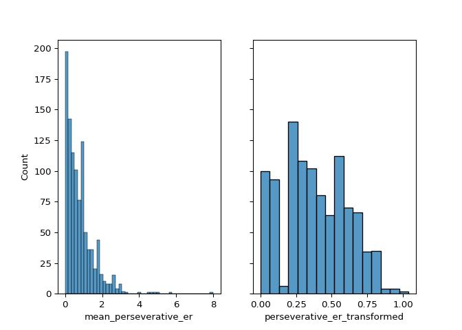
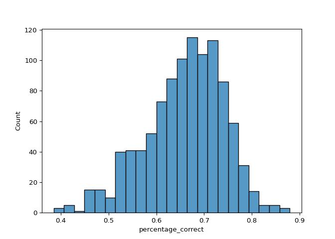

# Model 1: mean perseverative errors per reversal ~ feedback type


<p>

This file contains all model-agnostic tests run to test the effect of
feedback type (fear, disgust, points) on perseverative errors.
</p>

<br> Includes:
<p>

- data visualisation
- initial skew assessment (and resulting skew transformation)
- initial hypothesis testing mixed effects model
- assessment of assumptions of this model (which was violated)
- resulting generalized mixed effects model
- assessing whether adding video-ratings differences (identified in
  video-rating analyses) moderates results
- sensitivity analysis (including generalized mixed effects models)
- final conclusions

</p>

<h3>

Load in packages and data- in r and then in python
</h3>

<details class="code-fold">
<summary>Code</summary>

``` r
library(tidyverse, quietly=TRUE)
library(lme4)
library(emmeans)
library(DHARMa)
library('readxl')
library('xlsx')

task_summary <- read.csv("U:/Documents/Disgust learning project/github/disgust_reversal_learning-final/csvs/dem_vids_task_excluded.csv")

pvals_file = 'pvals/pvalsForPlotting.xlsx'
```

</details>

<details class="code-fold">
<summary>Code</summary>

``` python
import numpy as np
import pandas as pd
import matplotlib.pyplot as plt
import seaborn as sns
import scipy.stats as stats
import jsonlines
from functools import reduce
import statistics
import scipy.stats
import seaborn as sns
import math
import os
import json
import ast
import statsmodels.api as sm
import statsmodels.formula.api as smf
import pingouin as pg
import warnings
from scipy.stats import ttest_rel
#from statannotations.Annotator import Annotator
from scipy.stats import skew
from scipy.stats import pearsonr
from statsmodels.stats.diagnostic import het_white
from sklearn.preprocessing import PowerTransformer
import statannot
from scipy.stats import ttest_ind
from scipy.stats import ttest_1samp
import itertools

warnings.simplefilter(action='ignore', category=FutureWarning)
pd.options.mode.copy_on_write = True

task_summary=pd.read_csv("U:/Documents/Disgust learning project/github/disgust_reversal_learning-final/csvs/dem_vids_task_excluded.csv")

pvals_file = 'pvals/pvalsForPlotting.xlsx'

pd.set_option('display.max_columns', None)
```

</details>

<h3>

Assess and correct for skewness in perseverative error outcome
</h3>

<details class="code-fold">
<summary>Code</summary>

``` python
pt=PowerTransformer(method='yeo-johnson', standardize=False)
skl_yeojohnson=pt.fit(pd.DataFrame(task_summary.mean_perseverative_er))
skl_yeojohnson=pt.transform(pd.DataFrame(task_summary.mean_perseverative_er))
task_summary['perseverative_er_transformed'] = pt.transform(pd.DataFrame(task_summary.mean_perseverative_er))


fig, axes = plt.subplots(1,2, sharey=True)
sns.histplot(data=task_summary, x="mean_perseverative_er", ax=axes[0]) 
sns.histplot(data=task_summary['perseverative_er_transformed'], ax=axes[1])
print('Perseverative error skew: '+str(skew(task_summary.mean_perseverative_er)))
```

</details>

    Perseverative error skew: 2.400818032551747



<h3>

<b>Mixed effects model assumptions were violated</b>
</h3>

In this case, the basic model (no random slopes or random intercepts,
and no covariates) produced the best fit (indexed by BIC scores). But
the model assumptions were violated

<p>

Select the winning mixed effects model using BIC scores:
</p>

<details class="code-fold">
<summary>Code</summary>

``` python
data=task_summary.reset_index()
formula = 'perseverative_er_transformed ~ block_type'
basic_model=smf.mixedlm(formula, data, groups=data['participant_no'], missing='drop').fit(reml=False)

#feedback_randint=smf.mixedlm(formula, data, groups=data['participant_no'], missing='drop', vc_formula={'feedback_details': '0+feedback_details'}).fit(reml=False) CONVERGENCE WARNING
#fractals_randint=smf.mixedlm(formula, data, groups=data['participant_no'], missing='drop', vc_formula={'fractals': '0+fractals'}).fit(reml=False) CONVERGENCE WARNING
feedback_fractals_randint=smf.mixedlm(formula, data, groups=data['participant_no'], missing='drop', vc_formula={"feedback_details": "0 + feedback_details", "fractals": "0 + fractals"}).fit(reml=False)

randslope=smf.mixedlm(formula, data, groups=data['participant_no'], missing='drop', re_formula='~block_type').fit(reml=False)
#feedback_randint_randslope=smf.mixedlm(formula, data, groups=data['participant_no'], missing='drop', vc_formula={'feedback_details': '0+feedback_details'}, re_formula='~block_type').fit(reml=False) CONVERGENCE WARNING
#fractals_randint_randslope=smf.mixedlm(formula, data, groups=data['participant_no'], missing='drop', vc_formula={'fractals': '0+fractals'}, re_formula='~block_type').fit(reml=False)
#feedback_fractals_randint_randslope=smf.mixedlm(formula, data, groups=data['participant_no'], missing='drop', vc_formula={'feedback_details': '0+feedback_details', "fractals": "0 + fractals"}, re_formula='~block_type').fit(reml=False) CONVERGENCE WARNING


bic=pd.DataFrame({'basic_model': [basic_model.bic], 
                    'feedback_fractals_randint': [feedback_fractals_randint.bic], 
                    'randslope': [randslope.bic]
                    })
print(bic.sort_values(by=0, axis=1))
```

</details>

       basic_model   randslope  feedback_fractals_randint
    0  -156.851283 -128.487069                 -78.173486

<details class="code-fold">
<summary>Code</summary>

``` python
win1=bic.sort_values(by=0, axis=1).columns[0]

no_covariate=smf.mixedlm(formula, data, groups=data['participant_no'], missing='drop').fit(reml=False)
sex_covariate=smf.mixedlm(formula+str('+prolific_sex'), data, groups=data['participant_no'], missing='drop').fit(reml=False)
age_covariate=smf.mixedlm(formula+str('+prolific_age'), data, groups=data['participant_no'], missing='drop').fit(reml=False)
digit_span_covariate=smf.mixedlm(formula+str('+digit_span'), data, groups=data['participant_no'], missing='drop').fit(reml=False)
sex_age_covariate=smf.mixedlm(formula+str('+prolific_sex+prolific_age'), data, groups=data['participant_no'], missing='drop').fit(reml=False)
sex_digit_span_covariate=smf.mixedlm(formula+str('+prolific_sex+digit_span'), data, groups=data['participant_no'], missing='drop').fit(reml=False)
digit_span_age_covariate=smf.mixedlm(formula+str('+digit_span+prolific_age'), data, groups=data['participant_no'], missing='drop').fit(reml=False)
sex_age_digit_span_covariate=smf.mixedlm(formula+str('+prolific_sex+prolific_age+digit_span'), data, groups=data['participant_no'], missing='drop').fit(reml=False)

bic=pd.DataFrame({'no_covariate': [no_covariate.bic], 
                    'sex_covariate': [sex_covariate.bic], 
                    'age_covariate': [age_covariate.bic],
                    'digit_span_covariate': [digit_span_covariate.bic],
                    'sex_age_covariate': [sex_age_covariate.bic],
                    'sex_digit_span_covariate': [sex_digit_span_covariate.bic],
                    'digit_span_age_covariate': [digit_span_age_covariate.bic],
                    'sex_age_digit_span_covariate': [sex_age_digit_span_covariate.bic]})
print(bic.sort_values(by=0, axis=1))
```

</details>

       no_covariate  age_covariate  digit_span_covariate  sex_covariate  \
    0   -156.851283    -152.183759           -150.380937    -150.198921   

       sex_age_covariate  digit_span_age_covariate  sex_digit_span_covariate  \
    0        -145.567838               -145.463878               -143.826925   

       sex_age_digit_span_covariate  
    0                   -138.917108  

<details class="code-fold">
<summary>Code</summary>

``` python
win2=bic.sort_values(by=0, axis=1).columns[0]
print("Winning models: "+ win1 +" "+ win2)
```

</details>

    Winning models: basic_model no_covariate

<p>

<b>And test model assumptions:</b>
</p>

<p>

Shapiro-Wilk test of normality of residuals
</p>

<details class="code-fold">
<summary>Code</summary>

``` python
#chosen model
results=no_covariate

#shapiro-Wilk test of normality of residuals
labels = ["Statistic", "p-value"]
norm_res = stats.shapiro(results.resid)

for key, val in dict(zip(labels, norm_res)).items():
    print(key, val)
```

</details>

    Statistic 0.9931933132269517
    p-value 0.00012825572082599747

<details class="code-fold">
<summary>Code</summary>

``` python
    ##if test is significant then the assumption is violated
        #is significant here
```

</details>

<p>

White Lagrange multiplier Test for Heteroscedasticity
</p>

<details class="code-fold">
<summary>Code</summary>

``` python
#chosen model
##homoskedasticity of variance 
#White Lagrange Multiplier Test for Heteroscedasticity
het_white_res = het_white(results.resid, results.model.exog)

labels = ["LM Statistic", "LM-Test p-value", "F-Statistic", "F-Test p-value"]

for key, val in dict(zip(labels, het_white_res)).items():
    print(key, val)
```

</details>

    LM Statistic 5.332021820867592
    LM-Test p-value 0.06952903037179446
    F-Statistic 2.672138230652338
    F-Test p-value 0.06958948752634543

<details class="code-fold">
<summary>Code</summary>

``` python
    ##again, only violated if you get a significant p value
```

</details>

<br>
<h4>

<b>So instead we run a generalized mixed effects model (done in R)</b>
</h4>

Model details:
<p>

- Gamma probability distribution and inverse link function
- no additional random effects or slopes
- no additional covariates

</p>

<p>

This is the specification that produced the best fit (according to BIC)
</p>

<details class="code-fold">
<summary>Code</summary>

``` r
task_summary$pos_perseverative_er <- task_summary$mean_perseverative_er + 0.01 ##+0.01 as all values must be positive (i.e., can't have 0s)

##firstly we test whether model should use a gamma or inverse gaussian probability function
##and whether the link function should be identity or inverse
gamma_log <- glmer(pos_perseverative_er ~ block_type + (1|participant_no), data=task_summary, family=Gamma(link="log"))
gamma_inverse <- glmer(pos_perseverative_er ~ block_type + (1|participant_no), data=task_summary, family=Gamma(link="inverse"))
#gamma_identity <- glmer(pos_perseverative_er ~ block_type + (1|participant_no), data=task_summary, family=Gamma(link="identity"))

#invgaus_log <- glmer(pos_perseverative_er ~ block_type + (1|participant_no), data=task_summary, family=inverse.gaussian(link="log"))
invgaus_inverse <- glmer(pos_perseverative_er ~ block_type + (1|participant_no), data=task_summary, family=inverse.gaussian(link="inverse"))
invgaus_identity <- glmer(pos_perseverative_er ~ block_type + (1|participant_no), data=task_summary, family=inverse.gaussian(link="identity"))

bic_values <- c(
  BIC(gamma_log),
  BIC(gamma_inverse),
  BIC(invgaus_inverse),
  BIC(invgaus_identity)
)
model_names <- c("Gamma (log)", "Gamma (inverse)", "Inverse gaussian (inverse)", "Inverse gaussian (identity)")

bic_df <- data.frame(Model = model_names, BIC = bic_values)
print(bic_df[order(bic_df$BIC), ])
```

</details>

                            Model      BIC
    2             Gamma (inverse) 1611.950
    1                 Gamma (log) 1616.091
    3  Inverse gaussian (inverse) 2759.641
    4 Inverse gaussian (identity) 2759.641

<details class="code-fold">
<summary>Code</summary>

``` r
win1 <- bic_df[which.min(bic_df$BIC), ]$Model

basic_model <- glmer(pos_perseverative_er ~ block_type + (1|participant_no), data=task_summary, family=Gamma(link="inverse"))
feedback_randint <- glmer(pos_perseverative_er ~ block_type + (1|participant_no) + (1|feedback_details), data=task_summary, family=Gamma(link="inverse"))
fractals_randint <- glmer(pos_perseverative_er ~ block_type + (1|participant_no) + (1|fractals), data=task_summary, family=Gamma(link="inverse"))
feedback_fractals_randint <- glmer(pos_perseverative_er ~ block_type + (1|participant_no) + (1|fractals) + (1|feedback_details), data=task_summary, family=Gamma(link="inverse"))

randslope <-  glmer(pos_perseverative_er ~ block_type + (block_type|participant_no), data=task_summary, family=Gamma(link="inverse"))
fractals_randint_randslope <- glmer(pos_perseverative_er ~ block_type + (block_type|participant_no) + (1|fractals), data=task_summary, family=Gamma(link="inverse"))
feedback_randint_randslope <- glmer(pos_perseverative_er ~ block_type + (block_type|participant_no) + (1|feedback_details), data=task_summary, family=Gamma(link="inverse"))
feedback_fractals_randint_randslope <- glmer(pos_perseverative_er ~ block_type + (block_type|participant_no) + (1|feedback_details) + (1|fractals), data=task_summary, family=Gamma(link="inverse"))

bic_values <- c(
  BIC(basic_model),
  BIC(feedback_randint),
  BIC(fractals_randint),
  BIC(feedback_fractals_randint),
  BIC(randslope),
  BIC(fractals_randint_randslope),
  BIC(feedback_randint_randslope),
  BIC(feedback_fractals_randint_randslope)
)
model_names <- c("basic model", "feedback_randint", "fractals_randint", "feedback_fractals_randint", "randslope", "fractals_randint_randslope","feedback_randint_randslope", "feedback_fractals_randint_randslope")

bic_df <- data.frame(Model = model_names, BIC = bic_values)
print(bic_df[order(bic_df$BIC), ])
```

</details>

                                    Model      BIC
    1                         basic model 1611.950
    3                    fractals_randint 1618.877
    2                    feedback_randint 1618.877
    4           feedback_fractals_randint 1625.805
    5                           randslope 1646.365
    6          fractals_randint_randslope 1653.293
    7          feedback_randint_randslope 1653.295
    8 feedback_fractals_randint_randslope 1660.220

<details class="code-fold">
<summary>Code</summary>

``` r
win2 <- bic_df[which.min(bic_df$BIC), ]$Model

no_covariate <- basic_model
sex_covariate <- glmer(pos_perseverative_er ~ block_type + (1|participant_no) + prolific_sex, data=task_summary, family=Gamma(link="inverse"))
#age_covariate <- glmer(pos_perseverative_er ~ block_type + (1|participant_no) + prolific_age, data=task_summary, family=Gamma(link="inverse"))
#digit_span_covariate <- glmer(pos_perseverative_er ~ block_type + (1|participant_no) + digit_span, data=task_summary, family=Gamma(link="inverse"))
#sex_age_covariate <- glmer(pos_perseverative_er ~ block_type + (1|participant_no) + prolific_sex + prolific_age, data=task_summary, family=Gamma(link="inverse"))
sex_digit_span_covariate <- glmer(pos_perseverative_er ~ block_type + (1|participant_no) + prolific_sex + digit_span, data=task_summary, family=Gamma(link="inverse"))
#digit_span_age_covariate <- glmer(pos_perseverative_er ~ block_type + (1|participant_no) + prolific_age + digit_span, data=task_summary, family=Gamma(link="inverse"))
#sex_digit_span_age_covariate <- glmer(pos_perseverative_er ~ block_type + (1|participant_no) + prolific_age + prolific_sex + digit_span, data=task_summary, family=Gamma(link="inverse"))

bic_values <- c(
  BIC(no_covariate),
  BIC(sex_covariate),
  BIC(sex_digit_span_covariate)
)
model_names <- c("no_covariate", "sex_covariate", "sex_digit_span_covariate")

bic_df <- data.frame(Model = model_names, BIC = bic_values)
print(bic_df[order(bic_df$BIC), ])
```

</details>

                         Model      BIC
    1             no_covariate 1611.950
    2            sex_covariate 1618.780
    3 sex_digit_span_covariate 1625.445

<details class="code-fold">
<summary>Code</summary>

``` r
win3 <- bic_df[which.min(bic_df$BIC), ]$Model

print(paste0("Winning models: ", win1, " ", win2," ",win3))
```

</details>

    [1] "Winning models: Gamma (inverse) basic model no_covariate"

<p>

Results from this model show a <b>significant effect of block-type</b>:
specifically, a difference between disgust and points learning

``` r
task_summary$pos_perseverative_er <- task_summary$mean_perseverative_er + 0.01 ##+0.01 as all values must be positive (i.e., can't have 0s)
generalized_model <- glmer(pos_perseverative_er ~ block_type + (1|participant_no), data=task_summary, family=Gamma(link="inverse"))
summary(generalized_model)
```

    Generalized linear mixed model fit by maximum likelihood (Laplace
      Approximation) [glmerMod]
     Family: Gamma  ( inverse )
    Formula: pos_perseverative_er ~ block_type + (1 | participant_no)
       Data: task_summary

         AIC      BIC   logLik deviance df.resid 
      1587.3   1611.9   -788.7   1577.3     1015 

    Scaled residuals: 
        Min      1Q  Median      3Q     Max 
    -1.2647 -0.7161 -0.1944  0.5332  3.8144 

    Random effects:
     Groups         Name        Variance Std.Dev.
     participant_no (Intercept) 0.1441   0.3796  
     Residual                   0.6133   0.7831  
    Number of obs: 1020, groups:  participant_no, 340

    Fixed effects:
                     Estimate Std. Error t value Pr(>|z|)    
    (Intercept)       1.32174    0.07274  18.172   <2e-16 ***
    block_typeFear    0.13312    0.07953   1.674   0.0942 .  
    block_typePoints  0.18930    0.08252   2.294   0.0218 *  
    ---
    Signif. codes:  0 '***' 0.001 '**' 0.01 '*' 0.05 '.' 0.1 ' ' 1

    Correlation of Fixed Effects:
                (Intr) blck_F
    block_typFr -0.503       
    blck_typPnt -0.500  0.409

<p>

Extract confidence intervals
</p>

``` r
print(confint.merMod(no_covariate, level = 0.95, method='Wald'))
```

                           2.5 %    97.5 %
    .sig01                    NA        NA
    .sigma                    NA        NA
    (Intercept)       1.17917920 1.4643022
    block_typeFear   -0.02275218 0.2889925
    block_typePoints  0.02756991 0.3510265

<br>
<p>

As this hypothesis test found no difference between fear and disgust, we
will compute a Bayes Factor to test the strength of the evidence for the
null
</p>

<details class="code-fold">
<summary>Code</summary>

``` python
def bayes_factor(df, dependent_var, condition_1_name, condition_2_name):
    df=df[(df.block_type==condition_1_name)| (df.block_type==condition_2_name)][[dependent_var, 'block_type', 'participant_no']]
    df.dropna(inplace=True)
    df=df.pivot(index='participant_no', columns='block_type', values=dependent_var).reset_index()
    ttest=pg.ttest(df[condition_1_name], df[condition_2_name], paired=True)
    bf_null=1/float(ttest['BF10'].iloc[0])
    return ttest, bf_null
```

</details>

<details class="code-fold">
<summary>Code</summary>

``` python
ttest, bf_null = bayes_factor(task_summary, 'mean_perseverative_er', 'Disgust', 'Fear')
#print("Disgust vs Fear BF01: " + bf_null)

print(f"Disgust vs Fear: BF01({ttest['dof'].iloc[0]}) = {bf_null}")
```

</details>

    Disgust vs Fear: BF01(339) = 2.570694087403599

<p>

We also look at fear vs points (which is not directly assessed by the
model)
</p>

<details class="code-fold">
<summary>Code</summary>

``` python
ttest, bf_null = bayes_factor(task_summary, 'mean_perseverative_er', 'Points', 'Fear')

print(f"Points vs Fear: T = {ttest['T'][0]}, CI95% = {ttest['CI95%'][0]}, p = {ttest['p-val'][0]}, dof = {ttest['dof'].iloc[0]}")
```

</details>

    Points vs Fear: T = -0.8996844251513175, CI95% = [-0.12  0.04], p = 0.3689268456580095, dof = 339

<p>

And because the result is null, also get a Bayes factor:
</p>

<details class="code-fold">
<summary>Code</summary>

``` python
print(f"Points vs Fear: BF01({ttest['dof'].iloc[0]}) = {bf_null}")
```

</details>

    Points vs Fear: BF01(339) = 10.989010989010989

    U:\Documents\envs\disgust_reversal_venv\Lib\site-packages\openpyxl\styles\stylesheet.py:237: UserWarning: Workbook contains no default style, apply openpyxl's default
      warn("Workbook contains no default style, apply openpyxl's default")

<br>
<h3>

<b>Adding video ratings</b>
</h3>

Next, we will test whether this effect remains after video rating
differences between fear and disgust have been controlled for.
<p>

As before, the mixed effects model violated assumptions, so a
generalized mixed effects model must be run.
</p>

<p>

Again, we select the best model using BIC values:
</p>

<details class="code-fold">
<summary>Code</summary>

``` python
data=task_summary.reset_index()

formula = 'perseverative_er_transformed ~ block_type + +valence_diff + arousal_diff + valence_habdiff'

basic_model=smf.mixedlm(formula, data, groups=data['participant_no'], missing='drop').fit(reml=False)

#test which random effects to include
#feedback_randint=smf.mixedlm(formula, data, groups=data['participant_no'], missing='drop', vc_formula={'feedback_details': '0+feedback_details'}).fit(reml=False) CONVERGENCE WARNING
#fractals_randint=smf.mixedlm(formula, data, groups=data['participant_no'], missing='drop', vc_formula={'fractals': '0+fractals'}).fit(reml=False) CONVERGENCE WARNING
#feedback_fractals_randint=smf.mixedlm(formula, data, groups=data['participant_no'], missing='drop', vc_formula={"feedback_details": "0 + feedback_details", "fractals": "0 + fractals"}).fit(reml=False)
        
randslope=smf.mixedlm(formula, data, groups=data['participant_no'], missing='drop', re_formula='~block_type').fit(reml=False)
#feedback_randint_randslope=smf.mixedlm(formula, data, groups=data['participant_no'], missing='drop', vc_formula={'feedback_details': '0+feedback_details'}, re_formula='~block_type').fit(reml=False) CONVERGENCE WARNING
#fractals_randint_randslope=smf.mixedlm(formula, data, groups=data['participant_no'], missing='drop', vc_formula={'fractals': '0+fractals'}, re_formula='~block_type').fit(reml=False)
#feedback_fractals_randint_randslope=smf.mixedlm(formula, data, groups=data['participant_no'], missing='drop', vc_formula={'feedback_details': '0+feedback_details', "fractals": "0 + fractals"}, re_formula='~block_type').fit(reml=False) CONVERGENCE WARNING
        

bic=pd.DataFrame({'basic_model': [basic_model.bic], 
                  #  'feedback_andint': ['CONVERGENCE WARNING'], 
                  #  'fractals_randint': ['CONVERGENCE WARNING'],
                  #  'feedback_fractals_randint': ['CONVERGENCE WARNING'],
                    'randslope': [randslope.bic],
                  #  'feedback_randint_randslope':['CONVERGENCE WARNING'],
                   # 'fractals_randint_randslope': [fractals_randint_randslope.bic]
                   # 'feedback_fractals_randint_randslope': ['CONVERGENCE WARNING']
                   })
print(bic.sort_values(by=0, axis=1))
```

</details>

       basic_model   randslope
    0  -139.829322 -111.599128

<details class="code-fold">
<summary>Code</summary>

``` python
win1=bic.sort_values(by=0, axis=1).columns[0]

no_covariate=smf.mixedlm(formula, data, groups=data['participant_no'], missing='drop').fit(reml=False)
sex_covariate=smf.mixedlm(formula+str('+prolific_sex'), data, groups=data['participant_no'], missing='drop').fit(reml=False)
age_covariate=smf.mixedlm(formula+str('+prolific_age'), data, groups=data['participant_no'], missing='drop').fit(reml=False)
digit_span_covariate=smf.mixedlm(formula+str('+digit_span'), data, groups=data['participant_no'], missing='drop').fit(reml=False)
sex_age_covariate=smf.mixedlm(formula+str('+prolific_sex+prolific_age'), data, groups=data['participant_no'], missing='drop').fit(reml=False)
sex_digit_span_covariate=smf.mixedlm(formula+str('+prolific_sex+digit_span'), data, groups=data['participant_no'], missing='drop').fit(reml=False)
digit_span_age_covariate=smf.mixedlm(formula+str('+digit_span+prolific_age'), data, groups=data['participant_no'], missing='drop').fit(reml=False)
sex_age_digit_span_covariate=smf.mixedlm(formula+str('+prolific_sex+prolific_age+digit_span'), data, groups=data['participant_no'], missing='drop').fit(reml=False)

bic=pd.DataFrame({'no_covariate': [no_covariate.bic], 
                    'sex_covariate': [sex_covariate.bic], 
                    'age_covariate': [age_covariate.bic],
                    'digit_span_covariate': [digit_span_covariate.bic],
                    'sex_age_covariate': [sex_age_covariate.bic],
                    'sex_digit_span_covariate': [sex_digit_span_covariate.bic],
                    'digit_span_age_covariate': [digit_span_age_covariate.bic],
                    'sex_age_digit_span_covariate': [sex_age_digit_span_covariate.bic]})
print(bic.sort_values(by=0, axis=1))
```

</details>

       no_covariate  age_covariate  digit_span_covariate  sex_covariate  \
    0   -139.829322    -134.509382           -133.411158    -133.164219   

       sex_age_covariate  digit_span_age_covariate  sex_digit_span_covariate  \
    0         -127.87741               -127.868026               -126.848509   

       sex_age_digit_span_covariate  
    0                   -121.315358  

<details class="code-fold">
<summary>Code</summary>

``` python
win2=bic.sort_values(by=0, axis=1).columns[0]
print("Winning models: "+ win1 +" "+ win2)
```

</details>

    Winning models: basic_model no_covariate

<br>
<p>

Test assumptions:
</p>

<p>

Shapiro-Wilk test of normality of residuals
</p>

<details class="code-fold">
<summary>Code</summary>

``` python
results=no_covariate
labels = ["Statistic", "p-value"]
norm_res = stats.shapiro(results.resid)

for key, val in dict(zip(labels, norm_res)).items():
    print(key, val)
```

</details>

    Statistic 0.9932531693384103
    p-value 0.0001396501655398863

<p>

White Lagrange multiplier Test for Heteroscedasticity
</p>

<details class="code-fold">
<summary>Code</summary>

``` python
het_white_res = het_white(results.resid, results.model.exog)

labels = ["LM Statistic", "LM-Test p-value", "F-Statistic", "F-Test p-value"]

for key, val in dict(zip(labels, het_white_res)).items():
    print(key, val)
```

</details>

    LM Statistic 25.63263679882915
    LM-Test p-value 0.08141864106696323
    F-Statistic 1.5193758613542014
    F-Test p-value 0.08025252693260536

<p>

So we re-run the model as a generalized mixed effects model (again,
selecting the best fitting model using BIC scores)
</p>

Model details:
<p>

- Gamma probability distribution and inverse link function
- no additional random effects or slopes
- no additional covariates

</p>

<p>

This is the specification that produced the best fit (according to BIC)
</p>

<details class="code-fold">
<summary>Code</summary>

``` r
task_summary$pos_perseverative_er <- task_summary$mean_perseverative_er + 0.01 ##+0.01 as all values must be positive (i.e., can't have 0s)

##firstly we test whether model should use a gamma or inverse gaussian probability function
##and whether the link function should be identity or inverse
gamma_log <- glmer(pos_perseverative_er ~ block_type + valence_diff + arousal_diff + valence_habdiff + (1|participant_no), data=task_summary, family=Gamma(link="log"))
gamma_inverse <- glmer(pos_perseverative_er ~ block_type + valence_diff + arousal_diff + valence_habdiff + (1|participant_no), data=task_summary, family=Gamma(link="inverse"))
#gamma_identity <- glmer(pos_perseverative_er ~ block_type + valence_diff + arousal_diff + valence_habdiff + (1|participant_no), data=task_summary, family=Gamma(link="identity"))

#invgaus_log <- glmer(pos_perseverative_er ~ block_type + valence_diff + arousal_diff + valence_habdiff + (1|participant_no), data=task_summary, family=inverse.gaussian(link="log"))
invgaus_inverse <- glmer(pos_perseverative_er ~ block_type + valence_diff + arousal_diff + valence_habdiff + (1|participant_no), data=task_summary, family=inverse.gaussian(link="inverse"))
#invgaus_identity <- glmer(pos_perseverative_er ~ block_type + valence_diff + arousal_diff + valence_habdiff + (1|participant_no), data=task_summary, family=inverse.gaussian(link="identity"))

bic_values <- c(
  BIC(gamma_log),
  BIC(gamma_inverse),
  BIC(invgaus_inverse)
)
model_names <- c("Gamma (log)", "Gamma (inverse)", "Inverse gaussian (inverse)")

bic_df <- data.frame(Model = model_names, BIC = bic_values)
print(bic_df[order(bic_df$BIC), ])
```

</details>

                           Model      BIC
    2            Gamma (inverse) 1630.528
    1                Gamma (log) 1634.188
    3 Inverse gaussian (inverse) 2780.066

<details class="code-fold">
<summary>Code</summary>

``` r
win1 <- bic_df[which.min(bic_df$BIC), ]$Model

basic_model <- glmer(pos_perseverative_er ~ block_type + valence_diff + arousal_diff + valence_habdiff + (1|participant_no), data=task_summary, family=Gamma(link="inverse"))

#feedback_randint <- glmer(pos_perseverative_er ~ block_type + valence_diff + arousal_diff + valence_habdiff + (1|participant_no) + (1|feedback_details), data=task_summary, family=Gamma(link="inverse"))
fractals_randint <- glmer(pos_perseverative_er ~ block_type + valence_diff + arousal_diff + valence_habdiff + (1|participant_no) + (1|fractals), data=task_summary, family=Gamma(link="inverse"))
#feedback_fractals_randint <- glmer(pos_perseverative_er ~ block_type + valence_diff + arousal_diff + valence_habdiff + (1|participant_no) + (1|fractals) + (1|feedback_details), data=task_summary, family=Gamma(link="inverse"))

#randslope <- glmer(pos_perseverative_er ~ block_type + valence_diff + arousal_diff + valence_habdiff + (block_type|participant_no), data=task_summary, family=Gamma(link="inverse"))
feedback_randint_randslope <- glmer(pos_perseverative_er ~ block_type + valence_diff + arousal_diff + valence_habdiff + (block_type|participant_no) + (1|feedback_details), data=task_summary, family=Gamma(link="inverse"))
fractal_randint_randslope <- glmer(pos_perseverative_er ~ block_type + valence_diff + arousal_diff + valence_habdiff + (block_type|participant_no) + (1|fractals), data=task_summary, family=Gamma(link="inverse"))
#feedback_fractals_randint_randslope <- glmer(pos_perseverative_er ~ block_type + valence_diff + arousal_diff + valence_habdiff + (block_type|participant_no) + (1|feedback_details) + (1|fractals), data=task_summary, family=Gamma(link="inverse"))

bic_values <- c(
  BIC(basic_model),
  BIC(fractals_randint),
  BIC(fractals_randint_randslope),
  BIC(feedback_randint_randslope)
)
model_names <- c("basic model", "fractals_randint", "fractals_randint_randslope", "feedback_randint_randslope")

bic_df <- data.frame(Model = model_names, BIC = bic_values)
print(bic_df[order(bic_df$BIC), ])
```

</details>

                           Model      BIC
    1                basic model 1630.528
    2           fractals_randint 1637.456
    3 fractals_randint_randslope 1653.293
    4 feedback_randint_randslope 1671.711

<details class="code-fold">
<summary>Code</summary>

``` r
win2 <- bic_df[which.min(bic_df$BIC), ]$Model

no_covariate <- basic_model
sex_covariate <- glmer(pos_perseverative_er ~ block_type + valence_diff + arousal_diff + valence_habdiff + (1|participant_no) + prolific_sex, data=task_summary, family=Gamma(link="inverse"))
#age_covariate <- glmer(pos_perseverative_er ~ block_type + valence_diff + arousal_diff + valence_habdiff + (1|participant_no) + prolific_age, data=task_summary, family=Gamma(link="inverse"))
digit_span_covariate <- glmer(pos_perseverative_er ~ block_type + valence_diff + arousal_diff + valence_habdiff + (1|participant_no) + digit_span, data=task_summary, family=Gamma(link="inverse"))
#sex_age_covariate <- glmer(pos_perseverative_er ~ block_type + valence_diff + arousal_diff + valence_habdiff + (1|participant_no) + prolific_sex + prolific_age, data=task_summary, family=Gamma(link="inverse"))
#sex_digit_span_covariate <- glmer(pos_perseverative_er ~ block_type + valence_diff + arousal_diff + valence_habdiff + (1|participant_no) + prolific_sex + digit_span, data=task_summary, family=Gamma(link="inverse"))
#digit_span_age_covariate <- glmer(pos_perseverative_er ~ block_type + valence_diff + arousal_diff + valence_habdiff + (1|participant_no) + prolific_age + digit_span, data=task_summary, family=Gamma(link="inverse"))
#sex_digit_span_age_covariate <- glmer(pos_perseverative_er ~ block_type + valence_diff + arousal_diff + valence_habdiff + (1|participant_no) + prolific_age + prolific_sex + digit_span, data=task_summary, family=Gamma(link="inverse"))

bic_values <- c(
  BIC(no_covariate),
  BIC(sex_covariate),
  BIC(digit_span_covariate)
)
model_names <- c("no_covariate", "sex_covariate", "digit_span_covariate")

bic_df <- data.frame(Model = model_names, BIC = bic_values)
print(bic_df[order(bic_df$BIC), ])
```

</details>

                     Model      BIC
    1         no_covariate 1630.528
    3 digit_span_covariate 1637.249
    2        sex_covariate 1637.379

<details class="code-fold">
<summary>Code</summary>

``` r
win3 <- bic_df[which.min(bic_df$BIC), ]$Model

print(paste0("Winning models: ", win1, " ", win2," ",win3))
```

</details>

    [1] "Winning models: Gamma (inverse) basic model no_covariate"

<br>
<p>

This shows that adding video ratings has <b> no effect </b> on the
results

``` r
task_summary$pos_perseverative_er <- task_summary$mean_perseverative_er + 0.01 ##+0.01 as all values must be positive (i.e., can't have 0s)
generalized_model <- glmer(pos_perseverative_er ~ block_type +valence_diff + arousal_diff + valence_habdiff + (1|participant_no), data=task_summary, family=Gamma(link="inverse"))
summary(generalized_model)
```

    Generalized linear mixed model fit by maximum likelihood (Laplace
      Approximation) [glmerMod]
     Family: Gamma  ( inverse )
    Formula: pos_perseverative_er ~ block_type + valence_diff + arousal_diff +  
        valence_habdiff + (1 | participant_no)
       Data: task_summary

         AIC      BIC   logLik deviance df.resid 
      1591.1   1630.5   -787.6   1575.1     1012 

    Scaled residuals: 
        Min      1Q  Median      3Q     Max 
    -1.2639 -0.7127 -0.2102  0.5384  3.9164 

    Random effects:
     Groups         Name        Variance Std.Dev.
     participant_no (Intercept) 0.1426   0.3776  
     Residual                   0.6140   0.7836  
    Number of obs: 1020, groups:  participant_no, 340

    Fixed effects:
                       Estimate Std. Error t value Pr(>|z|)    
    (Intercept)       1.3221837  0.0794095  16.650   <2e-16 ***
    block_typeFear    0.1331227  0.0795042   1.674   0.0940 .  
    block_typePoints  0.1892452  0.0824777   2.295   0.0218 *  
    valence_diff      0.0189348  0.0284999   0.664   0.5064    
    arousal_diff      0.0436398  0.0372152   1.173   0.2409    
    valence_habdiff  -0.0006996  0.0214278  -0.033   0.9740    
    ---
    Signif. codes:  0 '***' 0.001 '**' 0.01 '*' 0.05 '.' 0.1 ' ' 1

    Correlation of Fixed Effects:
                (Intr) blck_F blck_P vlnc_d arsl_d
    block_typFr -0.460                            
    blck_typPnt -0.456  0.409                     
    valence_dff  0.382 -0.001 -0.002              
    arousal_dff -0.198 -0.006 -0.007 -0.189       
    valnc_hbdff -0.218  0.000 -0.001 -0.380  0.121

<p>

Extract confidence intervals
</p>

``` r
print(confint.merMod(generalized_model, method='Wald'))
```

                           2.5 %     97.5 %
    .sig01                    NA         NA
    .sigma                    NA         NA
    (Intercept)       1.16654399 1.47782349
    block_typeFear   -0.02270260 0.28894810
    block_typePoints  0.02759189 0.35089851
    valence_diff     -0.03692389 0.07479350
    arousal_diff     -0.02930065 0.11658033
    valence_habdiff  -0.04269718 0.04129807

<br>

<h3>

<b>Exploratory analysis: percentage correct </b>
</h3>

<p>

The above analyses show a difference in perseverative error rate between
disgust and points learning. To better understand this change, we tested
whether this difference is mirrored by a difference in overall task
performance (indexed by percentage of trials where participants were
correct - an ‘accuracy’ score)
</p>

<p>

Firstly, check that this value is significantly different from chance
(as an additional check that learning is present)
</p>

``` python
t, p= ttest_1samp(task_summary.percentage_correct, 0.5)
print(f"T-value = {t}; p-value = {p}")
```

    T-value = 62.070883535659; p-value = 0.0

<p>

And check that the variable is not skewed (i.e., there are no floor or
ceiling effects)
</p>

<details class="code-fold">
<summary>Code</summary>

``` python
sns.histplot(data=task_summary, x="percentage_correct") 
print('Percentage correct skew: '+str(skew(task_summary.percentage_correct)))
```

</details>

    Percentage correct skew: -0.49987154559115393



<p>

And also show that, as expected, accuracy is negatively correlated with
the perseverative error outcome.
</p>

<details class="code-fold">
<summary>Code</summary>

``` python
print(pearsonr(task_summary.mean_perseverative_er, task_summary.percentage_correct))
```

</details>

    PearsonRResult(statistic=np.float64(-0.5055950895424014), pvalue=np.float64(2.7197363565685622e-67))

<details class="code-fold">
<summary>Code</summary>

``` python
print("dof = "+str(len(set(task_summary.participant_no))-2))
```

</details>

    dof = 338

<p>

And now run a mixed effects model to assess whether it differs by
block-type
</p>

<p>

The regular mixed effects model did not converge, so a generalized mixed
effects model is run in its place
</p>

<p>

The winning model (as indexed by BIC) had:
<p>

- a gamma probability function
- an identity link function
- no covariates
- random intercepts for fractals

<details class="code-fold">
<summary>Code</summary>

``` r
##firstly we test whether model should use a gamma or inverse gaussian probability function
##and whether the link function should be identity or inverse
gamma_log <- glmer(percentage_correct ~ block_type + (1|participant_no), data=task_summary, family=Gamma(link="log"))
gamma_inverse <- glmer(percentage_correct ~ block_type + (1|participant_no), data=task_summary, family=Gamma(link="inverse"))
gamma_identity <- glmer(percentage_correct ~ block_type + (1|participant_no), data=task_summary, family=Gamma(link="identity"))

invgaus_log <- glmer(percentage_correct ~ block_type + (1|participant_no), data=task_summary, family=inverse.gaussian(link="log"))
invgaus_inverse <- glmer(percentage_correct ~ block_type + (1|participant_no), data=task_summary, family=inverse.gaussian(link="inverse"))
invgaus_identity <- glmer(percentage_correct ~ block_type + (1|participant_no), data=task_summary, family=inverse.gaussian(link="identity"))

bic_values <- c(
  BIC(gamma_log),
  BIC(gamma_inverse),
  BIC(gamma_identity),
  BIC(invgaus_log),
  BIC(invgaus_inverse),
  BIC(invgaus_identity)
)
model_names <- c("Gamma (log)", "Gamma (inverse)", "Gamma (identity)", "Inverse Gaussian (log)", "Inverse Gaussian (inverse)", "Inverse Gaussian (identity)")

bic_df <- data.frame(Model = model_names, BIC = bic_values)
print(bic_df[order(bic_df$BIC), ])
```

</details>

                            Model       BIC
    3            Gamma (identity) -2589.873
    1                 Gamma (log) -2568.088
    6 Inverse Gaussian (identity) -2547.580
    2             Gamma (inverse) -2545.095
    4      Inverse Gaussian (log) -2524.087
    5  Inverse Gaussian (inverse) -2498.419

<details class="code-fold">
<summary>Code</summary>

``` r
win1 <- bic_df[which.min(bic_df$BIC), ]$Model

basic_model <- glmer(percentage_correct ~ block_type +(1|participant_no), data=task_summary, family=Gamma(link="identity"))

feedback_randint <- glmer(percentage_correct ~ block_type +(1|participant_no) + (1|feedback_details), data=task_summary, family=Gamma(link="identity"))
fractals_randint <- glmer(percentage_correct ~ block_type +(1|participant_no) + (1|fractals), data=task_summary, family=Gamma(link="identity"))
feedback_fractals_randint <- glmer(percentage_correct ~ block_type +(1|participant_no) + (1|fractals) + (1|feedback_details), data=task_summary, family=Gamma(link="identity"))

#randslope <- glmer(percentage_correct ~ block_type +(block_type|participant_no), data=task_summary, family=Gamma(link="identity"))
feedback_randint_randslope <- glmer(percentage_correct ~ block_type +(block_type|participant_no) + (1|feedback_details), data=task_summary, family=Gamma(link="identity"))
#fractals_randint_randslope <- glmer(percentage_correct ~ block_type +(block_type|participant_no) + (1|fractals), data=task_summary, family=Gamma(link="identity")) #variance-covariance not positive defnite or contains nan values
#feedback_fractals_randint_randslope <- glmer(percentage_correct ~ block_type +(block_type|participant_no) + (1|feedback_details) + (1|fractals), data=task_summary, family=Gamma(link="identity")) #variance-covariance not positive defnite or contains nan values

bic_values <- c(
  BIC(basic_model),
  BIC(feedback_randint),
  BIC(fractals_randint),
  BIC(feedback_fractals_randint)
  #BIC(randslope),
  #BIC(feedback_randint_randslope),
  #BIC(fractals_randint_randslope),
  #BIC(feedback_fractals_randint_randslope)
)

model_names <- c("basic model", "feedback_randint", "fractals_randint", "feedback_fractals_randint")

bic_df <- data.frame(Model = model_names, BIC = bic_values)
print(bic_df[order(bic_df$BIC), ])
```

</details>

                          Model       BIC
    3          fractals_randint -2591.183
    1               basic model -2589.873
    4 feedback_fractals_randint -2584.289
    2          feedback_randint -2582.968

<details class="code-fold">
<summary>Code</summary>

``` r
win2 <- bic_df[which.min(bic_df$BIC), ]$Model

no_covariate <- fractals_randint
#age_covariate <-  glmer(percentage_correct ~ block_type +(1|participant_no) + (1|fractals) + prolific_age, data=task_summary, family=Gamma(link="identity"))
sex_covariate <-  glmer(percentage_correct ~ block_type +(1|participant_no) + (1|fractals) + prolific_sex, data=task_summary, family=Gamma(link="identity"))
#digit_span_covariate <-  glmer(percentage_correct ~ block_type +(1|participant_no) + (1|fractals) + digit_span, data=task_summary, family=Gamma(link="identity"))

#sex_age_covariate <-  glmer(percentage_correct ~ block_type +(1|participant_no) + (1|fractals) + prolific_sex + prolific_age, data=task_summary, family=Gamma(link="identity"))
#sex_digit_span_covariate <-  glmer(percentage_correct ~ block_type +(1|participant_no) + (1|fractals) + prolific_sex + digit_span, data=task_summary, family=Gamma(link="identity"))
#digit_span_age_covariate <-  glmer(percentage_correct ~ block_type +(1|participant_no) + (1|fractals) + digit_span + prolific_age, data=task_summary, family=Gamma(link="identity"))
#sex_digit_span_age_covariate <-  glmer(percentage_correct ~ block_type +(1|participant_no) + (1|fractals) + prolific_age + prolific_sex + digit_span, data=task_summary, family=Gamma(link="identity"))

bic_values <- c(
  BIC(no_covariate),
  #BIC(age_covariate),
  BIC(sex_covariate)
 # BIC(digit_span_covariate),
  #BIC(sex_age_covariate),
 #BIC(sex_digit_span_covariate),
  #BIC(digit_span_age_covariate),
 # BIC(sex_digit_span_age_covariate)
)
model_names <- c("no_covariate", "sex_covariate")

bic_df <- data.frame(Model = model_names, BIC = bic_values)
print(bic_df[order(bic_df$BIC), ])
```

</details>

              Model       BIC
    1  no_covariate -2591.183
    2 sex_covariate -2584.261

<details class="code-fold">
<summary>Code</summary>

``` r
win3 <- bic_df[which.min(bic_df$BIC), ]$Model

##all other models not converge
#win3 <- 'no_covariate'

print(paste0("Winning models: ", win1, " ", win2," ",win3))
```

</details>

    [1] "Winning models: Gamma (identity) fractals_randint no_covariate"

<p>

Now we run the hypothesis test:
</p>

<details class="code-fold">
<summary>Code</summary>

``` r
data<-task_summary
generalized_model <- glmer(percentage_correct ~ block_type +(1|participant_no) + (1|fractals), data=task_summary, family=Gamma(link="identity"))
summary(generalized_model)
```

</details>

    Generalized linear mixed model fit by maximum likelihood (Laplace
      Approximation) [glmerMod]
     Family: Gamma  ( identity )
    Formula: percentage_correct ~ block_type + (1 | participant_no) + (1 |  
        fractals)
       Data: task_summary

         AIC      BIC   logLik deviance df.resid 
     -2620.7  -2591.2   1316.4  -2632.7     1014 

    Scaled residuals: 
        Min      1Q  Median      3Q     Max 
    -3.2091 -0.5097  0.0359  0.5419  2.7921 

    Random effects:
     Groups         Name        Variance  Std.Dev.
     participant_no (Intercept) 2.595e-03 0.050938
     fractals       (Intercept) 8.935e-05 0.009452
     Residual                   9.365e-03 0.096770
    Number of obs: 1020, groups:  participant_no, 340; fractals, 28

    Fixed effects:
                     Estimate Std. Error t value Pr(>|z|)    
    (Intercept)      0.659491   0.006931  95.148   <2e-16 ***
    block_typeFear   0.005012   0.004269   1.174   0.2404    
    block_typePoints 0.009113   0.004268   2.135   0.0328 *  
    ---
    Signif. codes:  0 '***' 0.001 '**' 0.01 '*' 0.05 '.' 0.1 ' ' 1

    Correlation of Fixed Effects:
                (Intr) blck_F
    block_typFr -0.301       
    blck_typPnt -0.299  0.496

<p>

Extract confidence intervals
</p>

``` r
print(confint.merMod(generalized_model, method='Wald'))
```

                             2.5 %     97.5 %
    .sig01                      NA         NA
    .sig02                      NA         NA
    .sigma                      NA         NA
    (Intercept)       0.6459056077 0.67307548
    block_typeFear   -0.0033549230 0.01337928
    block_typePoints  0.0007472511 0.01747908

<p>

This reveals that the difference in perseverative errors between points
and disgust conditions results in a difference in accuracy between the
two conditions.
</p>

<p>

Because of the null fear vs disgust result, we compute bayes factors for
the strength of that null:
</p>

<details class="code-fold">
<summary>Code</summary>

``` python
ttest, bf_null = bayes_factor(task_summary, 'percentage_correct', 'Disgust', 'Fear')
#print("Disgust vs Fear BF01({{ttest['dof'].iloc[0]}}): " + bf_null)

print(f"Disgust vs Fear: BF01({ttest['dof'].iloc[0]}) = {bf_null}")
```

</details>

    Disgust vs Fear: BF01(339) = 10.989010989010989

<p>

We also look at fear vs points (which is not directly assessed by the
model)
</p>

<details class="code-fold">
<summary>Code</summary>

``` python
ttest, bf_null = bayes_factor(task_summary, 'percentage_correct', 'Points', 'Fear')

print(f"Points vs Fear: T = {ttest['T'][0]}, CI95% = {ttest['CI95%'][0]}, p = {ttest['p-val'][0]}, dof = {ttest['dof'].iloc[0]}")
```

</details>

    Points vs Fear: T = 0.8739173373388256, CI95% = [-0.    0.01], p = 0.38278193105844427, dof = 339

<p>

And because the result is null, also get a Bayes factor:
</p>

<details class="code-fold">
<summary>Code</summary>

``` python
print(f"Points vs Fear: BF01({ttest['dof'].iloc[0]}) = {bf_null}")
```

</details>

    Points vs Fear: BF01(339) = 11.235955056179776

    U:\Documents\envs\disgust_reversal_venv\Lib\site-packages\openpyxl\styles\stylesheet.py:237: UserWarning: Workbook contains no default style, apply openpyxl's default
      warn("Workbook contains no default style, apply openpyxl's default")

<h3>

<b>Exploratory analysis: emotion vs not & disgust vs not </b>
</h3>

<p>

The main hypothesis testing analyses found a difference in learning
(indexed by perseverative errors) between the points/loss-based feedback
and disgust feedback.
</p>

<p>

However, no difference was found between <b>either</b> fear and points
OR fear and disgust. This makes interpretation difficult as we cannot
determine whether the result is better explained by a difference in
learning between the two emotional conditions and points-based learning
OR a distinct feature of disgust learning
</p>

<p>

To assess this, we run two competing models:
<p>

- One assessing the presence of a difference between emotional learning
  (combining the fear and disgust block) and non-emotional learning (the
  points block)
- Another assessing the presence of a difference between disgust-based
  learning and learning which is not about disgust (combining the fear
  and points blocks)
  <p>

  We will use a) the presence/absence of significant results and b) the
  model fit (as indexed by BIC - as before) to guide interpretation of
  these competing models
  </p>

<p>

Firstly, add columns to the data-frame splitting conditions into
‘disgust or not’ (disgust vs fear and points) and ‘emotion or not’
(points vs disgust and fear)
</p>

<details class="code-fold">
<summary>Code</summary>

``` r
task_summary <- task_summary %>%
  mutate(
    disgustOrNot = ifelse(block_type == "Disgust", "Disgust", "Not"),
    emotionOrNot = ifelse(block_type == "Points", "Not", "Emotion")
  )
```

</details>

<p>

Next, run the hypothesis test for ‘disgust or not’ (using the same model
specification as used for the hypothesis testing analysis).
</p>

<p>

In this case, a generalized mixed effects model with:
</p>

<p>

- Gamma probability distribution and inverse link function
- no additional random effects or slopes
- no additional covariates

</p>

``` r
task_summary$pos_perseverative_er <- task_summary$mean_perseverative_er + 0.01 ##+0.01 as all values must be positive (i.e., can't have 0s)
disgustOrNot <- glmer(pos_perseverative_er ~ disgustOrNot + (1|participant_no), data=task_summary, family=Gamma(link="inverse"))
summary(disgustOrNot)
```

    Generalized linear mixed model fit by maximum likelihood (Laplace
      Approximation) [glmerMod]
     Family: Gamma  ( inverse )
    Formula: pos_perseverative_er ~ disgustOrNot + (1 | participant_no)
       Data: task_summary

         AIC      BIC   logLik deviance df.resid 
      1585.7   1605.4   -788.9   1577.7     1016 

    Scaled residuals: 
        Min      1Q  Median      3Q     Max 
    -1.2631 -0.7119 -0.2032  0.5198  3.9830 

    Random effects:
     Groups         Name        Variance Std.Dev.
     participant_no (Intercept) 0.1445   0.3801  
     Residual                   0.6149   0.7841  
    Number of obs: 1020, groups:  participant_no, 340

    Fixed effects:
                    Estimate Std. Error t value Pr(>|z|)    
    (Intercept)      1.32188    0.07276  18.167   <2e-16 ***
    disgustOrNotNot  0.16036    0.06799   2.358   0.0184 *  
    ---
    Signif. codes:  0 '***' 0.001 '**' 0.01 '*' 0.05 '.' 0.1 ' ' 1

    Correlation of Fixed Effects:
                (Intr)
    dsgstOrNtNt -0.597

``` r
print(confint.merMod(disgustOrNot, method='Wald'))
```

                        2.5 %    97.5 %
    .sig01                 NA        NA
    .sigma                 NA        NA
    (Intercept)     1.1792680 1.4644993
    disgustOrNotNot 0.0270948 0.2936193

<p>

And then again for ‘emotion or ’not’:
<p>

``` r
task_summary$pos_perseverative_er <- task_summary$mean_perseverative_er + 0.01 ##+0.01 as all values must be positive (i.e., can't have 0s)
emotionOrNot <- glmer(pos_perseverative_er ~ emotionOrNot + (1|participant_no), data=task_summary, family=Gamma(link="inverse"))
summary(emotionOrNot)
```

    Generalized linear mixed model fit by maximum likelihood (Laplace
      Approximation) [glmerMod]
     Family: Gamma  ( inverse )
    Formula: pos_perseverative_er ~ emotionOrNot + (1 | participant_no)
       Data: task_summary

         AIC      BIC   logLik deviance df.resid 
      1588.2   1607.9   -790.1   1580.2     1016 

    Scaled residuals: 
        Min      1Q  Median      3Q     Max 
    -1.2593 -0.7077 -0.1818  0.4985  3.8923 

    Random effects:
     Groups         Name        Variance Std.Dev.
     participant_no (Intercept) 0.1460   0.3821  
     Residual                   0.6178   0.7860  
    Number of obs: 1020, groups:  participant_no, 340

    Fixed effects:
                    Estimate Std. Error t value Pr(>|z|)    
    (Intercept)      1.38443    0.06292  22.001   <2e-16 ***
    emotionOrNotNot  0.12797    0.07535   1.698   0.0894 .  
    ---
    Signif. codes:  0 '***' 0.001 '**' 0.01 '*' 0.05 '.' 0.1 ' ' 1

    Correlation of Fixed Effects:
                (Intr)
    emotnOrNtNt -0.371

``` r
print(confint.merMod(emotionOrNot, method='Wald'))
```

                          2.5 %   97.5 %
    .sig01                   NA       NA
    .sigma                   NA       NA
    (Intercept)      1.26109797 1.507759
    emotionOrNotNot -0.01970393 0.275652

<p>

Only the ‘disgust or not’ model finds a significant effect, suggesting
that the difference between disgust and other types of learning (both
fear and points learning) is the key driver of effects
<p>

<p>

BIC values also show that this model is the better fitting model,
further supporting the hypothesis
</p>

``` r
#re-run the basic model for comparison
basic_model <- glmer(pos_perseverative_er ~ block_type + (1|participant_no), data=task_summary, family=Gamma(link="inverse"))
bic_values <- c(
    BIC(basic_model),
    BIC(disgustOrNot),
    BIC(emotionOrNot)
)
model_names <- c("Original model", "Disgust or not", "Emotion or not")
bic_df <- data.frame(Model = model_names, BIC = bic_values)
bic_df <- bic_df[order(bic_df$BIC), ]

print(bic_df[order(bic_df$BIC), ])
```

               Model      BIC
    2 Disgust or not 1605.429
    3 Emotion or not 1607.863
    1 Original model 1611.950

<br>
<h3>

<b> Sensitivity analysis </b>
</h3>

We also ran the same analyses after outliers had been excluded, to
assess whether outliers are driving this effect.

<p>

Because of the skew of this variable, we use an ‘alternative’ outlier
definition which excludes datapoints which fall outside of the normal
range of accuracy (\>1.5 IQRs outside of the IQR)
</p>

``` r
task_summary <- read.csv("U:/Documents/Disgust learning project/github/disgust_reversal_learning-final/csvs/dem_vids_task_excluded.csv")
Q1 <- quantile(task_summary$percentage_correct, 0.25)
Q3 <- quantile(task_summary$percentage_correct, 0.75)

IQR_value <- Q3 - Q1  

lower_bound <- Q1 - 1.5 * IQR_value
upper_bound <- Q3 + 1.5 * IQR_value

explore_df <- task_summary[task_summary$percentage_correct >= lower_bound, ]
```

<p>

Select the winning model, as before
</p>

<details class="code-fold">
<summary>Code</summary>

``` r
explore_df$pos_perseverative_er <- explore_df$mean_perseverative_er + 0.01 ##+0.01 as all values must be positive (i.e., can't have 0s)

#gamma_log <- glmer(pos_perseverative_er ~ block_type + (1|participant_no), data=explore_df, family=Gamma(link="log"))
gamma_inverse <- glmer(pos_perseverative_er ~ block_type + (1|participant_no), data=explore_df, family=Gamma(link="inverse"))
gamma_identity <- glmer(pos_perseverative_er ~ block_type + (1|participant_no), data=explore_df, family=Gamma(link="identity"))

#invgaus_log <- glmer(pos_perseverative_er ~ block_type + (1|participant_no), data=explore_df, family=inverse.gaussian(link="log"))
invgaus_inverse <- glmer(pos_perseverative_er ~ block_type + (1|participant_no), data=explore_df, family=inverse.gaussian(link="inverse"))
invgaus_identity <- glmer(pos_perseverative_er ~ block_type + (1|participant_no), data=explore_df, family=inverse.gaussian(link="identity"))

bic_values <- c(
  #BIC(gamma_log),
  BIC(gamma_inverse),
  BIC(gamma_identity),
  BIC(invgaus_inverse),
  BIC(invgaus_identity)
)
model_names <- c("Gamma (inverse)", "Gamma (identity)", "inverse gaussian (inverse)", "inverse gaussian (identity)")

bic_df <- data.frame(Model = model_names, BIC = bic_values)
print(bic_df[order(bic_df$BIC), ])
```

</details>

                            Model      BIC
    1             Gamma (inverse) 1553.470
    2            Gamma (identity) 1564.684
    3  inverse gaussian (inverse) 2691.830
    4 inverse gaussian (identity) 2691.830

<details class="code-fold">
<summary>Code</summary>

``` r
win1 <- bic_df[which.min(bic_df$BIC), ]$Model

basic_model <- glmer(pos_perseverative_er ~ block_type + (1|participant_no), data=explore_df, family=Gamma(link="inverse"))

#feedback_randint <- glmer(pos_perseverative_er ~ block_type + (1|participant_no) + (1|feedback_details), data=explore_df, family=Gamma(link="inverse"))
#fractals_randint <- glmer(pos_perseverative_er ~ block_type + (1|participant_no) + (1|fractals), data=explore_df, family=Gamma(link="inverse"))
feedback_fractals_randint <- glmer(pos_perseverative_er ~ block_type + (1|participant_no) + (1|fractals) + (1|feedback_details), data=explore_df, family=Gamma(link="inverse"))

#randslope <- glmer(pos_perseverative_er ~ block_type + (block_type|participant_no), data=explore_df, family=Gamma(link="inverse"))
#feedback_randint_randslope <- glmer(pos_perseverative_er ~ block_type + (block_type|participant_no) + (1|feedback_details), data=explore_df, family=Gamma(link="inverse"))
#fractals_randint_randslope <- glmer(pos_perseverative_er ~ block_type + (block_type|participant_no) + (1|fractals), data=explore_df, family=Gamma(link="inverse"))
#feedback_fractals_randint_randslope <- glmer(pos_perseverative_er ~ block_type + (block_type|participant_no) + (1|feedback_details) + (1|fractals), data=explore_df, family=Gamma(link="inverse"))

bic_values <- c(
  BIC(basic_model),
  #BIC(feedback_fractals_randint),
  BIC(fractals_randint_randslope)
)
model_names <- c("basic model", "feedback_fractals_randint")

bic_df <- data.frame(Model = model_names, BIC = bic_values)

bic_df <- bic_df[order(bic_df$BIC), ]
print(bic_df[order(bic_df$BIC), ])
```

</details>

                          Model      BIC
    1               basic model 1553.470
    2 feedback_fractals_randint 1653.293

<details class="code-fold">
<summary>Code</summary>

``` r
win2 <- bic_df[which.min(bic_df$BIC), ]$Model

no_covariate <- basic_model
sex_covariate <- glmer(pos_perseverative_er ~ block_type + (1|participant_no) + prolific_sex, data=explore_df, family=Gamma(link="inverse"))
#age_covariate <- glmer(pos_perseverative_er ~ block_type + (1|participant_no) + prolific_age, data=explore_df, family=Gamma(link="inverse"))
#digit_span_covariate <- glmer(pos_perseverative_er ~ block_type + (1|participant_no) + digit_span, data=explore_df, family=Gamma(link="inverse"))
#sex_age_covariate <- glmer(pos_perseverative_er ~ block_type + (1|participant_no) + prolific_sex + prolific_age, data=explore_df, family=Gamma(link="inverse"))
sex_digit_span_covariate <- glmer(pos_perseverative_er ~ block_type + (1|participant_no) + prolific_sex + digit_span, data=explore_df, family=Gamma(link="inverse"))
#digit_span_age_covariate <- glmer(pos_perseverative_er ~ block_type + (1|participant_no) + prolific_age + digit_span, data=explore_df, family=Gamma(link="inverse"))
#sex_digit_span_age_covariate <- glmer(pos_perseverative_er ~ block_type + (1|participant_no) + prolific_age + prolific_sex + digit_span, data=explore_df, family=Gamma(link="inverse"))

bic_values <- c(
  BIC(no_covariate),
  BIC(sex_covariate),
  BIC(sex_digit_span_covariate)
)
model_names <- c("no_covariate", "sex_covariate", "sex_digit_span_covariate")

bic_df <- data.frame(Model = model_names, BIC = bic_values)
print(bic_df[order(bic_df$BIC), ])
```

</details>

                         Model      BIC
    1             no_covariate 1553.470
    2            sex_covariate 1560.380
    3 sex_digit_span_covariate 1567.054

<details class="code-fold">
<summary>Code</summary>

``` r
win3 <- bic_df[which.min(bic_df$BIC), ]$Model

print(paste0("Winning models: ", win1, " ", win2," ",win3))
```

</details>

    [1] "Winning models: Gamma (inverse) basic model no_covariate"

<p>

Results from the winning model:
</p>

``` r
summary(no_covariate)
```

    Generalized linear mixed model fit by maximum likelihood (Laplace
      Approximation) [glmerMod]
     Family: Gamma  ( inverse )
    Formula: pos_perseverative_er ~ block_type + (1 | participant_no)
       Data: explore_df

         AIC      BIC   logLik deviance df.resid 
      1528.9   1553.5   -759.4   1518.9     1006 

    Scaled residuals: 
        Min      1Q  Median      3Q     Max 
    -1.2588 -0.7193 -0.1927  0.5409  3.7869 

    Random effects:
     Groups         Name        Variance Std.Dev.
     participant_no (Intercept) 0.1267   0.3559  
     Residual                   0.6186   0.7865  
    Number of obs: 1011, groups:  participant_no, 340

    Fixed effects:
                     Estimate Std. Error t value Pr(>|z|)    
    (Intercept)       1.32831    0.07496  17.719   <2e-16 ***
    block_typeFear    0.11945    0.08457   1.412   0.1579    
    block_typePoints  0.18945    0.08845   2.142   0.0322 *  
    ---
    Signif. codes:  0 '***' 0.001 '**' 0.01 '*' 0.05 '.' 0.1 ' ' 1

    Correlation of Fixed Effects:
                (Intr) blck_F
    block_typFr -0.525       
    blck_typPnt -0.524  0.425

``` r
print(confint.merMod(no_covariate, method='Wald'))
```

                           2.5 %    97.5 %
    .sig01                    NA        NA
    .sigma                    NA        NA
    (Intercept)       1.18137968 1.4752336
    block_typeFear   -0.04631678 0.2852100
    block_typePoints  0.01609627 0.3628113

<p>

Because of the null result between fear and disgust, we compute a bayes
factor for the strength of that null:
</p>

<details class="code-fold">
<summary>Code</summary>

``` python
Q1 = task_summary['percentage_correct'].quantile(0.25)
Q3 = task_summary['percentage_correct'].quantile(0.75)
IQR = Q3 - Q1
lower_bound = Q1- 1.5 *  IQR
upper_bound = Q3 + 1.5 *  IQR
explore_df = task_summary[task_summary.percentage_correct > lower_bound]

ttest, bf_null = bayes_factor(explore_df, 'mean_perseverative_er', 'Disgust', 'Fear')
#print("Disgust vs Fear BF01({{ttest['dof'].iloc[0]}}): " + bf_null)

print(f"Disgust vs Fear: BF01({ttest['dof'].iloc[0]}) = {bf_null}")
```

</details>

    Disgust vs Fear: BF01(334) = 3.6363636363636362

<p>

We also look at fear vs points (which is not directly assessed by the
model)
</p>

<details class="code-fold">
<summary>Code</summary>

``` python
ttest, bf_null = bayes_factor(explore_df, 'mean_perseverative_er', 'Points', 'Fear')

print(f"Points vs Fear: T = {ttest['T'][0]}, CI95% = {ttest['CI95%'][0]}, p = {ttest['p-val'][0]}, dof = {ttest['dof'].iloc[0]}")
```

</details>

    Points vs Fear: T = -1.0671071146229145, CI95% = [-0.12  0.03], p = 0.28669417323635055, dof = 334

<p>

And because the result is null, also get a Bayes factor:
</p>

<details class="code-fold">
<summary>Code</summary>

``` python
print(f"Points vs Fear: BF01({ttest['dof'].iloc[0]}) = {bf_null}")
```

</details>

    Points vs Fear: BF01(334) = 9.25925925925926

    U:\Documents\envs\disgust_reversal_venv\Lib\site-packages\openpyxl\styles\stylesheet.py:237: UserWarning: Workbook contains no default style, apply openpyxl's default
      warn("Workbook contains no default style, apply openpyxl's default")

<br> <br> <b>We also include the pre-registered outlier analysis for
completeness</b>
<p>

Firstly, exclude outliers from the dataframe (outliers are define as
those \>1.5 IQRs above or below the upper or lower quartile)

<details class="code-fold">
<summary>Code</summary>

``` python
#create outliers df --> removing those >1.5 IQRs above or below UQ and LQ
def replace_outliers_with_nan(df, column):
    Q1 = df[column].quantile(0.25)
    Q3 = df[column].quantile(0.75)
    IQR = Q3 - Q1
    lower_bound = Q1- 1.5 * IQR
    upper_bound = Q3 + 1.5 * IQR
    df[column]=df[column].apply(lambda x: np.nan if x<lower_bound or x>upper_bound else x)
    return df

key_outcomes=['percentage_correct', 'mean_perseverative_er', 'mean_regressive_er', 'median_till_correct', 'win_stay', 'lose_shift']
for col in key_outcomes:
    task_summary=replace_outliers_with_nan(task_summary, col)
task_summary.to_csv('sensitivity_df.csv')
sensitivity_df=task_summary
```

</details>

<br>
<p>

Assess and correct for skewness in perseverative error outcome
(excluding outliers)
</p>

<details class="code-fold">
<summary>Code</summary>

``` python
pt=PowerTransformer(method='yeo-johnson', standardize=False)
skl_yeojohnson=pt.fit(pd.DataFrame(sensitivity_df.mean_perseverative_er))
skl_yeojohnson=pt.transform(pd.DataFrame(sensitivity_df.mean_perseverative_er))
sensitivity_df['perseverative_er_transformed'] = pt.transform(pd.DataFrame(sensitivity_df.mean_perseverative_er))


fig, axes = plt.subplots(1,2, sharey=True)
sns.histplot(data=sensitivity_df, x="mean_perseverative_er", ax=axes[0]) 
sns.histplot(data=sensitivity_df['perseverative_er_transformed'], ax=axes[1])
print('Perseverative error skew: '+str(skew(sensitivity_df.mean_perseverative_er.dropna())))
```

</details>

    Perseverative error skew: 0.9439083554848277


In this case, the basic model (no random slopes or random intercepts,
and no covariates) produced the best fit (indexed by BIC scores). BUT
the model assumptions are (again!) violated.

<details class="code-fold">
<summary>Code</summary>

``` python
data=sensitivity_df.reset_index()
formula = 'perseverative_er_transformed ~ block_type'
basic_model=smf.mixedlm(formula, data, groups=data['participant_no'], missing='drop').fit(reml=False)

#test which random effects to include
#feedback_randint=smf.mixedlm(formula, data, groups=data['participant_no'], missing='drop', vc_formula={'feedback_details': '0+feedback_details'}).fit(reml=False)
#fractals_randint=smf.mixedlm(formula, data, groups=data['participant_no'], missing='drop', vc_formula={'fractals': '0+fractals'}).fit(reml=False)
#feedback_fractals_randint=smf.mixedlm(formula, data, groups=data['participant_no'], missing='drop', vc_formula={"feedback_details": "0 + feedback_details", "fractals": "0 + fractals"}).fit(reml=False)
        #had to comment out because it does not converge and errors out

randslope=smf.mixedlm(formula, data, groups=data['participant_no'], missing='drop', re_formula='~block_type').fit(reml=False)
#feedback_randint_randslope=smf.mixedlm(formula, data, groups=data['participant_no'], missing='drop', vc_formula={'feedback_details': '0+feedback_details'}, re_formula='~block_type').fit(reml=False)
#fractals_randint_randslope=smf.mixedlm(formula, data, groups=data['participant_no'], missing='drop', vc_formula={'fractals': '0+fractals'}, re_formula='~block_type').fit(reml=False)
#feedback_fractals_randint_randslope=smf.mixedlm(formula, data, groups=data['participant_no'], missing='drop', vc_formula={'feedback_details': '0+feedback_details', "fractals": "0 + fractals"}, re_formula='~block_type').fit(reml=False)


bic=pd.DataFrame({'basic_model': [basic_model.bic], 
                   # 'feedback_andint': ['CONVERGENCE WARNING'], 
                   # 'fractals_randint': ['CONVERGENCE WARNING'],
                   # 'feedback_fractals_randint': ['NOT CONVERGE'], #
                    'randslope': [randslope.bic],
                    #'fractals_randint_randslope': [fractals_randint_randslope.bic]
                   # 'feedback_randint_randslope':['CONVERGENCE WARNING'],
                   # 'feedback_fractals_randint_randslope': ['NOT CONVERGE']
                   })
print(bic.sort_values(by=0, axis=1))
```

</details>

       basic_model  randslope
    0   -56.598502 -26.919263

<details class="code-fold">
<summary>Code</summary>

``` python
win1=bic.sort_values(by=0, axis=1).columns[0]

no_covariate=smf.mixedlm(formula, data, groups=data['participant_no'], missing='drop').fit(reml=False)
sex_covariate=smf.mixedlm(formula+str('+prolific_sex'), data, groups=data['participant_no'], missing='drop').fit(reml=False)
age_covariate=smf.mixedlm(formula+str('+prolific_age'), data, groups=data['participant_no'], missing='drop').fit(reml=False)
digit_span_covariate=smf.mixedlm(formula+str('+digit_span'), data, groups=data['participant_no'], missing='drop').fit(reml=False)
sex_age_covariate=smf.mixedlm(formula+str('+prolific_sex+prolific_age'), data, groups=data['participant_no'], missing='drop').fit(reml=False)
sex_digit_span_covariate=smf.mixedlm(formula+str('+prolific_sex+digit_span'), data, groups=data['participant_no'], missing='drop').fit(reml=False)
digit_span_age_covariate=smf.mixedlm(formula+str('+digit_span+prolific_age'), data, groups=data['participant_no'], missing='drop').fit(reml=False)
sex_age_digit_span_covariate=smf.mixedlm(formula+str('+prolific_sex+prolific_age+digit_span'), data, groups=data['participant_no'], missing='drop').fit(reml=False)

bic=pd.DataFrame({'no_covariate': [no_covariate.bic], 
                    'sex_covariate': [sex_covariate.bic], 
                    'age_covariate': [age_covariate.bic],
                    'digit_span_covariate': [digit_span_covariate.bic],
                    'sex_age_covariate': [sex_age_covariate.bic],
                    'sex_digit_span_covariate': [sex_digit_span_covariate.bic],
                    'digit_span_age_covariate': [digit_span_age_covariate.bic],
                    'sex_age_digit_span_covariate': [sex_age_digit_span_covariate.bic]})
print(bic.sort_values(by=0, axis=1))
```

</details>

       no_covariate  age_covariate  digit_span_covariate  sex_covariate  \
    0    -56.598502     -52.732414            -50.606595     -50.407015   

       sex_age_covariate  digit_span_age_covariate  sex_digit_span_covariate  \
    0         -46.612217                -46.318338                -44.639112   

       sex_age_digit_span_covariate  
    0                    -40.366319  

<details class="code-fold">
<summary>Code</summary>

``` python
win2=bic.sort_values(by=0, axis=1).columns[0]
print("Winning models: "+ win1 +" "+ win2)
```

</details>

    Winning models: basic_model no_covariate

<p>

Shapiro-Wilk test of normality of residuals
</p>

<details class="code-fold">
<summary>Code</summary>

``` python
#chosen model
results=no_covariate

#shapiro-Wilk test of normality of residuals
labels = ["Statistic", "p-value"]
norm_res = stats.shapiro(results.resid)

for key, val in dict(zip(labels, norm_res)).items():
    print(key, val)
```

</details>

    Statistic 0.9901267071073535
    p-value 3.606836892222057e-06

<details class="code-fold">
<summary>Code</summary>

``` python
    ##if test is significant then the assumption is violated
        #is significant here
```

</details>

<p>

White Lagrange multiplier Test for Heteroscedasticity
</p>

<details class="code-fold">
<summary>Code</summary>

``` python
#chosen model
##homoskedasticity of variance 
#White Lagrange Multiplier Test for Heteroscedasticity
het_white_res = het_white(results.resid, results.model.exog)

labels = ["LM Statistic", "LM-Test p-value", "F-Statistic", "F-Test p-value"]

for key, val in dict(zip(labels, het_white_res)).items():
    print(key, val)
```

</details>

    LM Statistic -2.3500990387283096
    LM-Test p-value 1.0
    F-Statistic -1.168669420239847
    F-Test p-value 1.0

<details class="code-fold">
<summary>Code</summary>

``` python
    ##again, only violated if you get a significant p value
```

</details>

<h4>

Run a generalized mixed effects model (done in R)
</h4>

Model details:
<p>

- Gamma probability distribution and inverse link function
- no additional random effects or slopes
- no additional covariate

</p>

<p>

This is the specification that produced the best fit (according to BIC)
</p>

<details class="code-fold">
<summary>Code</summary>

``` r
task_summary <- read.csv("sensitivity_df.csv")

task_summary$pos_perseverative_er <- task_summary$mean_perseverative_er + 0.01 ##+0.01 as all values must be positive (i.e., can't have 0s)

gamma_log <- glmer(pos_perseverative_er ~ block_type + (1|participant_no), data=task_summary, family=Gamma(link="log"))
gamma_inverse <- glmer(pos_perseverative_er ~ block_type + (1|participant_no), data=task_summary, family=Gamma(link="inverse"))
gamma_identity <- glmer(pos_perseverative_er ~ block_type + (1|participant_no), data=task_summary, family=Gamma(link="identity"))

#invgaus_log <- glmer(pos_perseverative_er ~ block_type + (1|participant_no), data=task_summary, family=inverse.gaussian(link="log"))
invgaus_inverse <- glmer(pos_perseverative_er ~ block_type + (1|participant_no), data=task_summary, family=inverse.gaussian(link="inverse"))
invgaus_identity <- glmer(pos_perseverative_er ~ block_type + (1|participant_no), data=task_summary, family=inverse.gaussian(link="identity"))

bic_values <- c(
  BIC(gamma_log),
  BIC(gamma_inverse),
  BIC(gamma_identity),
  BIC(invgaus_inverse),
  BIC(invgaus_identity)
)
model_names <- c("Gamma (log)", "Gamma (inverse)", "Gamma (identity)", "inverse gaussian (inverse)", "inverse gaussian (identity)")

bic_df <- data.frame(Model = model_names, BIC = bic_values)
print(bic_df[order(bic_df$BIC), ])
```

</details>

                            Model      BIC
    2             Gamma (inverse) 1342.135
    1                 Gamma (log) 1343.560
    3            Gamma (identity) 1343.957
    5 inverse gaussian (identity) 2465.458
    4  inverse gaussian (inverse) 2465.458

<details class="code-fold">
<summary>Code</summary>

``` r
win1 <- bic_df[which.min(bic_df$BIC), ]$Model

basic_model <- glmer(pos_perseverative_er ~ block_type + (1|participant_no), data=task_summary, family=Gamma(link="inverse"))

feedback_randint <- glmer(pos_perseverative_er ~ block_type + (1|participant_no) + (1|feedback_details), data=task_summary, family=Gamma(link="inverse"))
fractals_randint <- glmer(pos_perseverative_er ~ block_type + (1|participant_no) + (1|fractals), data=task_summary, family=Gamma(link="inverse"))
feedback_fractals_randint <- glmer(pos_perseverative_er ~ block_type + (1|participant_no) + (1|fractals) + (1|feedback_details), data=task_summary, family=Gamma(link="inverse"))

#randslope <- glmer(pos_perseverative_er ~ block_type + (block_type|participant_no), data=task_summary, family=Gamma(link="inverse"))
#feedback_randint_randslope <- glmer(pos_perseverative_er ~ block_type + (block_type|participant_no) + (1|feedback_details), data=task_summary, family=Gamma(link="inverse"))
#fractals_randint_randslope <- glmer(pos_perseverative_er ~ block_type + (block_type|participant_no) + (1|feedback_details), data=task_summary, family=Gamma(link="inverse"))
#feedback_fractals_randint_randslope <- glmer(pos_perseverative_er ~ block_type + (block_type|participant_no) + (1|feedback_details) + (1|fractals), data=task_summary, family=Gamma(link="inverse"))

bic_values <- c(
  BIC(basic_model),
  BIC(feedback_randint),
  BIC(fractals_randint),
  BIC(feedback_fractals_randint)
 # BIC(fractals_randint_randslope)
)
model_names <- c("basic model", "feedback_randint", "fractals_randint", "feedback_fractals_randint")

bic_df <- data.frame(Model = model_names, BIC = bic_values)
print(bic_df[order(bic_df$BIC), ])
```

</details>

                          Model      BIC
    1               basic model 1342.135
    2          feedback_randint 1349.026
    3          fractals_randint 1349.026
    4 feedback_fractals_randint 1355.917

<details class="code-fold">
<summary>Code</summary>

``` r
win2 <- bic_df[which.min(bic_df$BIC), ]$Model

no_covariate <- basic_model
sex_covariate <- glmer(pos_perseverative_er ~ block_type + (1|participant_no) + prolific_sex, data=task_summary, family=Gamma(link="inverse"))
#age_covariate <- glmer(pos_perseverative_er ~ block_type + (1|participant_no) + prolific_age, data=task_summary, family=Gamma(link="inverse"))
digit_span_covariate <- glmer(pos_perseverative_er ~ block_type + (1|participant_no) + digit_span, data=task_summary, family=Gamma(link="inverse"))
#sex_age_covariate <- glmer(pos_perseverative_er ~ block_type + (1|participant_no) + prolific_sex + prolific_age, data=task_summary, family=Gamma(link="inverse"))
sex_digit_span_covariate <- glmer(pos_perseverative_er ~ block_type + (1|participant_no) + prolific_sex + digit_span, data=task_summary, family=Gamma(link="inverse"))
#digit_span_age_covariate <- glmer(pos_perseverative_er ~ block_type + (1|participant_no) + prolific_age + digit_span, data=task_summary, family=Gamma(link="inverse"))
#sex_digit_span_age_covariate <- glmer(pos_perseverative_er ~ block_type + (1|participant_no) + prolific_age + prolific_sex + digit_span, data=task_summary, family=Gamma(link="inverse"))

bic_values <- c(
  BIC(no_covariate),
  BIC(sex_covariate),
  BIC(digit_span_covariate),
  BIC(sex_digit_span_covariate)
)
model_names <- c("no_covariate", "sex_covariate", "digit_span_covariate", "sex_digit_span_covariate")

bic_df <- data.frame(Model = model_names, BIC = bic_values)
print(bic_df[order(bic_df$BIC), ])
```

</details>

                         Model      BIC
    1             no_covariate 1342.135
    2            sex_covariate 1348.360
    3     digit_span_covariate 1348.409
    4 sex_digit_span_covariate 1354.464

<details class="code-fold">
<summary>Code</summary>

``` r
win3 <- bic_df[which.min(bic_df$BIC), ]$Model

print(paste0("Winning models: ", win1, " ", win2," ",win3))
```

</details>

    [1] "Winning models: Gamma (inverse) basic model no_covariate"

<p>

Results from this model show <b>no effect of block-type</b>

``` r
sensitivity_df <- read.csv("sensitivity_df.csv")
sensitivity_df$pos_perseverative_er <- sensitivity_df$mean_perseverative_er + 0.01 ##+0.01 as all values must be positive (i.e., can't have 0s)
generalized_model <- glmer(pos_perseverative_er ~ block_type + (1|participant_no), data=sensitivity_df, family=Gamma(link="inverse"))
summary(generalized_model)
```

    Generalized linear mixed model fit by maximum likelihood (Laplace
      Approximation) [glmerMod]
     Family: Gamma  ( inverse )
    Formula: pos_perseverative_er ~ block_type + (1 | participant_no)
       Data: sensitivity_df

         AIC      BIC   logLik deviance df.resid 
      1317.7   1342.1   -653.8   1307.7      978 

    Scaled residuals: 
        Min      1Q  Median      3Q     Max 
    -1.2838 -0.7218 -0.1792  0.6114  2.9242 

    Random effects:
     Groups         Name        Variance Std.Dev.
     participant_no (Intercept) 0.07353  0.2712  
     Residual                   0.59070  0.7686  
    Number of obs: 983, groups:  participant_no, 339

    Fixed effects:
                     Estimate Std. Error t value Pr(>|z|)    
    (Intercept)      1.467350   0.086799  16.905   <2e-16 ***
    block_typeFear   0.002079   0.101212   0.021    0.984    
    block_typePoints 0.046761   0.102808   0.455    0.649    
    ---
    Signif. codes:  0 '***' 0.001 '**' 0.01 '*' 0.05 '.' 0.1 ' ' 1

    Correlation of Fixed Effects:
                (Intr) blck_F
    block_typFr -0.591       
    blck_typPnt -0.589  0.501

<p>

Extract confidence intervals
</p>

``` r
print(confint.merMod(generalized_model, method='Wald'))
```

                          2.5 %    97.5 %
    .sig01                   NA        NA
    .sigma                   NA        NA
    (Intercept)       1.2972264 1.6374727
    block_typeFear   -0.1962914 0.2004504
    block_typePoints -0.1547384 0.2482613

<br>
<p>

As this hypothesis test found no difference between fear and disgust or
disgust and points, we will compute a Bayes Factor to test the strength
of the evidence for the null
</p>

<p>

Firstly for disgust vs fear:
</p>

<details class="code-fold">
<summary>Code</summary>

``` python
ttest, bf_null = bayes_factor(sensitivity_df, 'mean_perseverative_er', 'Disgust', 'Fear')

print(f"Disgust vs Fear: BF01({ttest['dof'].iloc[0]}) = {bf_null}")
```

</details>

    Disgust vs Fear: BF01(311) = 15.15151515151515

<br>
<p>

Next for disgust vs points:
</p>

<details class="code-fold">
<summary>Code</summary>

``` python
ttest, bf_null = bayes_factor(sensitivity_df, 'mean_perseverative_er', 'Disgust', 'Points')
#print("Disgust vs Fear BF01: " + bf_null)

print(f"Disgust vs Points: BF01({ttest['dof'].iloc[0]}) = {bf_null}")
```

</details>

    Disgust vs Points: BF01(315) = 12.5

<br>
<p>

We also look at fear vs points (which is not directly assessed by the
model)
</p>

<details class="code-fold">
<summary>Code</summary>

``` python
ttest, bf_null = bayes_factor(sensitivity_df, 'mean_perseverative_er', 'Points', 'Fear')

print(f"Points vs Fear: T = {ttest['T'][0]}, CI95% = {ttest['CI95%'][0]}, p = {ttest['p-val'][0]}, df = {ttest['dof'].iloc[0]}")
```

</details>

    Points vs Fear: T = -0.6958254159548561, CI95% = [-0.1   0.05], p = 0.48703697399783874, df = 324

<p>

And because the result is null, also get a Bayes factor:
</p>

<details class="code-fold">
<summary>Code</summary>

``` python
print(f"Points vs Fear: BF01({ttest['dof'].iloc[0]}) = {bf_null}")
```

</details>

    Points vs Fear: BF01(324) = 12.658227848101266

    U:\Documents\envs\disgust_reversal_venv\Lib\site-packages\openpyxl\styles\stylesheet.py:237: UserWarning: Workbook contains no default style, apply openpyxl's default
      warn("Workbook contains no default style, apply openpyxl's default")
